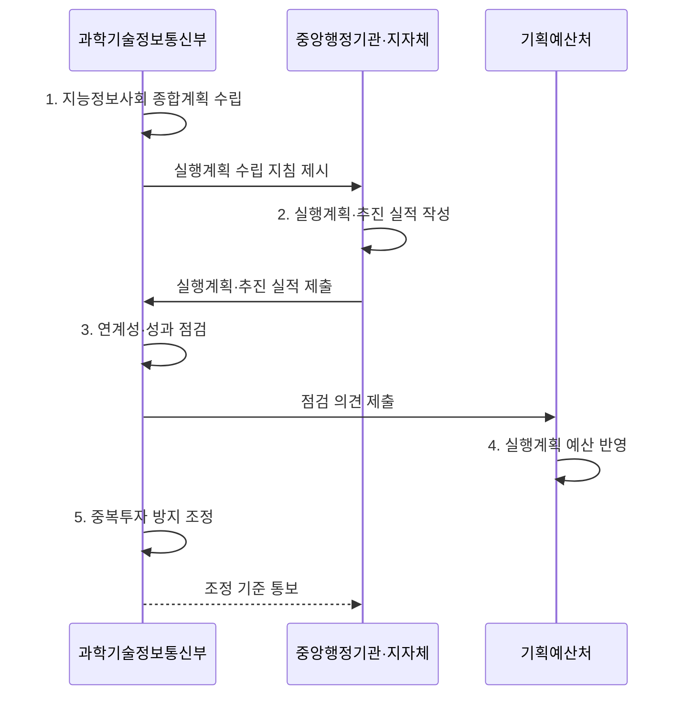

---
sidebar:
  order: 21
  label: "021. 지능정보화 기본법 (Intelligent Informatization Basic Act)"
  badge:
    text: "기출 · 30%"
    variant: note
title: "지능정보화 기본법 (Intelligent Informatization Basic Act)"
date: "2026-08-02T13:21:00+09:00"
tags:
  - "notes-law_policy"
weight: 21
extra:
  question_no: "021"
  source_status: "기출"
  source_history: "131회"
  priority: 30
  priority_note: "131회 기출, 지능정보사회 정책의 기본법"
---

## Ⅰ. 개요

핵심 용어

- **지능정보화 기본법**: 국가 지능정보화 정책의 수립·추진, 기반 조성, 활용 확산과 권리 보호의 기본 원칙을 정한 법률이다.
- **지능정보화**: 정보의 생산·유통·활용을 기반으로 지능정보기술 등을 적용하여 사회 활동을 가능하게 하거나 효율화하는 것이다.

- 정의/개념: 국가 지능정보화 정책의 수립·추진을 규율하는 **기본법**
- 배경/필요성: 기관별 정보화 투자 분절로 **중복사업·정책 불일치 증가**

#### 한줄 요약

- 인공지능과 데이터가 산업 전반에 확산함에 따라 국가 정책의 기본 방향을 잡고 역기능과 사회적 격차를 예방하기 위해 제정된 기본법이다.

## Ⅱ. 특징

핵심 용어

- **계획 연계성**: 국가 종합계획과 중앙행정기관·지방자치단체의 연도별 실행계획을 목표·사업·예산으로 연결하는 성질이다.
- **기반·활용 촉진**: 지능정보서비스에 필요한 데이터·기술·표준·전문인력 기반을 조성하고 공공·민간의 도입과 활용을 넓히는 정책 기능이다.
- **투자 조정성**: 실행계획 점검·예산 의견·중복투자 방지로 기관별 정보화 사업을 조정하는 기능이다.

- **계획 연계성**: 지능정보사회 종합계획과 중앙행정기관·지방자치단체의 연도별 실행계획 연계
- **기반·활용 촉진**: 데이터·기술·표준·전문인력 기반과 공공·민간 서비스 확산
- **투자 조정성**: 실행계획 점검·예산 의견·중복투자 방지로 기관 사업 조정

#### 한줄 요약

- 기술 기반과 서비스 확산뿐 아니라 정보격차 해소와 이용자 보호를 국가 지능정보화 정책에 함께 반영합니다.

## Ⅲ. 구조 및 구성요소

핵심 용어

- **지능정보사회 종합계획**: 국가 지능정보화의 중장기 목표·추진 방향·핵심 과제를 정한 상위 계획이다.
- **연도별 실행계획**: 각 기관이 종합계획을 실제 사업·예산·일정·성과지표로 구체화한 계획이다.
- **지능정보화책임관**: 기관의 지능정보화 정책·사업·성과를 조정하고 실행계획의 이행을 총괄하는 책임자이다.
- **지능정보기술 기반**: 데이터·기술·표준·전문인력과 네트워크 등 지능정보서비스에 필요한 공통 기반이다.
- **성과·중복투자 관리**: 추진 실적을 점검하고 기관 간 유사 사업을 조정하여 계획의 성과와 투자 효율을 높이는 활동이다.

| 구성요소 | 책임 |
|:---|:---|
| **종합계획·실행계획** | 국가 목표와 기관별 **사업·성과 연계** |
| **지능정보화책임관** | 기관 정책·사업 조정과 **이행 총괄** |
| **기술·데이터·인력 기반** | 기술·표준·데이터·**인력 기반 조성** |
| **공공·민간 서비스 확산** | 지능정보서비스의 **도입·활용 지원** |
| **성과·중복투자 관리** | 추진 실적 점검과 **중복사업 조정** |

#### 한줄 요약

- 국가의 중장기 계획 수립부터 기술 개발을 위한 인프라 조성, 그리고 취약계층 권리 보장까지 아우르는 거버넌스 프레임워크이다.

## Ⅳ. 흐름도

핵심 용어

- **계획 점검**: 기관 실행계획의 종합계획 부합성·중복성·성과를 검토하는 절차이다.
- **예산 연계**: 계획 점검 결과와 투자 우선순위를 다음 예산 편성·조정에 반영하는 과정이다.
- **지능정보사회 종합계획**: 국가 지능정보화의 중장기 목표와 정책 방향을 정해 기관별 실행계획의 기준이 되는 상위 계획이다.
- **중복투자 방지 조정**: 기관 간 유사한 지능정보화 사업을 확인하고 범위·예산·역할을 조정하는 절차이다.

**동작 원리**

1. **지능정보사회 종합계획 수립**: 3년 단위 국가 목표·정책 방향 확정
2. **실행계획·추진 실적 작성**: 기관별 연도 사업·예산·성과 계획 구체화
3. **연계성·성과 점검**: 종합계획 정합성과 전년도 추진 실적 분석
4. **실행계획 예산 반영**: 점검 의견을 다음 연도 예산 편성에 참작
5. **중복투자 방지 조정**: 기관 간 유사 지능정보화 사업의 중복 예방

#### 한줄 요약

- 정부의 종합계획에 따라 중앙행정기관과 지방자치단체가 매년 실행계획을 세우고 실적과 다음 계획을 제출합니다.

## Ⅴ. 종류 및 비교

핵심 용어

- **기본법**: 특정 분야의 정책 방향·국가와 기관의 책무·계획 체계를 포괄적으로 정한 법률이다.
- **개별 사업법**: 특정 서비스·기술·산업의 인허가·지원·의무를 구체적으로 규율하는 법률이다.
- **인공지능(Artificial Intelligence, AI)**: 데이터 학습과 추론을 바탕으로 분류·예측·생성 등의 지능형 기능을 수행하는 기술이다.

| 판단 기준 | 지능정보화 | 전통 정보화 |
|:---|:---|:---|
| **적용 기준** | 데이터·AI 기반 **국가 정책·사업** | 단순 망 연결·**시스템 전산화** |
| **핵심 특징** | 종합·실행계획과 **투자 조정** | 정보통신망·**업무 전산화** |
| **한계** | 관련 개별법의 **의무 확인 필요** | 지능기술·데이터의 **정책 연계 부족** |

#### 한줄 요약

- 망 연결과 문서 전산화에 집중했던 전통적인 국가 정보화 체계와, 인공지능 활용 및 격차 해소를 지향하는 지능정보화 체계를 대조한다.

## Ⅵ. 실무 고려사항 및 대책

핵심 용어

- **중복 투자**: 여러 기관이 같은 기능·데이터·플랫폼을 별도 구축하여 예산과 운영 자원이 낭비되는 문제이다.
- **성과 불일치**: 사업 산출물은 완료했지만 종합계획의 정책 성과와 연결되지 않는 문제이다.
- **계획-예산 단절**: 우선순위가 낮거나 중복된 실행계획에도 예산이 편성되어 조정 효과가 사라지는 문제이다.
- **인공지능기본법(AI기본법)**: 인공지능 산업의 진흥과 신뢰 기반 조성을 함께 규율하여 인공지능 서비스의 안전·신뢰 의무를 판단하는 법률이다.
- **디지털포용법**: 디지털 접근과 이용 역량의 격차를 줄이고 취약계층의 디지털 권리를 보장하는 법률이다.

| 문제 | 대책 | 효과 |
|:---|:---|:---|
| 기관별 사업과 **국가 계획 분절** | 책임관이 목표·예산·성과를 **종합계획과 연계** | 중복 투자 감소·**정책 일관성 확보** |
| 성과 없는 **기술 도입 중심 평가** | 실행계획에 **성과지표·추진 실적** 반영 | 예산 편성의 **근거 강화** |
| 관련 법률의 **의무 혼동** | AI 신뢰는 AI기본법, 포용은 **디지털포용법** 적용 | 법률별 **책임 경계 명확화** |

#### 한줄 요약

- 고령층과 장애인이 모바일 신분증이나 무인 단말기를 이용할 수 있는지 검사해 지능정보서비스의 접근 격차를 줄인다.

## Ⅶ. 결론

핵심 용어

- **정책 정합성**: 상위 종합계획·기관 실행계획·개별 사업·예산·성과지표가 같은 목표 체계로 연결된 상태이다.
- **인공지능**: 데이터 학습과 추론으로 분류·예측·생성 등의 지능형 기능을 수행하는 기술이다.

- **정책 정합성** 을 기준으로 계획 중복·투자 성과를 점검해 실행계획·예산 조정

#### 한줄 요약

- 인공지능 진흥과 윤리적 통제를 균형 있게 배치하여 기술 혁신의 혜택이 모든 국민에게 고루 돌아가도록 제도를 안착시켜야 한다.
