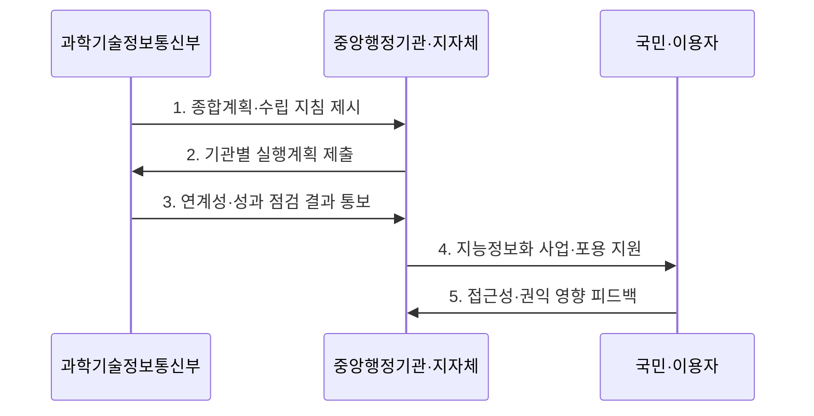

---
sidebar:
  order: 21
  label: "021. 지능정보화 기본법 (Intelligent Informatization Basic Act)"
  badge:
    text: "기출 · 30%"
    variant: note
title: "지능정보화 기본법 (Intelligent Informatization Basic Act)"
date: "2026-07-30T12:21:00+09:00"
tags:
  - "notes-law_policy"
weight: 21
extra:
  question_no: "021"
  source_status: "기출"
  source_history: "131회"
  priority: 30
  priority_note: "131회 기출, 지능정보사회 정책의 기본법"
---

## 미리 알고가기

- **인공지능(Artificial Intelligence, AI)**: 데이터 학습과 추론을 통해 분류·예측·생성 등의 지능형 기능을 수행하는 기술이다.
- **지능정보화(Intelligent Informatization)**: 정보의 생산·유통·활용을 기반으로 지능정보기술이나 다른 기술을 적용하여 사회 각 분야의 활동을 가능하게 하거나 효율화하는 것이다.
- **디지털 포용(Digital Inclusion)**: 취약계층을 포함한 모든 사람이 디지털 서비스에 접근하고 활용하여 그 혜택을 누리도록 보장하는 원칙이다.
- **사회적 영향(Social Impact)**: 지능정보서비스가 국민의 권리·안전·고용·생활에 미치는 긍정적·부정적 결과이다.
- **웹 접근성(Web Accessibility)**: 장애 유형과 이용 환경에 관계없이 웹 정보와 기능을 인식·운용할 수 있게 하는 품질 원칙이다.

## Ⅰ. 개요

- **지능정보화 기본법**은 국가 지능정보화의 추진 체계와 기반 조성·서비스 확산·정보격차 해소·이용자 보호를 종합 규율하는 **지능정보사회 기본법**
- **배경/필요성**: 시스템 전산화 중심 정책으로 대응하기 어려운 지능정보기술 확산의 사회적 영향과 디지털 포용 문제에 대한 국가 차원의 조정

### 쉽게 이해하기 (학습용)

- 인공지능과 데이터가 산업 전반에 확산함에 따라 국가 정책의 기본 방향을 잡고 역기능과 사회적 격차를 예방하기 위해 제정된 기본법이다.

## Ⅱ. 특징

- **계획 연계성**: 지능정보사회 종합계획과 중앙행정기관·지방자치단체의 연도별 실행계획 연계
- **기반·활용 촉진**: 데이터·기술·표준·전문인력 기반을 조성하고 공공·민간의 지능정보서비스 확산 지원
- **권익·포용 보장**: 접근성·교육·정보격차 해소와 역기능 예방을 통해 이용자의 권리와 안전 보호

### 쉽게 이해하기 (학습용)

- 기술 기반과 서비스 확산뿐 아니라 정보격차 해소와 이용자 보호를 국가 지능정보화 정책에 함께 반영합니다.

## Ⅲ. 구조 및 구성요소

| 구성요소 | 책임 |
|:---|:---|
| 종합계획·실행계획 | 국가 목표와 기관별 연도 사업·예산·성과를 연계 |
| 지능정보화책임관 | 기관의 정책·사업 조정과 계획 이행을 총괄 |
| 기술·데이터·인력 기반 | 지능정보기술 개발·표준화·데이터 활용·전문인력 양성 |
| 공공·민간 서비스 확산 | 사회 각 분야의 지능정보서비스 도입과 활용 지원 |
| 정보격차 해소·이용자 보호 | 접근성·역량 교육·권익보호·역기능 대응 시책 수행 |

### 쉽게 이해하기 (학습용)

- 국가의 중장기 계획 수립부터 기술 개발을 위한 인프라 조성, 그리고 취약계층 권리 보장까지 아우르는 거버넌스 프레임워크이다.

## Ⅳ. 흐름도

### 동작 원리

1. **종합계획·수립 지침 제시**: 국가 지능정보사회 목표·정책 방향과 기관별 계획 기준 수립
2. **기관별 실행계획 제출**: 중앙행정기관과 지방자치단체가 연도별 사업·예산·성과 계획 제시
3. **연계성·성과 점검 결과 통보**: 종합계획과의 정합성 및 전년도 추진 실적을 분석하여 조정
4. **지능정보화 사업·포용 지원**: 서비스 확산과 취약계층의 접근·활용 역량 지원
5. **접근성·권익 영향 피드백**: 이용자가 서비스 장벽과 권리·안전 영향을 제기하여 다음 계획에 반영

### 쉽게 이해하기 (학습용)

- 정부의 종합계획에 따라 중앙행정기관과 지방자치단체가 매년 실행계획을 세우고 실적과 다음 계획을 제출합니다.

## Ⅴ. 종류 및 비교

| 판단 기준 | 지능정보화 | 전통 정보화 |
|:---|:---|:---|
| 적용 기준 | 데이터·AI 기반 서비스 및 영향 검토 시 | 단순 네트워크 연결 및 시스템 전산화 시 |
| 핵심 특징 | AI 활용·윤리·디지털 포용 | 정보통신망·시스템 전산화 |
| 한계 | 정책 범위가 넓어 개별 의무 확인 필요 | AI 영향·정보격차 대응 부족 |

> 요약: 지능정보 기술 특성을 반영한 법적 규율

### 쉽게 이해하기 (학습용)

- 망 연결과 문서 전산화에 집중했던 전통적인 국가 정보화 체계와, 인공지능 활용 및 격차 해소를 지향하는 지능정보화 체계를 대조한다.

## Ⅵ. 실무 고려사항 및 대책

| 고려사항 | 대책 | 효과 |
|:---|:---|:---|
| 기관별 사업과 국가 계획의 분절 | 지능정보화책임관이 목표·예산·성과지표를 종합계획과 연결 | 중복 투자 감소와 정책 일관성 확보 |
| 기술 도입 성과 중심의 평가 | 이용자 권익·안전·접근성·정보격차 지표를 사업 성과에 포함 | 사회적 역기능 예방과 디지털 포용 강화 |
| 취약계층의 서비스 이용 장벽 | 웹·모바일·무인정보단말기의 접근성 시험과 대체 채널 제공 | 필수 공공서비스의 동등한 이용 보장 |

### 쉽게 이해하기 (학습용)

- 고령층과 장애인이 모바일 신분증이나 무인 단말기를 이용할 수 있는지 검사해 지능정보서비스의 접근 격차를 줄인다.

## Ⅶ. 결론

- 국가 지능정보화를 추진하려면 **기관별 사업을 종합계획과 연계하고 기술 성과뿐 아니라 접근성·정보격차·이용자 권익의 영향을 성과지표로 관리하는 포용적 정책 집행** 필요

### 쉽게 이해하기 (학습용)

- 인공지능 진흥과 윤리적 통제를 균형 있게 배치하여 기술 혁신의 혜택이 모든 국민에게 고루 돌아가도록 제도를 안착시켜야 한다.
