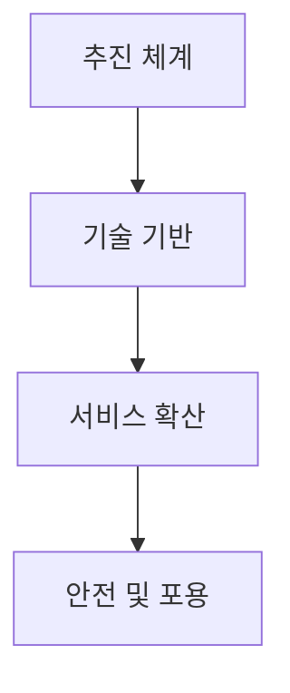
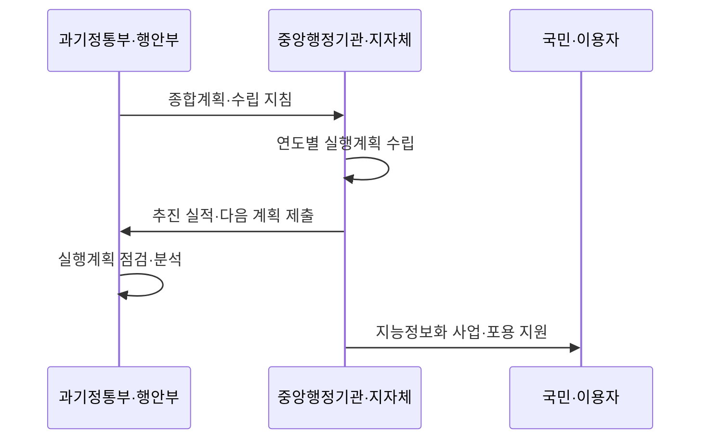

---
sidebar:
  order: 21
  label: "021. 지능정보화 기본법 (Intelligent Informatization Basic Act)"
  badge:
    text: "기출 · 30%"
    variant: note
title: "지능정보화 기본법 (Intelligent Informatization Basic Act)"
date: "2026-07-27T23:59:59+09:00"
tags:
  - "notes-law_policy"
weight: 21
extra:
  question_no: "021"
  source_status: "기출"
  source_history: "131회"
  priority: 30
  priority_note: "131회 기출, 지능정보사회 정책의 기본법"
---

## 미리 알고가기

- **인공지능(Artificial Intelligence, AI)**: 데이터 학습과 추론을 통해 분류·예측·생성 등의 지능형 기능을 수행하는 기술이다.
- **지능정보화(Intelligent Informatization)**: 데이터와 AI를
  활용해 사회·산업의 판단과 서비스를 지능화하는 정책이다.
- **디지털 포용(Digital Inclusion)**: 취약계층도 디지털
  서비스에 접근하고 활용하도록 역량을 보장하는 원칙이다.
- **사회적 영향(Social Impact)**: 지능 서비스가 국민의
  권리·안전·생활에 미치는 결과를 뜻한다.
- **웹 접근성(Web Accessibility)**: 장애와 관계없이 웹을
  인식·운용할 수 있게 하는 설계 원칙이다.

## Ⅰ. 개요

- 정의/개념: 국가 지능정보화의 정책·기반·포용을 규율
- 기존 한계: 전산화 중심 정책은 AI 확산·정보격차 대응 부족
- 기존 한계: 전산화 중심 정책은 AI 확산과 디지털 포용 대응 부족

### 쉽게 이해하기 (학습용)

- 인공지능과 데이터가 산업 전반에 확산함에 따라 국가 정책의 기본 방향을 잡고 역기능과 사회적 격차를 예방하기 위해 제정된 기본법이다.

## Ⅱ. 특징

- 종합계획과 실행계획으로 국가 지능정보화 정책을 추진한다.
- 데이터·기술·인력 기반 조성과 활용 확산을 지원한다.
- 접근성·교육·역기능 예방으로 디지털 포용을 보장한다.

### 쉽게 이해하기 (학습용)

- 기술 기반과 서비스 확산뿐 아니라 정보격차 해소와 이용자 보호를 국가 지능정보화 정책에 함께 반영합니다.

## Ⅲ. 아키텍처 및 구성요소

| 설계 요소 | 설명 |
|:---|:---|
| 추진 체계 | 지능정보화 기본계획 및 실행계획 수립 |
| 기술 기반 | 데이터 확보, 전문 인력 양성, 표준화 |
| 서비스 확산 | 공공과 민간의 지능정보 서비스 도입 지원 |
| 안전 및 포용 | 정보 격차 해소 및 사회적 역기능 방지 |

### 쉽게 이해하기 (학습용)

- 국가의 중장기 계획 수립부터 기술 개발을 위한 인프라 조성, 그리고 취약계층 권리 보장까지 아우르는 거버넌스 프레임워크이다.

## Ⅳ. 원리 및 절차 흐름도

| 절차 | 설명 |
|:---|:---|
| 종합계획 | 국가 지능정보화 방향과 목표 수립 |
| 실행계획 | 기관별 연도 사업과 예산 계획 수립 |
| 실적 제출 | 전년도 실적과 다음 해 계획 제출 |
| 점검·분석 | 실행계획의 연계성과 성과 검토 |
| 사업·포용 지원 | 서비스 확산과 접근·활용 지원 |

### 쉽게 이해하기 (학습용)

- 정부의 종합계획에 따라 중앙행정기관과 지방자치단체가 매년 실행계획을 세우고 실적과 다음 계획을 제출합니다.

## Ⅴ. 종류 및 비교

| 판단 기준 | 지능정보화 | 전통 정보화 |
|:---|:---|:---|
| 적용 기준 | 데이터·AI 기반 서비스 및 영향 검토 시 | 단순 네트워크 연결 및 시스템 전산화 시 |
| 핵심 특징 | AI 활용·윤리·디지털 포용 | 정보통신망·시스템 전산화 |
| 한계 | 정책 범위가 넓어 개별 의무 확인 필요 | AI 영향·정보격차 대응 부족 |

> 요약: 지능정보 기술 특성을 반영한 법적 규율

### 쉽게 이해하기 (학습용)

- 망 연결과 문서 전산화에 집중했던 전통적인 국가 정보화 체계와, 인공지능 활용 및 격차 해소를 지향하는 지능정보화 체계를 대조한다.

## Ⅵ. 실무 사례

1. 공공 서비스는 **웹 접근성**으로 정보격차 수준 측정

### 쉽게 이해하기 (학습용)

- 고령층과 장애인이 모바일 신분증이나 무인 단말기를 이용할 수 있는지 검사해 지능정보서비스의 접근 격차를 줄인다.

## Ⅶ. 결론

- 지능정보사회 구현을 위해 포용·영향을 검토하여 **기본법** 활용

### 쉽게 이해하기 (학습용)

- 인공지능 진흥과 윤리적 통제를 균형 있게 배치하여 기술 혁신의 혜택이 모든 국민에게 고루 돌아가도록 제도를 안착시켜야 한다.
