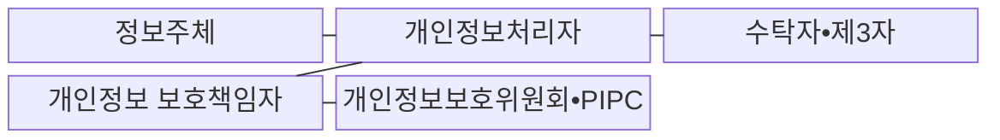
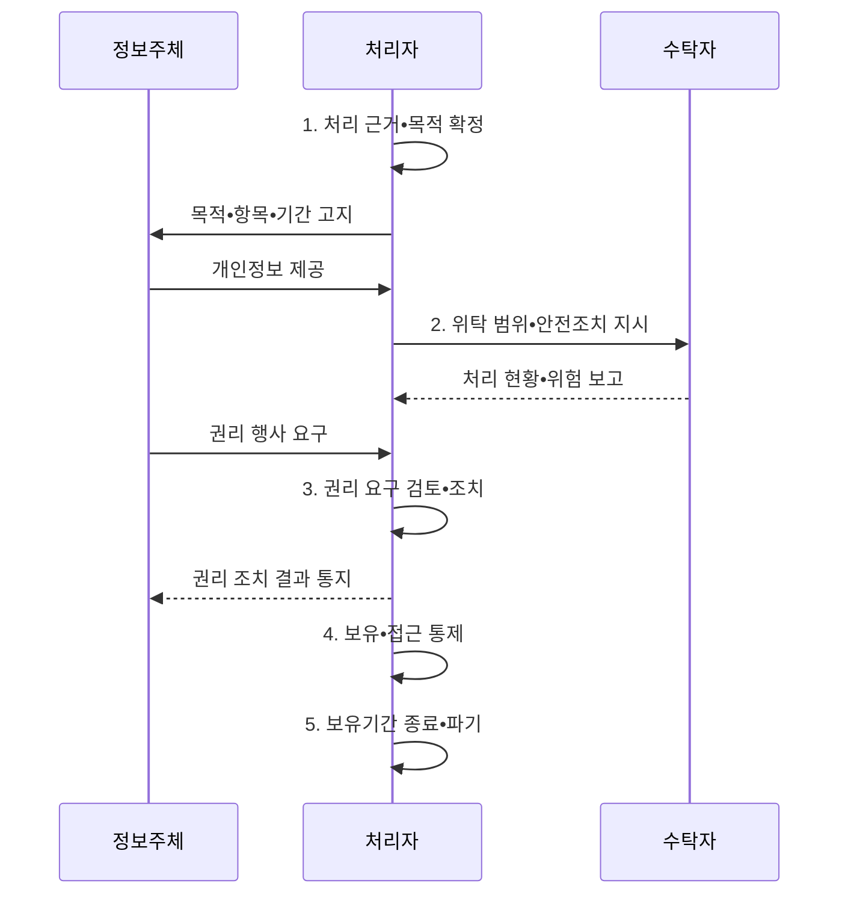

---
sidebar:
  order: 22
  label: "022. 개인정보보호법 (Personal Information Protection Act)"
  badge:
    text: "기출 • 50%"
    variant: note
title: "개인정보보호법 (Personal Information Protection Act)"
date: "2026-08-03T09:08:40+09:00"
tags:
  - "notes-law_policy"
weight: 22
extra:
  question_no: "022"
  source_status: "기출"
  source_history: "137회"
  priority: 50
  priority_note: "137회 기출, 개인정보 처리•전송권의 현행축"
---

## Ⅰ. 개요

핵심 용어

- **개인정보보호법**: 개인정보 처리 원칙과 개인정보처리자의 의무 및 정보주체 권리를 포괄적으로 규율하는 일반법이다.
- **개인정보**: 살아 있는 개인에 관한 정보로서 그 자체로 개인을 알아볼 수 있는 정보, 다른 정보와 쉽게 결합하여 알아볼 수 있는 정보와 법이 정한 가명정보를 포함한다.

- 정의/개념: 개인정보 처리와 정보주체 권리를 규율하는 **일반법**
- 배경/필요성: 통제 없는 수집•결합•제공으로 **사생활•자기결정권 침해**

#### 한줄 요약

- 개인정보의 수집부터 활용, 파기까지의 모든 단계에서 정보주체의 권리를 보호하고 기업이 지켜야 할 안전성 조치를 규정한 일반법이다.

## Ⅱ. 특징

핵심 용어

- **적법•최소 처리**: 동의•법률상 의무 등 처리 근거를 확인하고 목적에 필요한 최소한의 개인정보만 처리하는 원칙이다.
- **정보주체**: 처리되는 정보로 알아볼 수 있는 사람으로서 자신의 개인정보 처리에 관한 권리를 행사하는 주체이다.
- **전 과정 안전성**: 수집부터 보유•이용•제공•파기까지 접근권한•암호화•접속기록 등 안전조치를 적용하는 원칙이다.
- **열람•정정**: 정보주체가 자신의 개인정보 처리 현황을 확인하고 잘못된 내용을 바로잡도록 요구하는 권리이다.
- **전송요구권**: 정보주체가 자신의 개인정보를 본인이나 지정한 개인정보관리 전문기관 등에 전송하도록 요구하는 권리이다.
- **자동화된 결정**: 인공지능(Artificial Intelligence, AI) 등 완전히 자동화된 시스템이 개인정보를 처리해 정보주체의 권리•의무에 중대한 영향을 주는 결정을 내리는 것이다.

- **적법•최소 처리**: 동의•법률상 의무 등 처리 근거를 확인하고 목적에 필요한 최소한의 개인정보 수집
- **전 과정 안전성**: 접근권한•암호화•접속기록 등 안전조치와 유출 통지•신고로 처리 위험 통제
- **정보주체 권리**: 열람•정정•삭제•처리정지•전송요구와 법정 요건에 따른 자동화된 결정의 거부•설명 요구

#### 한줄 요약

- 적법한 처리 근거 아래 필요한 범위만 수집하고 가명정보 활용, 안전조치, 권리 행사와 위반 제재를 함께 규정합니다.

## Ⅲ. 구조 및 구성요소

핵심 용어

- **개인정보처리자**: 업무를 목적으로 개인정보파일을 운용하기 위하여 스스로 또는 다른 사람을 통해 개인정보를 처리하는 주체이다.
- **정보주체**: 처리되는 개인정보가 가리키는 개인으로서 열람•정정•삭제•처리정지 등 법정 권리를 행사하는 주체이다.
- **수탁자•제3자**: 수탁자는 개인정보처리자의 업무를 위탁받아 처리하는 자이고, 제3자는 처리자와 정보주체 외에 개인정보를 제공받는 별도 주체이다.
- **개인정보 보호책임자**: 개인정보처리자의 내부통제•권리 대응•사고 예방 업무를 총괄하는 책임자이다.
- **개인정보보호위원회(Personal Information Protection Commission, PIPC)**: 개인정보 보호 정책과 법 집행 및 피해구제 감독을 총괄하는 중앙행정기관이다.
- **가명정보**: 추가 정보를 사용하거나 결합하지 않고는 특정 개인을 알아볼 수 없도록 가명처리한 정보이다.
- **처리 생애주기**: 수집•이용•제공•위탁•보관•파기 전 단계에 적법한 근거•목적 제한•최소 수집•안전조치를 적용하는 관리 범위이다.

| 구성요소 | 책임 |
|:---|:---|
| **정보주체** | 처리 고지 확인과 **권리 행사** |
| **개인정보처리자** | 적법 근거•목적 범위의 **안전 처리** |
| **수탁자•제3자** | 위탁•제공 근거 범위에서 **제한 처리** |
| **개인정보 보호책임자** | 내부통제•권리 대응•**사고 예방 총괄** |
| **개인정보보호위원회•PIPC** | 정책•법 집행•**피해구제 감독** |

#### 한줄 요약

- 자신의 정보를 지키려는 주체와 이를 관리하는 기업, 그리고 위탁 업체와 법률 위반을 감시하는 정부 기관 간의 관계 구조이다.

## Ⅳ. 흐름도

핵심 용어

- **처리 근거**: 개인정보를 수집•이용•제공할 수 있도록 법이 인정한 동의•계약•법적 의무 등의 근거이다.
- **권리 요청**: 정보주체가 열람•정정•삭제•처리정지•전송 등을 개인정보처리자에게 요구하는 절차이다.
- **개인정보 처리 위탁**: 개인정보처리자가 업무의 일부와 그에 필요한 개인정보 처리를 수탁자에게 맡기는 관계이다.
- **안전조치**: 개인정보의 분실•도난•유출•위조•변조를 막기 위해 접근권한•암호화•접속기록 등을 관리하는 보호조치이다.
- **파기**: 보유기간이 끝나거나 처리 목적을 달성한 개인정보를 복구•재생할 수 없도록 제거하는 절차이다.

**동작 원리**

1. **처리 근거•목적 확정**: 동의•법률상 의무 등 적법 근거와 최소 항목 확인
2. **위탁 범위•안전조치 지시**: 수탁자의 목적 외 처리 금지와 보호조치를 문서화하고 감독
3. **권리 요구 검토•조치**: 본인 확인 후 수용•제한 근거와 조치 결과 결정
4. **보유•접근 통제**: 보유기간•접근권한•접속기록과 안전조치 관리
5. **보유기간 종료•파기**: 목적이 끝난 정보를 복구 불가능하게 파기

#### 한줄 요약

- 동의 등 적법한 근거를 확인해 최소 수집하고 이용•제공을 통제하며 권리 행사와 보유기간 종료 뒤 파기에 대응합니다.

## Ⅴ. 종류 및 비교

핵심 용어

- **일반 개인정보**: 식별 가능성과 처리 목적에 따라 법정 근거와 안전조치를 갖추어 처리하는 정보이다.
- **가명정보**: 통계•연구 등 법정 목적에서 추가 정보와 분리하여 처리할 수 있도록 식별성을 낮춘 정보이다.
- **익명정보**: 다른 정보를 사용해도 개인을 알아볼 수 없어 개인정보보호법상 개인정보에 해당하지 않는 정보이다.

| 판단 기준 | 일반 처리 | 가명 특례 |
|:---|:---|:---|
| **적용 기준** | 동의 등 **적법한 근거** 로 처리할 때 | 통계•연구•**공익 기록보존** 등에 활용할 때 |
| **핵심 특징** | 적법 근거•**목적 범위 내 처리** | 특정 목적의 **동의 없는 활용** 가능 |
| **한계** | 처리 근거•**권리 절차 준수** | 추가정보 분리•**재식별 금지** |

#### 한줄 요약

- 일반 개인정보 처리와 추가 정보 없이는 개인을 알아보기 어렵게 만든 가명정보의 특례 요건을 대조합니다.

## Ⅵ. 실무 고려사항 및 대책

핵심 용어

- **개인정보 유출**: 권한 없는 자가 개인정보를 알게 되거나 개인정보가 분실•도난•유출된 사고이다.
- **72시간**: 일정한 개인정보 유출에서 정보주체 통지와 관계기관 신고에 적용되는 법정 기한이다.

| 문제 | 대책 | 효과 |
|:---|:---|:---|
| 관행적 동의와 **과다 수집** | 법적 근거 기록과 항목•**보유기간 최소화** | 자기결정권 보장•**침해 규모 감소** |
| 위탁•제3자 제공의 **책임 공백** | 계약•교육•접근기록•**재위탁 감독** | 공급망 위험•**목적 외 이용 예방** |
| 개인정보 **유출 대응 지연** | **72시간 통지** 와 요건 충족 시 신고 훈련 | 피해 확산 방지•**법정 의무 이행** |

#### 한줄 요약

- 유출 사실을 알면 72시간 이내 정보주체에게 통지하고 신고 요건에 해당하면 위원회 등에 신고합니다.

## Ⅶ. 결론

핵심 용어

- **개인정보 자기결정권**: 개인이 자신의 정보가 언제•어떻게•어느 범위에서 처리되는지 통제할 권리이다.
- **수명주기 통제**: 처리 근거•목적•보유기간•제공•파기•권리 대응을 개인정보 전 과정에 연결하는 관리이다.

- **처리 근거•정보주체 권리** 로 개인정보 수명주기 통제

#### 한줄 요약

- 안전한 데이터 활용과 사생활 보호의 균형을 유지하면서 각 기업은 상시적인 개인정보 모니터링 체계를 확립해야 한다.
