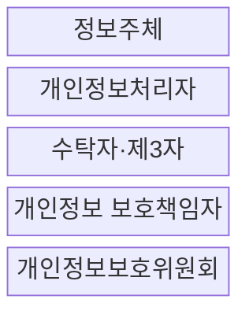
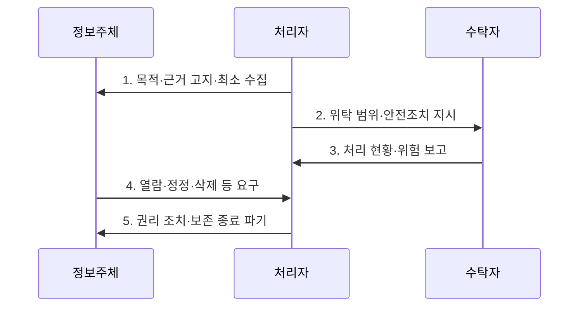

---
sidebar:
  order: 22
  label: "022. 개인정보보호법 (Personal Information Protection Act)"
  badge:
    text: "기출 · 50%"
    variant: note
title: "개인정보보호법 (Personal Information Protection Act)"
date: "2026-07-30T12:29:00+09:00"
tags:
  - "notes-law_policy"
weight: 22
extra:
  question_no: "022"
  source_status: "기출"
  source_history: "137회"
  priority: 50
  priority_note: "137회 기출, 개인정보 처리·전송권의 현행축"
---

## 미리 알고가기

- **개인정보(Personal Information)**: 살아 있는 개인에 관한 정보로서 그 개인을 알아볼 수 있거나 다른 정보와 쉽게 결합하여 알아볼 수 있는 정보이다.
- **정보주체(Data Subject)**: 처리되는 정보로 알아볼 수 있는 사람으로서 자신의 개인정보 처리에 관하여 열람·정정·삭제·처리정지 등의 권리를 행사하는 주체이다.
- **가명정보(Pseudonymized Information)**: 추가 정보를 사용하거나 결합하지 않고는 특정 개인을 알아볼 수 없도록 가명처리한 정보이다.
- **개인정보보호위원회(Personal Information Protection Commission, PIPC)**: 개인정보 보호 정책과 법 집행을 총괄하는 중앙행정기관이다.
- **인공지능(Artificial Intelligence, AI)**: 개인정보를 학습·추론하여 자동화된 결정에 활용하는 기술이다.
- **72시간**: 일정한 개인정보 유출 시 정보주체 통지와 관계기관 신고에 적용되는 법정 기한이다.

## Ⅰ. 개요

- **개인정보 보호법**은 개인정보의 수집·이용·제공·보관·파기 전 과정을 규율하고 안전조치와 정보주체의 권리·피해구제를 보장하는 **개인정보 보호 일반법**
- **배경/필요성**: 무제한 수집·목적 외 이용·불충분한 안전조치로 침해될 수 있는 개인의 사생활과 개인정보 자기결정권 보호

### 쉽게 이해하기 (학습용)

- 개인정보의 수집부터 활용, 파기까지의 모든 단계에서 정보주체의 권리를 보호하고 기업이 지켜야 할 안전성 조치를 규정한 일반법이다.

## Ⅱ. 특징

- **적법·최소 처리**: 동의·법률상 의무 등 처리 근거를 확인하고 목적에 필요한 최소한의 개인정보 수집
- **전 과정 안전성**: 접근권한·암호화·접속기록 등 안전조치와 유출 통지·신고로 처리 위험 통제
- **정보주체 통제권**: 열람·정정·삭제·처리정지·전송 요구와 자동화된 결정에 대한 권리 보장

### 쉽게 이해하기 (학습용)

- 적법한 처리 근거 아래 필요한 범위만 수집하고 가명정보 활용, 안전조치, 권리 행사와 위반 제재를 함께 규정합니다.

## Ⅲ. 구조 및 구성요소

| 설계 요소 | 설명 |
|:---|:---|
| 정보주체 | 개인정보 처리에 대한 고지 확인과 권리 행사 |
| 개인정보처리자 | 적법한 근거·목적 범위에서 개인정보를 안전하게 처리 |
| 수탁자·제3자 | 위탁 계약 또는 제공 근거에 따라 정해진 범위에서 처리 |
| 개인정보 보호책임자 | 처리 현황·내부통제·권리 대응·사고 예방 업무 총괄 |
| 개인정보보호위원회 | 정책 수립·법 집행·유출 신고·분쟁과 피해구제 감독 |

### 쉽게 이해하기 (학습용)

- 자신의 정보를 지키려는 주체와 이를 관리하는 기업, 그리고 위탁 업체와 법률 위반을 감시하는 정부 기관 간의 관계 구조이다.

## Ⅳ. 흐름도

| 절차 | 설명 |
|:---|:---|
| 목적·근거 고지·최소 수집 | 처리 목적·항목·기간·권리를 알리고 필요한 최소 정보만 수집 |
| 위탁 범위·안전조치 지시 | 수탁자의 목적 외 처리 금지와 보호조치를 문서화하고 감독 |
| 처리 현황·위험 보고 | 제공·접근·보유 현황과 침해 징후를 점검하여 처리자에게 보고 |
| 열람·정정·삭제 등 요구 | 본인 확인 후 법정 권리의 수용·제한 근거와 조치 결과 통지 |
| 권리 조치·보존 종료 파기 | 요구 결과를 반영하고 보유 목적이 끝난 정보를 복구 불가능하게 파기 |

### 쉽게 이해하기 (학습용)

- 동의 등 적법한 근거를 확인해 최소 수집하고 이용·제공을 통제하며 권리 행사와 보유기간 종료 뒤 파기에 대응합니다.

## Ⅴ. 종류 및 비교

| 판단 기준 | 일반 처리 | 가명 특례 |
|:---|:---|:---|
| 적용 기준 | 동의 등 적법한 근거로 처리할 때 | 통계·연구·공익 기록보존 등에 활용할 때 |
| 핵심 특징 | 적법 근거·목적 범위 내 처리 | 특정 목적에 동의 없이 활용 가능 |
| 한계 | 처리 근거·권리 절차 준수 필요 | 추가정보 분리·재식별 금지 |

> 요약: 데이터 활용 방식에 따른 규제 강도 차이

### 쉽게 이해하기 (학습용)

- 일반 개인정보 처리와 추가 정보 없이는 개인을 알아보기 어렵게 만든 가명정보의 특례 요건을 대조합니다.

## Ⅵ. 실무 고려사항 및 대책

| 고려사항 | 대책 | 효과 |
|:---|:---|:---|
| 관행적 동의와 과다 수집 | 처리 목적별 법적 근거를 기록하고 필수·선택 항목과 보유기간 최소화 | 개인정보 자기결정권 보장과 침해 규모 감소 |
| 위탁·제3자 제공의 책임 공백 | 수탁자 선정·계약·교육·접근기록·재위탁을 정기 감독 | 공급망 처리 위험과 목적 외 이용 예방 |
| 개인정보 유출 대응 지연 | 탐지·초동조치·영향평가·72시간 통지와 신고의 역할·연락망을 훈련 | 피해 확산 방지와 법정 의무의 신속한 이행 |

### 쉽게 이해하기 (학습용)

- 유출 사실을 알면 72시간 이내 정보주체에게 통지하고 신고 요건에 해당하면 위원회 등에 신고합니다.

## Ⅶ. 결론

- 개인정보를 활용하려면 **목적별 처리 근거와 최소 항목을 먼저 확정하고 수탁자를 지속 감독하며 정보주체 권리와 72시간 유출 대응을 실제로 수행할 수 있는 전 과정 보호 체계** 필요

### 쉽게 이해하기 (학습용)

- 안전한 데이터 활용과 사생활 보호의 균형을 유지하면서 각 기업은 상시적인 개인정보 모니터링 체계를 확립해야 한다.
