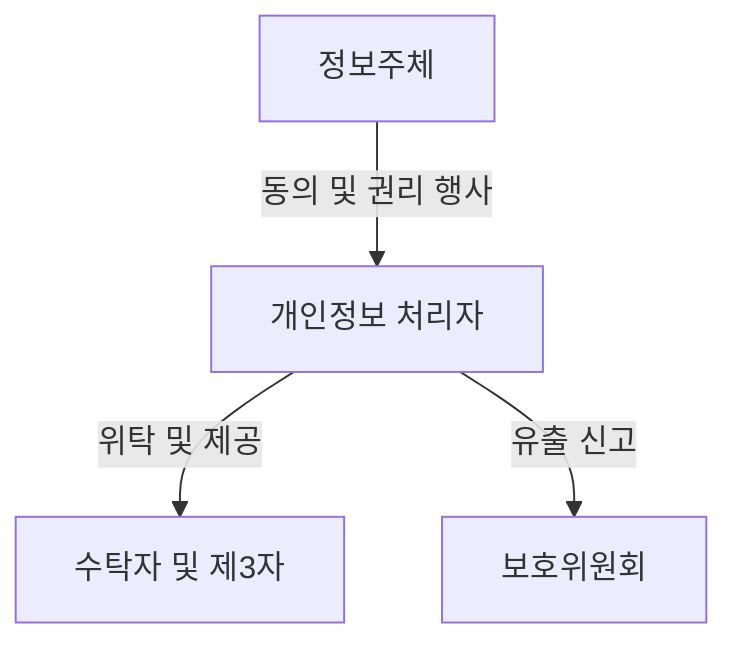
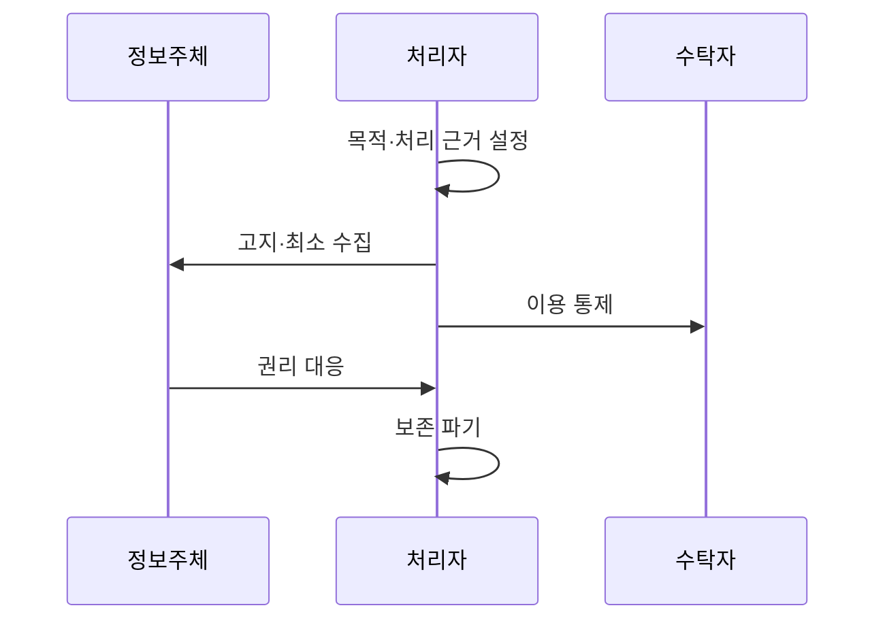

---
sidebar:
  order: 22
  label: "022. 개인정보보호법 (Personal Information Protection Act)"
  badge:
    text: "기출 · 50%"
    variant: note
title: "개인정보보호법 (Personal Information Protection Act)"
date: "2026-07-27T23:59:59+09:00"
tags:
  - "notes-law_policy"
weight: 22
extra:
  question_no: "022"
  source_status: "기출"
  source_history: "137회"
  priority: 50
  priority_note: "137회 기출, 개인정보 처리·전송권의 현행축"
---

## 미리 알고가기

- **개인정보(Personal Information)**: 살아 있는 개인을
  알아볼 수 있거나 다른 정보와 결합해 식별할 수 있는 정보다.
- **정보주체(Data Subject)**: 처리되는 정보로 알아볼 수 있는
  사람이며 열람·정정·삭제 등 권리를 행사한다.
- **가명정보(Pseudonymized Information)**: 추가 정보 없이는
  개인을 알아볼 수 없도록 가명처리한 정보다.
- **개인정보보호위원회(Personal Information Protection Commission,
  PIPC)**: ‘피아이피씨’로 읽는 머리글자 표기다. 법 집행을 총괄한다.
- **인공지능(Artificial Intelligence, AI)**: ‘에이아이’로
  읽는 머리글자 표기다. 자동화된 결정에 활용된다.
- **72시간(칠십이 시간)**: 일정한 개인정보 유출 시 통지·신고에 적용되는 법정 시간 기준이며, 구체 요건을 함께 확인

## Ⅰ. 개요

- **정의/개념**: 개인정보 처리 전 과정과 정보주체 권리를 규율
- **기존 한계**: 무제한 수집·목적 외 이용은 개인 통제권 침해
- **배경/필요성**: 처리 전 과정의 적법성·안전성·권리 보장

### 쉽게 이해하기 (학습용)

- 개인정보의 수집부터 활용, 파기까지의 모든 단계에서 정보주체의 권리를 보호하고 기업이 지켜야 할 안전성 조치를 규정한 일반법이다.

## Ⅱ. 특징

- 적법한 처리 근거·최소 수집·목적 제한을 적용한다.
- 안전조치와 유출 대응으로 처리 전 과정의 위험을 관리한다.
- 열람·정정·삭제·처리정지 등 정보주체 권리를 보장한다.

### 쉽게 이해하기 (학습용)

- 적법한 처리 근거 아래 필요한 범위만 수집하고 가명정보 활용, 안전조치, 권리 행사와 위반 제재를 함께 규정합니다.

## Ⅲ. 아키텍처 및 구성요소

| 설계 요소 | 설명 |
|:---|:---|
| 정보주체 | 개인정보 제공 및 열람·정정 요구 |
| 개인정보 처리자 | 수집 목적 범위 내 안전한 처리 및 관리 |
| 수탁자 및 제3자 | 위탁 계약에 따른 개인정보 처리 및 안전 확보 |
| 보호위원회 | 유출 신고 접수 및 법적 규제 감독 수행 |

### 쉽게 이해하기 (학습용)

- 자신의 정보를 지키려는 주체와 이를 관리하는 기업, 그리고 위탁 업체와 법률 위반을 감시하는 정부 기관 간의 관계 구조이다.

## Ⅳ. 원리 및 절차 흐름도

| 절차 | 설명 |
|:---|:---|
| 목적·근거 설정 | 처리 목적과 법적 근거를 확인 |
| 고지·최소 수집 | 필요한 사항을 알리고 최소 수집 |
| 이용 통제 | 제3자 제공 및 업무 위탁 시 안전 조치 |
| 권리 대응 | 정보주체의 열람 요구 및 정정 요청 처리 |
| 보존 파기 | 보유 기간 경과 후 안전한 복구 불능 파기 |

### 쉽게 이해하기 (학습용)

- 동의 등 적법한 근거를 확인해 최소 수집하고 이용·제공을 통제하며 권리 행사와 보유기간 종료 뒤 파기에 대응합니다.

## Ⅴ. 종류 및 비교

| 판단 기준 | 일반 처리 | 가명 특례 |
|:---|:---|:---|
| 적용 기준 | 동의 등 적법한 근거로 처리할 때 | 통계·연구·공익 기록보존 등에 활용할 때 |
| 핵심 특징 | 적법 근거·목적 범위 내 처리 | 특정 목적에 동의 없이 활용 가능 |
| 한계 | 처리 근거·권리 절차 준수 필요 | 추가정보 분리·재식별 금지 |

> 요약: 데이터 활용 방식에 따른 규제 강도 차이

### 쉽게 이해하기 (학습용)

- 일반 개인정보 처리와 추가 정보 없이는 개인을 알아보기 어렵게 만든 가명정보의 특례 요건을 대조합니다.

## Ⅵ. 실무 사례

1. 법정 기한 내 개인정보 유출 신고 및 통지 절차 수행
2. AI 면접 등 자동화된 결정에 대한 정보주체 거부권 대응

### 쉽게 이해하기 (학습용)

- 유출 사실을 알면 72시간 이내 정보주체에게 통지하고 신고 요건에 해당하면 위원회 등에 신고합니다.
- 완전히 자동화된 결정이 권리·의무에 중대한 영향을 주면 법정 범위에서 거부나 설명·검토 요구에 대응합니다.

## Ⅶ. 결론

- 처리 근거와 권리 대응 기록을 보존한다

### 쉽게 이해하기 (학습용)

- 안전한 데이터 활용과 사생활 보호의 균형을 유지하면서 각 기업은 상시적인 개인정보 모니터링 체계를 확립해야 한다.
