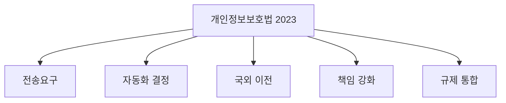
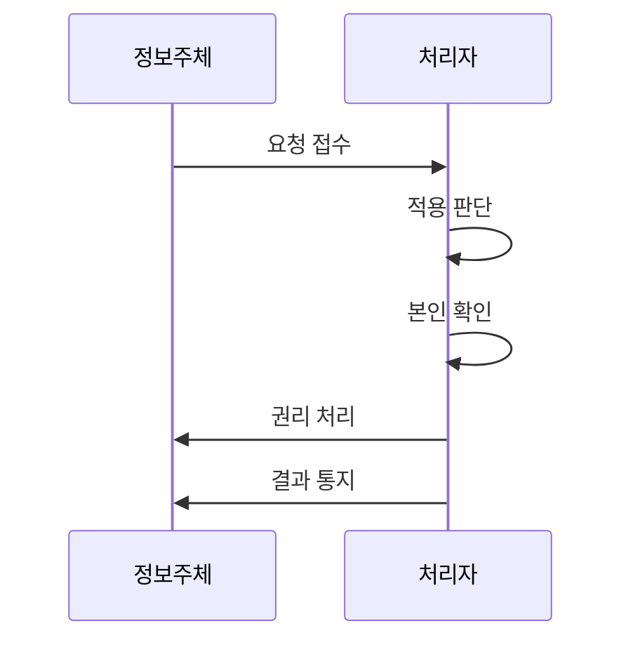

---
sidebar:
  order: 23
  label: "023. 개인정보보호법 2023 개정 주요 내용 (PIPA 2023 Amendment)"
  badge:
    text: "기출 · 30%"
    variant: note
title: "개인정보보호법 2023 개정 주요 내용 (PIPA 2023 Amendment)"
date: "2026-07-27T23:59:59+09:00"
tags:
  - "notes-law_policy"
weight: 23
extra:
  question_no: "023"
  source_status: "기출"
  source_history: "137회"
  priority: 30
  priority_note: "2023 개정 내용은 현행 개인정보법에 흡수"
---

## 미리 알고가기

- **개인정보보호법(Personal Information Protection Act, PIPA)**:
  ‘피파’로 읽는 머리글자 표기다. 개인정보 권리를 보장하는 일반법이다.
- **인공지능(Artificial Intelligence, AI)**: ‘에이아이’로
  읽는 머리글자 표기다. 자동화된 결정의 학습과 추론을 수행한다.
- **개인정보 전송요구권(Right to Data Portability)**: 정보주체가
  본인 정보를 본인이나 제3자에게 전송하도록 요구하는 권리다.
- **자동화된 결정(Automated Decision)**: 사람의 개입 없이
  완전히 자동화된 시스템이 내리는 의사결정이다.
- **규제 일원화(Unified Regulation)**: 온·오프라인 처리자에게
  하나의 개인정보 규제 기준을 적용하는 원칙이다.

## Ⅰ. 개요

- **정의/개념**: 정보주체 권리·국외이전·제재 체계를 정비
- **기존 한계**: 기존 법은 데이터 이동·자동화 결정 대응 부족
- **배경/필요성**: 정보주체 통제권 강화와 규제 일원화

### 쉽게 이해하기 (학습용)

- 데이터 이동성과 인공지능 활용 환경에 맞추어 개인정보 통제권을 강화하고 온·오프라인 규제 격차를 해소하기 위한 개정안이다.

## Ⅱ. 특징

- 개인정보 전송요구권의 일반법적 근거를 신설했다.
- 중대한 자동화 결정의 거부·설명 요구권을 신설했다.
- 온·오프라인 규제 일원화와 과징금 체계를 정비했다.

### 쉽게 이해하기 (학습용)

- 정보주체의 권리를 실질적으로 보호하고 온라인과 오프라인의 서로 다른 규제를 하나로 통합하여 법적 일관성을 확보했다.

## Ⅲ. 아키텍처 및 구성요소

| 설계 요소 | 설명 |
|:---|:---|
| 개인정보보호법 2023 | 권리·이전·제재 개정 체계 |
| 전송요구 | 형식, 본인 확인, 거절 절차 설계 |
| 자동화 결정 | 거부권, 설명요구권, 인적 검토 절차 마련 |
| 국외 이전 | 이전 근거 다변화 및 국외이전 중지 명령권 |
| 책임 강화 | 전체 매출액 기준 과징금 및 책임성 입증 |
| 규제 통합 | 온·오프라인 처리자 규제 단일화 적용 |

### 쉽게 이해하기 (학습용)

- 정보주체의 전송 요구와 인공지능 자동화 결정에 대한 거부권을 서비스 설계 단계부터 반영하여 구현해야 한다.

## Ⅳ. 원리 및 절차 흐름도

| 절차 | 설명 |
|:---|:---|
| 요청 접수 | 전송 요구 및 자동화 결정 거부권 접수 |
| 적용 판단 | 대상 정보 범위 및 예외 사유 적합성 검증 |
| 본인 확인 | 정보주체 식별 및 대리인 권한 확인 |
| 권리 처리 | 안전한 데이터 전송 및 자동화 결과 설명 |
| 결과 통지 | 조치 내역 또는 거절 사유 및 구제 통지 |

### 쉽게 이해하기 (학습용)

- 정보주체의 다양한 권리 요청을 받고 대상 여부를 판별하여 처리한 뒤 그 결과를 알리는 절차이다.

## Ⅴ. 종류 및 비교

| 판단 기준 | 2023 개정 | 개정 전 |
|:---|:---|:---|
| 적용 기준 | 데이터 이동성 보장 및 AI 대응 필요 시 | 전통적 수집 및 이용 방식 통제 시 |
| 핵심 특징 | 전송요구·자동화 결정 권리 강화 | 기존 열람·정정·삭제 중심 |
| 한계 | 세부 시행 범위·절차 확인 필요 | 데이터 이동·자동화 대응 부족 |

> 요약: 개정에 따른 권리 강화 및 규제 단일화

### 쉽게 이해하기 (학습용)

- 개정 전후의 가장 큰 차이점은 정보주체의 데이터 전송요구권이 신설된 것과 온·오프라인 규제가 단일 규정으로 일원화된 점이다.

## Ⅵ. 실무 사례

1. 완전 자동화된 신용평가에 거부·설명 절차 마련
2. 마이데이터 서비스를 위한 개인정보 전송 표준 규격 적용

### 쉽게 이해하기 (학습용)

- 완전히 자동화된 결정이 권리·의무에 중대한 영향을 주는지 확인하고 거부·설명·검토 요구에 대응합니다.
- 개인정보 마이데이터 서비스가 안전하게 전송되도록 수신기관과 전송 방식을 개발한다.

## Ⅶ. 결론

- 전송·설명 요구를 서비스 절차에 넣는다

### 쉽게 이해하기 (학습용)

- 전송과 자동화된 결정 관련 권리를 서비스 절차에 구현하고 국외이전·제재 기준까지 함께 준수해야 합니다.
