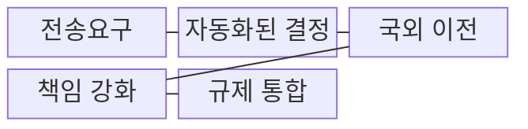
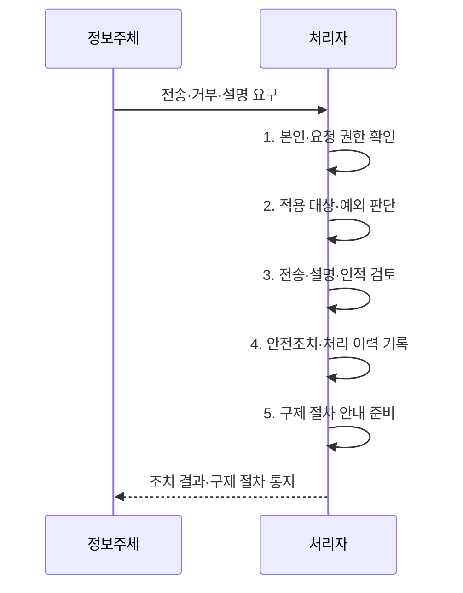

---
sidebar:
  order: 23
  label: "023. 개인정보보호법 2023 개정 주요 내용 (PIPA 2023 Amendment)"
  badge:
    text: "기출 · 30%"
    variant: note
title: "개인정보보호법 2023 개정 주요 내용 (PIPA 2023 Amendment)"
date: "2026-07-31T05:56:54+09:00"
tags:
  - "notes-law_policy"
weight: 23
extra:
  question_no: "023"
  source_status: "기출"
  source_history: "137회"
  priority: 30
  priority_note: "2023 개정 내용은 현행 개인정보법에 흡수"
---

## 미리 알고가기

- **개인정보보호법(Personal Information Protection Act, PIPA)**: 개인정보 처리 원칙과 정보주체의 권리를 규정한 일반법이다.
- **인공지능(Artificial Intelligence, AI)**: 데이터를 학습·추론하여 자동화된 결정을 수행하는 기술이다.
- **개인정보 전송요구권(Right to Data Portability)**: 정보주체가 자신에 관한 개인정보를 본인 또는 개인정보관리 전문기관 등에게 전송하도록 요구하는 권리이다.
- **자동화된 결정(Automated Decision)**: 인공지능 기술을 포함한 자동화된 시스템으로 개인정보를 처리하여 이루어지는 결정이다.
- **규제 일원화(Unified Regulation)**: 정보통신서비스 제공자 특례를 정비하여 온·오프라인 개인정보처리자에게 일관된 규율을 적용하는 체계이다.

## Ⅰ. 개요

- 정의/개념: 데이터 이동·자동 결정 권리를 확대한 **개인정보 보호체계 개편**
- 배경/필요성: 기존 권리로는 **데이터 이동·자동 결정 대응 곤란**

### 쉽게 이해하기 (학습용)

- 데이터 이동성과 인공지능 활용 환경에 맞추어 개인정보 통제권을 강화하고 온·오프라인 규제 격차를 해소하기 위한 개정안이다.

## Ⅱ. 특징

- **본인전송·제3자전송**: 정보주체가 본인 또는 지정 수신자에게 전송을 요구할 권리
- **AI 자동화 결정**: 중대한 결정의 거부 가능 여부와 설명·인적개입 절차 도입
- **책임성 강화**: 국외이전 근거·중지명령·온·오프라인 규제·과징금 산정 체계 정비

### 쉽게 이해하기 (학습용)

- 정보주체의 권리를 실질적으로 보호하고 온라인과 오프라인의 서로 다른 규제를 하나로 통합하여 법적 일관성을 확보했다.

## Ⅲ. 구조 및 구성요소

| 구성요소 | 책임 |
|:---|:---|
| **전송요구** | 형식·본인 확인·**거절 절차** 설계 |
| **자동화된 결정** | 거부·설명·**인적 개입 절차** 마련 |
| **국외 이전** | 적법한 이전 근거와 **중지명령 체계** |
| **책임 강화** | 전체 매출액 기준·**비관련 매출 제외** 과징금 |
| **규제 일원화** | 온·오프라인 처리자의 **규율 통합** |

### 쉽게 이해하기 (학습용)

- 정보주체의 전송 요구와 인공지능 자동화 결정에 대한 거부권을 서비스 설계 단계부터 반영하여 구현해야 한다.

## Ⅳ. 흐름도

**동작 원리**

1. **본인·요청 권한 확인**: 정보주체 또는 대리인의 신원과 요청 권한 확인
2. **적용 대상·예외 판단**: 법정 대상·제외 사유와 처리 가능 범위 결정
3. **전송·설명·인적 검토**: 안전한 전송과 결정 기준 설명·재처리 수행
4. **안전조치·처리 이력 기록**: 수신자 검증·암호화와 전송·권리 대응 이력 보존
5. **구제 절차 안내 준비**: 거절 사유·이의·피해구제 방법과 연락 창구 구성

### 쉽게 이해하기 (학습용)

- 정보주체의 다양한 권리 요청을 받고 대상 여부를 판별하여 처리한 뒤 그 결과를 알리는 절차이다.

## Ⅴ. 종류 및 비교

| 판단 기준 | 2023 개정 | 개정 전 |
|:---|:---|:---|
| **적용 기준** | 데이터 이동성·**AI 결정 대응** 필요 시 | 전통적 수집·이용의 **처리 통제** 시 |
| **핵심 특징** | **전송요구·자동화 결정 권리** 강화 | 기존 **열람·정정·삭제** 중심 |
| **한계** | 세부 시행 범위·**예외 확인 필요** | 데이터 이동·**자동화 대응 부족** |

### 쉽게 이해하기 (학습용)

- 개정 전후의 가장 큰 차이점은 정보주체의 데이터 전송요구권이 신설된 것과 온·오프라인 규제가 단일 규정으로 일원화된 점이다.

## Ⅵ. 실무 고려사항 및 대책

| 고려사항 | 대책 | 효과 |
|:---|:---|:---|
| 권리 유형과 **적용 범위 혼선** | 권리별 대상·예외·**처리기한 규칙화** | 일관된 권리 대응·**누락 방지** |
| 자동화된 결정의 **설명 불가능** | 입력·기준·영향 기록과 **인적 검토 경로** | 결정 투명성·**정보주체 통제권 강화** |
| 전송 과정의 **오인·유출 위험** | 본인·수신자 검증과 **암호화·이력 관리** | 안전한 이동·**책임 추적** |

### 쉽게 이해하기 (학습용)

- 완전히 자동화된 결정이 권리·의무에 중대한 영향을 주는지 확인하고 거부·설명·검토 요구에 대응합니다.

## Ⅶ. 결론

- **권리 적용 대상·예외**로 전송·자동화 결정 대응 절차 결정

### 쉽게 이해하기 (학습용)

- 전송과 자동화된 결정 관련 권리를 서비스 절차에 구현하고 국외이전·제재 기준까지 함께 준수해야 합니다.
