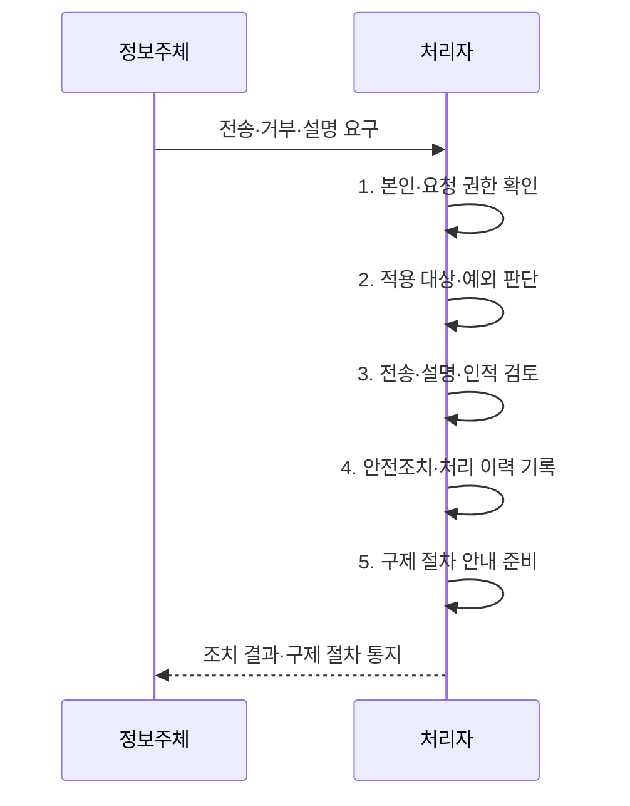

---
sidebar:
  order: 23
  label: "023. 개인정보보호법 2023 개정 주요 내용 (PIPA 2023 Amendment)"
  badge:
    text: "기출 · 30%"
    variant: note
title: "개인정보보호법 2023 개정 주요 내용 (PIPA 2023 Amendment)"
date: "2026-08-02T13:23:00+09:00"
tags:
  - "notes-law_policy"
weight: 23
extra:
  question_no: "023"
  source_status: "기출"
  source_history: "137회"
  priority: 30
  priority_note: "2023 개정 내용은 현행 개인정보법에 흡수"
---

## Ⅰ. 개요

핵심 용어

- **개인정보보호법 2023 개정**: 데이터 이동과 자동화된 결정에 대한 정보주체 권리를 확대하고 온·오프라인 규율과 책임 체계를 정비한 법 개편이다.
- **규제 일원화**: 정보통신서비스 제공자 특례를 정비하여 온·오프라인 개인정보처리자에게 일관된 규율을 적용하는 체계이다.

- 정의/개념: 데이터 이동·자동 결정 권리를 확대한 **개인정보 보호체계 개편**
- 배경/필요성: 기존 권리로는 **데이터 이동·자동 결정 대응 곤란**

#### 한줄 요약

- 데이터 이동성과 인공지능 활용 환경에 맞추어 개인정보 통제권을 강화하고 온·오프라인 규제 격차를 해소하기 위한 개정안이다.

## Ⅱ. 특징

핵심 용어

- **개인정보 전송요구권**: 정보주체가 자신에 관한 개인정보를 본인이나 지정한 수신자에게 전송하도록 요구하는 권리이다.
- **본인전송·제3자전송**: 본인전송은 정보주체 자신에게, 제3자전송은 정보주체가 지정한 수신자에게 개인정보를 보내는 전송요구 방식이다.
- **자동화된 결정**: 인공지능(Artificial Intelligence, AI) 기술을 포함한 자동화 시스템으로 개인정보를 처리하여 이루어지는 결정이다.
- **책임성 강화**: 국외 이전·중지 명령·과징금 산정 등 개인정보처리자의 입증과 제재 체계를 강화한 변화이다.

- **본인전송·제3자전송**: 정보주체가 본인 또는 지정 수신자에게 전송을 요구할 권리
- **AI 자동화 결정**: 중대한 결정의 거부 가능 여부와 설명·인적개입 절차 도입
- **책임성 강화**: 국외이전 근거·중지명령·온·오프라인 규제·과징금 산정 체계 정비

#### 한줄 요약

- 정보주체의 권리를 실질적으로 보호하고 온라인과 오프라인의 서로 다른 규제를 하나로 통합하여 법적 일관성을 확보했다.

## Ⅲ. 구조 및 구성요소

핵심 용어

- **본인전송**: 개인정보처리자가 보유한 정보를 정보주체 본인에게 구조화된 형식으로 보내는 방식이다.
- **제3자전송**: 정보주체의 요구에 따라 개인정보를 지정한 개인정보관리 전문기관 등에게 보내는 방식이다.
- **설명·인적개입**: 자동화된 결정의 기준·결과를 알리고 필요한 경우 사람이 검토하도록 하는 권리 보호 절차이다.
- **국외 이전**: 개인정보를 국외의 수신자에게 제공·처리위탁·보관하는 것으로, 법정 이전 근거와 보호조치가 필요하다.
- **과징금**: 개인정보 보호 의무 위반에 대해 위반행위와 관련 없는 매출액 등을 제외한 기준으로 부과하는 금전 제재이다.
- **규제 일원화**: 온·오프라인 개인정보처리자에게 일관된 처리 원칙과 책임 기준을 적용하는 체계이다.

| 구성요소 | 책임 |
|:---|:---|
| **전송요구** | 형식·본인 확인·**거절 절차** 설계 |
| **자동화된 결정** | 거부·설명·**인적 개입 절차** 마련 |
| **국외 이전** | 적법한 이전 근거와 **중지명령 체계** |
| **책임 강화** | 전체 매출액 기준·**비관련 매출 제외** 과징금 |
| **규제 일원화** | 온·오프라인 처리자의 **규율 통합** |

#### 한줄 요약

- 정보주체의 전송 요구와 인공지능 자동화 결정에 대한 거부권을 서비스 설계 단계부터 반영하여 구현해야 한다.

## Ⅳ. 흐름도

핵심 용어

- **본인·요청 권한 확인**: 요청자가 실제 정보주체 또는 적법한 대리인인지 안전한 인증 수단으로 검증하는 절차이다.
- **적용 대상·예외 판단**: 해당 정보·결정·처리자가 권리의 법정 적용 범위에 속하는지와 제외 사유가 있는지를 판단하는 단계이다.
- **안전조치·처리 이력 기록**: 전송 과정의 수신자 검증·암호화를 적용하고 권리 요청과 조치 내역을 보존하는 활동이다.
- **구제 절차**: 권리 요청이 거절되거나 침해가 발생했을 때 이의제기·분쟁조정 등으로 피해 회복을 요구하는 절차이다.

**동작 원리**

1. **본인·요청 권한 확인**: 정보주체 또는 대리인의 신원과 요청 권한 확인
2. **적용 대상·예외 판단**: 법정 대상·제외 사유와 처리 가능 범위 결정
3. **전송·설명·인적 검토**: 안전한 전송과 결정 기준 설명·재처리 수행
4. **안전조치·처리 이력 기록**: 수신자 검증·암호화와 전송·권리 대응 이력 보존
5. **구제 절차 안내 준비**: 거절 사유·이의·피해구제 방법과 연락 창구 구성

#### 한줄 요약

- 정보주체의 다양한 권리 요청을 받고 대상 여부를 판별하여 처리한 뒤 그 결과를 알리는 절차이다.

## Ⅴ. 종류 및 비교

핵심 용어

- **전송요구권**: 개인정보의 이동·재사용을 위해 정보주체가 본인 또는 지정 수신자에게 전송을 요구하는 권리이다.
- **자동화 결정 권리**: 사람의 실질적 개입 없이 이루어진 중대한 결정에 대해 거부·설명·재검토를 요구하는 권리이다.
- **인공지능(Artificial Intelligence, AI)**: 데이터 학습과 추론으로 분류·예측 등의 지능형 기능을 수행하며 자동화된 결정에 활용되는 기술이다.

| 판단 기준 | 2023 개정 | 개정 전 |
|:---|:---|:---|
| **적용 기준** | 데이터 이동성·**AI 결정 대응** 필요 시 | 전통적 수집·이용의 **처리 통제** 시 |
| **핵심 특징** | **전송요구·자동화 결정 권리** 강화 | 기존 **열람·정정·삭제** 중심 |
| **한계** | 세부 시행 범위·**예외 확인 필요** | 데이터 이동·**자동화 대응 부족** |

#### 한줄 요약

- 개정 전후의 가장 큰 차이점은 정보주체의 데이터 전송요구권이 신설된 것과 온·오프라인 규제가 단일 규정으로 일원화된 점이다.

## Ⅵ. 실무 고려사항 및 대책

핵심 용어

- **적용 범위 혼선**: 권리별 대상 정보·결정·예외를 구분하지 못해 요청을 누락하거나 과도하게 처리하는 문제이다.
- **설명 불가능**: 자동화된 결정의 주요 입력·기준·영향을 정보주체가 이해할 수 있도록 제시하지 못하는 문제이다.
- **오인·유출 위험**: 전송 과정에서 요청자나 수신자를 잘못 확인하거나 개인정보가 노출되는 위험이다.
- **인적 검토 경로**: 자동화된 결정에 이의가 있을 때 담당자가 결정 근거와 결과를 다시 검토하도록 연결하는 절차이다.
- **암호화·이력 관리**: 전송 중 개인정보를 보호하고 요청·수신·처리 내역을 남겨 사고와 책임을 추적하는 통제이다.

| 문제 | 대책 | 효과 |
|:---|:---|:---|
| 권리 유형과 **적용 범위 혼선** | 권리별 대상·예외·**처리기한 규칙화** | 일관된 권리 대응·**누락 방지** |
| 자동화된 결정의 **설명 불가능** | 입력·기준·영향 기록과 **인적 검토 경로** | 결정 투명성·**정보주체 통제권 강화** |
| 전송 과정의 **오인·유출 위험** | 본인·수신자 검증과 **암호화·이력 관리** | 안전한 이동·**책임 추적** |

#### 한줄 요약

- 완전히 자동화된 결정이 권리·의무에 중대한 영향을 주는지 확인하고 거부·설명·검토 요구에 대응합니다.

## Ⅶ. 결론

핵심 용어

- **권리별 적용 조건**: 전송 대상 정보·수신자와 자동화 결정의 중대성·인적개입 여부에 따라 대응 절차가 달라지는 기준이다.

- **권리 적용 대상·예외** 로 전송·자동화 결정 대응 절차 결정

#### 한줄 요약

- 전송과 자동화된 결정 관련 권리를 서비스 절차에 구현하고 국외이전·제재 기준까지 함께 준수해야 합니다.
