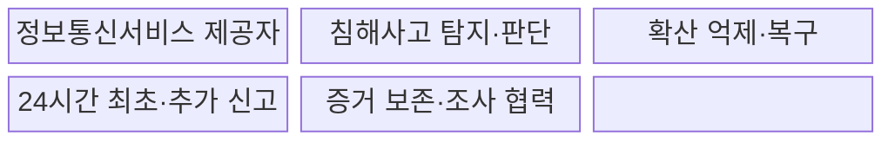
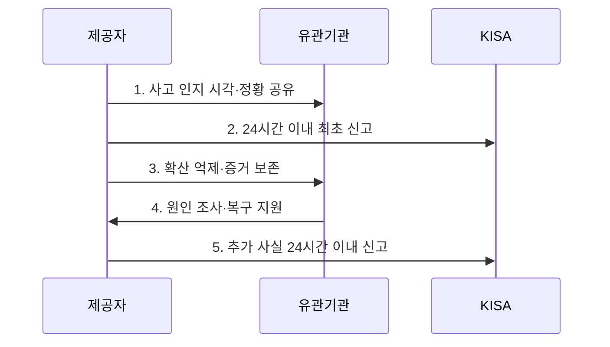

---
sidebar:
  order: 24
  label: "024. 정보통신망법 - 침해사고 신고·보호 조치 (Network Act)"
  badge:
    text: "미출 · 50%"
    variant: note
title: "정보통신망법 - 침해사고 신고·보호 조치 (Network Act)"
date: "2026-07-31T05:48:42+09:00"
tags:
  - "notes-law_policy"
weight: 24
extra:
  question_no: "024"
  source_status: "미출"
  source_history: ""
  priority: 50
  priority_note: "24시간 침해사고 신고와 보호조치의 현행축"
---

## 미리 알고가기

- **정보통신서비스 제공자(Information and Communications Service Provider, ISP)**: 전기통신역무를 이용하여 정보를 제공하며 침해사고 신고 의무를 지는 사업자다.
- **침해사고(Security Incident)**: 정보통신망이나 정보시스템이 공격받아 서비스·데이터의 안전을 해치는 사고이며, 본문 신고 절차의 시작 조건이다.
- **한국인터넷진흥원(Korea Internet & Security Agency, KISA)**: 침해사고 신고를 접수하고 기술적 대응을 지원하는 기관이다.
- **24시간**: 침해사고 발생을 인지한 시점부터 최초·추가 신고에 적용되는 법정 기한이다.
- **보호 조치(Protective Measures)**: 침해사고를 예방하거나 피해 확산을 억제하는 기술적·관리적 조치이며, 접속 제한과 취약점 보완 등을 포함한다.
- **증거 보존(Evidence Preservation)**: 접속 기록과 시스템 로그의 훼손을 막아 사고 원인 조사와 후속 신고의 근거를 유지하는 조치다.

## Ⅰ. 개요

- 정의/개념: 제공자가 사고 인지 후 **24시간 이내 신고**하고 보호조치를 병행하는 **정보통신망법 대응 절차**
- 배경/필요성: 사업자 내부 대응만으로는 대규모 침해의 **확산·공동 원인 조사** 통제 곤란

### 쉽게 이해하기 (학습용)

- 정보통신서비스 제공자는 침해사고를 알면 피해 확산을 억제하고 24시간 안에 관계기관에 신고해야 한다.

## Ⅱ. 특징

- **신속 신고성**: 사고 발생을 알게 된 때부터 24시간 이내에 최초 확인 사실 신고
- **지속 갱신성**: 최초 신고 후 추가로 확인한 사실도 확인 시점부터 24시간 이내에 신고
- **대응 병행성**: 신고와 동시에 접속 제한·취약점 보완·증거 보존·서비스 복구를 수행하여 피해 확산 억제

### 쉽게 이해하기 (학습용)

- 최초 신고 뒤 새 사실이 확인되면 그 사실도 24시간 안에 추가 신고해야 하므로 조사와 신고가 함께 이어진다.

## Ⅲ. 구조 및 구성요소

| 구성요소 | 책임 |
|:---|:---|
| **정보통신서비스 제공자** | 탐지·신고·보호조치·복구의 **이행 주체** |
| **침해사고 탐지·판단** | 피해 확인과 **법적 인지 시각** 기록 |
| **확산 억제·복구** | 악성 접속 차단·취약점 보완·**안전한 복원** |
| **24시간 최초·추가 신고** | 확인 정보를 **법정 기한 내 제출** |
| **증거 보존·조사 협력** | 로그·메모리 보존과 **정부 조사 지원** |

### 쉽게 이해하기 (학습용)

- 제공자가 사고 대응과 신고를 함께 수행하고, 보존한 로그로 원인을 조사하는 책임 구조다.

## Ⅳ. 흐름도

**동작 원리**

- **1. 사고 인지 시각·정황 공유**: 사고 판단 근거·영향 서비스·발견 경로와 인지 시점을 내부 전파
- **2. 24시간 이내 최초 신고**: 현재 확인 가능한 발생 일시·원인·피해·담당 연락처를 정부 또는 한국인터넷진흥원에 신고
- **3. 확산 억제·증거 보존**: 공격 경로를 차단하되 원인 규명에 필요한 로그와 시스템 증거 유지
- **4. 원인 조사·복구 지원**: 침해 범위·취약점·악성 행위를 분석하고 안전성을 확인한 뒤 서비스 복원
- **5. 추가 사실 24시간 이내 신고**: 조사 중 새로 확인한 원인·피해·조치 사실을 확인 시점 기준으로 추가 제출

### 쉽게 이해하기 (학습용)

- 사고를 안 때부터 24시간 안에 먼저 신고하고, 조사 중 새 사실이 나오면 다시 24시간 안에 알린다.

## Ⅴ. 종류 및 비교

| 판단 기준 | 정보통신망법 | 정보통신기반 보호법 |
|:---|:---|:---|
| **적용 기준** | **정보통신서비스 제공자** | **주요정보통신기반시설** |
| **핵심 특징** | 인지 후 **24시간 최초·추가 신고** | 관계기관 통지와 **복구·보호조치** |
| **한계** | 인지 시점과 **추가 사실 추적** | 시설 지정과 **소관 보고체계 확인** |

### 쉽게 이해하기 (학습용)

- 일반 정보통신서비스 사고는 정보통신망법을, 주요정보통신기반시설 사고는 기반보호법을 적용한다.

## Ⅵ. 실무 고려사항 및 대책

| 고려사항 | 대책 | 효과 |
|:---|:---|:---|
| 탐지·법적 인지의 **시각 혼선** | 관제·티켓에 **인지 시각·근거** 기록 | 신고 기한의 **객관적 관리** |
| 조사 완료 대기에 따른 **신고 지연** | 최초 정보 우선 신고와 **추가 사실 갱신** | 법정 기한과 **공동 대응** 확보 |
| 차단 과정의 **증거 훼손** | 격리·로그 보존·이미징·**접근 통제** | 원인과 **후속 책임 추적** |

### 쉽게 이해하기 (학습용)

- 보안관제시스템이 침해사고를 처음 확인한 시각을 남겨 24시간 신고기한의 시작점을 고정한다.

## Ⅶ. 결론

- 사고 인지 즉시 **확산 억제·증거 보존**, 확인 사실은 **24시간 내 최초·추가 신고**

### 쉽게 이해하기 (학습용)

- 사고를 처음 안 시각을 정확히 기록해 최초·추가 신고가 각각 24시간을 넘지 않게 관리한다.
