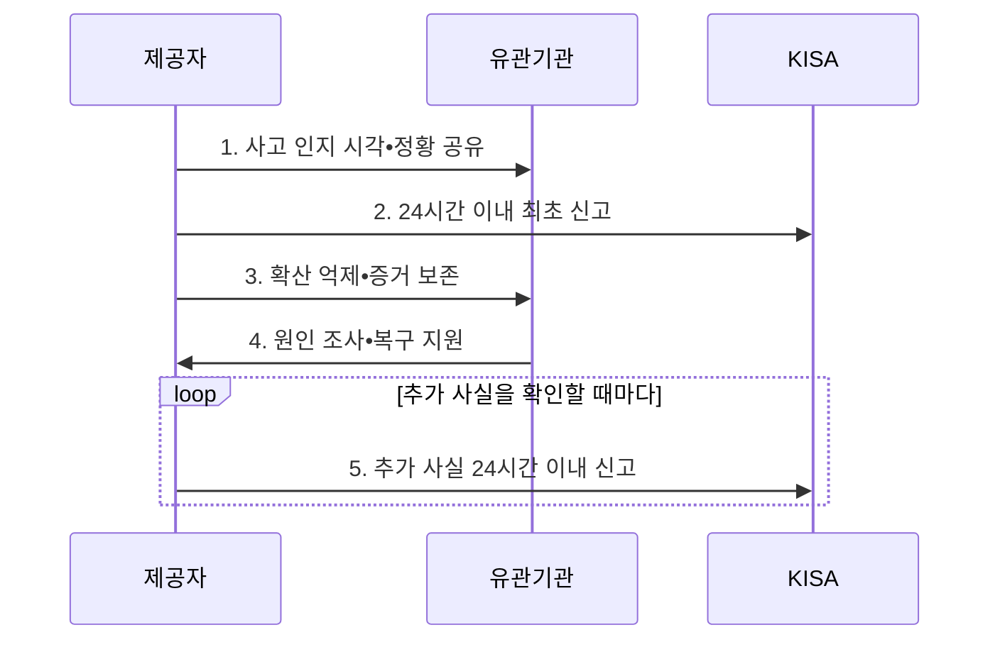

---
sidebar:
  order: 24
  label: "024. 정보통신망법 - 침해사고 신고•보호 조치 (Network Act)"
  badge:
    text: "미출 • 50%"
    variant: note
title: "정보통신망법 - 침해사고 신고•보호 조치 (Network Act)"
date: "2026-08-05T02:01:54+09:00"
tags:
  - "notes-law_policy"
weight: 24
extra:
  question_no: "024"
  source_status: "미출"
  source_history: ""
  priority: 50
  priority_note: "24시간 침해사고 신고와 보호조치의 현행축"
---

## Ⅰ. 개요

핵심 용어

- **침해사고 신고 절차**: 정보통신서비스 제공자가 침해사고 인지 후 법정 기한 안에 신고하고 확산 방지•증거 보존•복구를 병행하는 대응 절차이다.
- **침해사고**: 정보통신망이나 정보시스템이 공격받아 서비스•데이터의 안전을 해치는 사고이다.
- **24시간 신고 기준**: 침해사고 또는 추가 사실을 안 때부터 24시간 안에 현재 확인한 내용을 우선 신고해야 하는 법정 기한이다.
- **정보통신망 이용촉진 및 정보보호 등에 관한 법률(정보통신망법)**: 정보통신서비스 제공자의 침해사고 신고와 정보통신망 보호조치 등을 규율하는 법률이다.

- 정의/개념: 제공자가 사고 인지 후 **24시간 이내 신고**하고 보호조치를 병행하는 **정보통신망법 대응 절차**
- 배경/필요성: 사업자 내부 대응만으로는 대규모 침해의 **확산•공동 원인 조사** 통제 곤란

#### 한줄 요약

- 정보통신서비스 제공자는 침해사고를 알면 피해 확산을 억제하고 24시간 안에 관계기관에 신고해야 한다.

## Ⅱ. 특징

핵심 용어

- **신속 신고성**: 사고 발생을 알게 된 때부터 24시간 안에 현재 확인한 사실을 우선 신고하는 특성이다.
- **지속 갱신성**: 최초 신고 뒤 새로 확인한 원인•피해•조치 사실도 확인 시점 기준으로 추가 신고하는 특성이다.
- **대응 병행성**: 신고를 이유로 확산 억제•증거 보존•복구를 늦추지 않고 동시에 수행하는 원칙이다.

- **신속 신고성**: 사고 발생을 알게 된 때부터 24시간 이내에 최초 확인 사실 신고
- **지속 갱신성**: 최초 신고 후 추가로 확인한 사실도 확인 시점부터 24시간 이내에 신고
- **대응 병행성**: 신고와 동시에 접속 제한•취약점 보완•증거 보존•서비스 복구를 수행하여 피해 확산 억제

#### 한줄 요약

- 최초 신고 뒤 새 사실이 확인되면 그 사실도 24시간 안에 추가 신고해야 하므로 조사와 신고가 함께 이어진다.

## Ⅲ. 구조 및 구성요소

핵심 용어

- **정보통신서비스 제공자**: 전기통신역무를 이용하여 정보를 제공하며 법정 침해사고 신고 의무를 지는 사업자이다.
- **한국인터넷진흥원(Korea Internet & Security Agency, KISA)**: 침해사고 신고를 접수하고 기술적 대응을 지원하는 기관이다.
- **보호 조치**: 접속 제한•취약점 보완•계정 차단 등 침해 예방과 피해 확산 억제를 위한 기술적•관리적 조치이다.
- **침해사고 탐지**: 보안 경보와 조사 정황으로 침해 가능성을 식별하는 활동이다.
- **침해사고 판단**: 침해 여부와 법적 인지 시각을 확정하는 활동이다.
- **확산 억제**: 공격 경로를 차단하고 취약점을 보완하는 활동이다.
- **복구**: 안전성을 확인한 뒤 서비스를 정상 상태로 되돌리는 활동이다.
- **증거 보존**: 로그•메모리•시스템 이미지를 훼손 없이 유지하는 활동이다.
- **조사 협력**: 보존한 증거를 관계기관의 원인 조사에 제공하는 활동이다.

| 구성요소 | 책임 |
|:---|:---|
| **정보통신서비스 제공자** | 탐지•신고•보호조치•복구의 **이행 주체** |
| **침해사고 탐지•판단** | 피해 확인과 **법적 인지 시각** 기록 |
| **확산 억제•복구** | 악성 접속 차단•취약점 보완•**안전한 복원** |
| **24시간 최초•추가 신고** | 확인 정보를 **법정 기한 내 제출** |
| **증거 보존•조사 협력** | 로그•메모리 보존과 **정부 조사 지원** |

#### 한줄 요약

- 제공자가 사고 대응과 신고를 함께 수행하고, 보존한 로그로 원인을 조사하는 책임 구조다.

## Ⅳ. 흐름도

핵심 용어

- **인지 시점**: 정황•경보•조사 결과로 침해사고 발생 사실을 조직이 알게 되어 신고 기한 계산이 시작되는 시점이다.
- **최초 신고**: 침해사고 인지 후 24시간 안에 현재 확인한 발생 일시•원인•피해•연락처를 제출하는 신고이다.
- **추가 신고**: 조사 중 새로 확인한 원인•피해•조치 사실을 그 확인 시점부터 24시간 안에 제출하는 신고이다.

**동작 원리**

1. **사고 인지 시각•정황 공유**: 사고 판단 근거•영향 서비스•발견 경로와 인지 시점을 내부 전파
2. **24시간 이내 최초 신고**: 현재 확인 가능한 발생 일시•원인•피해•담당 연락처를 정부 또는 KISA에 신고
3. **확산 억제•증거 보존**: 공격 경로를 차단하되 원인 규명에 필요한 로그와 시스템 증거 유지
4. **원인 조사•복구 지원**: 침해 범위•취약점•악성 행위를 분석하고 안전성을 확인한 뒤 서비스 복원
5. **추가 사실 24시간 이내 신고**: 조사 중 새로 확인한 원인•피해•조치 사실을 확인 시점 기준으로 추가 제출

#### 한줄 요약

- 사고를 안 때부터 24시간 안에 먼저 신고하고, 조사 중 새 사실이 나오면 다시 24시간 안에 알린다.

## Ⅴ. 종류 및 비교

핵심 용어

- **정보통신기반 보호법**: 주요정보통신기반시설의 지정•보호와 침해사고 통지•복구 체계를 규율하는 법률이다.
- **주요정보통신기반시설**: 국가안전보장•행정•국방•금융 등 주요 기능에 중대한 영향을 주어 법에 따라 지정•보호되는 정보통신기반시설이다.

| 판단 기준 | 정보통신망법 | 정보통신기반 보호법 |
|:---|:---|:---|
| **적용 기준** | **정보통신서비스 제공자** | **주요정보통신기반시설** |
| **핵심 특징** | 인지 후 **24시간 최초•추가 신고** | 관계기관 통지와 **복구•보호조치** |
| **한계** | 인지 시점과 **추가 사실 추적** | 시설 지정과 **소관 보고체계 확인** |

#### 한줄 요약

- 일반 정보통신서비스 사고는 정보통신망법을, 주요정보통신기반시설 사고는 기반보호법을 적용한다.

## Ⅵ. 실무 고려사항 및 대책

핵심 용어

- **신고 지연**: 원인과 피해를 모두 확정한 뒤 신고하려다 최초 신고 기한을 넘기는 문제이다.
- **증거 훼손**: 성급한 재부팅•초기화•로그 순환으로 원인 규명 자료가 사라지는 문제이다.
- **인지 시각**: 조직이 침해사고를 안 때로 신고 기한 계산이 시작되는 시각이다.
- **인지 근거**: 침해 판단에 사용한 경보•티켓•조사 정황의 기록이다.
- **추가 사실 갱신**: 최초 신고 뒤 새로 확인한 원인•피해•조치 내용을 추가 신고에 반영하는 활동이다.

| 문제 | 대책 | 효과 |
|:---|:---|:---|
| 탐지•법적 인지의 **시각 혼선** | 관제•티켓에 **인지 시각•근거** 기록 | 신고 기한의 **객관적 관리** |
| 조사 완료 대기에 따른 **신고 지연** | 최초 정보 우선 신고와 **추가 사실 갱신** | 법정 기한과 **공동 대응** 확보 |
| 차단 과정의 **증거 훼손** | 격리•로그 보존•이미징•**접근 통제** | 원인과 **후속 책임 추적** |

#### 한줄 요약

- 보안관제시스템이 침해사고를 처음 확인한 시각을 남겨 24시간 신고기한의 시작점을 고정한다.

## Ⅶ. 결론

핵심 용어

- **24시간 기준**: 최초 신고와 새 사실의 추가 신고를 각각 사고 또는 사실을 인지한 시점부터 계산하는 법정 대응 기준이다.
- **공동 대응**: 사업자•정부•KISA가 사고 정보를 공유하여 확산 차단과 공통 원인 분석을 수행하는 체계이다.

- 사고 인지 즉시 **확산 억제•증거 보존**, 확인 사실은 **24시간 내 최초•추가 신고**

#### 한줄 요약

- 사고를 처음 안 시각을 정확히 기록해 최초•추가 신고가 각각 24시간을 넘지 않게 관리한다.
