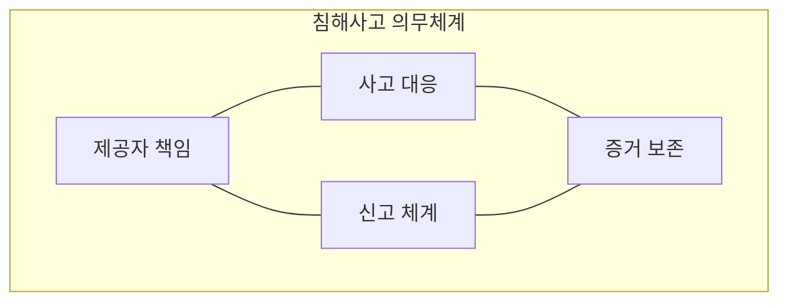
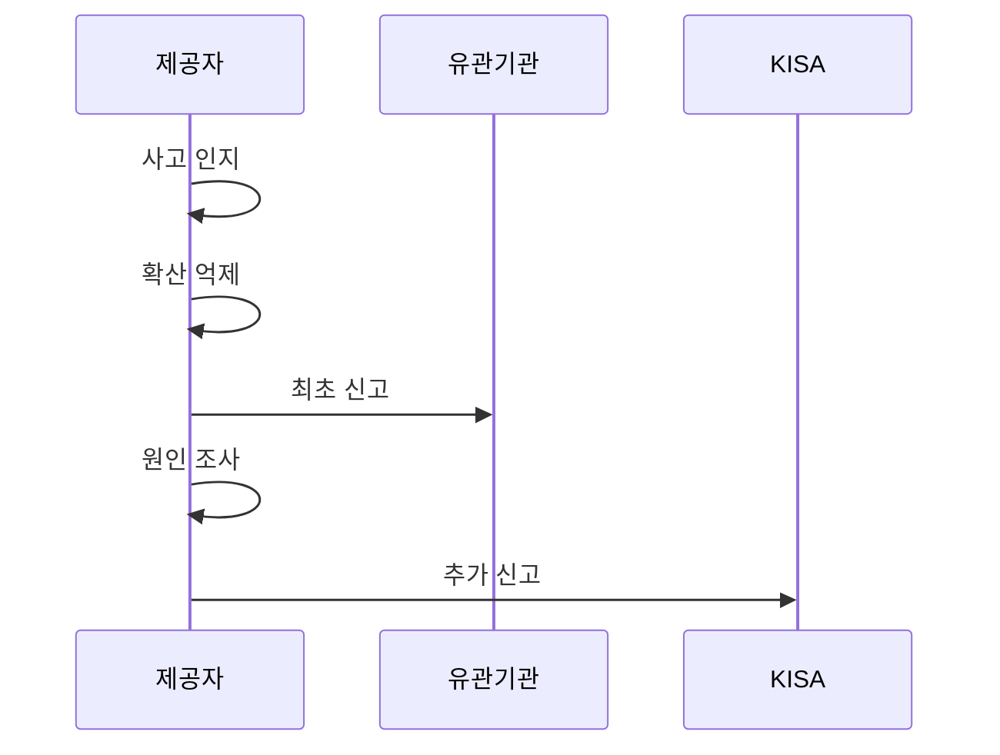

---
sidebar:
  order: 24
  label: "024. 정보통신망법 - 침해사고 신고·보호 조치 (Network Act)"
  badge:
    text: "미출제 · 50%"
    variant: note
title: "정보통신망법 - 침해사고 신고·보호 조치 (Network Act)"
date: "2026-07-25T14:20:00+09:00"
tags:
  - "notes-law_policy"
weight: 24
extra:
  question_no: "024"
  source_status: "미출제"
  source_history: ""
  priority: 50
  priority_note: "24시간 침해사고 신고와 보호조치의 현행축"
---

## 미리 알고가기

- **정보통신서비스 제공자(Information and Communications Service Provider, ISP)**: `ISP`는 “아이에스피”로 읽고 긴 영문 직무명을 줄여 쓰며, 전기통신역무로 정보를 제공하면서 침해사고 신고 의무를 지는 사업자를 가리킨다.
- **침해사고(Security Incident)**: 정보통신망이나 정보시스템이 공격받아 서비스·데이터의 안전을 해치는 사고이며, 본문 신고 절차의 시작 조건이다.
- **한국인터넷진흥원(Korea Internet & Security Agency, KISA)**: `KISA`는 “키사”로 읽고 기관 영문명의 머리글자를 조합한 표기이며, 침해사고 신고를 접수하고 대응을 지원한다.
- **24시간(24 Hours)**: “이십사 시간”으로 읽고 법정 신고기한을 숫자로 명확히 나타낸 표기이며, 침해사고 발생을 안 때부터 최초·추가 신고까지의 상한이다.
- **보호 조치(Protective Measures)**: 침해사고를 예방하거나 피해 확산을 억제하는 기술적·관리적 조치이며, 접속 제한과 취약점 보완 등을 포함한다.
- **증거 보존(Evidence Preservation)**: 접속 기록과 시스템 로그의 훼손을 막아 사고 원인 조사와 후속 신고의 근거를 유지하는 조치다.

## Ⅰ. 개요

- 정의/개념: 침해사고 대응과 24시간 신고 의무를 규율한다
- **배경/필요성**: 피해 확산을 억제하고 공동 대응 근거를 만든다

### 쉽게 이해하기 (학습용)

- 정보통신서비스 제공자는 침해사고를 알면 피해 확산을 억제하고 24시간 안에 관계기관에 신고해야 한다.

## Ⅱ. 특징

- 최초·추가 사실마다 24시간 신고기한이 적용된다
- 신고 뒤에도 조사·복구가 계속돼 추가 피해를 줄인다

### 쉽게 이해하기 (학습용)

- 최초 신고 뒤 새 사실이 확인되면 그 사실도 24시간 안에 추가 신고해야 하므로 조사와 신고가 함께 이어진다.

## Ⅲ. 아키텍처 및 구성요소

| 설계 요소 | 설명 |
|:---|:---|
| 제공자 책임 | 탐지·신고·복구 의무의 이행 주체 |
| 사고 대응 | 피해 파악 후 접속 제한·취약점 보완 |
| 신고 체계 | 인지 후 24시간 내 관계기관 신고 |
| 증거 보존 | 접속 기록·시스템 로그 훼손 방지 |

> 요약: 제공자가 사고 대응·신고·증거 보존을 수행한다

### 쉽게 이해하기 (학습용)

- 제공자가 사고 대응과 신고를 함께 수행하고, 보존한 로그로 원인을 조사하는 책임 구조다.

## Ⅳ. 원리 및 절차 흐름도

| 절차 | 설명 |
|:---|:---|
| 사고 인지 | 발생 인지 시각과 사고 정황 기록 |
| 확산 억제 | 접속 제한과 증거 보존 수행 |
| 최초 신고 | 인지 시각 기준 24시간 이내 관계기관 신고 |
| 원인 조사 | 취약점·악성코드 분석 후 서비스 복구 |
| 추가 신고 | 새 사실 확인 후 24시간 이내 신고 |

> 요약: 사고 인지 뒤 억제·신고·조사·추가 신고를 수행한다

### 쉽게 이해하기 (학습용)

- 사고를 안 때부터 24시간 안에 먼저 신고하고, 조사 중 새 사실이 나오면 다시 24시간 안에 알린다.

## Ⅴ. 종류 및 비교

| 판단 기준 | 정보통신망법 (현재) | 기반보호법 |
|:---|:---|:---|
| 적용 기준 | 정보통신서비스 제공자 | 주요정보통신기반시설 |
| 신고 기준 | 인지 후 24시간 이내 | 지체 없이 관계기관 통지 |
| 주요 의무 | 사고 대응·신고·자료 제출 | 취약점 분석·보호대책 수립 |

> 요약: 서비스와 기반시설의 신고 의무를 구분한다

### 쉽게 이해하기 (학습용)

- 일반 정보통신서비스 사고는 정보통신망법을, 주요정보통신기반시설 사고는 기반보호법을 적용한다.

## Ⅵ. 실무 사례

1. 관제시스템에 사고 인지 시각을 자동 기록한다
2. 추가 침해 사실 확인 시 KISA에 재신고한다

### 쉽게 이해하기 (학습용)

- 보안관제시스템이 침해사고를 처음 확인한 시각을 남겨 24시간 신고기한의 시작점을 고정한다.
- 원인 조사에서 새 피해 범위가 확인되면 그 확인 시각부터 24시간 안에 KISA에 추가 신고한다.

## Ⅶ. 결론

- 사고 인지 시각으로 24시간 신고기한을 통제한다.

### 쉽게 이해하기 (학습용)

- 사고를 처음 안 시각을 정확히 기록해 최초·추가 신고가 각각 24시간을 넘지 않게 관리한다.
