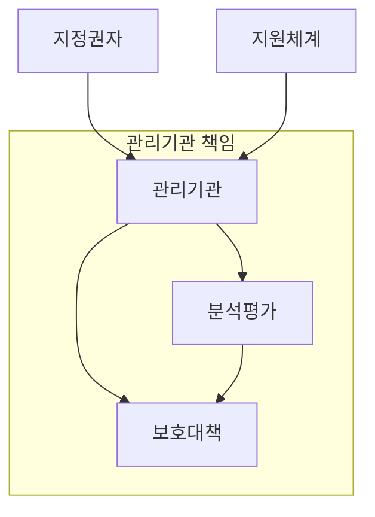
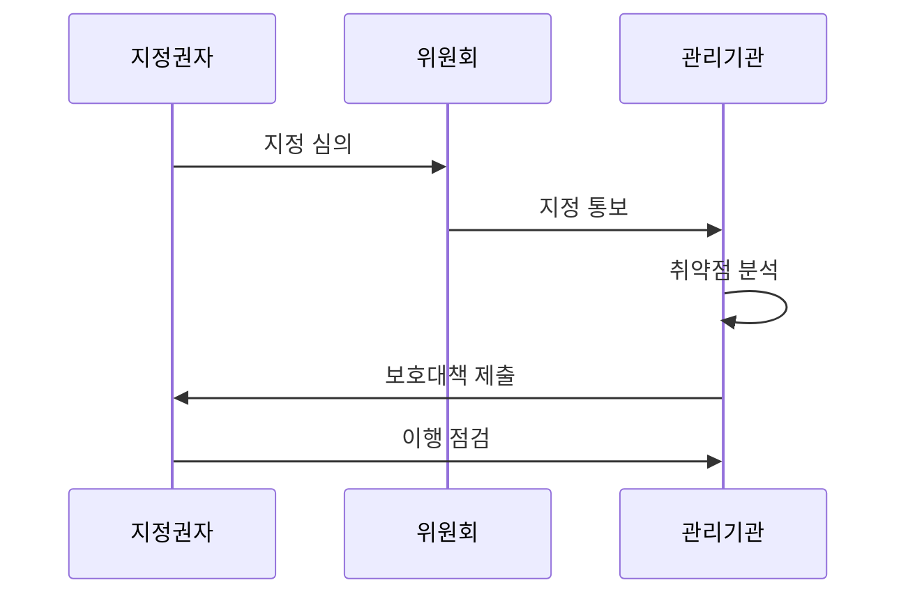

---
sidebar:
  order: 25
  label: "025. 정보통신기반 보호법 - 주요정보통신기반시설 지정 (Critical Infrastructure Protection)"
  badge:
    text: "미출제 · 50%"
    variant: note
title: "정보통신기반 보호법 - 주요정보통신기반시설 지정 (Critical Infrastructure Protection)"
date: "2026-07-25T14:22:00+09:00"
tags:
  - "notes-law_policy"
weight: 25
extra:
  question_no: "025"
  source_status: "미출제"
  source_history: ""
  priority: 50
  priority_note: "주요정보통신기반시설 지정·보호의 핵심법"
---

## 미리 알고가기

- **주요정보통신기반시설(Critical Information Infrastructure, CII)**: 침해될 경우 국가안보와 경제·사회에 중대한 영향을 줄 수 있어 지정·보호하는 시설이다.
- **정보기술(Information Technology, IT)**: 정보시스템에서 데이터를 저장·처리·전송하는 기술 영역이다.
- **운영기술(Operational Technology, OT)**: 발전소·공장 등의 물리 설비와 공정을 감시·제어하는 기술 영역이다.
- **취약점 분석·평가(Vulnerability Analysis and Assessment)**: 기반시설 자산의 취약점과 침해 가능성을 점검·평가해 보호대책의 근거를 만드는 법정 절차다.
- **보호대책(Protection Plan)**: 취약점 분석·평가 결과에 따라 관리·기술·물리 통제를 정하고 이행하는 계획이다.
- **랜섬웨어(Ransomware)**: 시스템이나 데이터를 암호화하고 금전을 요구하는 악성 소프트웨어이며, 오프라인 백업 복구 검증이 필요한 침해 유형이다.

## Ⅰ. 개요

- 정의/개념: 국가 핵심 정보통신기반시설을 지정·보호한다
- **배경/필요성**: 기반시설 마비의 국가적 연쇄 피해를 막는다

### 쉽게 이해하기 (학습용)

- 마비되면 국가안보·경제에 큰 영향을 주는 공공·민간 시설을 지정해 취약점을 점검하고 보호대책을 세우는 제도다.

## Ⅱ. 특징

- 국가안보·경제 파급성은 보호 대상을 선별한다
- 지정 시설 의무는 취약점과 보호 공백을 줄인다
- IT·OT 연결 평가는 물리 설비의 연쇄 피해를 찾는다

### 쉽게 이해하기 (학습용)

- 지정 시설의 관리기관은 법정 주기에 맞춰 취약점을 분석·평가하고 결과에 따라 보호대책을 세워 이행한다.

## Ⅲ. 아키텍처 및 구성요소

| 설계 요소 | 설명 |
|:---|:---|
| 지정권자 | 지정 후보 선정과 위원회 심의 요청 |
| 관리기관 | 분석·평가와 보호대책 이행 주체 |
| 분석평가 | 서버·망·제어설비 취약점 식별 |
| 보호대책 | 관리·기술·물리 통제 수립 |
| 지원체계 | 전문기관의 점검·침해 분석 지원 |

> 요약: 지정권자와 관리기관이 분석·보호를 분담한다

### 쉽게 이해하기 (학습용)

- 지정권자가 대상을 정하고, 관리기관이 전문기관의 지원을 받아 취약점 분석과 보호대책을 연결한다.

## Ⅳ. 원리 및 절차 흐름도

| 절차 | 설명 |
|:---|:---|
| 지정 심의 | 파급성·업무 의존도로 지정 여부 심의 |
| 지정 통보 | 심의된 기반시설을 관리기관에 통보 |
| 취약점 분석 | 법정 기준으로 시설 취약점 평가 |
| 보호대책 제출 | 평가 결과에 따른 보호대책 제출 |
| 이행 점검 | 보호대책 이행 실태 확인·개선 |

> 요약: 시설 지정 뒤 취약점 분석과 보호대책을 점검한다

### 쉽게 이해하기 (학습용)

- 파급성이 큰 시설을 심의해 지정하고, 관리기관이 취약점을 평가해 보호대책을 제출하면 지정권자가 이행을 점검한다.

## Ⅴ. 종류 및 비교

| 판단 기준 | 기반보호법 (현재) | 정보통신망법 |
|:---|:---|:---|
| 적용 기준 | 국가안보·경제 파급 시설 | 정보통신서비스 제공자 |
| 핵심 통제 | 취약점 분석·보호대책 | 사고 대응·24시간 신고 |
| 주요 위험 | 기반시설 마비의 연쇄 피해 | 서비스·이용자 피해 확산 |

> 요약: 핵심 기반시설과 정보통신서비스 의무를 구분한다

### 쉽게 이해하기 (학습용)

- 국가 핵심 시설은 기반보호법으로 사전 점검하고, 일반 정보통신서비스는 정보통신망법으로 사고 신고를 관리한다.

## Ⅵ. 실무 사례

1. 주요 제어망은 **법정 기준**으로 취약점 분석·평가

### 쉽게 이해하기 (학습용)

- 지정 시설의 서버·네트워크·제어설비를 법정 기준으로 점검해 보호대책에 반영할 취약점을 정한다.

## Ⅶ. 결론

- 분석·평가 결과로 보호대책 우선순위를 결정한다.

### 쉽게 이해하기 (학습용)

- 취약점 분석·평가에서 파급성이 큰 위험부터 골라 보호대책의 투자와 이행 순서를 정한다.
