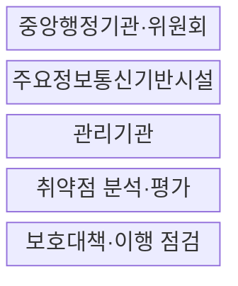
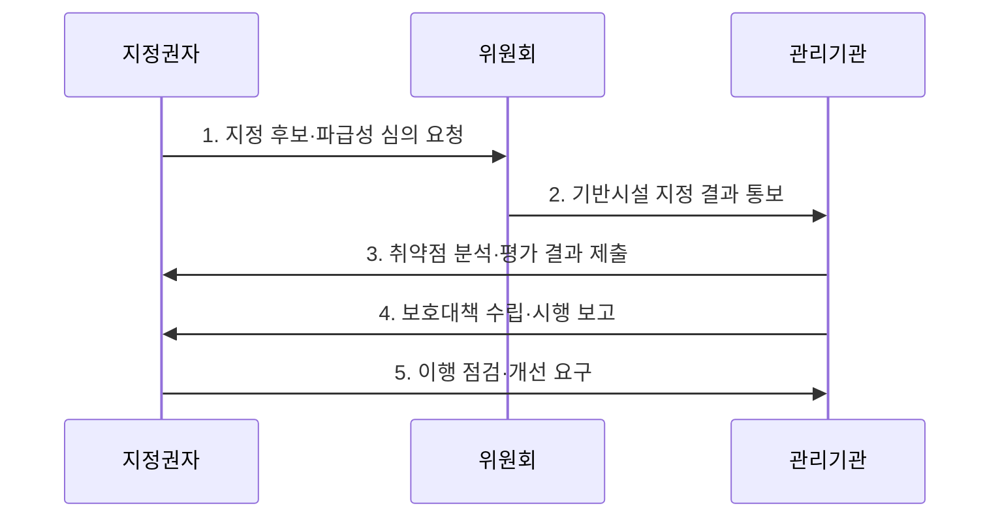

---
sidebar:
  order: 25
  label: "025. 정보통신기반 보호법 - 주요정보통신기반시설 지정 (Critical Infrastructure Protection)"
  badge:
    text: "미출제 · 50%"
    variant: note
title: "정보통신기반 보호법 - 주요정보통신기반시설 지정 (Critical Infrastructure Protection)"
date: "2026-07-30T12:53:00+09:00"
tags:
  - "notes-law_policy"
weight: 25
extra:
  question_no: "025"
  source_status: "미출제"
  source_history: ""
  priority: 50
  priority_note: "주요정보통신기반시설 지정·보호의 핵심법"
---

## 미리 알고가기

- **주요정보통신기반시설(Critical Information Infrastructure, CII)**: 침해될 경우 국가안보와 경제·사회에 중대한 영향을 줄 수 있어 지정·보호하는 시설이다.
- **정보기술(Information Technology, IT)**: 정보시스템에서 데이터를 저장·처리·전송하는 기술 영역이다.
- **운영기술(Operational Technology, OT)**: 발전소·공장 등의 물리 설비와 공정을 감시·제어하는 기술 영역이다.
- **취약점 분석·평가(Vulnerability Analysis and Assessment)**: 기반시설 자산의 취약점과 침해 가능성을 점검·평가해 보호대책의 근거를 만드는 법정 절차다.
- **보호대책(Protection Plan)**: 취약점 분석·평가 결과에 따라 관리·기술·물리 통제를 정하고 이행하는 계획이다.
- **랜섬웨어(Ransomware)**: 시스템이나 데이터를 암호화하고 금전을 요구하는 악성 소프트웨어이며, 오프라인 백업 복구 검증이 필요한 침해 유형이다.

## Ⅰ. 개요

- **정보통신기반 보호법**은 침해사고가 국가안전보장과 경제·사회에 중대한 영향을 미칠 정보통신기반시설을 지정하고 취약점 분석·평가와 보호대책을 의무화하는 **국가 핵심기반 보호 법률**
- **배경/필요성**: 개별 기관의 자율적 보호만으로 예방하기 어려운 핵심 기반시설 마비와 상호의존 서비스의 국가적 연쇄 피해 통제

### 쉽게 이해하기 (학습용)

- 마비되면 국가안보·경제에 큰 영향을 주는 공공·민간 시설을 지정해 취약점을 점검하고 보호대책을 세우는 제도다.

## Ⅱ. 특징

- **위험 기반 지정**: 업무 중요도·의존도·피해 규모·복구 용이성 등 국가적 파급성을 기준으로 보호 대상 선별
- **주기적 예방 의무**: 관리기관이 취약점 분석·평가 결과를 근거로 보호대책을 수립·시행하여 보호 공백 축소
- **융합 영향 분석**: 정보기술과 운영기술의 연결 경로를 평가하여 사이버 침해가 물리 설비와 국민 안전으로 확산하는 위험 확인

### 쉽게 이해하기 (학습용)

- 지정 시설의 관리기관은 법정 주기에 맞춰 취약점을 분석·평가하고 결과에 따라 보호대책을 세워 이행한다.

## Ⅲ. 구조 및 구성요소

| 설계 요소 | 설명 |
|:---|:---|
| 중앙행정기관·위원회 | 지정 후보 검토·심의·지정과 보호정책 조정 |
| 주요정보통신기반시설 | 침해 시 국가·경제·사회에 중대한 영향을 주는 보호 대상 |
| 관리기관 | 시설 운영과 분석·평가·보호대책·사고 대응의 책임 주체 |
| 취약점 분석·평가 | 자산·위협·취약점·업무 영향을 체계적으로 식별·평가 |
| 보호대책·이행 점검 | 관리·기술·물리 통제를 계획하고 이행 수준과 개선 결과 확인 |

> 요약: 지정권자와 관리기관이 분석·보호를 분담한다

### 쉽게 이해하기 (학습용)

- 지정권자가 대상을 정하고, 관리기관이 전문기관의 지원을 받아 취약점 분석과 보호대책을 연결한다.

## Ⅳ. 흐름도

| 절차 | 설명 |
|:---|:---|
| 지정 후보·파급성 심의 요청 | 업무 중요도·대체 가능성·상호의존성과 침해 피해 규모 분석 |
| 기반시설 지정 결과 통보 | 심의 결과와 관리기관의 보호 의무·대상 범위 명확화 |
| 취약점 분석·평가 결과 제출 | 정보기술·운영기술 자산의 위협·취약점·업무 영향 평가 |
| 보호대책 수립·시행 보고 | 위험 우선순위에 따라 예방·탐지·대응·복구 통제 이행 |
| 이행 점검·개선 요구 | 보호대책의 실효성과 미조치 위험을 확인하여 보완 추진 |

> 요약: 시설 지정 뒤 취약점 분석과 보호대책을 점검한다

### 쉽게 이해하기 (학습용)

- 파급성이 큰 시설을 심의해 지정하고, 관리기관이 취약점을 평가해 보호대책을 제출하면 지정권자가 이행을 점검한다.

## Ⅴ. 종류 및 비교

| 판단 기준 | 정보통신기반 보호법 | 정보통신망법 |
|:---|:---|:---|
| 적용 기준 | 국가안보·경제 파급 시설 | 정보통신서비스 제공자 |
| 핵심 통제 | 취약점 분석·보호대책 | 사고 대응·24시간 신고 |
| 한계 | 지정 범위 밖 공급망·연계 시스템의 위험 누락 가능 | 서비스 제공자 중심으로 국가 기반의 연쇄 영향 평가는 제한 |

> 요약: 핵심 기반시설과 정보통신서비스 의무를 구분한다

### 쉽게 이해하기 (학습용)

- 국가 핵심 시설은 기반보호법으로 사전 점검하고, 일반 정보통신서비스는 정보통신망법으로 사고 신고를 관리한다.

## Ⅵ. 실무 고려사항 및 대책

| 고려사항 | 대책 | 효과 |
|:---|:---|:---|
| 시설 경계 밖 공급망·연계 위험 | 외부 접속·원격 유지보수·클라우드·협력업체 의존 관계를 자산 범위에 포함 | 우회 침투와 연쇄 장애 위험 감소 |
| 운영기술의 무중단 요구로 취약점 조치 지연 | 안전·가용성 영향을 검토하여 보완통제·정비창구·단계 패치 적용 | 운영 연속성과 보안 수준의 균형 확보 |
| 문서 중심 보호대책 | 침해 시나리오별 탐지·격리·수동 운전·오프라인 복구 훈련 수행 | 실제 사고 대응과 핵심 기능 복원 능력 향상 |

### 쉽게 이해하기 (학습용)

- 지정 시설의 서버·네트워크·제어설비를 법정 기준으로 점검해 보호대책에 반영할 취약점을 정한다.

## Ⅶ. 결론

- 주요정보통신기반시설의 연쇄 피해를 줄이려면 **정보기술·운영기술·외부 공급망의 의존 관계를 포함해 취약점과 업무 영향을 평가하고 핵심 기능의 격리·수동 운전·오프라인 복구를 우선하는 보호대책** 필요

### 쉽게 이해하기 (학습용)

- 취약점 분석·평가에서 파급성이 큰 위험부터 골라 보호대책의 투자와 이행 순서를 정한다.
