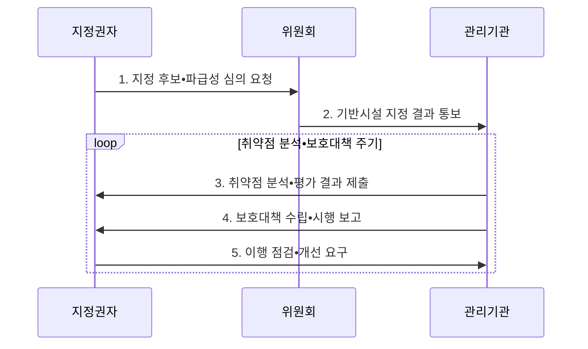

---
sidebar:
  order: 25
  label: "025. 정보통신기반 보호법 - 주요정보통신기반시설 지정 (Critical Infrastructure Protection)"
  badge:
    text: "미출 • 50%"
    variant: note
title: "정보통신기반 보호법 - 주요정보통신기반시설 지정 (Critical Infrastructure Protection)"
date: "2026-08-05T02:01:54+09:00"
tags:
  - "notes-law_policy"
weight: 25
extra:
  question_no: "025"
  source_status: "미출"
  source_history: ""
  priority: 50
  priority_note: "주요정보통신기반시설 지정•보호의 핵심법"
---

## Ⅰ. 개요

<details><summary>핵심 용어</summary>

- **정보통신기반 보호법**: 국가적 파급성이 큰 주요정보통신기반시설을 지정하고 취약점 분석•평가와 보호대책을 의무화한 법률이다.
- **주요정보통신기반시설**: 침해될 경우 국가안보와 경제•사회에 중대한 영향을 줄 수 있어 지정•보호하는 시설이다.

</details>

- 정의/개념: **주요정보통신기반시설** 을 지정해 취약점 분석•평가와 보호대책을 의무화한 **핵심기반 보호 법률**
- 배경/필요성: 개별 기관의 자율 보호만으로는 기반시설 마비와 **상호의존 서비스 연쇄 피해** 통제 곤란

#### 한줄 요약

- 마비되면 국가안보•경제에 큰 영향을 주는 공공•민간 시설을 지정해 취약점을 점검하고 보호대책을 세우는 제도다.

## Ⅱ. 특징

<details><summary>핵심 용어</summary>

- **위험 기반 지정**: 업무 중요도•의존도•피해 규모•복구 용이성 등 국가적 파급성을 기준으로 보호 대상을 선별하는 방식이다.
- **주기적 예방 의무**: 관리기관이 정기적인 취약점 분석•평가와 보호대책 이행으로 보호 공백을 줄이는 의무이다.
- **정보기술(Information Technology, IT)**: 데이터를 저장•처리•전송하는 정보시스템 기술 영역이다.
- **운영기술(Operational Technology, OT)**: 물리 설비와 공정을 감시•제어하는 기술 영역이다.
- **융합 영향 분석**: IT와 OT의 연결을 통해 침해가 물리 설비와 국민 안전으로 확산하는 영향을 분석하는 방식이다.

</details>

- **위험 기반 지정**: 업무 중요도•의존도•피해 규모•복구 용이성 등 국가적 파급성을 기준으로 보호 대상 선별
- **주기적 예방 의무**: 관리기관이 취약점 분석•평가 결과를 근거로 보호대책을 수립•시행하여 보호 공백 축소
- **융합 영향 분석**: 정보기술과 운영기술의 연결 경로를 평가하여 사이버 침해가 물리 설비와 국민 안전으로 확산하는 위험 확인

#### 한줄 요약

- 지정 시설의 관리기관은 법정 주기에 맞춰 취약점을 분석•평가하고 결과에 따라 보호대책을 세워 이행한다.

## Ⅲ. 구조 및 구성요소

<details><summary>핵심 용어</summary>

- **관리기관**: 지정 기반시설을 관리하며 취약점 분석•평가와 보호대책 수립•시행 책임을 지는 기관이다.
- **취약점 분석•평가**: 기반시설 자산의 위협•취약점•침해 가능성•업무 영향을 점검하여 보호대책 근거를 만드는 법정 절차이다.
- **보호대책**: 분석•평가 결과에 따라 예방•탐지•대응•복구의 관리적•기술적•물리적 통제를 정하고 이행하는 계획이다.
- **중앙행정기관**: 후보 시설을 발굴하고 지정•보호 업무를 수행하는 주체이다.
- **위원회**: 후보 시설의 지정 여부와 보호정책을 심의•조정하는 주체이다.
- **이행 점검**: 보호대책이 실제 적용되어 위험을 낮추었는지 확인하고 미흡한 사항의 개선을 요구하는 절차이다.

</details>

```text
[중앙행정기관•위원회]
           |
[주요정보통신기반시설]
           |
       [관리기관]
           |
  +--------+--------+
  |                 |
[취약점 분석•평가] [보호대책•이행 점검]
```

선의 의미: 중앙행정기관•위원회가 지정한 주요정보통신기반시설을 관리기관이 맡고, 취약점 분석•평가와 보호대책•이행 점검을 책임지는 보호 체계를 나타낸다.

| 구성요소 | 책임 |
|:---|:---|
| **중앙행정기관•위원회** | 지정 심의와 **보호정책 조정** |
| **주요정보통신기반시설** | 국가•경제•사회 파급성이 큰 **보호 대상** |
| **관리기관** | 분석•평가•보호대책•대응의 **책임 주체** |
| **취약점 분석•평가** | 자산•위협•취약점•**업무 영향** 평가 |
| **보호대책•이행 점검** | 관리•기술•물리 통제와 **개선 확인** |

#### 한줄 요약

- 지정권자가 대상을 정하고, 관리기관이 전문기관의 지원을 받아 취약점 분석과 보호대책을 연결한다.

## Ⅳ. 흐름도

<details><summary>핵심 용어</summary>

- **지정 심의**: 후보 시설의 국가•경제•사회 파급성과 대체 가능성을 검토하여 법정 보호 대상으로 정하는 절차이다.
</details>



**동작 원리**

1. **지정 후보•파급성 심의**: 업무 중요도•대체 가능성•상호의존성과 침해 피해 규모 분석
2. **기반시설 지정 결과 통보**: 심의 결과와 관리기관의 보호 의무•대상 범위 명확화
3. **취약점 분석•평가**: 정보기술•운영기술 자산의 위협•취약점•업무 영향 평가
4. **보호대책 수립•시행**: 위험 우선순위에 따라 예방•탐지•대응•복구 통제 이행
5. **이행 점검•개선 요구**: 보호대책의 실효성과 미조치 위험을 확인하여 보완 추진

#### 한줄 요약

- 파급성이 큰 시설을 심의해 지정하고, 관리기관이 취약점을 평가해 보호대책을 제출하면 지정권자가 이행을 점검한다.

## Ⅴ. 종류 및 비교

<details><summary>핵심 용어</summary>

- **IT•OT 융합 위험**: 정보망의 침해가 제어망으로 전파되어 물리 공정•안전에 영향을 주는 위험이다.
- **정보통신망법**: 정보통신서비스 제공자의 침해사고 보호조치와 24시간 신고 등을 규율하는 법률이다.

</details>

| 판단 기준 | 정보통신기반 보호법 | 정보통신망법 |
|:---|:---|:---|
| **적용 기준** | 국가안보•경제 **파급 시설** | **정보통신서비스 제공자** |
| **핵심 통제** | **취약점 분석•보호대책** | 사고 대응•**24시간 신고** |
| **한계** | 지정 밖 **공급망 위험 누락** | 국가 기반의 **연쇄 영향 평가 제한** |

#### 한줄 요약

- 국가 핵심 시설은 기반보호법으로 사전 점검하고, 일반 정보통신서비스는 정보통신망법으로 사고 신고를 관리한다.

## Ⅵ. 실무 고려사항 및 대책

<details><summary>핵심 용어</summary>

- **공급망 위험**: 협력업체•외부 접속을 통해 침해가 시설 경계 안으로 확산하는 위험이다.
- **연계 위험**: 다른 기반시설과의 의존 관계를 따라 장애가 확산하는 위험이다.
- **보완통제**: 즉시 패치하기 어려운 OT에 먼저 적용하는 대체 보호조치이다.
- **단계 패치**: 안전성을 검증한 순서로 패치를 배포하는 방식이다.
- **격리**: 침해 구간을 다른 자산과 분리해 확산을 차단하는 대응이다.
- **오프라인 복구**: 공격자가 접근할 수 없는 백업으로 핵심 기능을 복원하는 대응이다.

</details>

| 문제 | 대책 | 효과 |
|:---|:---|:---|
| 시설 경계 밖 **공급망•연계 위험** | 외부 접속•협력업체 의존 관계를 **자산 범위에 포함** | 신뢰 공급망 침투와 **연쇄 장애 위험 감소** |
| 운영기술의 무중단 요구로 **취약점 조치 지연** | 안전•가용성 검토 후 **보완통제•단계 패치** 적용 | 운영 연속성과 **보안 수준의 균형 확보** |
| 문서 중심 **보호대책** | 침해 시나리오별 **격리•오프라인 복구** 훈련 | 실제 사고 대응과 **핵심 기능 복원** 능력 향상 |

#### 한줄 요약

- 지정 시설의 서버•네트워크•제어설비를 법정 기준으로 점검해 보호대책에 반영할 취약점을 정한다.

## Ⅶ. 결론

<details><summary>핵심 용어</summary>

- **물리 영향 우선순위**: 정보 자산 손실뿐 아니라 인명•시설•사회 기능 피해를 기준으로 보호 조치 순위를 정하는 원칙이다.
</details>

- 파급성이 큰 **IT•OT•공급망 위험**부터 평가해 **격리•수동 운전•오프라인 복구** 우선

#### 한줄 요약

- 취약점 분석•평가에서 파급성이 큰 위험부터 골라 보호대책의 투자와 이행 순서를 정한다.
