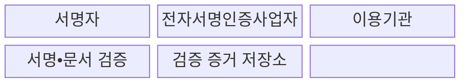
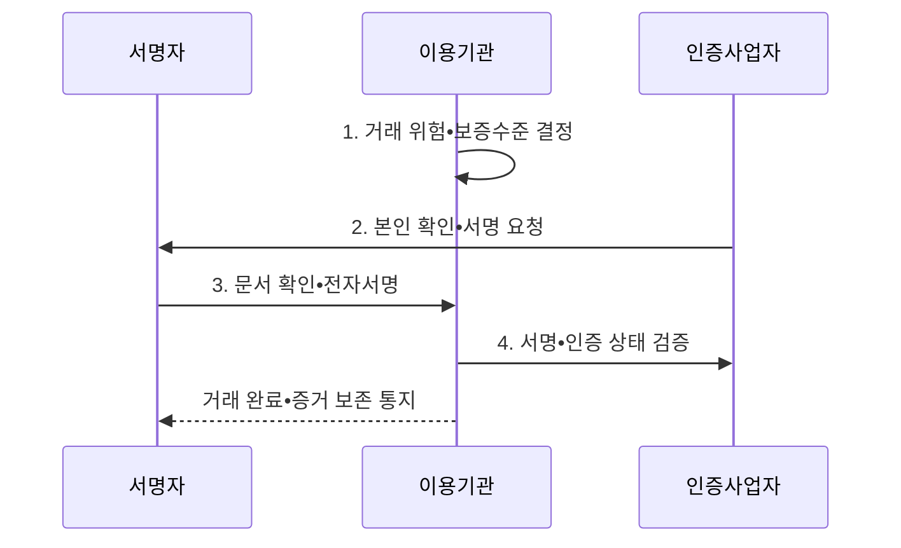

---
sidebar:
  order: 26
  label: "026. 전자서명법 - 공인인증서 폐지•전자서명 (Electronic Signature Act)"
  badge:
    text: "미출 • 30%"
    variant: note
title: "전자서명법 - 공인인증서 폐지•전자서명 (Electronic Signature Act)"
date: "2026-08-04T14:54:17+09:00"
tags:
  - "notes-law_policy"
weight: 26
extra:
  question_no: "026"
  source_status: "미출"
  source_history: ""
  priority: 30
  priority_note: "전자서명 효력•인증수단 경쟁을 묻는 법제"
---

## Ⅰ. 개요

핵심 용어

- **전자서명법**: 전자서명의 법적 효력 원칙과 전자서명인증업무의 신뢰 기준을 기술 중립적으로 정한 법률이다.
- **전자서명**: 전자문서에 붙거나 논리적으로 결합되어 서명자의 신원과 서명 사실을 나타내는 전자적 정보이다.

- 정의/개념: 전자서명의 효력과 인증업무 기준을 정한 **기술 중립적 전자거래 신뢰 법률**
- 배경/필요성: 공인인증서의 법정 우월성과 **특정 설치 기술 의존**으로 신기술•인증 경쟁 제약

#### 한줄 요약

- 공인인증서만 우대하던 제도를 없애고 다양한 전자서명이 경쟁하도록 하되, 서명 효력은 법률과 당사자 약정에 따라 판단한다.

## Ⅱ. 특징

핵심 용어

- **법적 비차별성**: 전자적 형태라는 이유만으로 서명의 법적 효력을 부인하지 않는 원칙이다.
- **기술 중립성**: 특정 인증기술에 법정 독점 지위를 부여하지 않고 다양한 전자서명 수단이 경쟁하도록 하는 원칙이다.
- **위험 비례성**: 법령•당사자 약정•거래 피해에 맞춰 본인확인 강도와 증거 수준을 선택하는 원칙이다.

- **법적 비차별성**: 전자적 형태라는 이유만으로 서명의 법적 효력을 부인하지 않는 원칙
- **기술 중립성**: 특정 인증기술의 법정 독점을 배제하고 민간 전자서명 수단 간 경쟁 촉진
- **위험 비례성**: 법령•당사자 약정•거래 위험에 맞춰 본인확인 강도와 증거 수준을 선택

#### 한줄 요약

- 법이 특정 인증기술을 우대하지 않으므로 이용기관이 거래 위험과 이용 편의에 맞는 전자서명 수단을 선택한다.

## Ⅲ. 구조 및 구성요소

핵심 용어

- **전자서명인증사업자**: 가입자 신원을 확인하고 전자서명 생성•검증에 필요한 인증서비스를 제공하는 주체이다.
- **해시값**: 문서 내용을 고정 길이 값으로 변환하여 서명 후 문서 변경 여부를 검증하는 무결성 증거이다.
- **서명자**: 전자문서의 내용을 확인하고 자신의 의사를 나타내기 위해 전자서명정보를 생성하는 사람이다.
- **이용기관**: 전자서명을 업무나 거래에 적용하고 위험에 맞는 서명 수단과 보증수준을 선택하는 기관이다.
- **보증수준**: 신원확인 방법과 인증수단의 강도에 따라 전자서명이 제공하는 신뢰 정도를 나타내는 수준이다.
- **검증 증거 저장소**: 원문 해시•서명값•검증 시각•거래 맥락을 보존하여 분쟁 시 서명 사실을 입증하는 저장 영역이다.

| 구성요소 | 책임 |
|:---|:---|
| **서명자** | 본인 확인 후 전자문서 내용에 동의하여 **전자서명** |
| **전자서명인증사업자** | 가입자 식별과 **전자서명 생성•검증** 서비스 제공 |
| **이용기관** | 거래 위험에 맞는 **서명 수단•보증수준** 채택 |
| **서명•문서 검증** | 서명 유효성•**문서 무결성•서명 의사** 확인 |
| **검증 증거 저장소** | 원문 해시•서명값•**검증 시각•거래 맥락** 보존 |

#### 한줄 요약

- 서명자는 인증사업자의 수단으로 문서에 서명하고, 이용기관은 검증 결과와 문서 해시를 증거로 보존한다.

## Ⅳ. 흐름도

핵심 용어

- **서명 의사 확인**: 이용자에게 서명 대상 원문과 법적 효과를 명확히 제시하고 서명 동의를 받는 절차이다.
- **서명 검증**: 서명값•문서 해시•인증 상태•시각•취소 여부를 확인하여 신원과 문서 무결성을 판단하는 절차이다.

**동작 원리**

1. **거래 위험•보증수준 결정**: 거래 금액•법적 효과•부정 사용 피해로 본인확인과 증거 수준 결정
2. **본인 확인•서명 요청**: 선택한 수단으로 가입자를 확인하고 서명 대상 문서를 명확히 제시
3. **문서 확인•전자서명**: 서명자가 원문과 의사를 확인한 뒤 서명정보를 생성
4. **서명•인증 상태 검증**: 서명값•문서 해시•인증 유효성•시각•취소 여부 확인

#### 한줄 요약

- 이용기관은 거래 위험에 맞는 수단을 고른 뒤 서명자 의사를 확인하고, 서명과 문서가 유효했다는 기록을 남긴다.

## Ⅴ. 종류 및 비교

핵심 용어

- **인증서 기반 서명**: 공개키 인증서와 개인키로 서명자 신원•서명값•문서 무결성을 검증하는 방식이다.
- **개인 식별 번호(Personal Identification Number, PIN)**: 사용자가 본인임을 증명하기 위해 입력하는 비밀 숫자이다.
- **간편 전자서명**: 모바일 앱•생체•PIN 등 다양한 인증수단과 사업자 증거를 결합하여 서명하는 방식이다.

| 판단 기준 | 개정 후 체계 | 개정 전 체계 |
|:---|:---|:---|
| **적용 기준** | 거래 위험별 **인증서 기반 서명•간편 전자서명 선택** | 지정 **공인인증서 우선** |
| **핵심 특징** | **기술 중립•민간 경쟁** | 공인인증서의 **법정 우월성** |
| **한계** | 보증수준•**증거 요건 판단** | 기술 의존•**호환성 저하** |

#### 한줄 요약

- 개정 후에는 하나의 인증서를 강제하지 않고 거래 금액과 피해 영향에 맞춰 전자서명 수단을 선택한다.

## Ⅵ. 실무 고려사항 및 대책

핵심 용어

- **부인방지**: 서명자가 나중에 서명 사실을 부정하기 어렵도록 신원•문서•시각•인증 상태의 증거를 보존하는 성질이다.
- **문서 해시**: 서명 당시 원문의 해시로 문서 변경 여부를 입증하는 값이다.
- **서명값**: 서명자의 키로 생성해 서명 사실과 의사를 입증하는 값이다.
- **타임스탬프**: 전자문서와 서명정보가 특정 시각에 존재했고 이후 변경되지 않았음을 입증하는 전자적 시각 증거이다.

| 문제 | 대책 | 효과 |
|:---|:---|:---|
| 편의성만으로 **낮은 보증수준 선택** | 거래 피해에 따라 **인증수단 등급화** | 위험에 비례한 **본인확인 확보** |
| 서명 화면과 **실제 원문 불일치** | 원문을 표시하고 **문서 해시•서명값 결합** | 서명 의사와 **문서 무결성 입증** |
| 장기 보존 중 **인증 상태 확인 곤란** | 검증 시각•타임스탬프를 **원문과 함께 보존** | **부인방지•분쟁 대응력** 강화 |

#### 한줄 요약

- 계약서 해시와 서명 검증 시각을 함께 보존해 나중에 문서 변경과 서명 부인을 확인한다.

## Ⅶ. 결론

핵심 용어

- **강한 본인확인**: 고위험 거래에서 복수 요소나 높은 보증수준의 인증수단으로 서명자의 신원을 확인하는 방식이다.
- **검증 시각**: 서명 검증 당시의 인증 유효 상태를 입증하는 시각 정보이다.

- 고위험 거래는 **강한 본인확인**, 모든 서명은 **원문 해시•검증 시각** 장기 보존

#### 한줄 요약

- 거래 금액과 피해 영향이 클수록 본인 확인이 강한 전자서명을 선택하고 검증 증거도 더 오래 보존한다.
