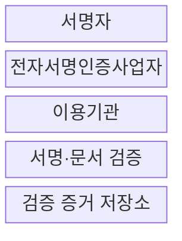
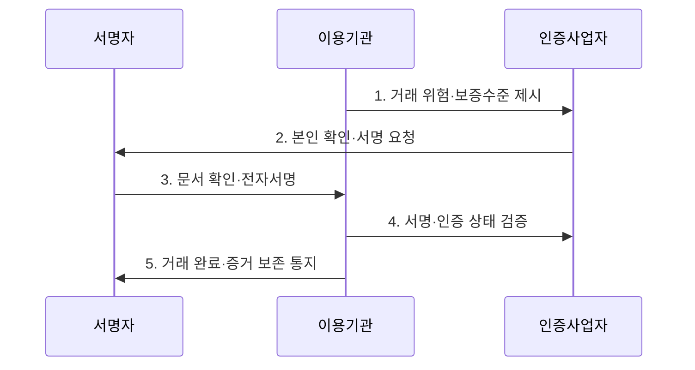

---
sidebar:
  order: 26
  label: "026. 전자서명법 - 공인인증서 폐지·전자서명 (Electronic Signature Act)"
  badge:
    text: "미출제 · 30%"
    variant: note
title: "전자서명법 - 공인인증서 폐지·전자서명 (Electronic Signature Act)"
date: "2026-07-30T13:01:00+09:00"
tags:
  - "notes-law_policy"
weight: 26
extra:
  question_no: "026"
  source_status: "미출제"
  source_history: ""
  priority: 30
  priority_note: "전자서명 효력·인증수단 경쟁을 묻는 법제"
---

## 미리 알고가기

- **전자서명(Electronic Signature)**: 전자문서에 붙거나 논리적으로 결합되어 서명자의 신원과 서명 사실을 나타내는 전자적 정보이며, 법적 효력 판단의 대상이다.
- **공동인증서(Joint Certificate)**: 옛 공인인증서의 독점적 지위가 폐지된 뒤 기존 인증기관들이 이름을 바꿔 제공하는 인증서로, 법률상 별도 우월 지위를 뜻하지 않는다.
- **전자서명인증사업자(Electronic Signature Certification Service Provider)**: 가입자의 신원을 확인하고 전자서명 생성·검증에 필요한 인증서비스를 제공하는 주체다.
- **개인식별번호(Personal Identification Number, PIN)**: 이용자가 알고 있는 비밀값으로 본인 여부를 확인하는 인증정보다.
- **응용 프로그래밍 인터페이스(Application Programming Interface, API)**: 서비스가 외부 전자서명 기능을 정해진 방식으로 호출하는 연결 규약이다.
- **인터넷 프로토콜 주소(Internet Protocol Address, IP Address)**: 네트워크 접속 위치를 식별하여 서명 행위의 보조 증적으로 사용하는 주소다.
- **해시값(Hash Value)**: 문서 내용을 고정 길이 값으로 변환한 결과이며, 서명 뒤 문서가 바뀌었는지 검증하는 무결성 증거다.
- **액티브엑스(ActiveX)**: 웹 브라우저에 별도 기능을 설치하는 마이크로소프트 기술로, 기존 공인인증 환경의 설치·호환성 부담을 유발했다.
- **부인방지(Non-repudiation)**: 서명자가 나중에 서명 사실을 부정하기 어렵도록 신원·문서·시각의 검증 증거를 보존하는 성질이다.

## Ⅰ. 개요

- **전자서명법**은 전자서명의 법적 효력과 인증업무의 운영 기준을 정하고 특정 기술의 독점 없이 다양한 인증수단의 이용을 촉진하는 **전자거래 신뢰 법률**
- **배경/필요성**: 공인인증서의 법정 우월성과 특정 설치 기술 의존으로 제한된 이용 편의·신기술 도입·인증수단 경쟁의 개선

### 쉽게 이해하기 (학습용)

- 공인인증서만 우대하던 제도를 없애고 다양한 전자서명이 경쟁하도록 하되, 서명 효력은 법률과 당사자 약정에 따라 판단한다.

## Ⅱ. 특징

- **법적 비차별성**: 전자적 형태라는 이유만으로 서명의 법적 효력을 부인하지 않는 원칙
- **기술 중립성**: 특정 인증기술의 법정 독점을 배제하고 민간 전자서명 수단 간 경쟁 촉진
- **위험 비례성**: 법령·당사자 약정·거래 위험에 맞춰 본인확인 강도와 증거 수준을 선택

### 쉽게 이해하기 (학습용)

- 법이 특정 인증기술을 우대하지 않으므로 이용기관이 거래 위험과 이용 편의에 맞는 전자서명 수단을 선택한다.

## Ⅲ. 구조 및 구성요소

| 설계 요소 | 설명 |
|:---|:---|
| 서명자 | 본인 확인 후 전자문서의 내용에 동의하여 서명 |
| 전자서명인증사업자 | 가입자 식별과 전자서명 생성·검증에 필요한 인증서비스 제공 |
| 이용기관 | 법령·약정·거래 위험에 맞는 서명 수단과 보증수준 채택 |
| 서명·문서 검증 | 서명 유효성·가입자 상태·문서 무결성·서명 의사 확인 |
| 검증 증거 저장소 | 원문 해시·서명값·인증 상태·검증 시각·거래 맥락 보존 |

> 요약: 서명·인증·검증 증거로 전자거래를 구성한다

### 쉽게 이해하기 (학습용)

- 서명자는 인증사업자의 수단으로 문서에 서명하고, 이용기관은 검증 결과와 문서 해시를 증거로 보존한다.

## Ⅳ. 흐름도

| 절차 | 설명 |
|:---|:---|
| 거래 위험·보증수준 제시 | 거래 금액·법적 효과·부정 사용 피해로 본인확인과 증거 수준 결정 |
| 본인 확인·서명 요청 | 선택한 수단으로 가입자를 확인하고 서명 대상 문서를 명확히 제시 |
| 문서 확인·전자서명 | 서명자가 원문과 의사를 확인한 뒤 서명정보를 생성 |
| 서명·인증 상태 검증 | 서명값·문서 해시·인증 유효성·시각·취소 여부 확인 |
| 거래 완료·증거 보존 통지 | 검증 결과와 거래 맥락을 보존하고 당사자에게 완료 결과 제공 |

> 요약: 거래 위험에 맞는 서명 수단과 증거를 관리한다

### 쉽게 이해하기 (학습용)

- 이용기관은 거래 위험에 맞는 수단을 고른 뒤 서명자 의사를 확인하고, 서명과 문서가 유효했다는 기록을 남긴다.

## Ⅴ. 종류 및 비교

| 판단 기준 | 개정 후 체계 | 개정 전 체계 |
|:---|:---|:---|
| 적용 기준 | 거래 위험별 수단 선택 | 지정 공인인증서 우선 사용 |
| 핵심 특징 | 기술중립·민간 인증 경쟁 | 공인인증서의 법정 우월성 |
| 한계 | 이용기관이 거래별 보증수준과 증거 요건을 판단해야 함 | 특정 기술 의존·호환성 저하·이용 불편 |

> 요약: 개정 뒤 기술중립과 민간 인증 경쟁을 적용한다

### 쉽게 이해하기 (학습용)

- 개정 후에는 하나의 인증서를 강제하지 않고 거래 금액과 피해 영향에 맞춰 전자서명 수단을 선택한다.

## Ⅵ. 실무 고려사항 및 대책

| 고려사항 | 대책 | 효과 |
|:---|:---|:---|
| 편의성만으로 낮은 보증수준 선택 | 거래 금액·권리 변동·부정 사용 피해에 따른 인증수단 등급화 | 위험에 비례한 본인확인 확보 |
| 서명 화면과 실제 원문의 불일치 | 서명 직전 원문·핵심 조건을 표시하고 해당 문서 해시와 서명값 결합 | 서명 의사와 문서 무결성 입증 |
| 장기 보존 중 인증 상태 확인 곤란 | 검증 시각·인증서 상태·타임스탬프·감사로그를 원문과 함께 보존 | 부인방지와 분쟁 대응력 강화 |

### 쉽게 이해하기 (학습용)

- 계약서 해시와 서명 검증 시각을 함께 보존해 나중에 문서 변경과 서명 부인을 확인한다.

## Ⅶ. 결론

- 전자계약의 진정성과 서명 의사를 입증하려면 **거래 위험에 비례한 본인확인 수단을 선택하고 서명 대상 원문의 해시·인증 상태·검증 시각·거래 맥락을 장기 보존하는 전자서명 체계** 필요

### 쉽게 이해하기 (학습용)

- 거래 금액과 피해 영향이 클수록 본인 확인이 강한 전자서명을 선택하고 검증 증거도 더 오래 보존한다.
