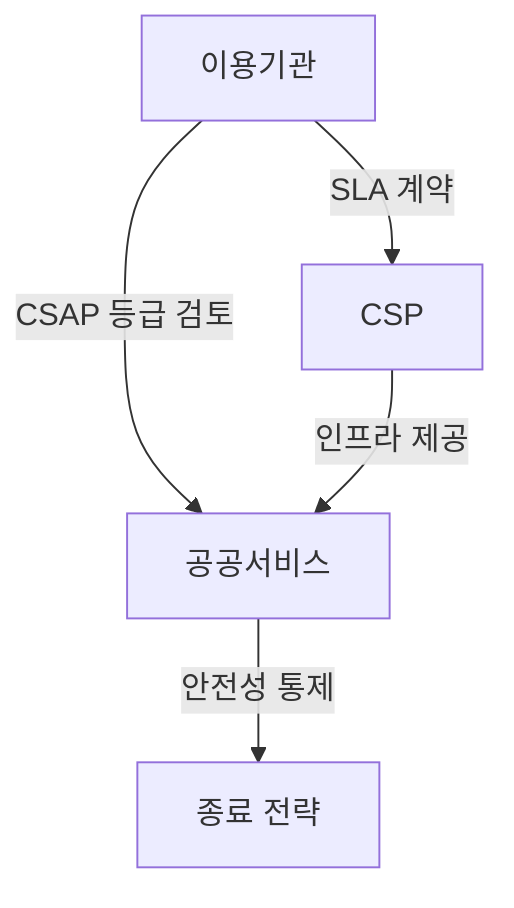
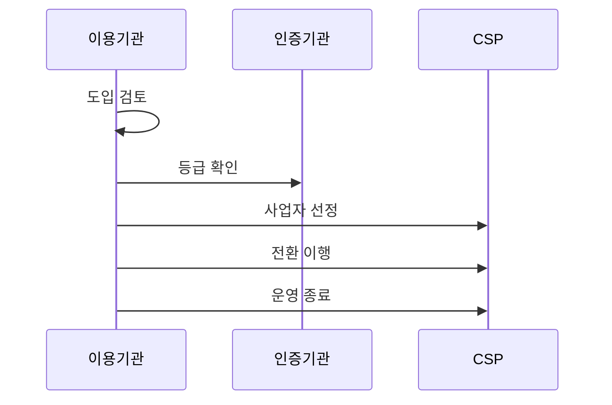

---
sidebar:
  order: 27
  label: "027. 클라우드컴퓨팅법 - CSAP·공공 이용 (Cloud Computing Act)"
  badge:
    text: "기출 · 30%"
    variant: note
title: "클라우드컴퓨팅법 - CSAP·공공 이용 (Cloud Computing Act)"
date: "2026-07-27T23:59:59+09:00"
tags:
  - "notes-law_policy"
weight: 27
extra:
  question_no: "027"
  source_status: "기출"
  source_history: "128회"
  priority: 30
  priority_note: "128회 기출, 공공 클라우드 이용·인증 법제"
---

## 미리 알고가기

- **클라우드컴퓨팅법(Cloud Computing Act)**: 클라우드 산업 진흥과 공공부문의 이용 촉진, 이용자 보호를 함께 규율하는 법률이다.
- **클라우드서비스 보안인증제(Cloud Security Assurance Program, CSAP)**: `CSAP`는 “씨에스에이피”로 읽고 영문명의 머리글자를 조합한 표기이며, 공공기관용 클라우드서비스가 보안기준을 충족하는지 인증한다.
- **클라우드서비스 제공자(Cloud Service Provider, CSP)**: `CSP`는 “씨에스피”로 읽고 영문명의 머리글자를 조합한 표기이며, 컴퓨팅 자원과 운영 보안 기능을 제공하는 사업자다.
- **서비스 수준 협약(Service Level Agreement, SLA)**: `SLA`는 “에스엘에이”로 읽고 영문명의 머리글자를 조합한 표기이며, 가용성·복구·책임 기준을 이용기관과 제공자 사이에 정한다.
- **오토스케일링(Auto-scaling)**: 부하에 따라 컴퓨팅 자원을 자동 증감하는 기능이며, 클라우드와 자체 구축의 수요 대응 차이를 만든다.
- **온프레미스(On-premises)**: 기관이 소유·통제하는 시설에 시스템을 직접 구축하는 방식이며, 공공 클라우드의 비교 대상이다.
- **하이브리드 클라우드(Hybrid Cloud)**: 자체 환경과 외부 클라우드를 연결해 업무를 나누는 배치 방식이며, 데이터 중요도별 전환에 사용한다.
- **공급자 종속(Vendor Lock-in)**: 특정 제공자의 기술·데이터 형식에 묶여 다른 환경으로 옮기기 어려운 상태이며, 종료 전략으로 통제할 위험이다.

## Ⅰ. 개요

- 정의/개념: 클라우드 진흥·공공 이용·보호를 규율한다
- 기존 한계: 자체 구축 중심 조달은 탄력적 자원 이용 제한
- **배경/필요성**: 클라우드 이용 촉진과 이용자 보호

### 쉽게 이해하기 (학습용)

- 공공기관의 클라우드 이용을 촉진하면서도 서비스 안전성과 이용자 데이터 보호 기준을 함께 정한 법률이다.

## Ⅱ. 특징

- 공공기관의 우선 검토는 클라우드 이용을 촉진한다
- CSAP 등급은 업무별 허용 범위 오판을 줄인다
- 공동 책임은 이용기관과 CSP의 통제 누락을 막는다

### 쉽게 이해하기 (학습용)

- CSAP 인증은 CSP의 보안수준을 확인하지만, 이용기관도 데이터 분류와 계정 권한 같은 자신의 책임을 계속 수행해야 한다.

## Ⅲ. 아키텍처 및 구성요소

| 설계 요소 | 설명 |
|:---|:---|
| 이용기관 | 업무 중요도 분류와 위험 승인 |
| CSP | 인증된 자원과 기반 보안 제공 |
| 공공서비스 | SLA에 따라 업무 기능 운영 |
| 종료 전략 | 계약 종료 시 데이터 반출·파기 |

> 요약: 이용기관과 CSP가 운영·종료 책임을 나눈다

### 쉽게 이해하기 (학습용)

- 이용기관과 CSP는 SLA로 운영 책임을 나누고, 종료 전략으로 데이터를 반출·파기해 공급자 종속을 줄인다.

## Ⅳ. 원리 및 절차 흐름도

| 절차 | 설명 |
|:---|:---|
| 도입 검토 | 업무 중요도와 도입 타당성 분석 |
| 등급 확인 | 업무에 맞는 CSAP 등급 확인 |
| 사업자 선정 | SLA·이관·종료 조건 계약 |
| 전환 이행 | 데이터 이전과 가용성 시험 |
| 운영 종료 | 데이터 반출·파기 결과 확인 |

> 요약: 업무 등급을 확인해 전환하고 종료 결과를 검증한다

### 쉽게 이해하기 (학습용)

- 업무 중요도로 도입 여부와 CSAP 등급을 정하고, SLA와 종료 조건을 계약한 뒤 이전·운영·파기를 확인한다.

## Ⅴ. 종류 및 비교

| 판단 기준 | 공공 클라우드 (현재) | 자체 구축 |
|:---|:---|:---|
| 적용 기준 | 가변 수요·신속한 자원 증설 | 전용 통제·물리 격리 요구 |
| 핵심 특징 | 오토스케일링·공동 책임 | 고정 자원·기관 단독 책임 |
| 한계 | 공급자 종속·책임 경계 누락 | 과잉 용량·증설 지연 |

> 요약: 자원 형태와 보안 책임 경계로 방식을 선택한다

### 쉽게 이해하기 (학습용)

- 공공 클라우드는 CSP와 책임을 나누고 수요에 따라 자원을 늘리지만, 자체 구축은 기관이 시설과 자원을 모두 통제한다.

## Ⅵ. 실무 사례

1. 공공 하이브리드 전환 전 CSAP 등급을 확인한다

### 쉽게 이해하기 (학습용)

- 공공기관은 업무 중요도에 맞는 CSAP 등급과 인증 유효 여부를 확인한 뒤 하이브리드 배치를 정한다.

## Ⅶ. 결론

- 안전한 클라우드 이용을 위해 중요도·종료를 검토하여 **클라우드법** 활용

### 쉽게 이해하기 (학습용)

- 공공 업무의 중요도에 맞춰 CSAP 등급을 정하고, 계약 전에 데이터 반출·파기 조건까지 확정한다.
