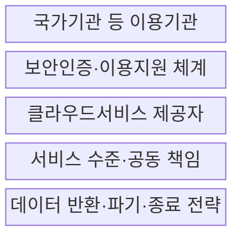
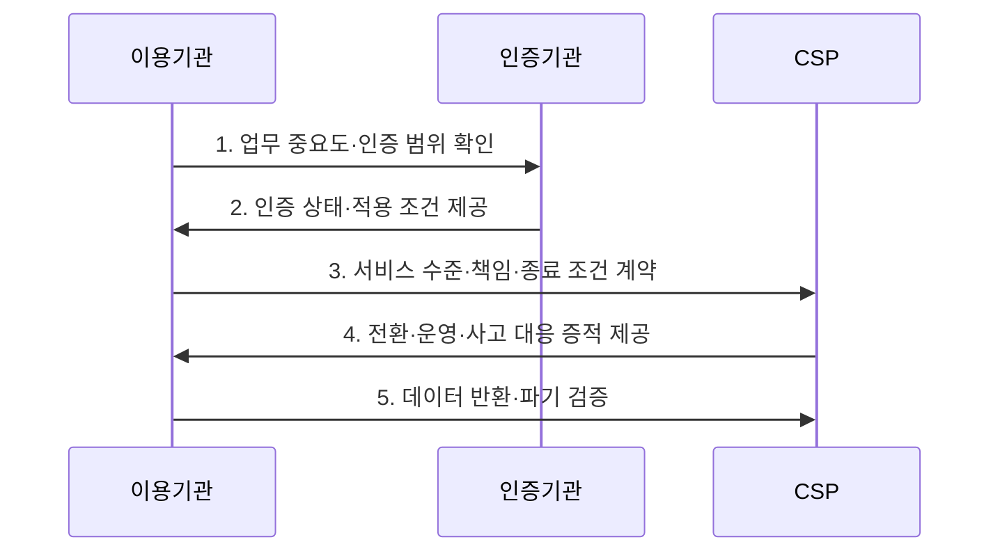

---
sidebar:
  order: 27
  label: "027. 클라우드컴퓨팅법 - CSAP·공공 이용 (Cloud Computing Act)"
  badge:
    text: "기출 · 30%"
    variant: note
title: "클라우드컴퓨팅법 - CSAP·공공 이용 (Cloud Computing Act)"
date: "2026-07-30T13:09:00+09:00"
tags:
  - "notes-law_policy"
weight: 27
extra:
  question_no: "027"
  source_status: "기출"
  source_history: "128회"
  priority: 30
  priority_note: "128회 기출, 공공 클라우드 이용·인증 법제"
---

## 미리 알고가기

- **클라우드컴퓨팅법(Cloud Computing Act)**: 클라우드 산업 진흥과 공공부문의 이용 촉진, 이용자 보호를 함께 규율하는 법률이다.
- **클라우드서비스 보안인증제(Cloud Security Assurance Program, CSAP)**: 공공기관용 클라우드서비스가 보안기준을 충족하는지 평가·인증하는 제도다.
- **클라우드서비스 제공자(Cloud Service Provider, CSP)**: 컴퓨팅 자원과 클라우드 운영·보안 기능을 제공하는 사업자다.
- **서비스 수준 협약(Service Level Agreement, SLA)**: 이용기관과 제공자가 가용성·복구·책임 기준을 정한 협약이다.
- **오토스케일링(Auto-scaling)**: 부하에 따라 컴퓨팅 자원을 자동 증감하는 기능이며, 클라우드와 자체 구축의 수요 대응 차이를 만든다.
- **온프레미스(On-premises)**: 기관이 소유·통제하는 시설에 시스템을 직접 구축하는 방식이며, 공공 클라우드의 비교 대상이다.
- **하이브리드 클라우드(Hybrid Cloud)**: 자체 환경과 외부 클라우드를 연결해 업무를 나누는 배치 방식이며, 데이터 중요도별 전환에 사용한다.
- **공급자 종속(Vendor Lock-in)**: 특정 제공자의 기술·데이터 형식에 묶여 다른 환경으로 옮기기 어려운 상태이며, 종료 전략으로 통제할 위험이다.

## Ⅰ. 개요

- **클라우드컴퓨팅법**은 클라우드 산업의 발전, 국가기관 등의 이용 촉진, 보안인증, 서비스 신뢰성과 이용자 보호를 함께 규율하는 **클라우드 진흥·보호 법률**
- **배경/필요성**: 자체 구축 중심 제도로 부족했던 탄력적 자원 활용·공공 이용 절차·서비스 중단 대응·이용자 데이터 보호 기준 마련

### 쉽게 이해하기 (학습용)

- 공공기관의 클라우드 이용을 촉진하면서도 서비스 안전성과 이용자 데이터 보호 기준을 함께 정한 법률이다.

## Ⅱ. 특징

- **공공 이용 촉진**: 국가기관 등이 정보화사업을 추진할 때 클라우드서비스 이용을 검토하고 보안인증 서비스를 우선 고려
- **서비스 신뢰 보장**: 보안인증과 품질·성능 기준으로 제공자의 보호조치와 서비스 수준을 객관적으로 확인
- **공동 책임 관리**: 제공자의 기반 통제와 이용기관의 데이터·계정·설정·종료 책임을 계약과 운영 절차로 연결

### 쉽게 이해하기 (학습용)

- CSAP 인증은 CSP의 보안수준을 확인하지만, 이용기관도 데이터 분류와 계정 권한 같은 자신의 책임을 계속 수행해야 한다.

## Ⅲ. 구조 및 구성요소

| 설계 요소 | 설명 |
|:---|:---|
| 국가기관 등 이용기관 | 업무 중요도·보안 요구·이용 타당성 판단과 잔여 위험 승인 |
| 보안인증·이용지원 체계 | 보안기준 적합성을 평가하고 공공이 이용할 서비스를 등록·지원 |
| 클라우드서비스 제공자 | 인증 범위의 자원·운영·기반 보호와 사고·중단 대응 제공 |
| 서비스 수준·공동 책임 | 가용성·복구·보안·변경·비용과 양 당사자의 통제 경계 계약 |
| 데이터 반환·파기·종료 전략 | 계약 종료 시 데이터·설정·로그를 이전하고 잔존 사본의 파기 확인 |

> 요약: 이용기관과 CSP가 운영·종료 책임을 나눈다

### 쉽게 이해하기 (학습용)

- 이용기관과 CSP는 SLA로 운영 책임을 나누고, 종료 전략으로 데이터를 반출·파기해 공급자 종속을 줄인다.

## Ⅳ. 흐름도

| 절차 | 설명 |
|:---|:---|
| 업무 중요도·인증 범위 확인 | 데이터·서비스 영향에 맞는 배치 방식과 보안인증 등급·유효 범위 검토 |
| 인증 상태·적용 조건 제공 | 인증 서비스·책임 경계·제외 항목과 최신 상태 확인 |
| 서비스 수준·책임·종료 조건 계약 | 가용성·복구·보안·비용·자료 이전·파기와 감사 권한 명시 |
| 전환·운영·사고 대응 증적 제공 | 데이터 이전·복구 시험·변경·취약점·중단 대응 결과를 이용기관에 보고 |
| 데이터 반환·파기 검증 | 계약 종료 전 대체 환경 복원 가능성과 제공자 잔존 데이터 제거 확인 |

> 요약: 업무 등급을 확인해 전환하고 종료 결과를 검증한다

### 쉽게 이해하기 (학습용)

- 업무 중요도로 도입 여부와 CSAP 등급을 정하고, SLA와 종료 조건을 계약한 뒤 이전·운영·파기를 확인한다.

## Ⅴ. 종류 및 비교

| 판단 기준 | 공공 클라우드 | 자체 구축 |
|:---|:---|:---|
| 적용 기준 | 가변 수요·신속한 자원 증설 | 전용 통제·물리 격리 요구 |
| 핵심 특징 | 오토스케일링·공동 책임 | 고정 자원·기관 단독 책임 |
| 한계 | 공급자 종속·책임 경계 누락 | 과잉 용량·증설 지연 |

> 요약: 자원 형태와 보안 책임 경계로 방식을 선택한다

### 쉽게 이해하기 (학습용)

- 공공 클라우드는 CSP와 책임을 나누고 수요에 따라 자원을 늘리지만, 자체 구축은 기관이 시설과 자원을 모두 통제한다.

## Ⅵ. 실무 고려사항 및 대책

| 고려사항 | 대책 | 효과 |
|:---|:---|:---|
| 보안인증을 전체 책임의 대체로 오인 | 인증 범위·제외 통제와 이용기관의 계정·데이터·설정 책임을 책임분담표로 명시 | 공동 책임의 통제 누락 방지 |
| 서비스 중단과 복구 성능 불확실 | 서비스 수준 목표·재해복구 구조·중단 통지와 정기 복구 시험을 계약 | 업무 연속성과 복구 가능성 확보 |
| 공급자 종속과 종료 실패 | 표준 형식 반출·대체 환경 복원·잔존 데이터 파기의 출구 시험 수행 | 전환 비용과 데이터 잔류 위험 감소 |

### 쉽게 이해하기 (학습용)

- 공공기관은 업무 중요도에 맞는 CSAP 등급과 인증 유효 여부를 확인한 뒤 하이브리드 배치를 정한다.

## Ⅶ. 결론

- 공공 클라우드를 안전하게 이용하려면 **업무 중요도와 인증 범위를 일치시키고 공동 책임·서비스 수준을 계약하며 대체 환경 복원과 잔존 데이터 파기까지 시험하는 전 수명주기 이용 관리** 필요

### 쉽게 이해하기 (학습용)

- 공공 업무의 중요도에 맞춰 CSAP 등급을 정하고, 계약 전에 데이터 반출·파기 조건까지 확정한다.
