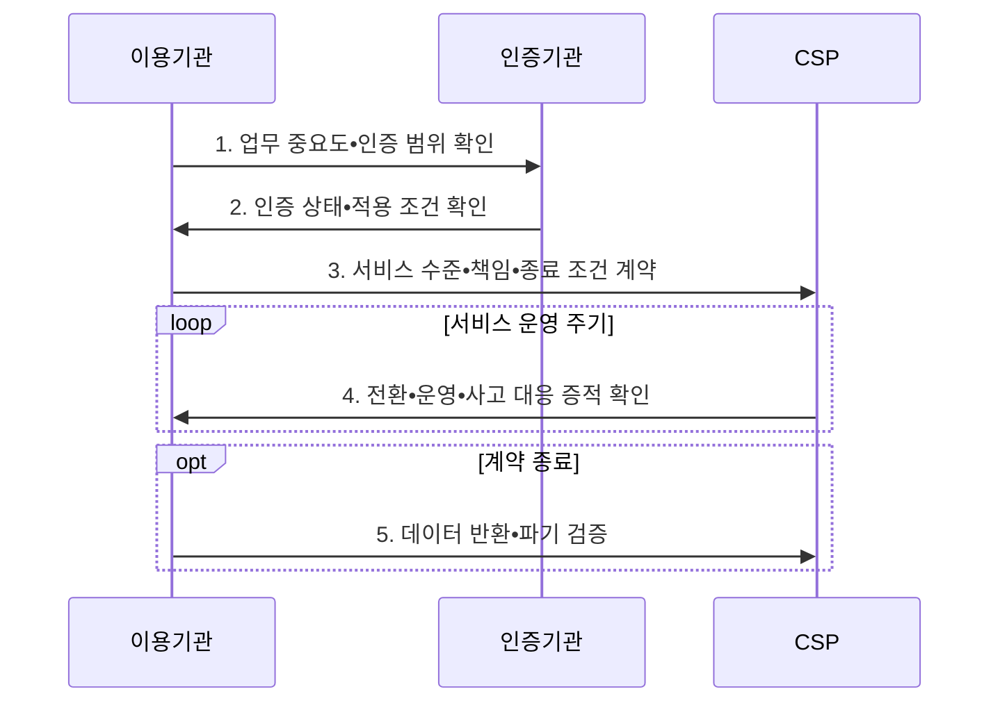

---
sidebar:
  order: 27
  label: "027. 클라우드컴퓨팅법 - CSAP•공공 이용 (Cloud Computing Act)"
  badge:
    text: "기출 • 30%"
    variant: note
title: "클라우드컴퓨팅법 - CSAP•공공 이용 (Cloud Computing Act)"
date: "2026-08-05T02:01:54+09:00"
tags:
  - "notes-law_policy"
weight: 27
extra:
  question_no: "027"
  source_status: "기출"
  source_history: "128회"
  priority: 30
  priority_note: "128회 기출, 공공 클라우드 이용•인증 법제"
---

## Ⅰ. 개요

<details><summary>핵심 용어</summary>

- **클라우드컴퓨팅법**: 클라우드 산업 진흥•공공 이용 촉진•보안인증•이용자 보호를 함께 규율하는 법률이다.
- **클라우드서비스 제공자(Cloud Service Provider, CSP)**: 컴퓨팅 자원과 클라우드 운영•보안 기능을 서비스로 제공하는 사업자이다.

</details>

- 정의/개념: 산업 진흥•공공 이용•보안인증•이용자 보호를 규율한 **클라우드 진흥•보호 법률**
- 배경/필요성: 자체 구축 중심 제도로는 **탄력적 자원•공공 이용•데이터 보호** 기준 확보 곤란

#### 한줄 요약

- 공공기관의 클라우드 이용을 촉진하면서도 서비스 안전성과 이용자 데이터 보호 기준을 함께 정한 법률이다.

## Ⅱ. 특징

<details><summary>핵심 용어</summary>

- **공공 이용 촉진**: 국가기관 등이 정보화사업에서 클라우드서비스 이용을 검토하고 적합한 보안인증 서비스를 고려하도록 하는 정책이다.
- **서비스 신뢰 보장**: 보안인증과 품질•성능 기준으로 제공자의 보호조치와 서비스 수준을 객관적으로 확인하는 체계이다.
- **공동 책임 관리**: 제공자의 기반 통제와 이용기관의 데이터•계정•설정•종료 책임을 계약과 운영 절차로 연결하는 관리이다.
- **클라우드서비스 보안인증(Cloud Security Assurance Program, CSAP)**: 공공기관용 클라우드서비스가 정해진 보안기준을 충족하는지 평가•인증하는 제도이다.
</details>

- **공공 이용 촉진**: 국가기관 등이 정보화사업을 추진할 때 클라우드서비스 이용을 검토하고 보안인증 서비스를 우선 고려
- **서비스 신뢰 보장**: 보안인증과 품질•성능 기준으로 제공자의 보호조치와 서비스 수준을 객관적으로 확인
- **공동 책임 관리**: 제공자의 기반 통제와 이용기관의 데이터•계정•설정•종료 책임을 계약과 운영 절차로 연결

#### 한줄 요약

- CSAP 인증은 CSP의 보안수준을 확인하지만, 이용기관도 데이터 분류와 계정 권한 같은 자신의 책임을 계속 수행해야 한다.

## Ⅲ. 구조 및 구성요소

<details><summary>핵심 용어</summary>

- **서비스 수준 협약(Service Level Agreement, SLA)**: 이용기관과 제공자가 가용성•복구•지원•책임 기준을 정한 협약이다.
- **출구 전략**: 계약 종료 시 데이터•서비스를 다른 환경으로 이전하고 제공자 잔여 데이터를 파기하는 계획이다.
- **잔여 위험**: 보안인증과 보호조치를 적용한 뒤에도 남아 이용기관이 업무 영향에 따라 수용 여부를 결정해야 하는 위험이다.
- **공동 책임**: 제공자와 이용기관이 각각 담당할 기반•계정•설정•데이터 보호 통제를 구분해 수행하는 모델이다.

</details>

```text
[국가기관 등 이용기관]---[보안인증•이용지원 체계]
           |                         |
           +--------[클라우드서비스 제공자]
                              |
                 [서비스 수준•공동 책임]
                              |
              [데이터 반환•파기•종료 전략]
```

선의 의미: 이용기관과 보안인증•이용지원 체계가 클라우드서비스 제공자를 둘러싸고 서비스 수준•공동 책임 및 데이터 반환•파기•종료 전략의 통제 경계를 형성한다.

| 구성요소 | 책임 |
|:---|:---|
| **국가기관 등 이용기관** | 업무 중요도•보안 요구에 따른 **잔여 위험 승인** |
| **보안인증•이용지원 체계** | 보안기준 적합성 평가와 **공공 서비스 등록•지원** |
| **클라우드서비스 제공자** | 인증 범위의 자원•운영 보호와 **중단 대응** 제공 |
| **서비스 수준•공동 책임** | 가용성•복구와 양 당사자의 **통제 경계 계약** |
| **데이터 반환•파기•종료 전략** | 계약 종료 시 데이터 이전과 **잔존 사본 파기** 확인 |

#### 한줄 요약

- 이용기관과 CSP는 SLA로 운영 책임을 나누고, 종료 전략으로 데이터를 반출•파기해 공급자 종속을 줄인다.

## Ⅳ. 흐름도

<details><summary>핵심 용어</summary>

- **업무 중요도 평가**: 데이터 민감도•서비스 중단 영향•법적 요구로 적합한 배치 방식과 인증 수준을 결정하는 과정이다.
- **반환 검증**: 계약 종료 전 데이터를 대체 환경에서 복원할 수 있는지 확인하는 절차이다.
- **파기 검증**: 제공자의 원본•복제•백업 데이터 삭제 증거를 검토하는 절차이다.

</details>



**동작 원리**

1. **업무 중요도•인증 범위 확인**: 데이터•서비스 영향에 맞는 배치 방식과 보안인증 등급•유효 범위 검토
2. **인증 상태•적용 조건 확인**: 인증 서비스•책임 경계•제외 항목과 최신 상태 확인
3. **서비스 수준•책임•종료 조건 계약**: 가용성•복구•보안•비용•자료 이전•파기와 감사 권한 명시
4. **전환•운영•사고 대응 증적 확인**: 데이터 이전•복구 시험•변경•취약점•중단 대응 결과를 이용기관에 보고
5. **데이터 반환•파기 검증**: 계약 종료 전 대체 환경 복원 가능성과 제공자 잔존 데이터 제거 확인

#### 한줄 요약

- 업무 중요도로 도입 여부와 CSAP 등급을 정하고, SLA와 종료 조건을 계약한 뒤 이전•운영•파기를 확인한다.

## Ⅴ. 종류 및 비교

<details><summary>핵심 용어</summary>

- **온프레미스**: 기관 소유•통제 시설에 시스템을 직접 구축하고 모든 계층을 운영하는 방식이다.
- **공공 클라우드**: 외부 제공자의 공유 기반에서 인증된 서비스를 이용하여 탄력적으로 자원을 확보하는 방식이다.
- **오토스케일링**: 부하 변화에 따라 클라우드 컴퓨팅 자원을 자동으로 늘리거나 줄이는 기능이다.
</details>

| 판단 기준 | 공공 클라우드 | 자체 구축 |
|:---|:---|:---|
| **적용 기준** | 가변 수요•**신속한 자원 증설** | 전용 통제•**물리 격리** 요구 |
| **핵심 특징** | **오토스케일링•공동 책임** | 고정 자원•**기관 단독 책임** |
| **한계** | **공급자 종속•책임 경계** 누락 | **과잉 용량•증설 지연** |

#### 한줄 요약

- 공공 클라우드는 CSP와 책임을 나누고 수요에 따라 자원을 늘리지만, 자체 구축은 기관이 시설과 자원을 모두 통제한다.

## Ⅵ. 실무 고려사항 및 대책

<details><summary>핵심 용어</summary>

- **공급자 종속**: 특정 제공자의 API•데이터 형식•관리 도구에 묶여 다른 환경으로 이전하기 어려운 상태이다.
- **책임 공백**: 제공자와 이용기관이 서로의 책임으로 오인하여 계정•설정•데이터 보호 통제가 수행되지 않는 문제이다.
- **서비스 수준 목표**: 가용성•복구시간•지원 응답 등 서비스가 달성해야 할 수준을 측정 가능한 값으로 정한 목표이다.
</details>

| 문제 | 대책 | 효과 |
|:---|:---|:---|
| 보안인증으로 인한 **책임 공백** | 인증 범위와 이용기관 책임을 **책임분담표로 명시** | 공동 책임의 **통제 누락 방지** |
| 서비스 중단과 **복구 성능 불확실** | 서비스 수준 목표와 **정기 복구 시험** 계약 | 업무 연속성과 **복구 가능성 확보** |
| **공급자 종속•종료 실패** | 표준 형식 반출과 **잔존 데이터 파기** 시험 | 전환 비용과 **데이터 잔류 위험 감소** |

#### 한줄 요약

- 공공기관은 업무 중요도에 맞는 CSAP 등급과 인증 유효 여부를 확인한 뒤 하이브리드 배치를 정한다.

## Ⅶ. 결론

<details><summary>핵심 용어</summary>

- **인증 범위 확인**: 인증 보유 여부만 보지 않고 실제 이용 서비스•리전•기능•운영 조직이 인증서 경계에 포함되는지 확인하는 절차이다.
- **종료 시험**: 계약 종료 전에 데이터 반출•대체 환경 복원•잔존 데이터 파기가 가능한지 검증하는 시험이다.

</details>

- 업무 중요도에 맞게 **인증 범위 확인** 을 수행하고 **CSAP 범위** 를 선택한 뒤 계약 전 **공동 책임•종료 시험** 확정

#### 한줄 요약

- 공공 업무의 중요도에 맞춰 CSAP 등급을 정하고, 계약 전에 데이터 반출•파기 조건까지 확정한다.
