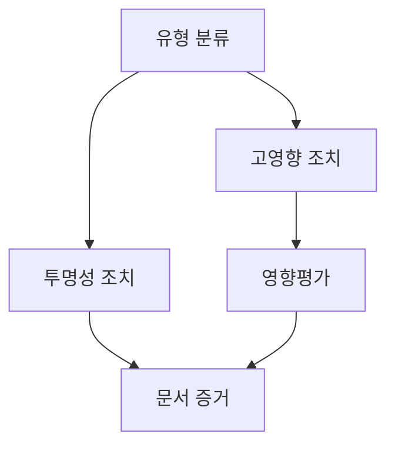
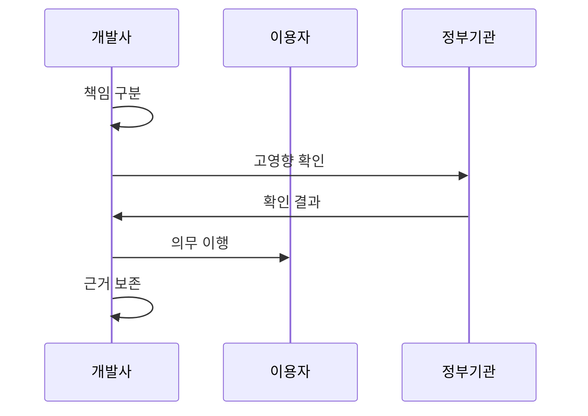

---
sidebar:
  order: 28
  label: "028. AI 기본법 - 고영향 AI·영향평가 (AI Basic Act)"
  badge:
    text: "기출 · 70%"
    variant: note
title: "AI 기본법 - 고영향 AI·영향평가 (AI Basic Act)"
date: "2026-07-27T23:59:59+09:00"
tags:
  - "notes-law_policy"
weight: 28
extra:
  question_no: "028"
  source_status: "기출"
  source_history: "138회"
  priority: 70
  priority_note: "138회 기출, 고영향 AI 의무의 현행 정책축"
---

## 미리 알고가기

- **인공지능(Artificial Intelligence, AI)**: `AI`는 “에이아이”로 읽고 영문명의 머리글자를 조합한 표기이며, 학습·추론·판단으로 결과를 만들어 이 법의 지원·규율 대상이 되는 기술이다.
- **인공지능기본법(Artificial Intelligence Basic Act, AI Basic Act)**: `AI Basic Act`는 “에이아이 베이식 액트”로 읽고 법의 대상과 기본 성격을 나타낸 영문 표기이며, 인공지능 산업 진흥과 신뢰 기반을 함께 규율한다.
- **고영향 인공지능(High-impact Artificial Intelligence, High-impact AI)**: “하이 임팩트 에이아이”로 읽고 사람의 생명·신체·기본권에 큰 영향을 주는 정도를 강조한 표기이며, 확인·안전·설명 의무의 대상이다.
- **생성형 인공지능(Generative Artificial Intelligence, Generative AI)**: “제너러티브 에이아이”로 읽고 새로운 결과물을 생성하는 기능을 나타낸 표기이며, 이용자 고지와 생성물 표시 의무의 대상이다.
- **인공지능 영향평가(AI Impact Assessment)**: “에이아이 임팩트 어세스먼트”로 읽고 국내법상 별도 공식 약어 없이 영문 뜻을 병기하며, 고영향 인공지능이 기본권에 미치는 영향을 사전에 확인하는 권고 절차다.
- **워터마크(Watermark)**: “워터마크”로 읽고 결과물의 출처를 드러내는 표식을 뜻하며, 생성형 인공지능이 만든 결과임을 이용자가 식별하게 한다.
- **딥페이크(Deepfake)**: “딥페이크”로 읽고 딥러닝과 위조를 결합한 관용 표기이며, 실제처럼 합성된 음성·영상이 오인되지 않도록 표시할 대상이다.

## Ⅰ. 개요

- 정의/개념: AI 산업 진흥과 신뢰 기반을 함께 규율한다
- 기존 한계: 자율 원칙만으로 고영향·생성형 AI 위험 통제 부족
- **배경/필요성**: AI 산업 진흥과 유형별 신뢰 의무 마련

### 쉽게 이해하기 (학습용)

- 인공지능 산업을 키우는 지원책과 고영향·생성형 인공지능의 위험을 줄이는 의무를 함께 정한 기본법이다.

## Ⅱ. 특징

- 고영향 AI는 위험관리·설명·인간 감독 의무를 적용한다
- 생성형 AI는 이용 사실 고지와 생성물 표시를 적용한다
- 영향평가는 기본권 영향을 사전에 식별·완화한다

### 쉽게 이해하기 (학습용)

- 모든 인공지능에 같은 의무를 주지 않고, 고영향 여부와 생성 기능에 따라 안전조치와 표시의무를 달리 적용한다.

## Ⅲ. 아키텍처 및 구성요소

| 설계 요소 | 설명 |
|:---|:---|
| 유형 분류 | 고영향·생성형 해당 여부 확인 |
| 고영향 조치 | 위험관리·설명·인간 감독 |
| 투명성 조치 | AI 이용 고지와 생성물 표시 |
| 영향평가 | 기본권 영향과 완화조치 검토 |
| 문서 증거 | 분류·조치·평가 근거 보존 |

> 요약: AI 유형별 조치와 영향평가 증거를 관리한다

### 쉽게 이해하기 (학습용)

- 유형 분류를 기준으로 고영향 인공지능에는 안전조치를, 생성형 인공지능에는 고지·표시를 연결하고 근거를 보존한다.

## Ⅳ. 원리 및 절차 흐름도

| 절차 | 설명 |
|:---|:---|
| 책임 구분 | 개발·제공 단계별 의무 주체 구분 |
| 고영향 확인 | 정부에 고영향 해당 여부 확인 요청 |
| 확인 결과 | 해당 여부와 적용 의무 확정 |
| 의무 이행 | 위험관리·설명·고지·표시 적용 |
| 근거 보존 | 분류와 조치 이행 자료 보관 |

> 요약: 고영향 여부를 확인해 의무를 이행·입증한다

### 쉽게 이해하기 (학습용)

- 사업자는 서비스 영역과 영향으로 고영향 여부를 확인받고, 결과에 맞는 안전·설명·표시 조치를 적용해 근거를 남긴다.

## Ⅴ. 종류 및 비교

| 판단 기준 | 고영향 AI (현재) | 생성형 AI | 일반 AI |
|:---|:---|:---|:---|
| 적용 기준 | 법정 영역·권리에 중대한 영향 | 텍스트·음성·영상 등 생성 | 두 유형에 해당하지 않음 |
| 핵심 특징 | 위험관리·설명·인간 감독 | 이용 고지·생성물 표시 | 일반 신뢰확보 노력 |
| 한계 | 권리 침해·안전사고 | 합성물 오인·딥페이크 악용 | 결과 오류·과신 |

> 요약: 고영향·생성형·일반 AI의 의무를 구분한다

### 쉽게 이해하기 (학습용)

- 생명·권리에 큰 영향을 주면 고영향 의무를, 새 콘텐츠를 만들면 생성형 표시의무를 적용하고 나머지는 일반 신뢰조치를 따른다.

## Ⅵ. 실무 사례

1. 의료 AI 도입 전 기본권 영향평가를 수행한다

### 쉽게 이해하기 (학습용)

- 의료 인공지능을 도입하기 전에 환자의 권리와 안전에 미칠 영향을 평가하고 사람의 감독 절차를 정한다.

## Ⅶ. 결론

- 신뢰 AI 구현을 위해 고영향·생성 기능을 검토하여 **AI기본법** 활용

### 쉽게 이해하기 (학습용)

- 법정 영역과 권리 영향으로 고영향 여부를 확인하고, 생성 기능까지 함께 보아 안전·표시 의무를 정한다.
