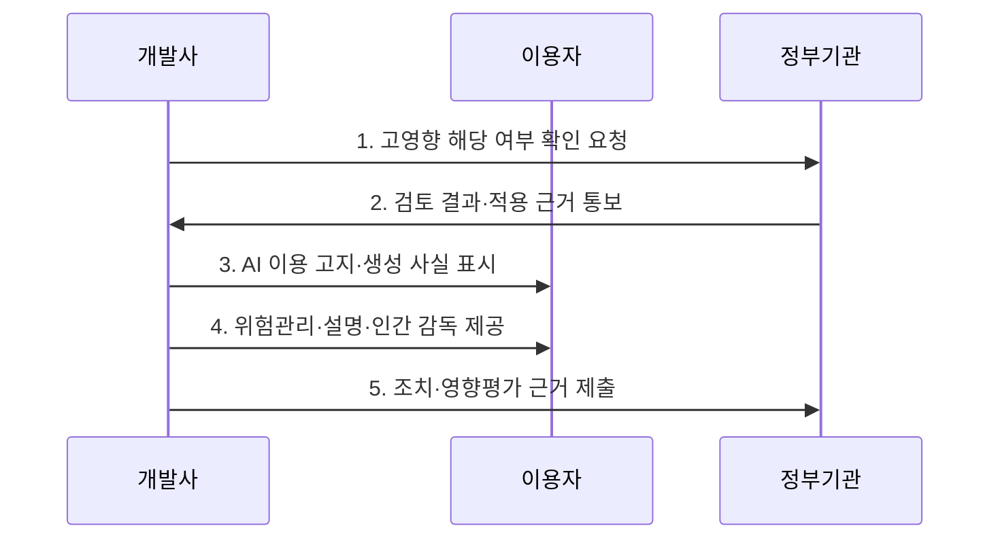

---
sidebar:
  order: 28
  label: "028. AI 기본법 - 고영향 AI·영향평가 (AI Basic Act)"
  badge:
    text: "기출 · 70%"
    variant: note
title: "AI 기본법 - 고영향 AI·영향평가 (AI Basic Act)"
date: "2026-07-30T13:17:00+09:00"
tags:
  - "notes-law_policy"
weight: 28
extra:
  question_no: "028"
  source_status: "기출"
  source_history: "138회"
  priority: 70
  priority_note: "138회 기출, 고영향 AI 의무의 현행 정책축"
---

## 미리 알고가기

- **인공지능(Artificial Intelligence, AI)**: 학습·추론·판단을 통해 분류·예측·생성 등의 결과를 만드는 기술이다.
- **인공지능기본법(Artificial Intelligence Basic Act, AI Basic Act)**: 인공지능 산업 진흥과 안전·신뢰 확보를 함께 규율하는 법률이다.
- **고영향 인공지능(High-impact Artificial Intelligence, High-impact AI)**: 사람의 생명·신체·기본권에 중대한 영향을 미쳐 안전·설명 의무가 적용되는 인공지능이다.
- **생성형 인공지능(Generative Artificial Intelligence, Generative AI)**: 학습한 데이터의 구조를 바탕으로 텍스트·이미지·음성 등의 새로운 결과물을 생성하는 인공지능이다.
- **고영향 인공지능 영향평가(AI Impact Assessment)**: 고영향 인공지능의 이용이 국민의 기본권에 미치는 영향을 분석하고 개선 방안을 마련하는 평가 절차이다.
- **워터마크(Watermark)**: 결과물의 출처나 생성 방식을 식별할 수 있도록 삽입하는 표시다.
- **딥페이크(Deepfake)**: 딥러닝으로 실제와 유사하게 합성·변조한 음성·영상이다.

## Ⅰ. 개요

- **인공지능기본법**은 인공지능 산업·기술의 발전을 지원하면서 고영향·생성형 인공지능의 투명성·안전성·신뢰 확보 기준을 규율하는 **인공지능 진흥·신뢰 기본법**
- **배경/필요성**: 자율 원칙만으로 통제하기 어려운 생명·신체·기본권 영향과 생성물 오인 위험에 유형별 책임과 국가 지원 기반 마련

### 쉽게 이해하기 (학습용)

- 인공지능 산업을 키우는 지원책과 고영향·생성형 인공지능의 위험을 줄이는 의무를 함께 정한 기본법이다.

## Ⅱ. 특징

- **위험 차등화**: 법정 영역과 권리 영향에 따라 고영향 인공지능 여부를 판단하고 사업자가 정부에 확인 요청 가능
- **투명성 확보**: 고영향·생성형 인공지능 기반 서비스의 사전 고지와 생성형 결과물의 생성 사실 표시
- **신뢰성 관리**: 고영향 인공지능의 위험관리·설명·이용자 보호·인간 감독과 기본권 영향평가를 통해 피해 예방

### 쉽게 이해하기 (학습용)

- 모든 인공지능에 같은 의무를 주지 않고, 고영향 여부와 생성 기능에 따라 안전조치와 표시의무를 달리 적용한다.

## Ⅲ. 구조 및 구성요소

| 구성요소 | 책임 |
|:---|:---|
| 인공지능사업자·이용기관 | 개발·제공·이용 단계별 법정 의무와 위험 통제 수행 |
| 고영향·생성형 유형 판단 | 이용 영역·결정 영향·생성 기능으로 적용 유형과 중첩 여부 확인 |
| 투명성·안전성 확보 조치 | 사전 고지·생성 사실 표시·위험관리·설명·인간 감독 이행 |
| 고영향 인공지능 영향평가 | 기본권 영향을 분석하고 완화·개선 방안과 잔여 위험 검토 |
| 정부 확인·감독·지원 | 고영향 여부 확인·가이드·사실조사·시정과 산업 진흥 지원 |

> 요약: AI 유형별 조치와 영향평가 증거를 관리한다

### 쉽게 이해하기 (학습용)

- 유형 분류를 기준으로 고영향 인공지능에는 안전조치를, 생성형 인공지능에는 고지·표시를 연결하고 근거를 보존한다.

## Ⅳ. 흐름도

### 동작 원리

1. **고영향 해당 여부 확인 요청**: 법정 영역·이용 목적·결정 대상·권리 영향을 근거로 판단 자료 제출
2. **검토 결과·적용 근거 통보**: 해당·비해당·판단 곤란 결과와 적용 근거를 서비스 책임에 반영
3. **AI 이용 고지·생성 사실 표시**: 고영향·생성형 서비스임을 사전 고지하고 생성 결과의 출처 표시
4. **위험관리·설명·인간 감독 제공**: 고영향 인공지능의 위험 식별·대응·결과 설명·이용자 보호·사람의 개입 수단 운영
5. **조치·영향평가 근거 제출**: 분류·조치·시험·사고·영향평가 결과를 보존하고 요청 시 입증

### 쉽게 이해하기 (학습용)

- 사업자는 서비스 영역과 영향으로 고영향 여부를 확인받고, 결과에 맞는 안전·설명·표시 조치를 적용해 근거를 남긴다.

## Ⅴ. 종류 및 비교

| 판단 기준 | 고영향 AI | 생성형 AI | 일반 AI |
|:---|:---|:---|:---|
| 적용 기준 | 법정 영역·권리에 중대한 영향 | 텍스트·음성·영상 등 생성 | 두 유형에 해당하지 않음 |
| 핵심 특징 | 위험관리·설명·인간 감독 | 이용 고지·생성물 표시 | 일반 신뢰확보 노력 |
| 한계 | 영역·영향에 따른 경계 판단과 강한 통제 비용 | 표시 우회·합성물 오인·딥페이크 악용 | 법정 특례 밖에서도 결과 오류·과신 위험 잔존 |

> 요약: 고영향·생성형·일반 AI의 의무를 구분한다

### 쉽게 이해하기 (학습용)

- 생명·권리에 큰 영향을 주면 고영향 의무를, 새 콘텐츠를 만들면 생성형 표시의무를 적용하고 나머지는 일반 신뢰조치를 따른다.

## Ⅵ. 실무 고려사항 및 대책

| 고려사항 | 대책 | 효과 |
|:---|:---|:---|
| 고영향·생성형 중첩 유형 누락 | 서비스 기능별 법정 영역·권리 영향·생성 기능을 함께 분류하고 근거 기록 | 적용 의무 누락과 사후 분쟁 감소 |
| 설명과 인간 감독의 형식적 제공 | 결정 전후 개입 권한·중지 기준·설명 항목·이의 절차를 실제 업무 흐름에 연결 | 권리 침해와 자동화 편향의 실질적 통제 |
| 생성물 표시의 제거·오인 | 이용자 고지와 기계 판독 가능한 표시·출처 메타데이터·악용 모니터링 결합 | 합성물 식별 가능성과 책임 추적 향상 |

### 쉽게 이해하기 (학습용)

- 의료 인공지능을 도입하기 전에 환자의 권리와 안전에 미칠 영향을 평가하고 사람의 감독 절차를 정한다.

## Ⅶ. 결론

- 고영향 또는 생성형 인공지능 서비스를 제공하려면 **법정 영역·기본권 영향·생성 기능을 함께 분류하고 사전 고지·생성 표시·위험관리·설명·인간 감독을 업무 흐름과 증거 체계에 내재화하는 신뢰성 관리** 필요

### 쉽게 이해하기 (학습용)

- 법정 영역과 권리 영향으로 고영향 여부를 확인하고, 생성 기능까지 함께 보아 안전·표시 의무를 정한다.
