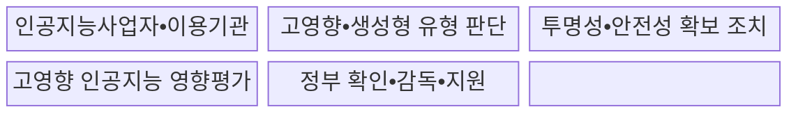
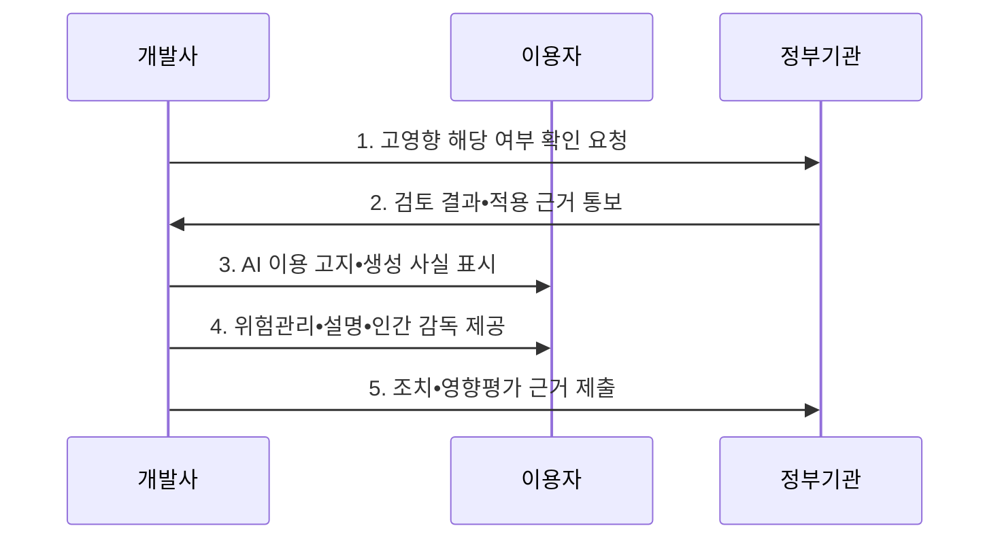

---
sidebar:
  order: 28
  label: "028. AI 기본법 - 고영향 AI•영향평가 (AI Basic Act)"
  badge:
    text: "기출 • 70%"
    variant: note
title: "AI 기본법 - 고영향 AI•영향평가 (AI Basic Act)"
date: "2026-08-03T08:48:47+09:00"
tags:
  - "notes-law_policy"
weight: 28
extra:
  question_no: "028"
  source_status: "기출"
  source_history: "138회"
  priority: 70
  priority_note: "138회 기출, 고영향 AI 의무의 현행 정책축"
---

## Ⅰ. 개요

핵심 용어

- **인공지능기본법**: 인공지능(Artificial Intelligence, AI) 산업 진흥과 고영향•생성형 AI의 안전•신뢰•투명성 의무를 함께 규율하는 기본법이다.
- **인공지능(Artificial Intelligence, AI)**: 학습•추론•판단을 통해 분류•예측•생성 등의 결과를 만드는 기술이다.

- 정의/개념: AI 산업 진흥과 고영향•생성형 AI의 **안전•투명성 의무** 를 규율한 **진흥•신뢰 기본법**
- 배경/필요성: 자율 원칙만으로는 생명•신체•기본권 영향과 **생성물 오인 위험** 통제 곤란

#### 한줄 요약

- 인공지능 산업을 키우는 지원책과 고영향•생성형 인공지능의 위험을 줄이는 의무를 함께 정한 기본법이다.

## Ⅱ. 특징

핵심 용어

- **위험 차등화**: 이용 영역•목적•결정 대상•기본권 영향에 따라 고영향 인공지능(Artificial Intelligence, AI) 여부와 적용 의무를 구분하는 방식이다.
- **투명성 확보**: 고영향•생성형 AI 기반 서비스임을 고지하고 생성 결과물의 생성 사실을 표시하는 원칙이다.
- **신뢰성 관리**: 고영향 AI의 위험관리•설명•인간 감독•이용자 보호를 수명주기 동안 운영하는 체계이다.
- **기본권 영향평가**: 고영향 AI 이용이 국민의 권리와 안전에 미치는 영향을 분석하고 완화 방안을 마련하는 평가이다.

- **위험 차등화**: 법정 영역과 권리 영향에 따라 고영향 인공지능 여부를 판단하고 사업자가 정부에 확인 요청 가능
- **투명성 확보**: 고영향•생성형 인공지능 기반 서비스의 사전 고지와 생성형 결과물의 생성 사실 표시
- **신뢰성 관리**: 고영향 AI의 위험관리•설명•인간 감독 의무와 기본권 영향평가 노력

#### 한줄 요약

- 모든 인공지능에 같은 의무를 주지 않고, 고영향 여부와 생성 기능에 따라 안전조치와 표시의무를 달리 적용한다.

## Ⅲ. 구조 및 구성요소

핵심 용어

- **고영향 인공지능(Artificial Intelligence, AI)**: 사람의 생명•신체•기본권에 중대한 영향을 미쳐 추가 안전•설명 의무가 적용되는 AI이다.
- **생성형 인공지능**: 학습 데이터 구조를 바탕으로 텍스트•이미지•음성 등 새로운 결과물을 생성하는 AI이다.
- **고영향 AI 영향평가**: 고영향 AI 이용이 국민의 기본권에 미치는 영향을 분석하고 개선 방안을 마련하는 평가 절차이다.
- **인공지능사업자•이용기관**: AI를 개발•제공하거나 업무에 이용하면서 단계별 법정 의무와 위험 통제를 수행하는 주체이다.
- **투명성•안전성 확보 조치**: 사전 고지•생성 표시•위험관리•설명•인간 감독으로 이용자의 권리와 안전을 보호하는 조치이다.
- **정부 확인•감독•지원**: 고영향 해당 여부를 확인하고 법 준수를 감독하며 AI 산업 진흥을 지원하는 공적 기능이다.

| 구성요소 | 책임 |
|:---|:---|
| **인공지능사업자•이용기관** | 개발•제공•이용 단계별 **법정 의무•위험 통제** 수행 |
| **고영향•생성형 유형 판단** | 영역•권리 영향•생성 기능의 **중첩 여부 확인** |
| **투명성•안전성 확보 조치** | 사전 고지•위험관리•설명•**인간 감독** 이행 |
| 고영향 인공지능 영향평가 | 기본권 영향과 완화 방안을 검토하는 **노력 의무** |
| **정부 확인•감독•지원** | 고영향 여부 확인•사실조사•시정과 **산업 진흥 지원** |

#### 한줄 요약

- 유형 분류를 기준으로 고영향 인공지능에는 안전조치를, 생성형 인공지능에는 고지•표시를 연결하고 근거를 보존한다.

## Ⅳ. 흐름도

핵심 용어

- **고영향 해당 여부 확인**: 법정 영역•이용 목적•결정 대상•권리 영향을 근거로 적용 대상인지 판단하는 절차이다.
- **인간 감독**: 사람이 고위험 결과를 검토•거부•수정하고 필요할 때 서비스나 자동 결정을 중단하는 통제이다.
- **인공지능(Artificial Intelligence, AI) 이용 고지•생성 사실 표시**: 이용자에게 AI 기반 서비스임을 미리 알리고 생성 결과물임을 식별할 수 있게 표시하는 투명성 조치이다.
- **고영향 AI 영향평가**: 고영향 AI가 기본권에 미치는 영향과 완화 조치를 분석하고 그 근거를 보존하는 평가이다.

**동작 원리**

- **고영향 해당 여부 확인 요청**: 법정 영역•이용 목적•결정 대상•권리 영향을 근거로 판단 자료 제출
- **검토 결과•적용 근거 통보**: 해당•비해당•판단 곤란 결과와 적용 근거를 서비스 책임에 반영
- **AI 이용 고지•생성 사실 표시**: 고영향•생성형 서비스임을 사전 고지하고 생성 결과의 출처 표시
- **위험관리•설명•인간 감독 제공**: 고영향 인공지능의 위험 식별•대응•결과 설명•이용자 보호•사람의 개입 수단 운영
- **조치•영향평가 근거 제출**: 분류•조치•시험•사고•영향평가 결과를 보존하고 요청 시 입증

#### 한줄 요약

- 사업자는 서비스 영역과 영향으로 고영향 여부를 확인받고, 결과에 맞는 안전•설명•표시 조치를 적용해 근거를 남긴다.

## Ⅴ. 종류 및 비교

핵심 용어

- **고영향 인공지능(Artificial Intelligence, AI)**: 생명•신체•기본권에 중대한 영향을 주는 분야에서 의사결정에 사용되는 AI이다.
- **생성형 AI**: 새로운 콘텐츠를 생성하여 이용자가 AI 생성물임을 오인할 위험이 있는 AI이다.
- **일반 AI**: 고영향 법정 기준에 해당하지 않지만 기본적인 안전•투명성•사업자 책임이 필요한 AI이다.
- **딥페이크**: 딥러닝으로 실제와 유사하게 합성•변조하여 오인과 악용 위험을 만드는 음성•영상 콘텐츠이다.

| 판단 기준 | 고영향 AI | 생성형 AI | 일반 AI |
|:---|:---|:---|:---|
| **적용 기준** | 법정 영역•**권리에 중대한 영향** | 텍스트•음성•영상 등 **콘텐츠 생성** | 두 유형에 **해당하지 않음** |
| **핵심 특징** | **위험관리•설명•인간 감독** | **이용 고지•생성물 표시** | 일반 **신뢰확보 노력** |
| **한계** | 경계 판단과 **강한 통제 비용** | 표시 제거•합성물 오인•**딥페이크 악용** | 결과 오류•**과신 위험 잔존** |

#### 한줄 요약

- 생명•권리에 큰 영향을 주면 고영향 의무를, 새 콘텐츠를 만들면 생성형 표시의무를 적용하고 나머지는 일반 신뢰조치를 따른다.

## Ⅵ. 실무 고려사항 및 대책

핵심 용어

- **중첩 유형**: 하나의 서비스가 고영향 의사결정과 생성 기능을 함께 가져 두 유형의 의무가 동시에 적용되는 상태이다.
- **인간 감독**: 사람이 AI 결과를 검토•거부•수정하고 정해진 기준에서 처리를 중단하는 통제이다.
- **기계 판독 표시•출처 메타데이터**: 자동화 도구가 AI 생성 사실과 출처를 확인할 수 있도록 결과물이나 부가정보에 남기는 표시이다.

| 문제 | 대책 | 효과 |
|:---|:---|:---|
| 고영향•생성형 **중첩 유형 누락** | 영역•권리 영향•생성 기능의 **분류 근거 기록** | 적용 의무 누락과 **사후 분쟁 감소** |
| 설명과 **인간 감독의 형식적 제공** | 개입 권한•중지 기준•이의 절차를 **업무 흐름에 연결** | 권리 침해와 **자동화 편향 통제** |
| 생성물 **표시 제거•오인** | 기계 판독 표시•출처 메타데이터•**악용 모니터링** | 합성물 식별과 **책임 추적 향상** |

#### 한줄 요약

- 의료 인공지능을 도입하기 전에 환자의 권리와 안전에 미칠 영향을 평가하고 사람의 감독 절차를 정한다.

## Ⅶ. 결론

핵심 용어

- **고영향 인공지능(Artificial Intelligence, AI)**: 생명•신체•기본권에 중대한 영향을 주어 위험관리•설명•인간 감독 의무가 적용되는 AI이다.
- **생성형 AI**: 텍스트•이미지•음성 등 새로운 결과물을 만들어 사전 고지와 생성 사실 표시가 필요한 AI이다.

- 고영향 AI는 **위험관리•설명•인간 감독**, 생성형 AI는 **사전 고지•생성 표시** 적용

#### 한줄 요약

- 법정 영역과 권리 영향으로 고영향 여부를 확인하고, 생성 기능까지 함께 보아 안전•표시 의무를 정한다.
