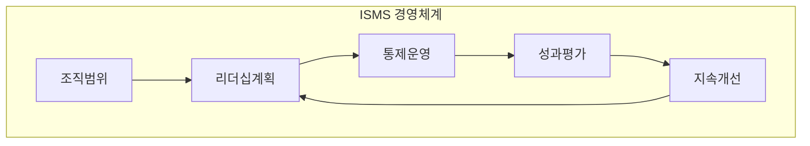
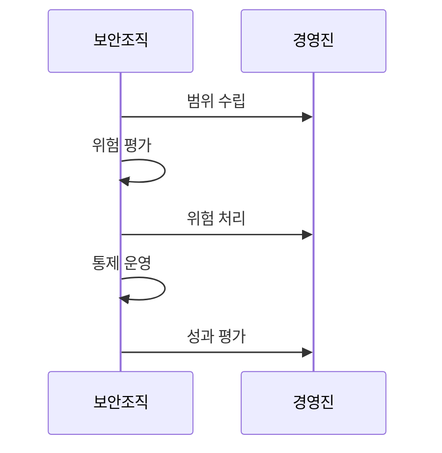

---
sidebar:
  order: 29
  label: "029. ISO/IEC 27001 정보보안 경영시스템 (ISO 27001)"
  badge:
    text: "기출 · 50%"
    variant: note
title: "ISO/IEC 27001 정보보안 경영시스템 (ISO 27001)"
date: "2026-07-27T23:59:59+09:00"
tags:
  - "notes-law_policy"
weight: 29
extra:
  question_no: "029"
  source_status: "기출"
  source_history: "137회"
  priority: 50
  priority_note: "137회 기출, 정보보안 경영체계의 대표 표준"
---

## 미리 알고가기

- **국제표준화기구(International Organization for Standardization, ISO)**: 산업과 경영시스템의 국제표준을 제정하는 기구다.
- **국제전기기술위원회(International Electrotechnical Commission, IEC)**: 전기·전자·정보기술 분야의 국제표준을 제정하는 기구다.
- **정보보안경영시스템(Information Security Management System, ISMS)**: 정보보안 위험을 식별하고 통제를 지속적으로 운영·개선하는 경영체계다.
- **적용성 선언서(Statement of Applicability, SoA)**: 조직이 선택한 정보보안 통제와 적용 여부·제외 사유를 기록한 문서다.
- **계획-실행-점검-개선(Plan-Do-Check-Act, PDCA)**: 목표 수립, 실행, 성과 점검, 개선을 반복하는 경영시스템 순환 구조다.
- **부속서 A(Annex A)**: 정보보안 위험처리에 참조할 통제 목록이다.
- **ISO/IEC 27001:2022**: 인증에 사용하는 정보보안경영시스템 요구사항 표준이다.
- **ISO/IEC 27002**: ISO/IEC 27001의 통제를 선택·구현할 때 참고하는 지침이다.

## Ⅰ. 개요

- 정의/개념: ISMS 수립·운영·개선 요구사항 표준이다
- 기존 한계: 통제 목록 중심 운영은 조직별 위험·성과 반영 부족
- 기존 한계: 통제 목록 중심 운영은 조직별 위험과 성과 반영 부족

### 쉽게 이해하기 (학습용)

- 조직이 경영진 책임 아래 정보보안 위험을 평가하고 통제를 운영·개선하도록 요구하는 인증 가능한 국제표준이다.

## Ⅱ. 특징

- 조직 상황·범위·리더십을 기반으로 ISMS를 수립한다
- 위험평가·처리와 SoA로 통제 선택 근거를 관리한다
- 내부감사·경영검토·시정조치로 지속 개선한다

### 쉽게 이해하기 (학습용)

- 보안 장비 목록을 따르는 대신 조직의 업무와 위험을 먼저 분석하고, 필요한 통제를 선택한 근거를 SoA에 남긴다.

## Ⅲ. 아키텍처 및 구성요소

| 설계 요소 | 설명 |
|:---|:---|
| 조직범위 | ISMS 경계·이해관계자 요구 정의 |
| 리더십계획 | 방침·목표·위험 기준 승인 |
| 통제운영 | 위험처리 통제와 SoA 이행 |
| 성과평가 | 내부감사·경영검토 수행 |
| 지속개선 | 부적합 시정과 개선기회 반영 |

> 요약: 범위·위험·통제·평가를 순환해 ISMS를 개선한다

### 쉽게 이해하기 (학습용)

- 조직 범위와 위험 기준에서 통제 운영을 설계하고, 성과평가에서 찾은 부적합을 다음 계획에 반영하는 순환 구조다.

## Ⅳ. 원리 및 절차 흐름도

| 절차 | 설명 |
|:---|:---|
| 범위 수립 | 조직 상황과 ISMS 경계 정의 |
| 위험 평가 | 위험 기준으로 우선순위 산정 |
| 위험 처리 | 통제 선택과 SoA 작성·승인 |
| 통제 운영 | 통제 이행과 운영 증거 관리 |
| 성과 평가 | 내부감사·경영검토 후 시정 |

> 요약: 위험을 평가·처리하고 통제 성과를 개선한다

### 쉽게 이해하기 (학습용)

- ISMS 범위를 정한 뒤 위험을 평가해 통제를 선택하고, 운영 결과를 내부감사와 경영검토로 확인해 부적합을 고친다.

## Ⅴ. 종류 및 비교

| 판단 기준 | ISO/IEC 27001 (현재) | ISO/IEC 27002 |
|:---|:---|:---|
| 적용 기준 | ISMS 인증·요구사항 수립 | 통제 선택·구현 지침 필요 |
| 핵심 특징 | 인증 가능한 요구사항 표준 | 통제 목적·구현 지침 |
| 한계 | 형식적 문서화·통제 미이행 | 인증 요구사항으로 오인 |

> 요약: 27001은 요구사항, 27002는 통제 지침이다

### 쉽게 이해하기 (학습용)

- ISO/IEC 27001은 인증받을 경영 요구사항이고, ISO/IEC 27002는 통제를 선택·구현할 때 참고하는 지침이다.

## Ⅵ. 실무 사례

1. **변경 승인·감사 로그**로 보안 통제 운영 입증

### 쉽게 이해하기 (학습용)

- 방화벽 정책 변경 승인과 감사로그를 연결해 선택한 통제가 문서에만 있지 않고 실제 운영됨을 입증한다.

## Ⅶ. 결론

- 정보보호 관리를 위해 위험·SoA를 검토하여 **ISO 27001** 활용

### 쉽게 이해하기 (학습용)

- 조직 위험으로 통제를 선택한 근거는 SoA에, 실제 이행 결과는 운영증거에 남겨 경영진이 개선을 결정하게 한다.
