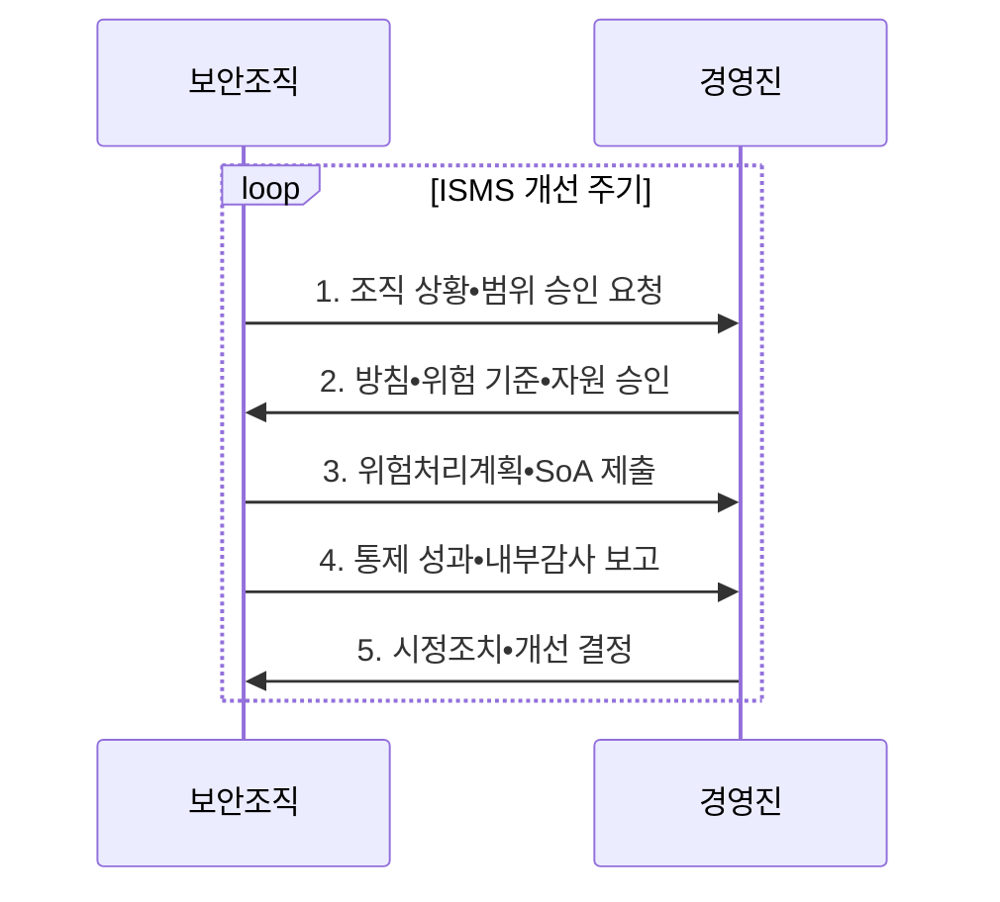

---
sidebar:
  order: 29
  label: "029. ISO/IEC 27001 정보보안 경영시스템 (ISO 27001)"
  badge:
    text: "기출 • 50%"
    variant: note
title: "ISO/IEC 27001 정보보안 경영시스템 (ISO 27001)"
date: "2026-08-05T14:21:29+09:00"
tags:
  - "notes-law_policy"
weight: 29
extra:
  question_no: "029"
  source_status: "기출"
  source_history: "137회"
  priority: 50
  priority_note: "137회 기출, 정보보안 경영체계의 대표 표준"
---

## Ⅰ. 개요

<details><summary>핵심 용어</summary>

- **국제표준화기구/국제전기기술위원회 27001(International Organization for Standardization/International Electrotechnical Commission 27001, ISO/IEC 27001)**: 정보보안 위험에 맞춰 정보보안경영시스템을 수립•운영•개선하기 위한 인증 가능한 국제 요구사항 표준이다.
- **정보보안경영시스템(Information Security Management System, ISMS)**: 정보보안 위험을 식별하고 통제를 지속적으로 운영•평가•개선하는 경영체계이다.

</details>

- 정의/개념: 정보보안 위험에 맞춰 **ISMS** 를 수립•운영•개선하는 **인증 가능한 국제 요구사항 표준**
- 배경/필요성: 통제 목록의 형식적 적용만으로는 업무 위험•성과와 **경영진 책임** 연결 곤란

#### 한줄 요약

- 조직이 경영진 책임 아래 정보보안 위험을 평가하고 통제를 운영•개선하도록 요구하는 인증 가능한 국제표준이다.

## Ⅱ. 특징

<details><summary>핵심 용어</summary>

- **상황 기반성**: 조직의 내•외부 이슈와 이해관계자 요구를 분석하여 ISMS 범위•방침•목표를 정하는 특성이다.
- **위험 기반성**: 일관된 위험평가•처리 방법으로 업무 위험에 맞는 통제를 선택하는 특성이다.
- **지속 개선성**: 성과지표•내부감사•경영검토•시정조치로 경영체계와 통제 효과를 반복 개선하는 특성이다.
- **적용성 선언서(Statement of Applicability, SoA)**: 위험처리를 위해 선택하거나 제외한 통제와 그 근거 및 구현 상태를 기록한 문서이다.

</details>

- **상황 기반성**: 조직의 내•외부 이슈와 이해관계자 요구를 분석하여 ISMS의 범위•방침•목표 설정
- **위험 기반성**: 일관된 위험평가•처리 방법과 적용성 선언서로 통제의 선택•제외•구현 근거 관리
- **지속 개선성**: 성과지표•내부감사•경영검토•부적합 시정조치로 통제 효과와 경영체계 개선

#### 한줄 요약

- 보안 장비 목록을 따르는 대신 조직의 업무와 위험을 먼저 분석하고, 필요한 통제를 선택한 근거를 SoA에 남긴다.

## Ⅲ. 구조 및 구성요소

<details><summary>핵심 용어</summary>

- **부속서 A**: 정보보안 위험처리에 필요한 통제를 선택할 때 참조하는 목록이다.
- **위험처리계획**: 위험별 처리 옵션•책임자•통제•일정•잔여위험 수용을 연결한 계획이다.
- **ISMS 범위**: 관리체계를 적용할 조직•업무•정보•시설•기술과 외부 의존성의 경계이다.
- **리더십**: 경영진이 보안 책임과 자원을 승인하는 경영 요소이다.
- **방침**: 조직의 정보보안 방향과 원칙을 선언한 기준이다.
- **목표**: 정보보안 성과를 측정할 수 있게 정한 달성 기준이다.
- **성과평가**: 통제 지표와 객관적 증거로 ISMS 효과를 확인하는 활동이다.
- **내부감사**: ISMS 요구사항 준수 여부를 독립적으로 확인하는 활동이다.
- **경영검토**: 경영진이 성과•변화•부적합을 검토하는 활동이다.
- **시정조치**: 부적합의 원인을 제거해 재발을 막는 활동이다.
- **개선**: 경영체계와 통제의 효과를 지속해서 높이는 활동이다.

</details>

```text
                    [조직 상황•ISMS 범위]
                       /             \
          [리더십•방침•목표]   [위험평가•처리•SoA]
                       \             /
                   [통제 운영•성과평가]
                              |
                   [경영검토•시정•개선]
```

선의 의미: 조직 상황•ISMS 범위가 리더십과 위험평가의 경계를 정하고, 두 요소는 통제 운영•성과평가를 지배하며, 경영검토•시정•개선은 그 효과를 감독한다.

| 구성요소 | 책임 |
|:---|:---|
| **조직 상황•ISMS 범위** | 업무•법규•의존 관계와 **관리체계 경계 정의** |
| **리더십•방침•목표** | 경영진의 책임•자원과 **측정 가능한 보안 목표** 승인 |
| **위험평가•처리•SoA** | 위험 기준과 **통제 선택•제외 근거** 문서화 |
| **통제 운영•성과평가** | 위험처리계획 실행과 **내부감사로 효과 확인** |
| **경영검토•시정•개선** | 변화•부적합 검토 후 **원인 제거•개선 결정** |

#### 한줄 요약

- 조직 범위와 위험 기준에서 통제 운영을 설계하고, 성과평가에서 찾은 부적합을 다음 계획에 반영하는 순환 구조다.

## Ⅳ. 흐름도

<details><summary>핵심 용어</summary>

- **계획-실행-점검-개선(Plan-Do-Check-Act, PDCA)**: 조직 상황과 목표를 계획하고 통제를 실행한 뒤 성과를 점검하고 개선하는 경영시스템 순환 구조이다.
</details>



**동작 원리**

1. **조직 상황•범위 승인**: 핵심 업무•정보•조직•시설•공급자와 적용 법규를 분석하여 경계 제시
2. **방침•위험 기준•자원 승인**: 경영진이 위험 수용 기준•역할•예산•역량과 목표를 확정
3. **위험처리계획•SoA 제출**: 평가한 위험별 처리 옵션과 통제 선택•제외•구현 상태를 연결
4. **통제 성과•내부감사 보고**: 통제 지표•사고•법규준수•감사 결과로 계획 대비 효과 평가
5. **시정조치•개선 결정**: 부적합의 원인을 제거하고 변화한 위험과 개선 기회를 다음 계획에 반영

#### 한줄 요약

- ISMS 범위를 정한 뒤 위험을 평가해 통제를 선택하고, 운영 결과를 내부감사와 경영검토로 확인해 부적합을 고친다.

## Ⅴ. 종류 및 비교

<details><summary>핵심 용어</summary>

- **ISO/IEC 27002**: 정보보안 통제를 선택•구현•운영할 때 참고하는 상세 지침이다.

</details>

| 판단 기준 | ISO/IEC 27001:2022 | ISO/IEC 27002 |
|:---|:---|:---|
| **적용 기준** | **ISMS 인증•요구사항** 수립 | **통제 선택•구현 지침** 필요 |
| **핵심 특징** | 인증 가능한 **요구사항 표준** | **통제 목적•구현 지침** |
| **한계** | 형식적 문서화•**통제 미이행** | **인증 요구사항으로 오인** |

#### 한줄 요약

- ISO/IEC 27001은 인증받을 경영 요구사항이고, ISO/IEC 27002는 통제를 선택•구현할 때 참고하는 지침이다.

## Ⅵ. 실무 고려사항 및 대책

<details><summary>핵심 용어</summary>

- **인증 범위의 의도적 축소**: 핵심 업무나 공급자 의존성을 인증 경계에서 제외해 실제 위험이 관리체계 밖에 남는 문제이다.
</details>

| 문제 | 대책 | 효과 |
|:---|:---|:---|
| **인증 범위의 의도적 축소** | 핵심 업무•공급자 의존성과 **제외 근거 검증** | 실질적 위험을 포괄하는 **ISMS 범위 확보** |
| 부속서 A 통제의 **점검표 적용** | SoA에 통제 **선택•제외 근거와 상태 기록** | 위험과 통제의 **추적성 향상** |
| 문서와 **실제 운영의 괴리** | 표본 증거와 효과 지표를 **내부감사** | 통제 실효성 입증과 **형식적 인증 방지** |

#### 한줄 요약

- 방화벽 정책 변경 승인과 감사로그를 연결해 선택한 통제가 문서에만 있지 않고 실제 운영됨을 입증한다.

## Ⅶ. 결론

<details><summary>핵심 용어</summary>

</details>

- 인증은 **ISO/IEC 27001**, 통제 구현은 **ISO/IEC 27002**, 선택 근거는 SoA 적용

#### 한줄 요약

- 조직 위험으로 통제를 선택한 근거는 SoA에, 실제 이행 결과는 운영증거에 남겨 경영진이 개선을 결정하게 한다.
