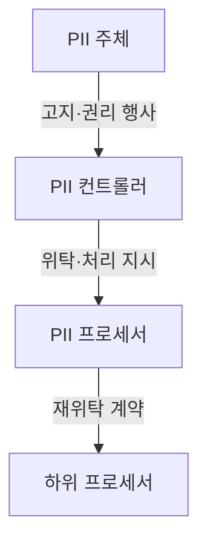
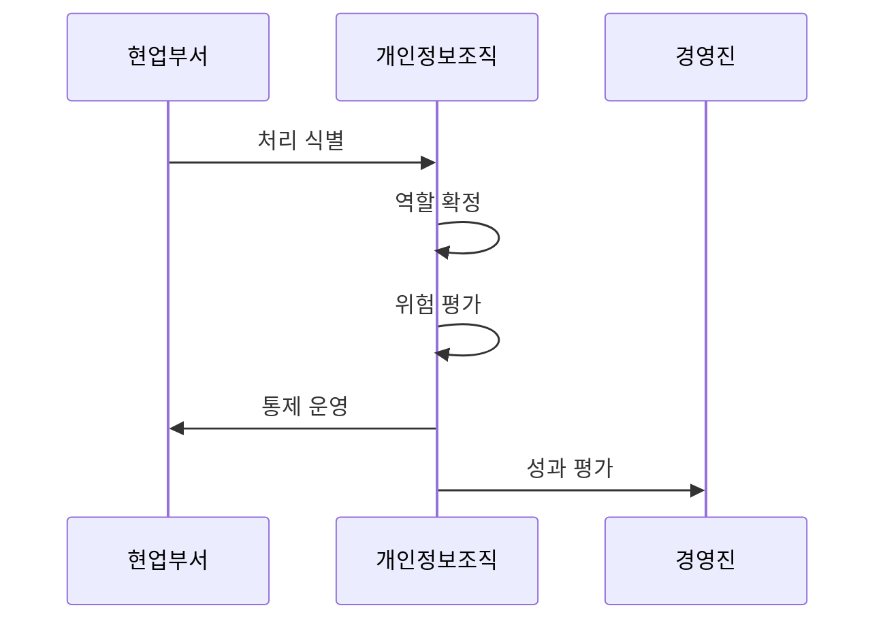

---
sidebar:
  order: 30
  label: "030. ISO/IEC 27701 개인정보 경영시스템 (ISO 27701)"
  badge:
    text: "기출 · 30%"
    variant: note
title: "ISO/IEC 27701 개인정보 경영시스템 (ISO 27701)"
date: "2026-07-27T23:59:59+09:00"
tags:
  - "notes-law_policy"
weight: 30
extra:
  question_no: "030"
  source_status: "기출"
  source_history: "126회"
  priority: 30
  priority_note: "126회 기출, 개인정보 경영체계 확장 표준"
---

## 미리 알고가기

- **국제표준화기구(International Organization for Standardization, ISO)**: 산업과 경영시스템의 국제표준을 제정하는 기구다.
- **국제전기기술위원회(International Electrotechnical Commission, IEC)**: 전기·전자·정보기술 분야의 국제표준을 제정하는 기구다.
- **개인식별정보(Personally Identifiable Information, PII)**: 단독 또는 다른 정보와 결합하여 특정 개인을 식별할 수 있는 정보다.
- **개인정보보호 경영시스템(Privacy Information Management System, PIMS)**: 개인정보 처리 위험과 책임을 지속적으로 관리·개선하는 경영체계다.
- **정보보호 경영시스템(Information Security Management System, ISMS)**: 정보보호 위험을 식별하고 통제를 지속적으로 운영·개선하는 경영체계다.
- **PII 컨트롤러(PII Controller)**: 개인정보 처리 목적과 수단을 결정하는 주체다.
- **PII 프로세서(PII Processor)**: 컨트롤러의 위탁을 받아 개인정보를 처리하는 주체다.
- **하위 프로세서(Sub-processor)**: 프로세서의 재위탁을 받아 개인정보를 처리하는 주체다.
- **일반개인정보보호법(General Data Protection Regulation, GDPR)**: 유럽연합의 개인정보 처리 원칙과 정보주체 권리를 규정한 법률이다.
- **ISO/IEC 27701:2025**: 개인정보보호 경영시스템의 요구사항과 지침을 제공하는 국제표준이다.

## Ⅰ. 개요

- 정의/개념: 독립 PIMS 요구사항과 지침의 국제표준이다
- 기존 한계: 정보보안 통제만으로 PII 권리·처리 책임 입증 부족
- **배경/필요성**: PII 처리 위험과 역할별 책임의 체계적 관리

### 쉽게 이해하기 (학습용)

- 조직이 PII 처리 위험과 법적 의무를 경영체계로 운영·개선하도록 요구하는 독립 인증 가능 국제표준이다.

## Ⅱ. 특징

- 2025년판은 독립 PIMS 요구사항과 지침을 제공한다
- 컨트롤러·프로세서 역할별 PII 책임을 구분한다
- ISO/IEC 27001과 통합해 보안·개인정보 위험을 연계한다

### 쉽게 이해하기 (학습용)

- 2025년판은 ISO/IEC 27001의 부속 확장이 아니라 독립 PIMS이며, 컨트롤러와 프로세서의 책임을 나눠 관리한다.

## Ⅲ. 아키텍처 및 구성요소

| 설계 요소 | 설명 |
|:---|:---|
| PII 주체 | 고지받고 열람·삭제 등 권리 행사 |
| PII 컨트롤러 | PII 처리 목적·수단 결정 |
| PII 프로세서 | 컨트롤러 지시에 따라 PII 처리 |
| 하위 프로세서 | 재위탁 계약에 따라 PII 처리 |

> 요약: PII 처리 역할과 권리 책임을 계약으로 연결한다

### 쉽게 이해하기 (학습용)

- PII 주체의 권리 요구가 컨트롤러에서 프로세서와 하위 프로세서까지 같은 계약 책임으로 이어지는 구조다.

## Ⅳ. 원리 및 절차 흐름도

| 절차 | 설명 |
|:---|:---|
| 처리 식별 | PII 항목·목적·보유기간 목록화 |
| 역할 확정 | 컨트롤러·프로세서 책임 결정 |
| 위험 평가 | 생애주기별 권리 침해 위험 분석 |
| 통제 운영 | 위험·법적 요구에 맞는 통제 적용 |
| 성과 평가 | 감사·경영검토 후 시정조치 결정 |

> 요약: PII 처리·역할·위험·통제를 평가하고 개선한다

### 쉽게 이해하기 (학습용)

- PII 항목과 목적을 찾고 처리 주체의 역할을 정한 뒤, 위험에 맞는 통제를 운영해 감사와 경영검토로 개선한다.

## Ⅴ. 종류 및 비교

| 판단 기준 | ISO/IEC 27701 (현재) | ISO/IEC 27001 |
|:---|:---|:---|
| 적용 기준 | PII 책임·권리 관리체계 필요 | 정보보안 위험 관리체계 필요 |
| 핵심 특징 | 독립 PIMS 요구사항·지침 | 인증 가능한 ISMS 요구사항 |
| 한계 | 처리 역할·법적 요구 누락 | 정보보안 위험·통제 누락 |

> 요약: 27701은 개인정보, 27001은 보안 위험을 관리한다

### 쉽게 이해하기 (학습용)

- ISO/IEC 27701:2025는 독립 PIMS이지만 ISO/IEC 27001과 구조를 맞춰 개인정보와 정보보안을 통합 운영할 수 있다.

## Ⅵ. 실무 사례

1. 클라우드 처리자는 **재위탁 통제**를 계약·운영 검증

### 쉽게 이해하기 (학습용)

- 클라우드 사업자가 하위 처리자를 추가할 때 사전 승인과 동일 보호의무가 계약·운영에 반영됐는지 확인한다.

## Ⅶ. 결론

- 개인정보 관리를 위해 역할·법 요구를 검토하여 **ISO 27701** 활용

### 쉽게 이해하기 (학습용)

- 컨트롤러·프로세서 역할과 적용 법률을 먼저 정하고, PII 생애주기마다 필요한 통제와 증거를 배치한다.
