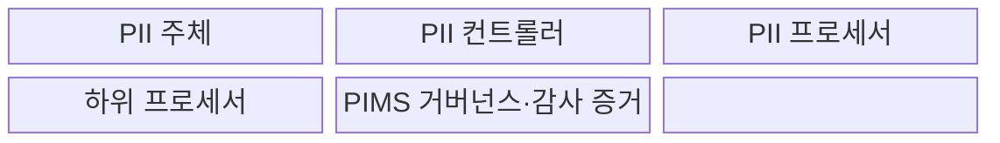
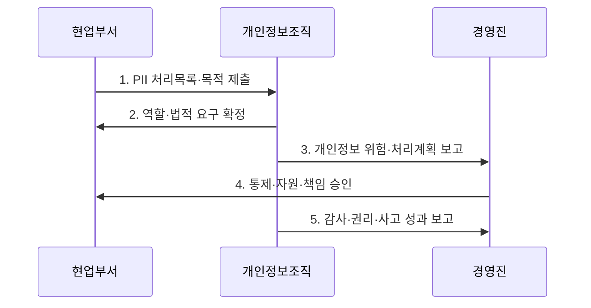

---
sidebar:
  order: 30
  label: "030. ISO/IEC 27701 개인정보 경영시스템 (ISO 27701)"
  badge:
    text: "기출 · 30%"
    variant: note
title: "ISO/IEC 27701 개인정보 경영시스템 (ISO 27701)"
date: "2026-08-02T13:30:00+09:00"
tags:
  - "notes-law_policy"
weight: 30
extra:
  question_no: "030"
  source_status: "기출"
  source_history: "126회"
  priority: 30
  priority_note: "126회 기출, 개인정보 경영체계 확장 표준"
---

## Ⅰ. 개요

핵심 용어

- **ISO/IEC 27701**: 개인식별정보 위험과 책임을 관리하는 개인정보보호 경영시스템의 요구사항과 지침을 제공하는 국제표준이다.
- **개인정보보호 경영시스템(PIMS)**: 개인정보 처리 위험·권리·책임을 지속적으로 관리하고 개선하는 경영체계이다.

- 정의/개념: PII 위험과 책임을 관리하는 **독립 PIMS 요구사항·지침 국제표준**
- 배경/필요성: 정보보안 통제만으로는 **PII 주체 권리**와 컨트롤러·프로세서 책임 입증 곤란

### 쉽게 이해하기 (학습용)

- 조직이 PII 처리 위험과 법적 의무를 경영체계로 운영·개선하도록 요구하는 독립 인증 가능 국제표준이다.

## Ⅱ. 특징

핵심 용어

- **역할 기반 책임성**: PII 컨트롤러·프로세서·하위 프로세서의 목적 결정·처리 지시·재위탁 책임을 구분하는 원칙이다.
- **통합 운영성**: ISO/IEC 27001과 조화된 구조로 개인정보 권리 위험과 정보보안 위험을 하나의 경영체계에서 관리하는 성질이다.
- **독립 요구사항**: 개인정보보호 경영시스템을 자체 범위와 책임으로 수립·평가할 수 있도록 정한 요구이다.

- **독립 인증성**: 2025년판이 개인정보보호 경영시스템의 독립적인 요구사항과 구현 지침 제공
- **역할 기반 책임성**: 개인식별정보 컨트롤러·프로세서·하위 프로세서의 목적 결정·처리 지시·재위탁 책임 구분
- **통합 운영성**: ISO/IEC 27001과 조화된 구조를 활용하여 개인정보 권리 위험과 정보보안 위험을 하나의 경영체계로 연계

### 쉽게 이해하기 (학습용)

- 2025년판은 ISO/IEC 27001의 부속 확장이 아니라 독립 PIMS이며, 컨트롤러와 프로세서의 책임을 나눠 관리한다.

## Ⅲ. 구조 및 구성요소

핵심 용어

- **개인식별정보(PII)**: 단독 또는 다른 정보와 결합하여 특정 개인을 식별할 수 있는 정보이다.
- **PII 컨트롤러**: 개인정보 처리 목적과 수단을 결정하는 주체이다.
- **PII 프로세서·하위 프로세서**: 컨트롤러의 위탁을 받아 처리하거나 프로세서로부터 재위탁받아 처리하는 주체이다.

| 구성요소 | 책임 |
|:---|:---|
| **PII 주체** | 고지받고 열람·삭제 등 **권리 행사** |
| **PII 컨트롤러** | 처리 목적·수단·법적 근거와 **권리 대응 결정** |
| **PII 프로세서** | 문서화된 지시에 따라 처리하고 **통제 증거 제공** |
| **하위 프로세서** | 승인된 재위탁 계약과 **동일한 보호 의무** 이행 |
| **PIMS 거버넌스·감사 증거** | 역할·위험·통제·권리 대응·**개선 기록 관리** |

### 쉽게 이해하기 (학습용)

- PII 주체의 권리 요구가 컨트롤러에서 프로세서와 하위 프로세서까지 같은 계약 책임으로 이어지는 구조다.

## Ⅳ. 흐름도

핵심 용어

- **PII 처리목록**: 개인정보 항목·정보주체·수집원·목적·근거·수신자·보유기간·국외이전을 연결한 기록이다.
- **개인정보 위험평가**: 처리 활동이 개인의 권리·자유와 조직 준수에 미치는 영향을 분석하여 통제와 잔여위험을 결정하는 절차이다.

**동작 원리**

- **1. PII 처리목록·목적 제출**: 항목·정보주체·수집원·목적·근거·수신자·보유기간·국외이전 목록화
- **2. 역할·법적 요구 확정**: 처리 활동별 컨트롤러·프로세서 관계와 적용 법률·계약·권리 의무 판단
- **3. 개인정보 위험·처리계획 보고**: PII 생애주기의 개인 권리·자유 영향과 조직 위험을 평가하여 통제안 제시
- **4. 통제·자원·책임 승인**: 경영진이 위험 수용·정책·역할·예산과 처리 계획을 승인
- **5. 감사·권리·사고 성과 보고**: 권리 요청·유출·재위탁·법규준수·내부감사 결과로 부적합과 개선 결정

### 쉽게 이해하기 (학습용)

- PII 항목과 목적을 찾고 처리 주체의 역할을 정한 뒤, 위험에 맞는 통제를 운영해 감사와 경영검토로 개선한다.

## Ⅴ. 종류 및 비교

핵심 용어

- **ISMS**: 기밀성·무결성·가용성 등 조직 정보보안 위험과 통제를 관리하는 경영체계이다.
- **PIMS**: PII 처리 원칙·정보주체 권리·컨트롤러·프로세서 책임과 개인정보 위험을 관리하는 경영체계이다.

| 판단 기준 | ISO/IEC 27701:2025 | ISO/IEC 27001:2022 |
|:---|:---|:---|
| **적용 기준** | PII **책임·권리 관리체계** 필요 | **정보보안 위험 관리체계** 필요 |
| **핵심 특징** | 독립 **PIMS 요구사항·지침** | 인증 가능한 **ISMS 요구사항** |
| **한계** | 국가별 **적용 법규 매핑** 필요 | 주체 권리·처리 역할에 **추가 체계 필요** |

### 쉽게 이해하기 (학습용)

- ISO/IEC 27701:2025는 독립 PIMS이지만 ISO/IEC 27001과 구조를 맞춰 개인정보와 정보보안을 통합 운영할 수 있다.

## Ⅵ. 실무 고려사항 및 대책

핵심 용어

- **재위탁 통제**: 하위 프로세서의 사전 승인·계약 의무·처리 위치·삭제·감사 증거를 관리하는 통제이다.
- **권리 요청 대응**: 열람·정정·삭제·처리 제한 등 정보주체 요청을 법정 기한과 역할에 따라 처리하는 절차이다.
- **목적 외 처리**: 정한 목적·근거 범위를 넘어 PII를 이용·제공하여 개인 권리를 침해하는 문제이다.

| 문제 | 대책 | 효과 |
|:---|:---|:---|
| PIMS 인증을 **법규준수 대체로 오인** | 개인정보 법률을 **처리목록·통제에 매핑** | 적용 의무 누락 방지와 **책임성 입증** |
| 컨트롤러·프로세서 **역할 혼선** | 활동별 권한과 **계약 책임·운영 증거 일치** | 권리 대응과 **사고 책임 명확화** |
| 하위 프로세서의 **통제 단절** | 사전 승인·동일 보호 의무·**반환·파기 계약** | 재위탁 공급망의 **개인정보 위험 감소** |

### 쉽게 이해하기 (학습용)

- 클라우드 사업자가 하위 처리자를 추가할 때 사전 승인과 동일 보호의무가 계약·운영에 반영됐는지 확인한다.

## Ⅶ. 결론

핵심 용어

- **ISO/IEC 27001 연계**: 공통 경영시스템 구조와 보안 통제를 활용하되 PII 역할·권리·처리 원칙을 추가하여 통합 관리하는 관계이다.
- **GDPR**: 유럽연합의 개인정보 처리 원칙과 정보주체 권리를 규정한 법률로 PIMS의 적용 법적 요구 중 하나가 될 수 있다.

- PII 활동별 **컨트롤러·프로세서 역할**과 법규를 매핑해 **권리·재위탁 증거** 감사

### 쉽게 이해하기 (학습용)

- 컨트롤러·프로세서 역할과 적용 법률을 먼저 정하고, PII 생애주기마다 필요한 통제와 증거를 배치한다.
