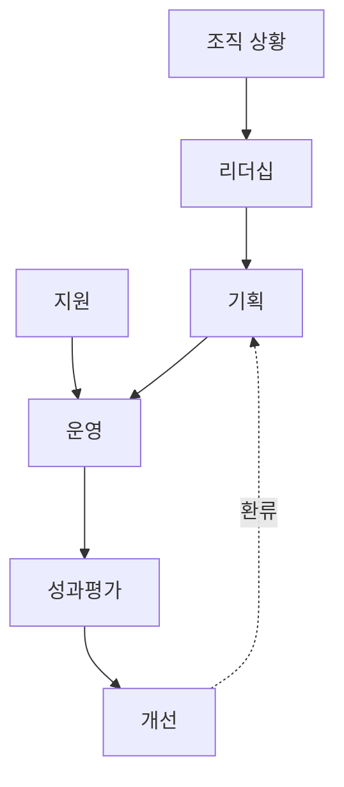
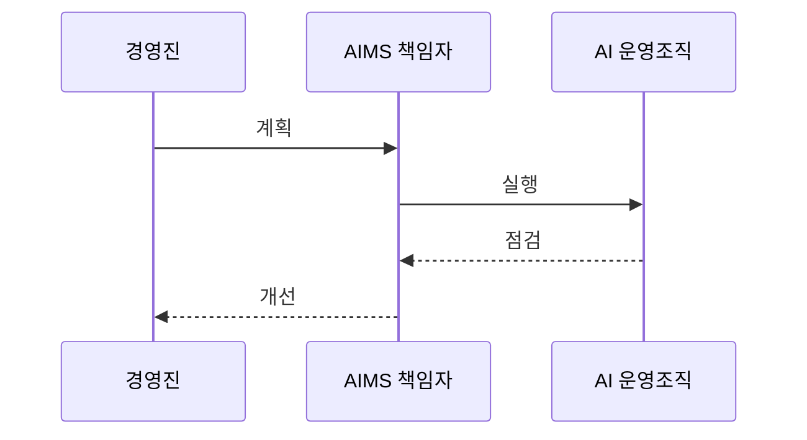

---
sidebar:
  order: 31
  label: "031. ISO/IEC 42001 AI 경영시스템 (ISO 42001 AI Management)"
  badge:
    text: "기출 · 70%"
    variant: note
title: "ISO/IEC 42001 AI 경영시스템 (ISO 42001 AI Management)"
date: "2026-07-27T23:59:59+09:00"
tags:
  - "notes-law_policy"
weight: 31
extra:
  question_no: "031"
  source_status: "기출"
  source_history: "138회"
  priority: 70
  priority_note: "138회 기출, AI 경영체계 구축·인증 표준"
---

## 미리 알고가기

- **국제표준화기구(International Organization for Standardization, ISO)**: '아이에스오'로 읽고 국제 표준 제정 기구를 관용 약어로 표시
- **국제전기기술위원회(International Electrotechnical Commission, IEC)**: '아이이씨'로 읽고 전기·전자 국제 표준 기구를 영문 머리글자로 표시
- **인공지능(Artificial Intelligence, AI)**: '에이아이'로 읽고 예측·추천·결정을 생성하는 시스템을 영문 머리글자로 표시
- **AI 경영시스템(Artificial Intelligence Management System, AIMS)**: '에임스'로 읽고 조직의 AI 위험·기회 관리체계를 영문 머리글자로 표시
- **계획-실행-점검-조치(Plan-Do-Check-Act, PDCA)**: '피디시에이'로 읽고 지속 개선 순환의 단계 머리글자를 표시
- **AI 생애주기(AI Life Cycle)**: AI 시스템의 기획부터 개발, 도입, 운영, 폐기까지의 흐름
- **인간 감독(Human Oversight)**: AI의 결정을 사람이 검토하고 필요 시 개입하거나 동작을 중단하는 통제 방식
- **AI 영향평가**: AI가 개인·집단·사회에 줄 수 있는 긍정·부정 영향을 사용 맥락별로 분석하는 활동
- **내부심사**: 조직이 AIMS 요구사항과 자체 절차를 지키는지 독립적으로 확인하는 활동
- **경영검토**: 최고경영진이 AIMS의 성과·위험·자원·개선 필요성을 주기적으로 검토하는 활동
- **인증**: 독립된 인증기관이 경영시스템의 표준 적합성을 심사해 증명하는 절차

## Ⅰ. 개요

- 정의/개념: 조직의 AIMS를 **수립·구현·유지·지속 개선하는 요구사항 표준**
- **배경/필요성**: 개별 모델 점검만으로 발생하는 **조직 책임·생애주기 위험 통제 공백 해소**

### 쉽게 이해하기 (학습용)
- 모델 하나의 성능 시험이 아니라 조직이 모든 AI의 책임·위험·통제를 반복 관리하는 방식을 정한다.

## Ⅱ. 특징

- **조직 상황·리더십·역할**로 AI 경영 책임과 AIMS 범위를 정한다.
- **AI 위험·기회·영향평가·생애주기 통제**를 계획하고 운영한다.
- **성과 측정·내부심사·경영검토·시정조치**로 지속 개선한다.

### 쉽게 이해하기 (학습용)
- 정확도가 높아도 차별·오용·통제 불능 위험이 있으면 조직의 정책과 책임으로 함께 관리한다.

## Ⅲ. 아키텍처 및 구성요소

| 설계 요소 | 설명 |
|:---|:---|
| 조직 상황 | 이해관계자·범위·AIMS 경계 |
| 리더십 | AI 정책·책임·경영진 의지 |
| 기획 | 위험·기회·목표·변경 계획 |
| 지원 | 자원·역량·인식·문서화 정보 |
| 운영 | 영향평가·위험처리·생애주기 통제 |
| 성과평가 | 측정·내부심사·경영검토 |
| 개선 | 부적합 시정과 지속적 개선 |

> 요약: 조직 상황부터 성과평가·개선까지 AIMS를 순환한다

### 쉽게 이해하기 (학습용)
- 경영진이 책임과 목표를 정하고 현장이 통제를 실행하면 심사 결과가 다음 계획으로 돌아간다.

## Ⅳ. 원리 및 절차 흐름도

| 절차 | 설명 |
|:---|:---|
| 계획 | 범위·위험·영향·목표·통제 결정 |
| 실행 | 자원 배정과 생애주기 통제 운영 |
| 점검 | 지표·사고·내부심사 결과 평가 |
| 개선 | 부적합 시정과 정책·통제 갱신 |

> 요약: AI 위험을 계획·실행·점검·개선으로 관리한다

### 쉽게 이해하기 (학습용)
- 어디에 쓸 AI인지 정해 위험을 통제하고 실제 결과를 심사해 다음 계획과 통제를 바꾼다.

## Ⅴ. 종류 및 비교

| AI 거버넌스 규범 | ISO/IEC 42001 | EU 인공지능법 |
|:---|:---|:---|
| 적용 기준 | 반복 가능한 AI 거버넌스 구축 | EU 시장에 AI를 제공·배포·사용 |
| 핵심 특징 | 조직 AIMS 요구사항·인증 | 위험별 법적 의무·금지 |
| 한계 | 인증 범위 밖 AI 미포함 | 조직 경영체계 전체는 미규정 |

> 요약: ISO는 경영체계, EU법은 시스템 의무를 정한다

### 쉽게 이해하기 (학습용)
- ISO는 조직이 계속 관리하는 틀이고 EU법은 시스템별 최소 법적 의무이므로 서로 대체하지 않는다.

## Ⅵ. 실무 사례

1. 채용 AI에 영향평가와 인간 재심 책임을 지정한다
2. 생성형 AI의 사고·변경을 경영검토에 반영한다

### 쉽게 이해하기 (학습용)
- 채용 결과가 특정 집단에 불리한지 평가하고 담당자가 자동 탈락을 재심할 절차와 중단 권한을 정한다.
- 환각 사고와 모델 변경 이력을 경영진이 검토해 허용 범위·통제·자원을 다시 결정한다.

## Ⅶ. 결론

- ISO/IEC 42001은 **조직의 AI 책임·위험을 PDCA로 관리**

### 쉽게 이해하기 (학습용)
- 인증서보다 AI 사용 맥락별 책임과 통제가 실제 운영되고 심사 결과로 개선되는지가 중요하다.
