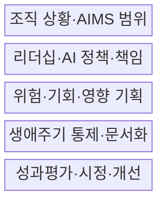
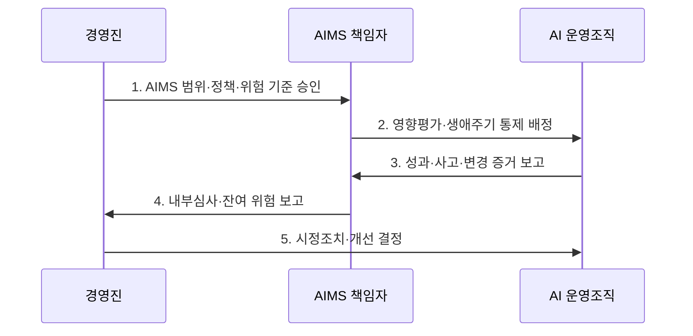

---
sidebar:
  order: 31
  label: "031. ISO/IEC 42001 AI 경영시스템 (ISO 42001 AI Management)"
  badge:
    text: "기출 · 70%"
    variant: note
title: "ISO/IEC 42001 AI 경영시스템 (ISO 42001 AI Management)"
date: "2026-07-30T13:41:00+09:00"
tags:
  - "notes-law_policy"
weight: 31
extra:
  question_no: "031"
  source_status: "기출"
  source_history: "138회"
  priority: 70
  priority_note: "138회 기출, AI 경영체계 구축·인증 표준"
---

## 미리 알고가기

- **국제표준화기구(International Organization for Standardization, ISO)**: 산업과 경영시스템 분야의 국제표준을 개발·발행하는 비정부 국제기구이다.
- **국제전기기술위원회(International Electrotechnical Commission, IEC)**: 전기·전자·정보기술 분야의 국제표준을 개발·발행하는 국제기구이다.
- **인공지능(Artificial Intelligence, AI)**: 입력 데이터를 분석하여 예측·추천·콘텐츠·의사결정 등의 결과를 생성하는 기술이다.
- **AI 경영시스템(Artificial Intelligence Management System, AIMS)**: 조직이 책임 있는 AI 개발·제공·사용을 위해 정책·목표·절차·책임을 연결하는 경영체계이다.
- **계획-실행-점검-조치(Plan-Do-Check-Act, PDCA)**: 목표 수립, 실행, 성과 점검, 개선 조치를 반복하는 지속 개선 절차
- **AI 생애주기(AI Life Cycle)**: AI 시스템의 기획부터 개발, 도입, 운영, 폐기까지의 흐름
- **인간 감독(Human Oversight)**: AI의 결정을 사람이 검토하고 필요 시 개입하거나 동작을 중단하는 통제 방식
- **AI 영향평가**: AI가 개인·집단·사회에 줄 수 있는 긍정·부정 영향을 사용 맥락별로 분석하는 활동
- **내부심사**: 조직이 AIMS 요구사항과 자체 절차를 지키는지 독립적으로 확인하는 활동
- **경영검토**: 최고경영진이 AIMS의 성과·위험·자원·개선 필요성을 주기적으로 검토하는 활동
- **인증**: 독립된 인증기관이 경영시스템의 표준 적합성을 심사해 증명하는 절차

## Ⅰ. 개요

- **ISO/IEC 42001:2023**은 AI 기반 제품·서비스를 개발·제공·사용하는 조직이 AI 경영시스템을 수립·운영·유지·지속 개선하도록 요구하는 **인증 가능한 국제 경영시스템 표준**
- **배경/필요성**: 개별 모델의 정확도·안전성 시험만으로 관리하기 어려운 조직 차원의 책임·AI 생애주기 위험·사회적 영향·지속적 개선 체계 확보

### 쉽게 이해하기 (학습용)
- 모델 하나의 성능 시험이 아니라 조직이 모든 AI의 책임·위험·통제를 반복 관리하는 방식을 정한다.

## Ⅱ. 특징

- **상황 기반성**: 이해관계자·법규·AI 역할을 분석하여 경영진 책임과 AI 경영시스템 범위 설정
- **생애주기 통제성**: AI 위험·기회·영향을 평가하고 데이터·모델·제3자·운영·폐기 통제 계획
- **지속 개선성**: 성과지표·사고·내부심사·경영검토·시정조치로 AI 경영체계의 적합성과 효과 개선

### 쉽게 이해하기 (학습용)
- 정확도가 높아도 차별·오용·통제 불능 위험이 있으면 조직의 정책과 책임으로 함께 관리한다.

## Ⅲ. 구조 및 구성요소

| 설계 요소 | 설명 |
|:---|:---|
| 조직 상황·AIMS 범위 | AI 개발자·제공자·사용자 역할과 이해관계자 요구·법규·적용 경계 정의 |
| 리더십·AI 정책·책임 | 경영진이 책임 있는 AI 원칙·목표·역할·권한·자원을 승인 |
| 위험·기회·영향 기획 | 사용 맥락별 위험·기회·개인·집단·사회 영향을 평가하고 처리 계획 수립 |
| 생애주기 통제·문서화 | 데이터·개발·검증·배포·운영·제3자·폐기의 통제와 증거 관리 |
| 성과평가·시정·개선 | 지표·내부심사·경영검토·부적합 원인 분석으로 정책과 통제 갱신 |

> 요약: 조직 상황부터 성과평가·개선까지 AIMS를 순환한다

### 쉽게 이해하기 (학습용)
- 경영진이 책임과 목표를 정하고 현장이 통제를 실행하면 심사 결과가 다음 계획으로 돌아간다.

## Ⅳ. 흐름도

| 절차 | 설명 |
|:---|:---|
| AIMS 범위·정책·위험 기준 승인 | 조직의 AI 역할·사용 맥락·이해관계자 요구를 토대로 경영체계 경계와 수용 기준 확정 |
| 영향평가·생애주기 통제 배정 | 위험·영향 처리 조치를 데이터·모델·운영·제3자 책임자에게 할당 |
| 성과·사고·변경 증거 보고 | 통제 수행 결과·모델 변화·오용·사고·불만과 목표 지표를 수집 |
| 내부심사·잔여 위험 보고 | 요구사항·자체 절차의 준수와 통제 효과·잔여 위험을 독립적으로 평가 |
| 시정조치·개선 결정 | 부적합 원인을 제거하고 정책·목표·자원·통제의 변경을 승인 |

> 요약: AI 위험을 계획·실행·점검·개선으로 관리한다

### 쉽게 이해하기 (학습용)
- 어디에 쓸 AI인지 정해 위험을 통제하고 실제 결과를 심사해 다음 계획과 통제를 바꾼다.

## Ⅴ. 종류 및 비교

| 판단 기준 | ISO/IEC 42001:2023 | EU 인공지능법 |
|:---|:---|:---|
| 적용 기준 | 반복 가능한 AI 거버넌스 구축 | EU 시장에 AI를 제공·배포·사용 |
| 핵심 특징 | 조직 AIMS 요구사항·인증 | 위험별 법적 의무·금지 |
| 한계 | 인증 범위 밖 AI 미포함 | 조직 경영체계 전체는 미규정 |

> 요약: ISO는 경영체계, EU법은 시스템 의무를 정한다

### 쉽게 이해하기 (학습용)
- ISO는 조직이 계속 관리하는 틀이고 EU법은 시스템별 최소 법적 의무이므로 서로 대체하지 않는다.

## Ⅵ. 실무 고려사항 및 대책

| 고려사항 | 대책 | 효과 |
|:---|:---|:---|
| 인증 범위 밖 비공식 AI 사용 | 조직의 개발·구매·내장·생성형 AI 목록과 사용 맥락을 정기 갱신 | 그림자 AI와 경영체계 사각지대 감소 |
| 영향평가의 형식적 문서화 | 영향받는 집단·오용 시나리오·인간 감독·잔여 위험·중단 기준을 운영 책임에 연결 | 실제 권리·안전 위험의 통제 |
| 공급자 모델의 불투명성과 변경 | 계약상 정보·시험·변경 통지·사고 협력·종료 권리를 확보하고 독립 검증 | 제3자 AI 위험과 책임 공백 감소 |

### 쉽게 이해하기 (학습용)
- 채용 결과가 특정 집단에 불리한지 평가하고 담당자가 자동 탈락을 재심할 절차와 중단 권한을 정한다.

## Ⅶ. 결론

- 조직 전체의 AI 책임을 지속 관리하려면 **공식·비공식 AI의 사용 맥락을 범위에 포함하고 영향평가·생애주기·제3자 통제를 책임자와 증거에 연결하며 내부심사·경영검토로 개선하는 ISO/IEC 42001:2023 체계** 필요

### 쉽게 이해하기 (학습용)
- 인증서보다 AI 사용 맥락별 책임과 통제가 실제 운영되고 심사 결과로 개선되는지가 중요하다.
