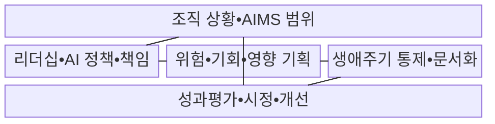
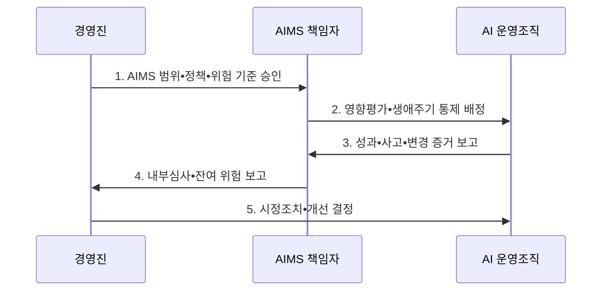

---
sidebar:
  order: 31
  label: "031. ISO/IEC 42001 AI 경영시스템 (ISO 42001 AI Management)"
  badge:
    text: "기출 • 70%"
    variant: note
title: "ISO/IEC 42001 AI 경영시스템 (ISO 42001 AI Management)"
date: "2026-08-03T08:48:47+09:00"
tags:
  - "notes-law_policy"
weight: 31
extra:
  question_no: "031"
  source_status: "기출"
  source_history: "138회"
  priority: 70
  priority_note: "138회 기출, AI 경영체계 구축•인증 표준"
---

## Ⅰ. 개요

핵심 용어

- **국제표준화기구/국제전기기술위원회 42001(International Organization for Standardization/International Electrotechnical Commission 42001, ISO/IEC 42001)**: 조직이 인공지능 경영시스템을 수립•운영•개선하고 인증받기 위한 요구사항을 정한 국제표준이다.
- **인공지능(Artificial Intelligence, AI) 경영시스템**: 조직이 책임 있는 AI 개발•제공•사용을 위해 정책•목표•절차•책임을 연결하는 경영체계다.

- 정의/개념: 조직의 **AI 경영시스템** 수립•운영•개선을 요구하는 **인증 가능한 국제표준**
- 배경/필요성: 모델 시험만으로는 조직 책임•생애주기 위험•**사회적 영향** 의 지속 관리 곤란

#### 한줄 요약
- 모델 하나의 성능 시험이 아니라 조직이 모든 AI의 책임•위험•통제를 반복 관리하는 방식을 정한다.

## Ⅱ. 특징

핵심 용어

- **상황 기반성**: 이해관계자•법규•조직의 인공지능(Artificial Intelligence, AI) 역할을 분석해 경영진 책임과 경영체계 범위를 정하는 특성이다.
- **생애주기 통제성**: AI의 기획부터 폐기까지 데이터•모델•제3자•운영 위험과 영향을 지속 관리하는 특성이다.
- **지속 개선성**: 성과지표•사고•내부심사•경영검토•시정조치로 AI 경영체계의 적합성과 효과를 반복 개선하는 특성이다.

- **상황 기반성**: 이해관계자•법규•AI 역할을 분석하여 경영진 책임과 AI 경영시스템 범위 설정
- **생애주기 통제성**: AI 위험•기회•영향을 평가하고 데이터•모델•제3자•운영•폐기 통제 계획
- **지속 개선성**: 성과지표•사고•내부심사•경영검토•시정조치로 AI 경영체계의 적합성과 효과 개선

#### 한줄 요약
- 정확도가 높아도 차별•오용•통제 불능 위험이 있으면 조직의 정책과 책임으로 함께 관리한다.

## Ⅲ. 구조 및 구성요소

핵심 용어

- **인공지능 경영시스템(Artificial Intelligence Management System, AIMS) 범위**: 조직의 AI 역할•법규•이해관계자 요구를 반영해 경영체계를 적용할 조직•업무•시스템의 경계를 정한 것이다.
- **리더십•AI 정책•책임**: 경영진이 AI 원칙•목표•역할과 필요한 자원을 승인하는 경영 요소이다.
- **위험•기회•영향 기획**: AI 사용 맥락이 개인•집단•사회에 미칠 결과를 평가하고 처리 계획을 수립하는 활동이다.
- **생애주기 통제•문서화**: 데이터•모델•운영•제3자에 대한 통제를 기획부터 폐기까지 적용하고 증거를 보존하는 활동이다.
- **성과평가•시정•개선**: 내부심사와 목표 지표로 부적합을 확인하고 원인을 제거하여 정책과 통제를 갱신하는 활동이다.

| 구성요소 | 책임 |
|:---|:---|
| **조직 상황•AIMS 범위** | AI 역할•법규•이해관계자 요구와 **적용 경계 정의** |
| **리더십•AI 정책•책임** | 경영진이 AI 원칙•목표•역할•**자원 승인** |
| **위험•기회•영향 기획** | 사용 맥락별 사회 영향을 평가해 **처리 계획 수립** |
| **생애주기 통제•문서화** | 데이터•모델•운영•제3자의 **통제 증거 관리** |
| **성과평가•시정•개선** | 내부심사•부적합 분석으로 **정책•통제 갱신** |

#### 한줄 요약
- 경영진이 책임과 목표를 정하고 현장이 통제를 실행하면 심사 결과가 다음 계획으로 돌아간다.

## Ⅳ. 흐름도

핵심 용어

- **인공지능 경영시스템(Artificial Intelligence Management System, AIMS) 범위•정책•위험 기준**: AI 적용 경계와 경영 원칙 및 조직이 수용할 위험 수준을 정한 운영 기준이다.
- **영향평가•생애주기 통제**: AI의 개인•집단•사회 영향을 평가하고 데이터•모델•운영•제3자 단계별 조치를 책임자에게 배정하는 활동이다.
- **성과•사고•변경 증거**: 통제 결과•목표 지표•오용•사고•모델 변경을 기록하여 경영체계의 효과를 판단하는 자료이다.
- **내부심사•잔여 위험 보고**: AIMS 책임자가 요구사항 준수와 통제 효과를 독립 평가해 조치 뒤 남은 위험을 경영진에게 보고하는 활동이다.
- **시정조치•개선 결정**: 부적합의 원인을 제거하고 정책•목표•자원•통제의 변경을 승인하는 활동이다.

1. **AIMS 범위•정책•위험 기준 승인**: 조직의 AI 역할•사용 맥락•이해관계자 요구를 토대로 경영체계 경계와 수용 기준 확정
2. **영향평가•생애주기 통제 배정**: 위험•영향 처리 조치를 데이터•모델•운영•제3자 책임자에게 할당
3. **성과•사고•변경 증거 보고**: 통제 수행 결과•모델 변화•오용•사고•불만과 목표 지표를 수집
4. **내부심사•잔여 위험 보고**: 요구사항•자체 절차의 준수와 통제 효과•잔여 위험을 독립적으로 평가
5. **시정조치•개선 결정**: 부적합 원인을 제거하고 정책•목표•자원•통제의 변경을 승인

#### 한줄 요약
- 어디에 쓸 AI인지 정해 위험을 통제하고 실제 결과를 심사해 다음 계획과 통제를 바꾼다.

## Ⅴ. 종류 및 비교

핵심 용어

- **국제표준화기구/국제전기기술위원회 42001:2023(International Organization for Standardization/International Electrotechnical Commission 42001:2023, ISO/IEC 42001:2023)**: 조직이 인공지능(Artificial Intelligence, AI) 경영시스템을 반복 운영하고 인증받을 수 있게 요구사항을 제시한다.
- **인공지능 경영시스템(Artificial Intelligence Management System, AIMS)**: 조직 전체의 AI 정책•책임•위험•통제를 반복 운영하는 경영체계이다.
- **유럽연합(European Union, EU) 인공지능법**: EU 시장에서 AI를 제공•배포•사용할 때 위험 등급별 금지와 법적 의무를 정한 법률이다.

| 판단 기준 | ISO/IEC 42001:2023 | EU 인공지능법 |
|:---|:---|:---|
| **적용 기준** | 반복 가능한 **AI 거버넌스 구축** | EU 시장에 **AI 제공•배포•사용** |
| **핵심 특징** | 조직 **AIMS 요구사항•인증** | 위험별 **법적 의무•금지** |
| **한계** | 인증 범위 밖 **AI 미포함** | 조직 **경영체계 전체는 미규정** |

#### 한줄 요약
- ISO는 조직이 계속 관리하는 틀이고 EU법은 시스템별 최소 법적 의무이므로 서로 대체하지 않는다.

## Ⅵ. 실무 고려사항 및 대책

핵심 용어

- **비공식 인공지능(Artificial Intelligence, AI) 사용**: 승인과 목록 관리 밖에서 도구를 사용해 인공지능 경영시스템(Artificial Intelligence Management System, AIMS) 통제와 책임의 사각지대를 만드는 문제다.
- **영향평가**: AI 사용 맥락이 개인•집단의 권리와 안전에 미칠 영향을 분석하고 완화 조치를 정하는 평가이다.
- **인간 감독**: 사람이 AI 결과를 재심•수정•거부하고 필요하면 처리를 중단할 수 있게 하는 통제이다.
- **독립 검증**: 공급자 설명과 별도로 모델의 성능•편향•안전성과 변경 영향을 객관적 증거로 확인하는 활동이다.

| 문제 | 대책 | 효과 |
|:---|:---|:---|
| 인증 범위 밖 **비공식 AI 사용** | AI 목록과 **사용 맥락 정기 갱신** | 그림자 AI와 **경영체계 사각지대 감소** |
| 영향평가의 **형식적 문서화** | 인간 감독•잔여 위험•중단 기준을 **운영 책임에 연결** | 실제 권리•안전 **위험 통제** |
| 공급자 모델의 **불투명성•변경** | 변경 통지•종료 권리를 확보하고 **독립 검증** | 제3자 AI의 **책임 공백 감소** |

#### 한줄 요약
- 채용 결과가 특정 집단에 불리한지 평가하고 담당자가 자동 탈락을 재심할 절차와 중단 권한을 정한다.

## Ⅶ. 결론

핵심 용어

- **인공지능 경영시스템(Artificial Intelligence Management System, AIMS) 범위**: 공식•비공식 AI를 빠짐없이 등록하여 경영체계의 책임과 통제를 적용하는 경계이다.
- **영향평가•인간 감독**: 고위험 AI는 사용 맥락별 영향평가를 수행하고 사람이 재심•개입•중단할 수 있는 인간 감독을 적용해야 한다.

- 공식•비공식 AI를 **AIMS 범위** 에 넣고 고위험 사용은 **영향평가•인간 감독** 우선

#### 한줄 요약
- 인증서보다 AI 사용 맥락별 책임과 통제가 실제 운영되고 심사 결과로 개선되는지가 중요하다.
