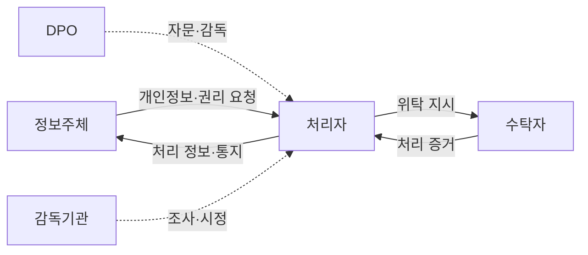
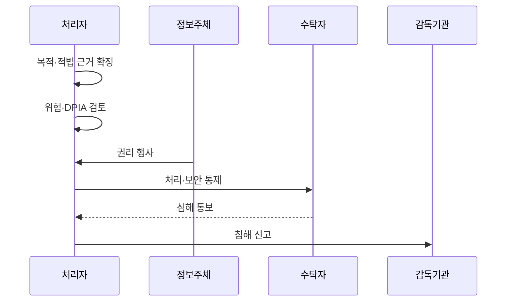

---
sidebar:
  order: 32
  label: "032. GDPR - 동의·데이터 이동성·잊혀질 권리 (GDPR)"
  badge:
    text: "미출제 · 50%"
    variant: note
title: "GDPR - 동의·데이터 이동성·잊혀질 권리 (GDPR)"
date: "2026-07-25T14:36:00+09:00"
tags:
  - "notes-law_policy"
weight: 32
extra:
  question_no: "032"
  source_status: "미출제"
  source_history: ""
  priority: 50
  priority_note: "역외이전·정보주체 권리를 묻는 대표 규제"
---

## 미리 알고가기

- **개인정보 보호 규정(General Data Protection Regulation, GDPR)**: EU 회원국 전체에 직접 적용되는 개인정보 보호 법령
- **유럽연합(European Union, EU)**: GDPR 규제가 즉시 효력을 가지는 경제 공동체
- **개인정보 처리자(Controller)**: 개인정보 처리 목적과 수단을 결정하고 이에 대한 책임을 지는 주체
- **개인정보 수탁자(Processor)**: 처리자의 위탁을 받아 계약 범위 내에서 개인정보를 처리하는 주체
- **개인정보보호책임자(Data Protection Officer, DPO)**: 조직 내 개인정보 준수 여부를 감독하는 독립적 전문가
- **개인정보 영향평가(Data Protection Impact Assessment, DPIA)**: 고위험 개인정보 처리에 대해 사전에 위험을 평가하고 조치를 수립하는 절차
- **정보주체(Data Subject)**: 개인정보가 가리키는 식별되거나 식별 가능한 자연인
- **적법 근거**: 동의·계약·법적 의무·중대한 이익·공적 임무·정당한 이익 중 개인정보 처리를 정당화하는 근거
- **특별 범주 개인정보**: 인종·정치 견해·건강·생체정보 등 원칙적으로 처리가 금지되고 별도 예외가 필요한 정보
- **삭제권**: 처리 목적 소멸·동의 철회 등 법정 사유가 있을 때 개인정보 삭제를 요구하는 권리
- **이동권**: 동의·계약에 근거해 자동 처리한 정보를 구조화된 기계 판독 형식으로 받거나 다른 처리자에게 보내게 할 권리
- **반대권**: 공적 임무·정당한 이익·직접 마케팅 등에 근거한 개인정보 처리의 중단을 요구하는 권리
- **감독기관**: GDPR 적용을 감독하고 조사·시정·과징금 권한을 행사하는 독립 공공기관
- **역외 적용**: EU 밖 조직도 EU 내 정보주체에게 재화·서비스를 제공하거나 행동을 모니터링하면 GDPR 적용을 받는 원칙
- **적정성 결정**: EU 집행위원회가 제3국 등의 개인정보 보호 수준이 충분하다고 인정하는 국외 이전 근거

## Ⅰ. 개요

- 정의/개념: EU 개인정보 처리·권리·이전을 규율하는 법이다
- 기존 한계: 국가별 분산 규제로 정보주체 권리와 처리자 책임의 일관된 보장 곤란

### 쉽게 이해하기 (학습용)
- EU 안의 정보주체를 대상으로 서비스하거나 행동을 추적하면 조직이 EU 밖에 있어도 적용될 수 있다.

## Ⅱ. 특징

- 목적별 적법 근거는 무단·과다 처리를 막는다
- 열람·정정·삭제·이동·반대권은 통제권을 보장한다
- 고위험 DPIA와 DPO는 권리 침해를 사전 완화한다
- 책임성 원칙은 준수 증거의 부재를 막는다

### 쉽게 이해하기 (학습용)
- 동의만 받으면 끝나는 법이 아니라 목적·보유기간·권리 요청·이전·침해 대응을 계속 입증해야 한다.

## Ⅲ. 아키텍처 및 구성요소

| 설계 요소 | 설명 |
|:---|:---|
| 정보주체 | 개인정보의 당사자이자 권리 행사자 |
| 처리자 | 처리 목적·수단 결정과 준수 책임 |
| 수탁자 | 처리자의 문서화된 지시에 따라 처리 |
| DPO | 독립적 준수 자문·감독·기관 연락 |
| 감독기관 | 조사·시정·제재와 민원 처리 |

> 요약: 처리자·수탁자·DPO·감독기관이 책임을 분담한다

### 쉽게 이해하기 (학습용)
- 처리자가 목적과 방법을 정하고 수탁자에게 일을 맡겨도 정보주체 권리와 법적 책임은 사라지지 않는다.

## Ⅳ. 원리 및 절차 흐름도

| 절차 | 설명 |
|:---|:---|
| 목적·적법 근거 확정 | 목적·최소 항목·보유기간 결정 |
| 위험·DPIA 검토 | 고위험 처리의 영향과 완화책 평가 |
| 권리 행사 | 열람·정정·삭제·이동·반대 처리 |
| 처리·보안 통제 | 위탁·접근·이전·삭제 증거 관리 |
| 침해 통보 | 수탁자가 처리자에게 지체 없이 알림 |
| 침해 신고 | 가능하면 72시간 내 감독기관 신고 |

> 요약: 적법 처리부터 권리·침해 대응까지 증거를 관리한다

### 쉽게 이해하기 (학습용)
- 왜 필요한 데이터인지 먼저 정하고 권리 요청과 침해가 생기면 위험 수준에 맞는 기한·대상으로 대응한다.

## Ⅴ. 종류 및 비교

| 비교축 | 삭제권 | 이동권 | 반대권 |
|:---|:---|:---|:---|
| 핵심 특징 | 법정 사유 시 개인정보 삭제 | 기계 판독 형식으로 이전 | 특정 근거의 처리 중단 요구 |
| 적용 기준 | 목적 소멸·동의 철회·불법 처리 | 동의·계약 기반 자동 처리 | 공적 임무·정당한 이익·마케팅 |
| 주요 위험 | 법적 보존·표현 자유 예외 누락 | 타인 권리 침해·호환성 부족 | 우월한 정당한 근거 판단 오류 |

> 요약: 삭제·이동·반대권은 처리에 미치는 효과가 다르다

### 쉽게 이해하기 (학습용)
- 삭제는 없애는 권리, 이동은 옮기는 권리, 반대는 특정 목적의 처리를 멈추게 하는 권리다.

## Ⅵ. 실무 사례

1. 회원 탈퇴의 삭제 요청과 법정 보존을 분리한다

### 쉽게 이해하기 (학습용)
- 서비스 데이터는 삭제하되 세법상 보존할 거래 기록은 근거·기간·접근 제한을 기록한다.

## Ⅶ. 결론

- EU 개인정보 처리의 적법성과 책임성을 확보하기 위해 **처리 근거·정보주체 권리·국외 이전·DPIA·침해 대응 증거**를 검토하고, GDPR 준수 내용을 기록으로 입증해야 한다.

### 쉽게 이해하기 (학습용)
- 동의서보다 목적별 적법 근거와 권리·위탁·이전·침해 대응이 실제 작동한 증거가 중요하다.
