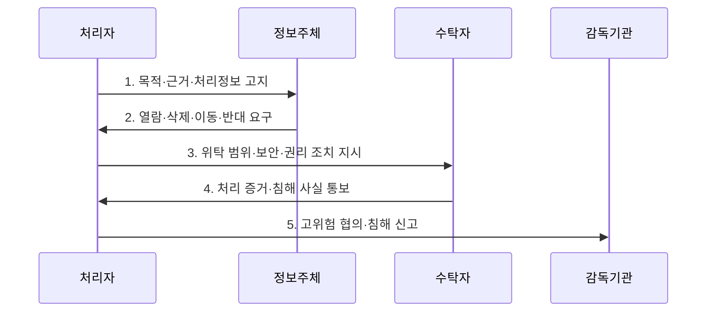

---
sidebar:
  order: 32
  label: "032. GDPR - 동의·데이터 이동성·잊혀질 권리 (GDPR)"
  badge:
    text: "미출 · 50%"
    variant: note
title: "GDPR - 동의·데이터 이동성·잊혀질 권리 (GDPR)"
date: "2026-07-31T11:43:51+09:00"
tags:
  - "notes-law_policy"
weight: 32
extra:
  question_no: "032"
  source_status: "미출"
  source_history: ""
  priority: 50
  priority_note: "역외이전·정보주체 권리를 묻는 대표 규제"
---

## 미리 알고가기

- **일반개인정보보호규정(General Data Protection Regulation, GDPR)**: 유럽연합 회원국에 직접 적용되어 개인정보 처리 원칙·정보주체 권리·처리 책임·국외이전을 규율하는 법령이다.
- **유럽연합(European Union, EU)**: 회원국이 공동의 법·정책·시장 체계를 운영하는 정치·경제 연합이다.
- **개인정보 처리자(Controller)**: 개인정보 처리의 목적과 수단을 결정하고 준수 책임을 지는 주체이다.
- **개인정보 수탁자(Processor)**: 처리자의 문서화된 지시에 따라 위탁 범위에서 개인정보를 처리하는 주체이다.
- **개인정보보호책임자(Data Protection Officer, DPO)**: 조직 내 개인정보 준수 여부를 감독하는 독립적 전문가
- **개인정보 영향평가(Data Protection Impact Assessment, DPIA)**: 고위험 개인정보 처리에 대해 사전에 위험을 평가하고 조치를 수립하는 절차
- **정보주체(Data Subject)**: 개인정보가 가리키는 식별되거나 식별 가능한 자연인
- **적법 근거**: 동의·계약·법적 의무·중대한 이익·공적 임무·정당한 이익 중 개인정보 처리를 정당화하는 근거
- **특별 범주 개인정보**: 인종·정치 견해·건강·생체정보 등 원칙적으로 처리가 금지되고 별도 예외가 필요한 정보
- **삭제권**: 처리 목적 소멸·동의 철회 등 법정 사유가 있을 때 개인정보 삭제를 요구하는 권리
- **이동권**: 동의·계약에 근거해 자동 처리한 정보를 구조화된 기계 판독 형식으로 받거나 다른 처리자에게 보내게 할 권리
- **반대권**: 공적 임무·정당한 이익·직접 마케팅 등에 근거한 개인정보 처리의 중단을 요구하는 권리
- **감독기관**: GDPR 적용을 감독하고 조사·시정·과징금 권한을 행사하는 독립 공공기관
- **역외 적용**: EU 밖 조직도 EU 내 정보주체에게 재화·서비스를 제공하거나 행동을 모니터링하면 GDPR 적용을 받는 원칙
- **적정성 결정**: EU 집행위원회가 제3국 등의 개인정보 보호 수준이 충분하다고 인정하는 국외 이전 근거

## Ⅰ. 개요

- 정의/개념: EU의 처리 원칙·정보주체 권리·책임·역외 적용을 규율한 **개인정보 보호 규정**
- 배경/필요성: 회원국별 분산 규율로는 국경 간 처리의 **권리·조직 책임성** 일관 보장 곤란

### 쉽게 이해하기 (학습용)
- EU 안의 정보주체를 대상으로 서비스하거나 행동을 추적하면 조직이 EU 밖에 있어도 적용될 수 있다.

## Ⅱ. 특징

- **원칙·근거 중심성**: 적법성·공정성·투명성·목적 제한·최소화·정확성·보유 제한·보안·책임성 원칙과 목적별 처리 근거 적용
- **권리 보장성**: 고지·열람·정정·삭제·처리제한·이동·반대와 자동화된 결정 관련 권리로 개인정보 통제권 보장
- **위험·책임 기반성**: 고위험 처리의 개인정보 영향평가, 필요한 경우 개인정보보호책임자 지정, 설계·기본값 보호와 준수 증거 관리

### 쉽게 이해하기 (학습용)
- 동의만 받으면 끝나는 법이 아니라 목적·보유기간·권리 요청·이전·침해 대응을 계속 입증해야 한다.

## Ⅲ. 구조 및 구성요소

```mermaid
block-beta
    columns 3
    S["정보주체"]:3
    C["처리자"] P["수탁자"] D["DPO"]
    A["감독기관"]:3
    S -- C
    C -- P
    C -- D
    D -- A
    S -- A
    S --- C
    C --- P
    P --- D
    D --- A
```

| 구성요소 | 책임 |
|:---|:---|
| **정보주체** | 개인정보의 당사자이자 **권리 행사자** |
| **처리자** | 처리 목적·수단 결정과 **준수 책임** |
| **수탁자** | 처리자의 **문서화된 지시**에 따라 처리 |
| **DPO** | 독립적 **준수 자문·감독·기관 연락** |
| **감독기관** | **조사·시정·제재**와 민원 처리 |

### 쉽게 이해하기 (학습용)
- 처리자가 목적과 방법을 정하고 수탁자에게 일을 맡겨도 정보주체 권리와 법적 책임은 사라지지 않는다.

## Ⅳ. 흐름도



1. **목적·근거·처리정보 고지**: 목적·법적 근거·항목·보유기간·수신자·국외이전·권리를 명확히 안내
2. **열람·삭제·이동·반대 요구**: 본인 확인 후 권리별 적용 조건·예외·기한을 판단하여 접수
3. **위탁 범위·보안·권리 조치 지시**: 수탁자 계약에 목적 외 처리 금지·보안·재위탁·권리 지원·삭제 의무 반영
4. **처리 증거·침해 사실 통보**: 수탁자가 지시 준수 증거와 침해 사실을 처리자에게 지체 없이 제공
5. **고위험 협의·침해 신고**: 잔여 고위험은 감독기관과 사전 협의하고 침해는 가능한 경우 72시간 내 신고

### 쉽게 이해하기 (학습용)
- 왜 필요한 데이터인지 먼저 정하고 권리 요청과 침해가 생기면 위험 수준에 맞는 기한·대상으로 대응한다.

## Ⅴ. 종류 및 비교

| 판단 기준 | 삭제권 | 이동권 | 반대권 |
|:---|:---|:---|:---|
| **적용 기준** | 목적 소멸·동의 철회·**불법 처리** | 동의·계약 기반 **자동 처리** | 공적 임무·**정당한 이익·마케팅** |
| **핵심 특징** | 법정 사유에 따른 **개인정보 삭제 요구** | 기계 판독 형식으로 **수령·이전** | 특정 근거의 처리나 **직접 마케팅 중단** |
| **한계** | 법적 보존·표현의 자유 등 **예외 판단** | 타인 권리와 **기술적 가능성 고려** | 정당한 근거와 **법적 청구 예외 판단** |

### 쉽게 이해하기 (학습용)
- 삭제는 없애는 권리, 이동은 옮기는 권리, 반대는 특정 목적의 처리를 멈추게 하는 권리다.

## Ⅵ. 실무 고려사항 및 대책

| 고려사항 | 대책 | 효과 |
|:---|:---|:---|
| 모든 처리를 **동의에 의존** | 목적별 적법 근거와 예외를 **처리기록에 매핑** | 불법 처리와 **근거 오용 방지** |
| **삭제권·법정 보존 충돌** | 삭제·보존 데이터를 분리하고 **접근 제한 기록** | 권리 보장과 **법적 의무 동시 충족** |
| 국외이전 근거와 **실제 흐름 불일치** | 수신자·이전 도구를 **데이터 흐름과 대조** | 역외 처리의 **보호 연속성 확보** |

### 쉽게 이해하기 (학습용)
- 서비스 데이터는 삭제하되 세법상 보존할 거래 기록은 근거·기간·접근 제한을 기록한다.

## Ⅶ. 결론

- EU 대상 처리는 **목적별 적법 근거·권리 증거**, 침해는 **가능하면 72시간 내 신고**

### 쉽게 이해하기 (학습용)
- 동의서보다 목적별 적법 근거와 권리·위탁·이전·침해 대응이 실제 작동한 증거가 중요하다.
