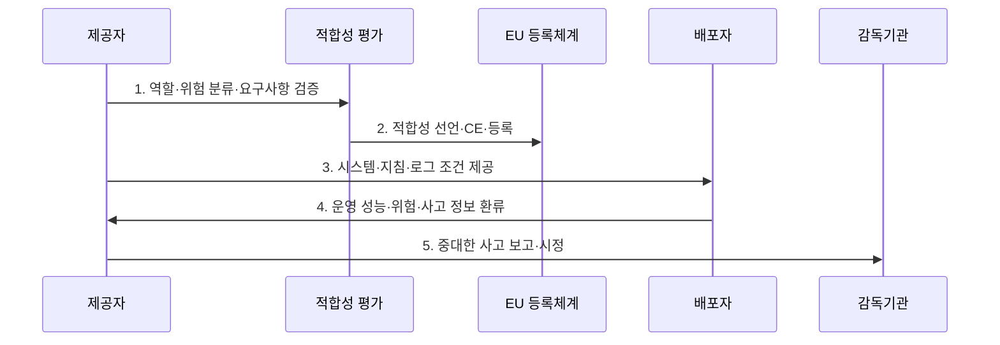

---
sidebar:
  order: 33
  label: "033. EU AI Act — 위험 기반 분류 체계 (EU AI Act)"
  badge:
    text: "기출 · 70%"
    variant: note
title: "EU AI Act — 위험 기반 분류 체계 (EU AI Act)"
date: "2026-07-30T13:57:00+09:00"
tags:
  - "notes-law-policy"
weight: 33
extra:
  question_no: "033"
  source_status: "기출"
  source_history: "138회"
  priority: 70
  priority_note: "138회 기출, 위험등급별 AI 의무의 현행축"
---

## 미리 알고가기

- **유럽연합(European Union, EU)**: 회원국이 공동의 법·정책·시장 체계를 운영하는 정치·경제 연합이다.
- **인공지능(Artificial Intelligence, AI)**: 입력 데이터를 분석하여 예측·추천·콘텐츠·의사결정 등의 결과를 생성하는 기술이다.
- **유럽연합 AI법(EU AI Act)**: AI 시스템·범용 AI 모델의 위험과 공급망 역할에 따라 금지·요구사항·투명성·감독 의무를 부과하는 유럽연합 규정이다.
- **범용 인공지능(General-Purpose AI, GPAI)**: 다양한 작업을 수행하고 여러 하위 시스템에 통합될 수 있는 일반성을 가진 AI 모델이다.
- **고위험 AI(High-Risk AI)**: 안전·기본권에 악영향을 미칠 가능성이 높은 AI 시스템
- **유럽 적합성(Conformité Européenne, CE)**: 제품이 EU의 안전·보건·환경보호 요구사항을 충족함을 나타내는 표시
- **EU AI 사무국(EU AI Office)**: GPAI 관련 규정을 감독하는 EU 내부 조직
- **EU AI 위원회(EU AI Board)**: 회원국 간 일관된 법 적용을 조율하는 협의체
- **제공자(Provider)**: AI 시스템·GPAI 모델을 개발해 자신의 이름으로 EU 시장에 출시하거나 서비스하는 주체
- **배포자(Deployer)**: 개인적 비전문 활동이 아닌 업무 권한 아래 AI 시스템을 사용하는 주체
- **수입자·유통업자**: 제3국 AI를 EU 시장에 출시하거나 공급망에서 제공하는 주체
- **적합성 평가**: 고위험 AI가 위험관리·데이터·문서·인간 감독 등 법정 요구사항을 충족하는지 확인하는 절차
- **시장 출시 후 모니터링**: 출시된 AI의 성능·사고·위험 데이터를 계속 수집·분석하는 체계
- **중대한 사고**: 사망·건강 피해·기반시설 중단·기본권 침해 등 법이 정한 중대한 결과를 낳은 사건
- **AI 리터러시**: AI를 다루는 인력이 기회·위험·피해를 이해하고 적절히 사용하도록 갖추는 지식과 역량
- **시스템적 위험 GPAI**: 고영향 능력 등으로 EU 시장 전체에 광범위한 위험을 줄 수 있는 범용 AI 모델

## Ⅰ. 개요

- 정의/개념: **EU AI Act**는 AI의 의도된 목적·사용 맥락·위험 수준과 제공자·배포자 등 공급망 역할에 따라 금지·고위험 요구사항·투명성·범용 AI 의무를 부과하는 **유럽연합 인공지능 규정**
- 배경/필요성: 자율 규제와 회원국별 상이한 규칙만으로 통제하기 어려운 건강·안전·기본권 침해와 유럽 단일시장의 규제 불확실성 해소

### 쉽게 이해하기 (학습용)
- 같은 모델도 채용·의료처럼 쓰는 목적과 공급망 역할에 따라 금지·고위험·투명성 의무가 달라진다.

## Ⅱ. 특징

- **위험 차등화**: 의도된 목적과 실제 사용 맥락을 기준으로 금지 관행·고위험 시스템·투명성 대상·범용 AI 모델 분류
- **공급망 책임성**: 제공자·배포자·수입자·유통업자의 출시 전 검증·문서 전달·운영·모니터링 책임 구분
- **시장 규율성**: 역외 적용·등록·시장감시·중대한 사고 보고·시정·제재와 단계별 적용일로 유럽 시장의 위험 통제

### 쉽게 이해하기 (학습용)
- 개발사가 문서화했어도 도입 조직은 입력 데이터·인간 감독·로그·기본권 영향을 별도로 책임진다.

## Ⅲ. 구조 및 구성요소

```mermaid
block-beta
    columns 3
    P["제공자"]:3
    I["수입자·유통업자"] D["배포자"] S["영향받는 사람"]
    A["EU AI 사무국·회원국 감독기관"]:3
    P -- I
    I -- D
    D -- S
    P -- A
    D -- A
    P --- I
    I --- D
    D --- S
    S --- A
```

| 구성요소 | 책임 |
|:---|:---|
| 제공자 | 위험 분류·품질시스템·기술문서·적합성·등록·출시 후 모니터링 수행 |
| 수입자·유통업자 | 제3국 제공자의 의무·CE 표시·문서·보관·운송 조건 확인 |
| 배포자 | 사용 지침·입력 데이터·인간 감독·로그·영향·사고 통제 |
| 영향받는 사람 | AI 상호작용·결정에 대한 고지·설명·불만·구제의 대상 |
| EU AI 사무국·회원국 감독기관 | 범용 AI 감독과 시장감시·등록·조사·시정·제재 조정 |

### 쉽게 이해하기 (학습용)
- AI가 개발자에서 수입·유통·사용 조직으로 넘어갈 때 문서와 책임도 함께 이어져야 한다.

## Ⅳ. 흐름도



1. **역할·위험 분류·요구사항 검증**: 공급망 역할과 금지·고위험·투명성·범용 AI 해당 여부를 판단하고 필요한 통제 확인
2. **적합성 선언·CE·등록**: 고위험 AI의 위험관리·데이터·문서·기록·인간 감독·정확성 요구를 검증하여 출시 요건 충족
3. **시스템·지침·로그 조건 제공**: 배포자가 안전하게 사용할 목적·한계·입력·감독·로그·유지관리 정보를 전달
4. **운영 성능·위험·사고 정보 환류**: 실제 성능·오용·편향·불만·사고를 수집하여 출시 후 모니터링과 변경 판단에 반영
5. **중대한 사고 보고·시정**: 법정 기한과 관할에 따라 감독기관에 보고하고 원인 조사·위험 완화·회수 등 조치

### 쉽게 이해하기 (학습용)
- 금지 여부를 먼저 보고 고위험이면 출시 전에 증명하며 운영 사고는 다시 제공자와 감독기관으로 돌아간다.

## Ⅴ. 종류 및 비교

| 판단 기준 | 금지 관행 | 고위험 AI | 투명성 대상 |
|:---|:---|:---|:---|
| 적용 기준 | 조작·사회점수 등 제5조 해당 | 제품 안전부품·부속서 III 용도 | 챗봇·감정인식·딥페이크 등 |
| 핵심 특징 | 법정 AI 관행 금지 | 사전 요구·사후감시 | AI 상호작용·합성물 고지 |
| 한계 | 예외 요건 오해 위험 | 목적 변경 시 재분류 필요 | 불명확한 고지는 인지 실패 |

### 쉽게 이해하기 (학습용)
- 금지면 중단하고 고위험이면 증명하며 이용자가 AI임을 알아야 하는 경우에는 명확히 표시한다.

## Ⅵ. 실무 고려사항 및 대책

| 고려사항 | 대책 | 효과 |
|:---|:---|:---|
| 모델명만으로 위험 등급 판단 | 의도된 목적·사용자·결정 영향·부속서 용도와 실제 배포 맥락을 시스템별 분류 | 고위험·금지·투명성 의무 누락 방지 |
| 공급망 역할과 문서의 단절 | 제공자·수입자·유통업자·배포자별 책임표와 기술문서·지침·로그·사고 환류 계약 | 출시 전후 책임 추적성 확보 |
| 단계별 적용일 오판 | 금지·AI 리터러시, 범용 AI, 일반 적용, 제품 내장 고위험 규칙의 적용일을 버전별 준수 달력으로 관리 | 조기·지연 준수 위험과 투자 혼선 감소 |

### 쉽게 이해하기 (학습용)
- 채용 결과가 지원자의 권리에 영향을 주므로 출시 전 적합성을 평가하고 운영 중에는 담당자가 자동 결정을 감독·재검토한다.

## Ⅶ. 결론

- 유럽연합 시장에 AI를 제공하거나 업무에 배포하려면 **모델이 아닌 실제 목적·영향과 공급망 역할로 위험을 분류하고 단계별 적용일에 맞춰 적합성·문서·인간 감독·모니터링·사고 환류를 연결하는 생애주기 준수 체계** 필요

### 쉽게 이해하기 (학습용)
- 모델 이름이 아니라 실제 용도와 공급망 역할을 기준으로 출시 전·후 의무와 적용일을 판단해야 한다.
