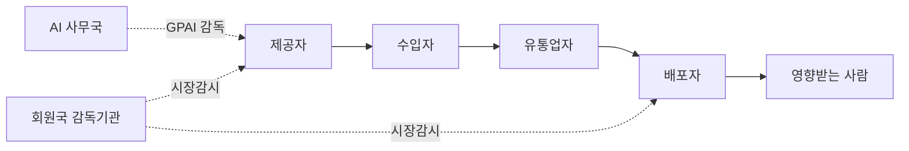
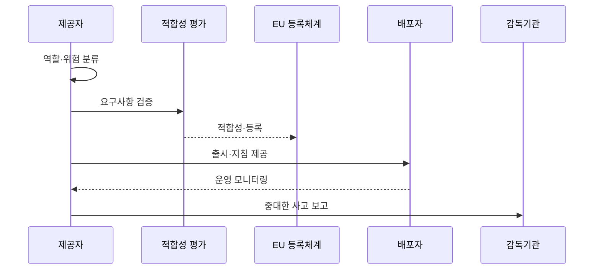

---
sidebar:
  order: 33
  label: "033. EU AI Act — 위험 기반 분류 체계 (EU AI Act)"
  badge:
    text: "기출 · 70%"
    variant: note
title: "EU AI Act — 위험 기반 분류 체계 (EU AI Act)"
date: "2026-07-27T23:59:59+09:00"
tags:
  - "notes-law-policy"
weight: 33
extra:
  question_no: "033"
  source_status: "기출"
  source_history: "138회"
  priority: 70
  priority_note: "138회 기출, 위험등급별 AI 의무의 현행축"
---

## 미리 알고가기

- **유럽연합(European Union, EU)**: '이유'로 읽고 법령이 적용되는 경제 연합을 영문 머리글자로 표시
- **인공지능(Artificial Intelligence, AI)**: '에이아이'로 읽고 예측·콘텐츠·추천·결정을 생성하는 시스템을 표시
- **유럽연합 AI법(EU AI Act)**: AI 시스템의 위험도에 따라 법적 의무를 부과하는 규제법
- **범용 인공지능(General-Purpose AI, GPAI)**: '지피에이아이'로 읽고 다양한 작업에 적용 가능한 모델을 영문 머리글자로 표시
- **고위험 AI(High-Risk AI)**: 안전·기본권에 악영향을 미칠 가능성이 높은 AI 시스템
- **유럽 적합성(Conformité Européenne, CE)**: '시에'로 읽고 EU 요구사항 적합 선언을 프랑스어 머리글자로 표시
- **EU AI 사무국(EU AI Office)**: GPAI 관련 규정을 감독하는 EU 내부 조직
- **EU AI 위원회(EU AI Board)**: 회원국 간 일관된 법 적용을 조율하는 협의체
- **제공자(Provider)**: AI 시스템·GPAI 모델을 개발해 자신의 이름으로 EU 시장에 출시하거나 서비스하는 주체
- **배포자(Deployer)**: 개인적 비전문 활동이 아닌 업무 권한 아래 AI 시스템을 사용하는 주체
- **수입자·유통업자**: 제3국 AI를 EU 시장에 출시하거나 공급망에서 제공하는 주체
- **적합성 평가**: 고위험 AI가 위험관리·데이터·문서·인간 감독 등 법정 요구사항을 충족하는지 확인하는 절차
- **시장 출시 후 모니터링**: 출시된 AI의 성능·사고·위험 데이터를 계속 수집·분석하는 체계
- **중대한 사고**: 사망·건강 피해·기반시설 중단·기본권 침해 등 법이 정한 중대한 결과를 낳은 사건
- **AI 리터러시**: AI를 다루는 인력이 기회·위험·피해를 이해하고 적절히 사용하도록 갖추는 지식과 역량
- **시스템적 위험 GPAI**: 고영향 능력 등으로 EU 시장 전체에 광범위한 위험을 줄 수 있는 범용 AI 모델

## Ⅰ. 개요

- 정의/개념: AI의 위험 수준·공급망 역할별 **금지·요구사항·투명성 의무를 정한 EU 규정**
- **배경/필요성**: 자율 규제만으로 막기 어려운 **안전·건강·기본권 침해와 시장 규칙 차이 해소**

### 쉽게 이해하기 (학습용)
- 같은 모델도 채용·의료처럼 쓰는 목적과 공급망 역할에 따라 금지·고위험·투명성 의무가 달라진다.

## Ⅱ. 특징

- **금지·고위험·투명성·GPAI**를 의도된 목적과 사용 맥락으로 분류한다.
- **제공자·배포자·수입자·유통업자**별 생애주기 책임을 구분한다.
- **역외 적용·시장감시·사고 보고·제재**로 EU 시장의 규제 우회를 통제한다.

### 쉽게 이해하기 (학습용)
- 개발사가 문서화했어도 도입 조직은 입력 데이터·인간 감독·로그·기본권 영향을 별도로 책임진다.

## Ⅲ. 아키텍처 및 구성요소

| 설계 요소 | 설명 |
|:---|:---|
| 제공자 | 분류·품질·문서·적합성·사후관리 |
| 수입자 | 제3국 AI의 제공자 의무 확인 |
| 유통업자 | CE·문서·보관조건 확인 |
| 배포자 | 지침·입력·인간 감독·로그 관리 |
| 영향받는 사람 | 고지·설명·구제의 대상 |
| AI 사무국 | GPAI 규칙과 시스템적 위험 감독 |
| 회원국 감독기관 | 고위험 AI 등록·시장감시·제재 |

> 요약: AI 공급망 역할과 감독기관의 책임을 연결한다

### 쉽게 이해하기 (학습용)
- AI가 개발자에서 수입·유통·사용 조직으로 넘어갈 때 문서와 책임도 함께 이어져야 한다.

## Ⅳ. 원리 및 절차 흐름도

| 절차 | 설명 |
|:---|:---|
| 역할·위험 분류 | 금지·고위험·투명성·GPAI 판정 |
| 요구사항 검증 | 위험·데이터·문서·감독 통제 확인 |
| 적합성·등록 | 고위험 AI 평가·CE·등록 수행 |
| 출시·지침 제공 | 사용조건·한계·로그 지침 전달 |
| 운영 모니터링 | 성능·위험·오용·사고 정보 수집 |
| 중대한 사고 보고 | 법정 기한에 감독기관 보고·시정 |

> 요약: 위험 분류부터 출시·감시·사고 보고까지 통제한다

### 쉽게 이해하기 (학습용)
- 금지 여부를 먼저 보고 고위험이면 출시 전에 증명하며 운영 사고는 다시 제공자와 감독기관으로 돌아간다.

## Ⅴ. 종류 및 비교

| EU AI법 위험 분류 | 금지 관행 | 고위험 AI | 투명성 대상 |
|:---|:---|:---|:---|
| 적용 기준 | 조작·사회점수 등 제5조 해당 | 제품 안전부품·부속서 III 용도 | 챗봇·감정인식·딥페이크 등 |
| 핵심 특징 | 법정 AI 관행 금지 | 사전 요구·사후감시 | AI 상호작용·합성물 고지 |
| 한계 | 예외 요건 오해 위험 | 목적 변경 시 재분류 필요 | 불명확한 고지는 인지 실패 |

> 요약: 금지·고위험·투명성 대상별 의무가 다르다

### 쉽게 이해하기 (학습용)
- 금지면 중단하고 고위험이면 증명하며 이용자가 AI임을 알아야 하는 경우에는 명확히 표시한다.

## Ⅵ. 실무 사례

1. 고위험 채용 AI는 **적합성 평가·인간 감독** 적용

### 쉽게 이해하기 (학습용)
- 채용 결과가 지원자의 권리에 영향을 주므로 출시 전 적합성을 평가하고 운영 중에는 담당자가 자동 결정을 감독·재검토한다.

## Ⅶ. 결론

- EU AI 규제 준수를 위해 역할·위험을 검토하여 **EU AI Act** 활용

### 쉽게 이해하기 (학습용)
- 모델 이름이 아니라 실제 용도와 공급망 역할을 기준으로 출시 전·후 의무와 적용일을 판단해야 한다.
