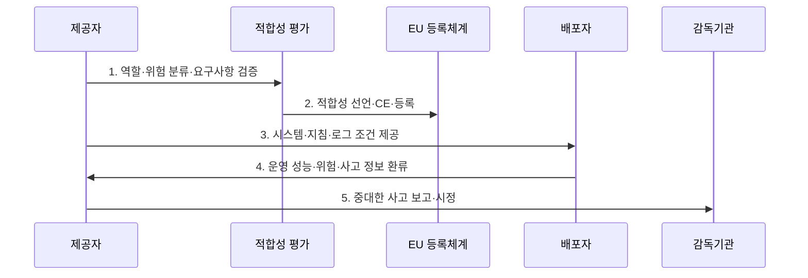

---
sidebar:
  order: 33
  label: "033. EU AI Act — 위험 기반 분류 체계 (EU AI Act)"
  badge:
    text: "기출 · 70%"
    variant: note
title: "EU AI Act — 위험 기반 분류 체계 (EU AI Act)"
date: "2026-08-02T12:00:00+09:00"
tags:
  - "notes-law-policy"
weight: 33
extra:
  question_no: "033"
  source_status: "기출"
  source_history: "138회"
  priority: 70
  priority_note: "138회 기출, 위험등급별 AI 의무의 현행축"
---

## Ⅰ. 개요

<details>
<summary>핵심 용어</summary>

- **EU AI 규정**: EU AI법은 AI의 목적·위험·공급망 역할에 따라 금지·고위험·투명성·범용 AI 의무를 차등 부과하는 EU AI 규정이다.

</details>

- 정의/개념: 목적·위험·공급망 역할별 금지·고위험·투명성·GPAI 의무를 부과한 **EU AI 규정**
- 배경/필요성: 자율 규제와 회원국별 규칙만으로는 **안전·기본권 침해**와 시장 불확실성 통제 곤란

### 쉽게 이해하기 (학습용)
- 같은 모델도 채용·의료처럼 쓰는 목적과 공급망 역할에 따라 금지·고위험·투명성 의무가 달라진다.

## Ⅱ. 특징

<details>
<summary>핵심 용어</summary>

- **공급망 책임성**: 공급망 책임성은 제공자·수입자·유통업자·배포자에게 출시 전 검증과 문서 전달·운영·사후 감시 책임을 나눠 부여한다.

</details>

- **위험 차등화**: 의도된 목적과 실제 사용 맥락을 기준으로 금지 관행·고위험 시스템·투명성 대상·범용 AI 모델 분류
- **공급망 책임성**: 제공자·배포자·수입자·유통업자의 출시 전 검증·문서 전달·운영·모니터링 책임 구분
- **시장 규율성**: 역외 적용·등록·시장감시·중대한 사고 보고·시정·제재와 단계별 적용일로 유럽 시장의 위험 통제

### 쉽게 이해하기 (학습용)
- 개발사가 문서화했어도 도입 조직은 입력 데이터·인간 감독·로그·기본권 영향을 별도로 책임진다.

## Ⅲ. 구조 및 구성요소

<details>
<summary>핵심 용어</summary>

- **배포자**: 배포자는 업무 목적으로 AI를 사용하는 주체로서 입력 데이터·인간 감독·로그·기본권 영향과 사고를 통제한다.

</details>

```mermaid
block-beta
    columns 3
    P["제공자"]:3
    I["수입자·유통업자"] D["배포자"] S["영향받는 사람"]
    A["EU AI 사무국·회원국 감독기관"]:3
    P -- I
    I -- D
    D -- S
    P -- A
    D -- A
    P --- I
    I --- D
    D --- S
    S --- A
```

| 구성요소 | 책임 |
|:---|:---|
| **제공자** | 위험 분류·기술문서·적합성·**출시 후 모니터링** |
| **수입자·유통업자** | 제3국 제공자의 의무·CE 표시·**문서 확인** |
| **배포자** | 입력 데이터·인간 감독·로그·**영향·사고 통제** |
| **영향받는 사람** | AI 결정에 대한 **고지·설명·불만·구제** 대상 |
| **EU AI 사무국·회원국 감독기관** | 범용 AI 감독과 **시장감시·시정·제재** 조정 |

### 쉽게 이해하기 (학습용)
- AI가 개발자에서 수입·유통·사용 조직으로 넘어갈 때 문서와 책임도 함께 이어져야 한다.

## Ⅳ. 흐름도

<details>
<summary>핵심 용어</summary>

- **1. 역할·위험 분류·요구사항 검증**: 제공자는 공급망 역할과 실제 사용 목적을 기준으로 금지·고위험·투명성·범용 AI 해당 여부와 통제를 확인한다.

</details>



1. **역할·위험 분류·요구사항 검증**: 공급망 역할과 금지·고위험·투명성·범용 AI 해당 여부를 판단하고 필요한 통제 확인
2. **적합성 선언·CE·등록**: 고위험 AI의 위험관리·데이터·문서·기록·인간 감독·정확성 요구를 검증하여 출시 요건 충족
3. **시스템·지침·로그 조건 제공**: 배포자가 안전하게 사용할 목적·한계·입력·감독·로그·유지관리 정보를 전달
4. **운영 성능·위험·사고 정보 환류**: 실제 성능·오용·편향·불만·사고를 수집하여 출시 후 모니터링과 변경 판단에 반영
5. **중대한 사고 보고·시정**: 법정 기한과 관할에 따라 감독기관에 보고하고 원인 조사·위험 완화·회수 등 조치

### 쉽게 이해하기 (학습용)
- 금지 여부를 먼저 보고 고위험이면 출시 전에 증명하며 운영 사고는 다시 제공자와 감독기관으로 돌아간다.

## Ⅴ. 종류 및 비교

<details>
<summary>핵심 용어</summary>

- **고위험 AI**: 고위험 AI는 안전부품이나 법정 중요 용도에 사용돼 안전·기본권에 중대한 영향을 줄 수 있는 AI 시스템이다.

</details>

| 판단 기준 | 금지 관행 | 고위험 AI | 투명성 대상 |
|:---|:---|:---|:---|
| **적용 기준** | 조작·사회점수 등 **제5조 해당** | 안전부품·**부속서 III 용도** | 챗봇·감정인식·**딥페이크** 등 |
| **핵심 특징** | 법정 **AI 관행 금지** | **사전 요구·사후감시** | AI 상호작용·**합성물 고지** |
| **한계** | **예외 요건 오해 위험** | 목적 변경 시 **재분류 필요** | 불명확한 고지로 **인지 실패** |

### 쉽게 이해하기 (학습용)
- 금지면 중단하고 고위험이면 증명하며 이용자가 AI임을 알아야 하는 경우에는 명확히 표시한다.

## Ⅵ. 실무 고려사항 및 대책

<details>
<summary>핵심 용어</summary>

- **적용일 오판**: 적용일 오판은 AI법 의무별 단계적 시행 시점을 구분하지 않아 필요한 통제와 투자를 제때 준비하지 못하는 문제다.

</details>

| 문제 | 대책 | 효과 |
|:---|:---|:---|
| 모델명만으로 **위험 등급 판단** | 목적·결정 영향·배포 맥락을 **시스템별 분류** | 고위험·금지·**투명성 의무 누락 방지** |
| 공급망 역할과 **문서 단절** | 역할별 책임표와 **사고 환류 계약** | 출시 전후 **책임 추적성 확보** |
| 단계별 **적용일 오판** | 규칙별 적용일을 **준수 달력으로 관리** | 준수 위험과 **투자 혼선 감소** |

### 쉽게 이해하기 (학습용)
- 채용 결과가 지원자의 권리에 영향을 주므로 출시 전 적합성을 평가하고 운영 중에는 담당자가 자동 결정을 감독·재검토한다.

## Ⅶ. 결론

<details>
<summary>핵심 용어</summary>

- **적합성·인간 감독·사후 모니터링**: 고위험 AI는 출시 전 적합성을 입증하고 운영 중 인간 감독과 출시 후 성능·위험·사고 모니터링을 수행해야 한다.

</details>

- 금지 관행은 **사용 중단**, 고위험 AI는 **적합성·인간 감독·사후 모니터링** 적용

### 쉽게 이해하기 (학습용)
- 모델 이름이 아니라 실제 용도와 공급망 역할을 기준으로 출시 전·후 의무와 적용일을 판단해야 한다.
