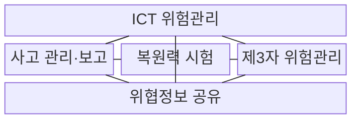
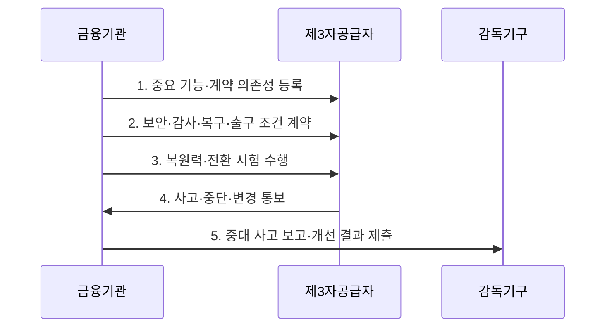

---
sidebar:
  order: 34
  label: "034. EU DORA 금융 디지털 운영 복원력"
  badge:
    text: "기출 · 50%"
    variant: note
title: "EU DORA 금융 디지털 운영 복원력 (EU DORA)"
date: "2026-08-02T12:00:00+09:00"
tags:
  - "notes-law-policy"
weight: 34
extra:
  question_no: "034"
  source_status: "기출"
  source_history: "138회"
  priority: 50
  priority_note: "138회 기출, 금융 ICT 복원력 규제"
---

## Ⅰ. 개요

핵심 용어

- **디지털 운영 복원력 규정**: DORA는 EU 금융기관의 ICT 위험·사고·복원력 시험·제3자 의존을 하나의 체계로 통합 규율하는 디지털 운영 복원력 규정이다.

- 정의/개념: EU 금융기관의 ICT 위험·사고·시험·제3자 의존을 통합 규율한 **디지털 운영 복원력 규정**
- 배경/필요성: 개별 규정·위탁 계약만으로는 ICT 장애와 **공급자 집중 위험의 시장 전파** 통제 곤란

### 쉽게 이해하기 (학습용)
- 금융기관이 IT를 외부에 맡겨도 장애 대응·시험·보고·계약의 최종 책임을 지게 한다.

## Ⅱ. 특징

핵심 용어

- **복원력 전 과정성**: 복원력 전 과정성은 ICT 위험의 식별·보호·탐지·대응·복구와 사고 보고·시험을 하나의 주기로 연결한다.

- **경영진 책임성**: 2025년 1월 17일부터 직접 적용되며 경영기구가 ICT 위험관리 전략·역할·자원·교육의 최종 책임 보유
- **복원력 전 과정성**: 비례성 원칙에 따라 식별·보호·탐지·대응·복구, 사고 분류·보고, 기본 시험과 위협 기반 모의침투 수행
- **제3자 통합성**: 정보 등록부·계약권리·집중 위험·출구 전략과 핵심 ICT 제공자에 대한 유럽연합 감독을 연결

### 쉽게 이해하기 (학습용)
- 보안 침해만 막는 것이 아니라 장애가 나도 금융 서비스를 유지·복구하고 원인을 고치는 능력을 요구한다.

## Ⅲ. 구조 및 구성요소

핵심 용어

- **제3자 위험관리**: 제3자 위험관리는 공급자 계약·중요 기능 의존·집중 위험·감사권과 출구 전략을 정보 등록부에 연결한다.

| 구성요소 | 책임 |
|:---|:---|
| **ICT 위험관리** | **식별·보호·탐지·대응·복구** 체계 |
| **사고 관리·보고** | 분류·**초기·중간·최종 보고** |
| **복원력 시험** | 기본 시험과 대상별 **TLPT 수행** |
| **제3자 위험관리** | 등록부·계약·**집중·출구 통제** |
| **위협정보 공유** | 신뢰 공동체의 **공격 정보 교환** |

### 쉽게 이해하기 (학습용)
- 내부 시스템·사고·시험과 외부 공급자 의존성을 한 복원력 체계로 묶어 경영진이 책임진다.

## Ⅳ. 흐름도

핵심 용어

- **3. 복원력·전환 시험 수행**: 금융기관은 취약점·복구·위협 기반 모의침투와 대체 사업자 전환 가능성을 시험해 실제 복원력을 검증한다.

1. **중요 기능·계약 의존성 등록**: 모든 ICT 제3자 계약과 지원 서비스·중요 기능·하위 공급자·위치를 정보 등록부에 기록
2. **보안·감사·복구·출구 조건 계약**: 접근·감사·사고 지원·서비스 수준·데이터 반환·종료와 감독기관 권리를 명시
3. **복원력·전환 시험 수행**: 취약점·시나리오·복구·대상별 위협 기반 모의침투와 대체 사업자 전환 가능성 검증
4. **사고·중단·변경 통보**: 공급자가 사건·원인·영향·조치와 중요 서비스 변경을 금융기관에 신속히 전달
5. **중대 사고 보고·개선 결과 제출**: 금융기관이 사고를 분류해 단계별 보고하고 근본원인·교훈을 통제와 계약에 반영

### 쉽게 이해하기 (학습용)
- 누가 어떤 중요 업무를 맡았는지 기록하고 계약·시험으로 대비한 뒤 사고를 보고해 통제를 고친다.

## Ⅴ. 종류 및 비교

핵심 용어

- **DORA**: DORA는 금융기관과 지정 ICT 제3자의 디지털 운영 복원력을 직접 규율하고 NIS2는 범산업 조직의 사이버보안을 지침으로 규율한다.

| 판단 기준 | DORA | NIS2 |
|:---|:---|:---|
| **적용 기준** | 금융기관·지정 **ICT 제3자** | 회원국 지정 **주요·중요 조직** |
| **핵심 특징** | 금융 ICT **직접 적용 규정** | 범산업 **국내 이행 지침** |
| **한계** | 대상·제3자 **의존성 판정 복잡** | 회원국별 **이행법 차이** |

### 쉽게 이해하기 (학습용)
- 금융 ICT 복원력은 DORA가 구체적으로 적용되고 다른 중요 산업은 NIS2의 국내 이행법을 확인한다.

## Ⅵ. 실무 고려사항 및 대책

핵심 용어

- **출구 조항 실행 불가능**: 출구 조항 실행 불가능은 계약에 종료 권리가 있어도 데이터 반출·대체 환경 복원을 시험하지 않아 실제 전환하지 못하는 문제다.

| 문제 | 대책 | 효과 |
|:---|:---|:---|
| 계약 목록과 **실제 중요 기능 불일치** | 정보 등록부에 중요 기능과 **공급자 의존성 연결** | 집중 위험과 **사고 영향 식별** |
| 계약상 **출구 조항 실행 불가능** | 데이터 반출·대체 환경 복원을 **정기 시험** | 공급자 장애 시 **금융 서비스 연속성 확보** |
| 공급자 **사고 보고 지연** | 초기 통보기한·조사 협력·**증거 제공 계약** | 단계별 보고와 **피해 완화 적시성 향상** |

### 쉽게 이해하기 (학습용)
- 중요 금융 기능이 한 클라우드에 몰렸는지 등록부로 찾고 데이터 이전과 대체 운영이 가능한 시간을 시험한다.

## Ⅶ. 결론

핵심 용어

- **복구·전환 시험과 출구 전략**: 공급자 집중 위험은 중요 기능의 복구·전환 시험과 실행 가능한 데이터 반환·계약 종료 전략으로 통제해야 한다.

- 중요 기능 의존은 **정보 등록부**, 집중 위험은 **복구·전환 시험과 출구 전략**으로 통제

### 쉽게 이해하기 (학습용)
- ICT를 위탁해도 금융기관은 중요 기능의 복원력과 감독기관 보고 책임을 넘길 수 없다.
