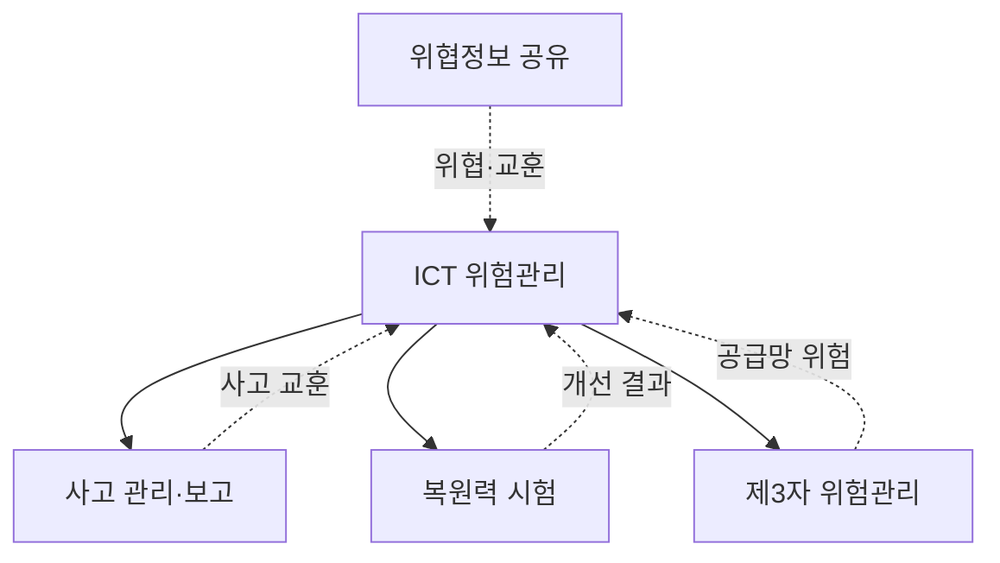
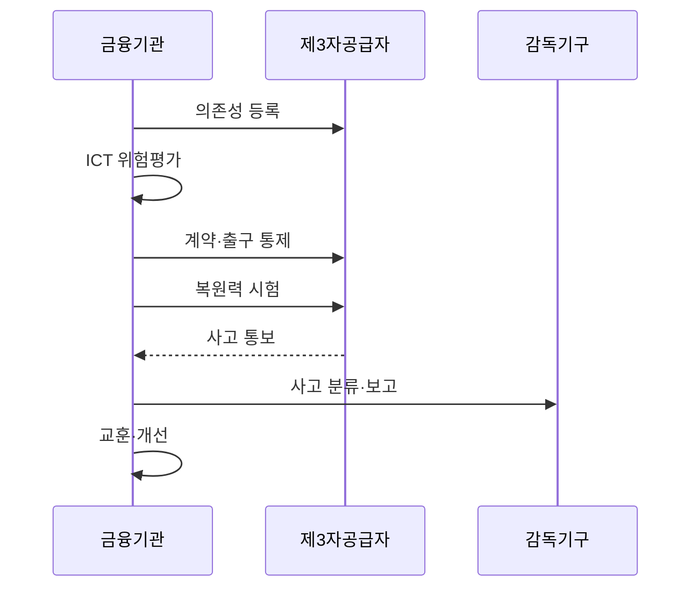

---
sidebar:
  order: 34
  label: "034. EU DORA 금융 디지털 운영 복원력"
  badge:
    text: "기출 · 50%"
    variant: note
title: "EU DORA 금융 디지털 운영 복원력 (EU DORA)"
date: "2026-07-27T23:59:59+09:00"
tags:
  - "notes-law-policy"
weight: 34
extra:
  question_no: "034"
  source_status: "기출"
  source_history: "138회"
  priority: 50
  priority_note: "138회 기출, 금융 ICT 복원력 규제"
---

## 미리 알고가기

- **디지털 운영 복원력법(Digital Operational Resilience Act, DORA)**: EU 금융기관의 ICT 위험관리와 운영 복원력 확보 의무를 규정한 법률
- **유럽연합(European Union, EU)**: DORA를 제정하고 회원국에 공통 적용하는 정치·경제 공동체
- **정보통신기술(Information and Communications Technology, ICT)**: 금융 서비스의 정보 처리와 통신을 지원하는 기술
- **위협 기반 모의침투(Threat-Led Penetration Testing, TLPT)**: 실제 공격자의 전술·기법·절차를 반영해 중요 시스템의 방어력을 검증하는 시험
- **핵심 ICT 제3자 서비스 제공자(Critical ICT Third-Party Provider, CTPP)**: 금융권의 중요 기능에 미치는 영향이 커 EU의 직접 감독을 받는 ICT 공급자
- **경영기구(Management Body)**: 금융기관의 ICT 위험관리 전략·예산·역할을 승인하고 최종 책임을 지는 의사결정 조직
- **중대 ICT 사고**: 서비스·고객·거래·데이터에 큰 영향을 미쳐 감독기관 보고 대상이 되는 ICT 사건
- **정보 등록부(Register of Information)**: 금융기관이 사용하는 ICT 제3자 계약·서비스·중요 기능 의존성을 기록한 목록
- **집중 위험**: 다수 중요 기능이 하나의 공급자·기술·지역에 의존해 장애 영향이 함께 커지는 위험
- **위협정보 공유**: 금융기관이 신뢰할 수 있는 공동체 안에서 공격 징후·전술·대응 정보를 교환하는 활동
- **네트워크·정보시스템 지침 2(Network and Information Systems Directive 2, NIS2)**: EU 핵심·중요 기관의 사이버보안 위험관리와 사고 보고 의무를 규정한 지침

## Ⅰ. 개요

- 정의/개념: 금융기관의 ICT 위험·사고·시험·제3자 위험을 **통합 규율하는 EU 규정**
- **배경/필요성**: 개별 금융 규정만으로 막기 어려운 **ICT 장애·공급자 집중 위험의 금융권 전파 방지**

### 쉽게 이해하기 (학습용)
- 금융기관이 IT를 외부에 맡겨도 장애 대응·시험·보고·계약의 최종 책임을 지게 한다.

## Ⅱ. 특징

- **2025년 1월 17일부터 직접 적용**하며 경영기구가 ICT 위험을 최종 책임진다.
- **ICT 위험관리·사고 보고·복원력 시험**을 비례성 원칙으로 운영한다.
- **제3자 정보 등록부·계약·집중·출구·핵심 공급자 감독**을 연결한다.

### 쉽게 이해하기 (학습용)
- 보안 침해만 막는 것이 아니라 장애가 나도 금융 서비스를 유지·복구하고 원인을 고치는 능력을 요구한다.

## Ⅲ. 아키텍처 및 구성요소

| 설계 요소 | 설명 |
|:---|:---|
| ICT 위험관리 | 식별·보호·탐지·대응·복구 체계 |
| 사고 관리·보고 | 분류·초기·중간·최종 보고 |
| 복원력 시험 | 기본 시험과 대상별 TLPT 수행 |
| 제3자 위험관리 | 등록부·계약·집중·출구 통제 |
| 위협정보 공유 | 신뢰 공동체의 공격 정보 교환 |

> 요약: 위험·사고·시험·제3자를 복원력 체계로 묶는다

### 쉽게 이해하기 (학습용)
- 내부 시스템·사고·시험과 외부 공급자 의존성을 한 복원력 체계로 묶어 경영진이 책임진다.

## Ⅳ. 원리 및 절차 흐름도

| 절차 | 설명 |
|:---|:---|
| 의존성 등록 | 제3자 계약·서비스·중요 기능 기록 |
| ICT 위험평가 | 자산·위협·집중·영향 분석 |
| 계약·출구 통제 | 감사·사고·복구·종료 권리 명시 |
| 복원력 시험 | 취약점·복구·TLPT로 통제 검증 |
| 사고 통보 | 공급자가 금융기관에 사건 전달 |
| 사고 분류·보고 | 중대 기준과 법정 단계별 보고 |
| 교훈·개선 | 근본원인과 통제·계약 갱신 |

> 요약: 의존성을 등록·통제하고 사고 교훈으로 개선한다

### 쉽게 이해하기 (학습용)
- 누가 어떤 중요 업무를 맡았는지 기록하고 계약·시험으로 대비한 뒤 사고를 보고해 통제를 고친다.

## Ⅴ. 종류 및 비교

| EU 사이버 복원력 규범 | DORA | NIS2 |
|:---|:---|:---|
| 적용 기준 | 금융기관·지정 ICT 제3자 | 회원국 지정 주요·중요 조직 |
| 핵심 특징 | 금융 ICT 직접 적용 규정 | 범산업 국내 이행 지침 |
| 한계 | 대상·제3자 의존성 판정 복잡 | 회원국별 이행법 차이 |

> 요약: DORA는 금융 규정, NIS2는 범산업 지침이다

### 쉽게 이해하기 (학습용)
- 금융 ICT 복원력은 DORA가 구체적으로 적용되고 다른 중요 산업은 NIS2의 국내 이행법을 확인한다.

## Ⅵ. 실무 사례

1. 클라우드 집중은 **정보 등록부·출구 시험**으로 통제

### 쉽게 이해하기 (학습용)
- 중요 금융 기능이 한 클라우드에 몰렸는지 등록부로 찾고 데이터 이전과 대체 운영이 가능한 시간을 시험한다.

## Ⅶ. 결론

- 금융 복원력 확보를 위해 ICT 위험·위탁을 검토하여 **DORA** 활용

### 쉽게 이해하기 (학습용)
- ICT를 위탁해도 금융기관은 중요 기능의 복원력과 감독기관 보고 책임을 넘길 수 없다.
