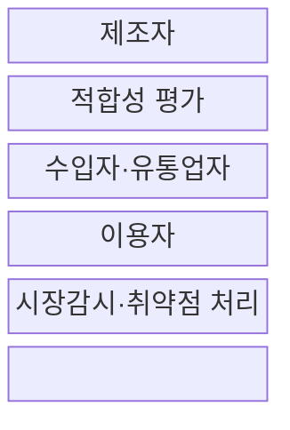
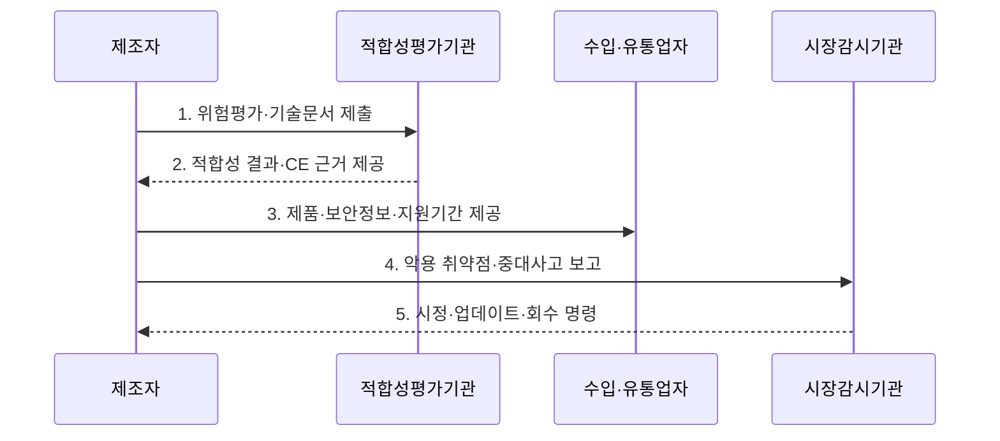

---
sidebar:
  order: 35
  label: "035. EU CRA 사이버 레질리언스 법"
  badge:
    text: "미출 · 50%"
    variant: note
title: "EU CRA 사이버 레질리언스 법 (EU Cyber Resilience Act)"
date: "2026-08-02T12:00:00+09:00"
tags:
  - "notes-law-policy"
weight: 35
extra:
  question_no: "035"
  source_status: "미출"
  source_history: ""
  priority: 50
  priority_note: "2026 보고 의무와 제품보안 수명주기의 현행축"
---

## Ⅰ. 개요

핵심 용어

- **EU 제품보안 규정**: CRA는 EU 시장의 디지털 요소 제품에 설계부터 지원기간까지 보안·취약점 처리 의무를 부과하는 EU 제품보안 규정이다.

- 정의/개념: **사이버 복원력법(CRA)**은 디지털 요소 제품의 생애주기 보안·취약점 처리를 의무화한 **EU 제품보안 규정**
- 배경/필요성: 출시 후 자율 조치로는 **공급망 취약점의 EU 시장 확산** 통제 곤란

### 쉽게 이해하기 (학습용)
- 연결 제품의 제조자가 안전한 기본설정부터 지원기간 동안의 취약점 처리까지 책임지도록 규정한다

## Ⅱ. 특징

핵심 용어

- **생애주기 보안성**: 생애주기 보안성은 제품 출시 전 보안설계부터 공표한 지원기간의 취약점 처리와 업데이트까지 제조자 책임으로 관리한다.

- 지원기간까지 취약점·업데이트를 관리하는 **생애주기 보안성**
- 제품 중요도별 자체·제3자 평가의 **위험 비례성**
- 제조자·수입자·유통업자·관리자의 **공급망 책임성**

### 쉽게 이해하기 (학습용)
- 무료 공개라는 이유만으로 모두 제외되지 않고 상업 활동과 제조자·관리자 역할에 따라 의무가 달라짐

## Ⅲ. 구조 및 구성요소

핵심 용어

- **적합성 평가**: 적합성 평가는 제품 등급에 따라 기술문서·시험·품질체계로 CRA 필수 사이버보안 요구사항 충족 여부를 확인한다.

| 구성요소 | 책임 |
|:---|:---|
| **제조자** | **위험평가·보안설계·기술문서** 책임 |
| **적합성 평가** | 제품 유형별 **자체·제3자 검증** |
| **수입자·유통업자** | **CE·문서·부적합·보관조건** 확인 |
| **이용자** | **업데이트·취약점 정보** 수신 |
| **시장감시·취약점 처리** | **보고·시정·판매제한·회수** 감독 |

### 쉽게 이해하기 (학습용)
- 제조자가 보안을 증명하고 수입·유통사가 확인하며 출시 뒤 취약점과 감독 결과가 다시 제조자에게 돌아감

## Ⅳ. 흐름도

핵심 용어

- **4. 악용 취약점·중대사고 보고**: 제조자는 적극 악용된 취약점과 중대한 보안 사고를 법정 단계와 기한에 따라 시장감시 체계에 통지한다.

1. **위험평가·기술문서 제출**: 사용·연결·지원기간의 위험과 보안 통제 문서화
2. **적합성 결과·CE 근거 제공**: 제품 등급별 시험과 품질체계로 필수 요구사항 검증
3. **제품·보안정보·지원기간 제공**: CE 표시와 이용 지침을 갖춰 EU 시장에 공급
4. **악용 취약점·중대사고 보고**: 2026년 9월 11일부터 법정 단계와 기한에 따라 통지
5. **시정·업데이트·회수 명령**: 부적합 원인 제거와 패치 또는 시장조치 이행

### 쉽게 이해하기 (학습용)
- 제조자는 출시 전에 보안 적합성을 입증하고 출시 후에는 악용 취약점과 사고를 보고하며 지원기간 동안 보안 업데이트를 제공한다

## Ⅴ. 종류 및 비교

핵심 용어

- **중요 제품 Class II**: 중요 제품 Class II는 위험도가 높은 부속서 제품으로서 출시 전에 제3자 적합성 평가가 요구되는 범주다.

| 판단 기준 | 기본 제품 | 중요 제품 Class I | 중요 제품 Class II |
|:---|:---|:---|:---|
| 적용 기준 | **부속서 III 밖 제품** | **부속서 III Class I** | **부속서 III Class II** |
| 핵심 특징 | 일반 **디지털 요소 제품** | **핵심 보안 기능·위험 제품** | 더 높은 **위험의 중요 제품** |
| 한계 | 자체평가의 **위험 과소 분류** | 표준 미적용 시 **제3자 평가** | 제3자 평가 누락 시 **출시 곤란** |

### 쉽게 이해하기 (학습용)
- 일반 제품은 자체평가가 가능하지만 중요도가 높아질수록 외부 적합성 평가 요구가 강해짐

## Ⅵ. 실무 고려사항 및 대책

핵심 용어

- **법정 기한 초과**: 법정 기한 초과는 취약점·사고의 조기경보와 후속 통지 절차가 없어 시장감시기관 보고가 늦어지는 문제다.

| 문제 | 대책 | 효과 |
|:---|:---|:---|
| 제품 분류 오류로 **평가 경로 누락** | **부속서 등급·적합성 경로 문서화** | 부적합 제품의 **출시 방지** |
| 부품 취약점 미통보로 **지원 지연** | **SBOM·취약점 통보·패치 기한 계약화** | 제품 수명주기 **위험 추적** |
| 보고 절차 미비로 **법정 기한 초과** | **24시간 조기경보·후속 통지 절차 수립** | 악용 취약점·사고의 **적시 보고** |
| 전파 지연 기준 부재로 **기관 공유 혼선** | **Delegated Regulation 2026/881 반영** | 통지 플랫폼의 **일관된 운영** |

### 쉽게 이해하기 (학습용)
- 부품 공급계약에서 SBOM과 취약점 통보를 받아 공표한 지원기간 동안 장비 보안 패치를 제공한다.

## Ⅶ. 결론

핵심 용어

- **취약점 보고·업데이트**: 제조자는 공표한 지원기간 동안 악용 취약점과 사고를 보고하고 이용 가능한 보안 업데이트를 제공해야 한다.

- EU 출시 제품은 **위험등급별 적합성 평가**, 지원기간은 **취약점 보고·업데이트** 적용

### 쉽게 이해하기 (학습용)
- 출시 전 CE 적합성뿐 아니라 출시 후 취약점 신고·보안 업데이트·시장 시정을 지원기간 동안 계속해야 한다
