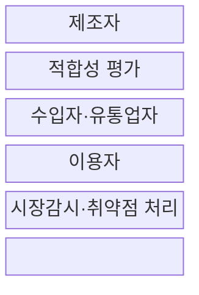
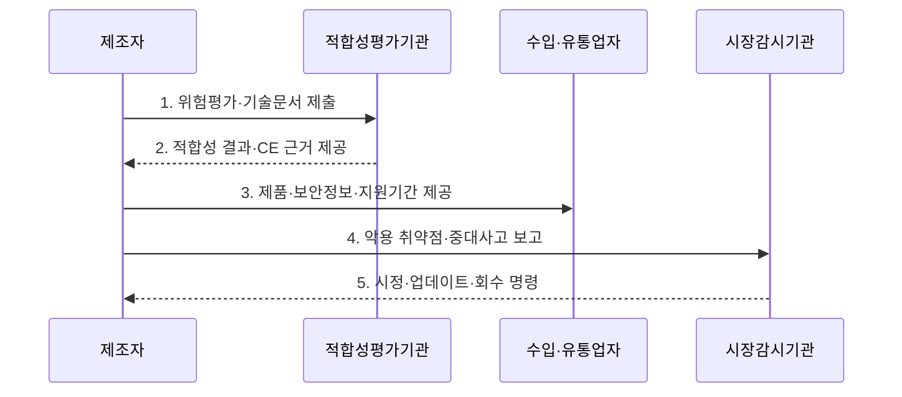

---
sidebar:
  order: 35
  label: "035. EU CRA 사이버 레질리언스 법"
  badge:
    text: "미출 · 50%"
    variant: note
title: "EU CRA 사이버 레질리언스 법 (EU Cyber Resilience Act)"
date: "2026-07-31T11:45:21+09:00"
tags:
  - "notes-law-policy"
weight: 35
extra:
  question_no: "035"
  source_status: "미출"
  source_history: ""
  priority: 50
  priority_note: "2026 보고 의무와 제품보안 수명주기의 현행축"
---

## 미리 알고가기

- **사이버 복원력법(Cyber Resilience Act, CRA)**: 디지털 요소 제품의 생애주기 사이버보안을 규율하는 EU 법률
- **유럽연합(European Union, EU)**: CRA 규제가 직접 적용되는 국가 공동체
- **소프트웨어 명세서(Software Bill of Materials, SBOM)**: 소프트웨어를 구성하는 컴포넌트 목록과 종속성 명세서
- **유럽 적합성 인증(Conformité Européenne, CE)**: EU 시장 유통을 위해 필수적인 안전성 마크
- **기본 보안 설정(Secure by Default)**: 제품 출고 시 별도 설정 없이도 기본적인 보안 기능이 활성화된 상태
- **설계 단계 보안(Secure by Design)**: 제품 기획 및 설계 단계부터 보안 위협을 예방하도록 설계하는 방식
- **디지털 요소 제품(Product with Digital Elements)**: 소프트웨어·하드웨어와 원격 데이터 처리 기능을 포함해 다른 기기·네트워크와 연결되는 제품
- **제조자·수입자·유통업자**: 제품을 설계·출시하거나 EU로 들여오고 공급망에서 판매하는 경제 운영자
- **적합성 평가**: 제품이 CRA 필수 사이버보안 요구사항을 충족하는지 기술문서·시험·품질체계로 확인하는 절차
- **적극 악용 취약점**: 악의적 행위자가 실제 시스템에서 악용했다는 신뢰할 수 있는 증거가 있는 취약점
- **중대 보안 사고**: 제품 보안에 영향을 주어 중요한 서비스나 이용자 보호에 심각한 결과를 낳는 사건
- **시장감시기관**: 출시 제품의 적합성을 조사하고 시정·판매금지·회수를 명령하는 회원국 기관
- **지원 기간**: 제조자가 취약점을 처리하고 보안 업데이트를 제공하기로 정한 제품 수명 기간
- **오픈소스 소프트웨어 관리자**: 상업 활동용 오픈소스 개발을 체계적·지속적으로 지원하지만 제품 제조자는 아닌 법인
- **Regulation (EU) 2024/2847**: CRA의 정식 법령 번호이며 2024년 11월 발효된 규정
- **Delegated Regulation (EU) 2026/881**: 취약점 통지 전파 지연 사유·조건을 구체화한 위임규정

## Ⅰ. 개요

- 정의/개념: 디지털 요소 제품의 **생애주기 보안·취약점 처리**를 의무화한 **EU 규정**
- 배경/필요성: 출시 후 자율 조치로는 **공급망 취약점의 EU 시장 확산** 통제 곤란

### 쉽게 이해하기 (학습용)
- 연결 제품의 제조자가 안전한 기본설정부터 지원기간 동안의 취약점 처리까지 책임지도록 규정한다

## Ⅱ. 특징

- 지원기간까지 취약점·업데이트를 관리하는 **생애주기 보안성**
- 제품 중요도별 자체·제3자 평가의 **위험 비례성**
- 제조자·수입자·유통업자·관리자의 **공급망 책임성**

### 쉽게 이해하기 (학습용)
- 무료 공개라는 이유만으로 모두 제외되지 않고 상업 활동과 제조자·관리자 역할에 따라 의무가 달라짐

## Ⅲ. 구조 및 구성요소

| 구성요소 | 책임 |
|:---|:---|
| **제조자** | **위험평가·보안설계·기술문서** 책임 |
| **적합성 평가** | 제품 유형별 **자체·제3자 검증** |
| **수입자·유통업자** | **CE·문서·부적합·보관조건** 확인 |
| **이용자** | **업데이트·취약점 정보** 수신 |
| **시장감시·취약점 처리** | **보고·시정·판매제한·회수** 감독 |

### 쉽게 이해하기 (학습용)
- 제조자가 보안을 증명하고 수입·유통사가 확인하며 출시 뒤 취약점과 감독 결과가 다시 제조자에게 돌아감

## Ⅳ. 흐름도

1. **위험평가·기술문서 제출**: 사용·연결·지원기간의 위험과 보안 통제 문서화
2. **적합성 결과·CE 근거 제공**: 제품 등급별 시험과 품질체계로 필수 요구사항 검증
3. **제품·보안정보·지원기간 제공**: CE 표시와 이용 지침을 갖춰 EU 시장에 공급
4. **악용 취약점·중대사고 보고**: 2026년 9월 11일부터 법정 단계와 기한에 따라 통지
5. **시정·업데이트·회수 명령**: 부적합 원인 제거와 패치 또는 시장조치 이행

### 쉽게 이해하기 (학습용)
- 제조자는 출시 전에 보안 적합성을 입증하고 출시 후에는 악용 취약점과 사고를 보고하며 지원기간 동안 보안 업데이트를 제공한다

## Ⅴ. 종류 및 비교

| 판단 기준 | 기본 제품 | 중요 제품 Class I | 중요 제품 Class II |
|:---|:---|:---|:---|
| 적용 기준 | **부속서 III 밖 제품** | **부속서 III Class I** | **부속서 III Class II** |
| 핵심 특징 | 일반 **디지털 요소 제품** | **핵심 보안 기능·위험 제품** | 더 높은 **위험의 중요 제품** |
| 한계 | 자체평가의 **위험 과소 분류** | 표준 미적용 시 **제3자 평가** | 제3자 평가 누락 시 **출시 곤란** |

### 쉽게 이해하기 (학습용)
- 일반 제품은 자체평가가 가능하지만 중요도가 높아질수록 외부 적합성 평가 요구가 강해짐

## Ⅵ. 실무 고려사항 및 대책

| 고려사항 | 대책 | 효과 |
|:---|:---|:---|
| 제품 분류 오류로 **평가 경로 누락** | **부속서 등급·적합성 경로 문서화** | 부적합 제품의 **출시 방지** |
| 부품 취약점 미통보로 **지원 지연** | **SBOM·취약점 통보·패치 기한 계약화** | 제품 수명주기 **위험 추적** |
| 보고 절차 미비로 **법정 기한 초과** | **24시간 조기경보·후속 통지 절차 수립** | 악용 취약점·사고의 **적시 보고** |
| 전파 지연 기준 부재로 **기관 공유 혼선** | **Delegated Regulation 2026/881 반영** | 통지 플랫폼의 **일관된 운영** |

### 쉽게 이해하기 (학습용)
- 부품 공급계약에서 SBOM과 취약점 통보를 받아 공표한 지원기간 동안 장비 보안 패치를 제공한다.

## Ⅶ. 결론

- EU 출시 제품은 **위험등급별 적합성 평가**, 지원기간은 **취약점 보고·업데이트** 적용

### 쉽게 이해하기 (학습용)
- 출시 전 CE 적합성뿐 아니라 출시 후 취약점 신고·보안 업데이트·시장 시정을 지원기간 동안 계속해야 한다
