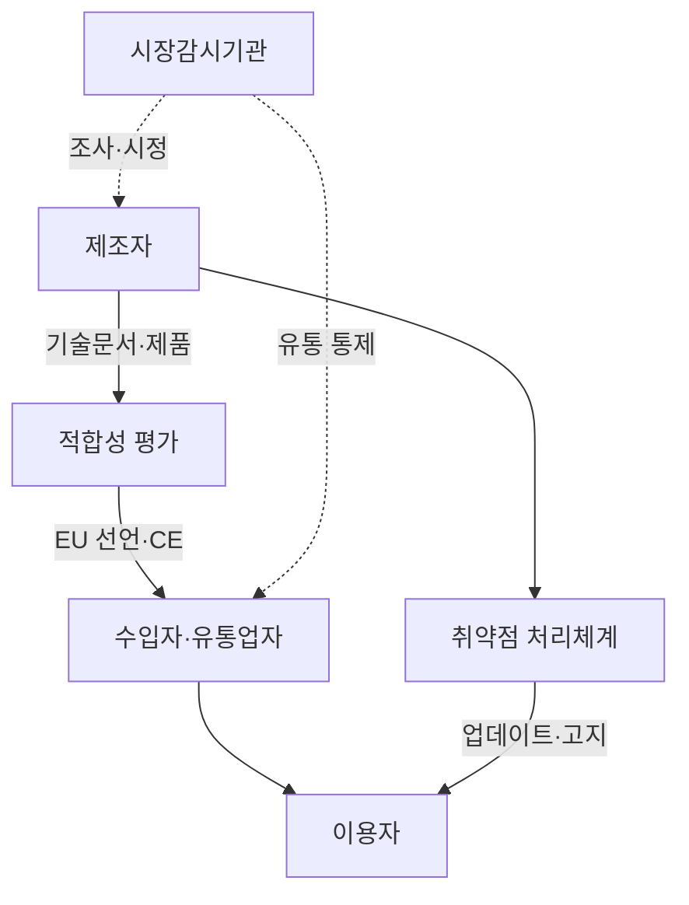
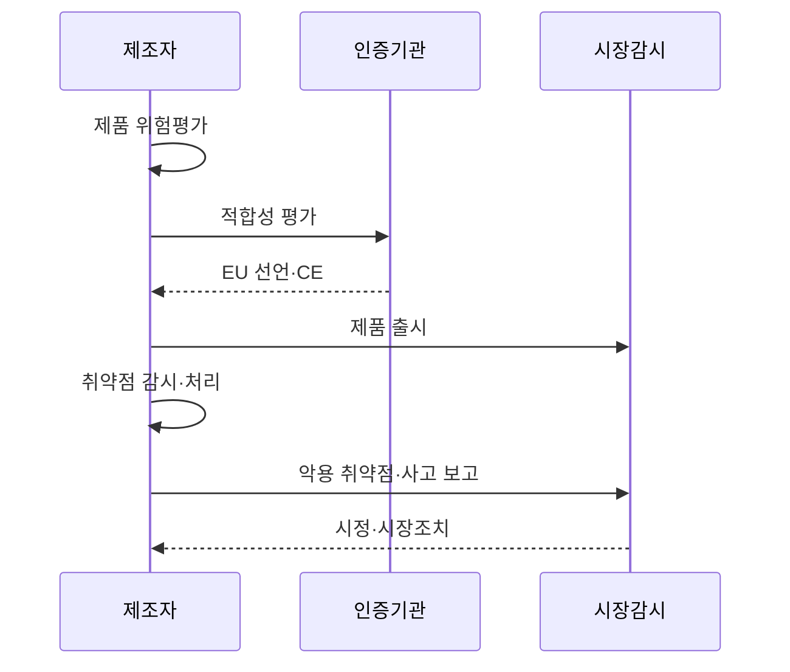

---
sidebar:
  order: 35
  label: "035. EU CRA 사이버 레질리언스 법"
  badge:
    text: "미출제 · 50%"
    variant: note
title: "EU CRA 사이버 레질리언스 법 (EU Cyber Resilience Act)"
date: "2026-07-25T01:20:00+09:00"
tags:
  - "notes-law-policy"
weight: 35
extra:
  question_no: "035"
  source_status: "미출제"
  source_history: ""
  priority: 50
  priority_note: "2026 보고 의무와 제품보안 수명주기의 현행축"
---

## 미리 알고가기

- **사이버 복원력법(Cyber Resilience Act, CRA)**: 디지털 제품의 생애주기 보안을 규율하는 법률
- **유럽연합(European Union, EU)**: CRA 규제가 직접 적용되는 국가 공동체
- **소프트웨어 명세서(Software Bill of Materials, SBOM)**: 소프트웨어를 구성하는 컴포넌트 목록과 종속성 명세서
- **유럽 적합성 인증(Conformité Européenne, CE)**: EU 시장 유통을 위해 필수적인 안전성 마크
- **기본 보안 설정(Secure by Default)**: 제품 출고 시 별도 설정 없이도 기본적인 보안 기능이 활성화된 상태
- **설계 단계 보안(Secure by Design)**: 제품 기획 및 설계 단계부터 보안 위협을 예방하도록 설계하는 방식
- **디지털 요소 제품(Product with Digital Elements)**: 소프트웨어·하드웨어와 원격 데이터 처리 기능을 포함해 다른 기기·네트워크와 연결되는 제품
- **제조자·수입자·유통업자**: 제품을 설계·출시하거나 EU로 들여오고 공급망에서 판매하는 경제 운영자
- **적합성 평가**: 제품이 CRA 필수 사이버보안 요구사항을 충족하는지 기술문서·시험·품질체계로 확인하는 절차
- **적극 악용 취약점**: 악의적 행위자가 실제 시스템에서 악용했다는 신뢰할 수 있는 증거가 있는 취약점
- **중대 보안 사고**: 제품 보안에 영향을 주어 중요한 서비스나 이용자 보호에 심각한 결과를 낳는 사건
- **시장감시기관**: 출시 제품의 적합성을 조사하고 시정·판매금지·회수를 명령하는 회원국 기관
- **지원 기간**: 제조자가 취약점을 처리하고 보안 업데이트를 제공하기로 정한 제품 수명 기간
- **오픈소스 소프트웨어 관리자**: 상업 활동용 오픈소스 개발을 체계적·지속적으로 지원하지만 제품 제조자는 아닌 법인

## Ⅰ. 개요

- 정의/개념: 디지털 제품의 생애주기 보안을 의무화한 EU 규정
- **배경/필요성**: 취약한 연결 제품과 공급망 공격의 시장 확산 방지

### 쉽게 이해하기 (학습용)
- 연결 제품을 출시한 제조자가 안전한 기본설정부터 지원기간의 취약점 처리까지 책임지게 함

## Ⅱ. 특징

- 제조자는 설계·출시·지원기간 보안에 책임진다.
- 중요도·위험이 적합성 평가 방식을 바꾼다.
- 수입자·유통업자도 CE·시정 여부를 확인한다.
- 비상업적 오픈소스 기여는 원칙적으로 제외된다.

### 쉽게 이해하기 (학습용)
- 무료 공개라는 이유만으로 모두 제외되지 않고 상업 활동과 제조자·관리자 역할에 따라 의무가 달라짐

## Ⅲ. 아키텍처 및 구성요소

| 설계 요소 | 설명 |
|:---|:---|
| 제조자 | 위험평가·보안설계·기술문서 책임 |
| 적합성 평가 | 제품 유형별 자체·제3자 검증 |
| 수입자·유통업자 | CE·문서·부적합·보관조건 확인 |
| 이용자 | 업데이트·취약점 정보의 수신자 |
| 취약점 처리체계 | SBOM·신고·패치·공개 관리 |
| 시장감시기관 | 조사·시정·판매제한·회수 |

### 쉽게 이해하기 (학습용)
- 제조자가 보안을 증명하고 수입·유통사가 확인하며 출시 뒤 취약점과 감독 결과가 다시 제조자에게 돌아감

## Ⅳ. 원리 및 절차 흐름도

| 절차 | 설명 |
|:---|:---|
| 제품 위험평가 | 사용·연결·지원기간의 위협 분석 |
| 적합성 평가 | 유형별 기술문서·시험·품질 검증 |
| EU 선언·CE | 적합성 선언 작성과 표시 부착 |
| 제품 출시 | 보안 정보·지원기간과 함께 공급 |
| 취약점 감시·처리 | SBOM·신고창구·패치·고지 운영 |
| 악용 취약점·사고 보고 | 법정 단계와 기한에 따라 통지 |
| 시정·시장조치 | 원인 제거·업데이트·회수 이행 |

### 쉽게 이해하기 (학습용)
- 출시 전 보안을 증명하고 출시 뒤에는 실제 악용·사고를 보고하며 지원기간 동안 패치함

## Ⅴ. 종류 및 비교

| 판단 기준 | 기본 제품 | 중요 제품 Class I | 중요 제품 Class II |
|:---|:---|:---|:---|
| 핵심 특징 | 일반 디지털 요소 제품 | 핵심 보안 기능·위험 제품 | 더 높은 위험의 중요 제품 |
| 적용 기준 | 부속서 III 밖 적용 제품 | 부속서 III Class I 해당 | 부속서 III Class II 해당 |
| 주요 위험 | 자체평가의 과소 분류 | 표준 미적용 시 제3자 평가 필요 | 제3자 평가 누락 시 출시 불가 |

### 쉽게 이해하기 (학습용)
- 일반 제품은 자체평가가 가능하지만 중요도가 높아질수록 외부 적합성 평가 요구가 강해짐

## Ⅵ. 실무 사례

1. IoT 장비는 **지원기간·SBOM·패치 계약** 연결

### 쉽게 이해하기 (학습용)
- 부품 공급계약에서 SBOM과 취약점 통보를 받아 공표한 지원기간 동안 장비 보안 패치를 제공한다.

## Ⅶ. 결론

- 제품 분류·지원기간·취약점 처리로 CRA 이행

### 쉽게 이해하기 (학습용)
- CE 표시만 붙이지 말고 출시 후 취약점 신고·패치·시장 시정을 지원기간까지 이어야 함
