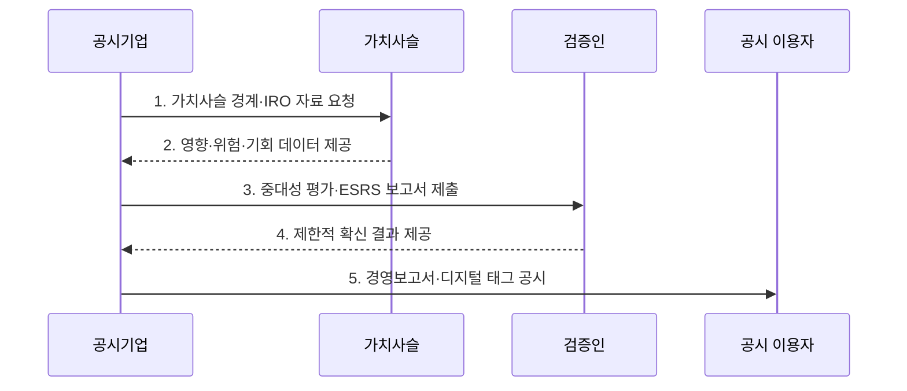

---
sidebar:
  order: 36
  label: "036. EU CSRD 지속가능성 공시"
  badge:
    text: "기출 · 50%"
    variant: note
title: "EU CSRD 지속가능성 공시 (EU CSRD)"
date: "2026-08-02T12:00:00+09:00"
tags:
  - "notes-law-policy"
weight: 36
extra:
  question_no: "036"
  source_status: "기출"
  source_history: "138회"
  priority: 50
  priority_note: "138회 기출, 지속가능성 정보 공시 규제"
---

## Ⅰ. 개요

핵심 용어

- **이중 중대성**: 이중 중대성은 기업이 사람·환경에 미치는 영향과 지속가능성 요인이 기업 재무에 주는 위험·기회를 함께 판정한다.

- 정의/개념: 적용 기업이 **이중 중대성**을 평가해 **ESRS로 공시**하는 EU 지침
- 배경/필요성: 기존 비재무 보고로는 지속가능성 정보의 **비교·검증 일관성 확보 곤란**

### 쉽게 이해하기 (학습용)
- 기업이 환경·사회에 미치는 영향과 지속가능성 요인이 기업 재무에 주는 위험을 같은 보고체계에서 공개한다

## Ⅱ. 특징

핵심 용어

- **검증 가능성**: 검증 가능성은 공시 데이터의 출처·산식·승인·변경을 내부통제로 보존하고 외부의 제한적 확신을 받게 한다.

- 사람·환경 영향과 재무 위험·기회를 함께 판정하는 **이중 중대성**
- 가치사슬 정책·행동·목표·지표를 통일하는 **ESRS 공시**
- 내부통제와 제한적 확신을 거치는 **검증 가능성**

### 쉽게 이해하기 (학습용)
- 돈에 미치는 위험만 고르면 안 되고 기업 활동이 사람·환경에 주는 중요한 영향도 공시 대상이 됨

## Ⅲ. 구조 및 구성요소

핵심 용어

- **가치사슬·IRO**: 가치사슬·IRO는 기업의 상·하류 활동에서 사람·환경에 미치는 영향과 재무 위험·기회를 식별하는 기초 자료다.

| 구성요소 | 책임 |
|:---|:---|
| **경영기구** | 공시 정책·책임·내부통제 승인 |
| **가치사슬·IRO** | 상·하류의 영향·위험·기회와 기초 데이터 |
| **이중 중대성 평가** | 영향·재무 관점의 중요 주제 판정 |
| **ESRS 보고·내부통제** | 표준 공시와 출처·산식·승인·변경 증거 관리 |
| **외부 확신·공시 이용자** | 독립 검증을 거친 정보 제공 |

### 쉽게 이해하기 (학습용)
- 협력사 원천 데이터가 내부 통제와 경영진 승인을 지나 외부 검증 가능한 보고 항목으로 이어짐

## Ⅳ. 흐름도

핵심 용어

- **4. 제한적 확신 결과 제공**: 검증인은 중대성 판단과 공시 데이터의 통제·산식·표본을 독립 검증해 제한적 확신 결론을 제공한다.

1. **가치사슬 경계·IRO 자료 요청**: 연결기업과 상·하류 활동의 조사 범위 확정
2. **영향·위험·기회 데이터 제공**: 정책·행동·목표·지표의 원천 자료 수집
3. **중대성 평가·ESRS 보고서 제출**: 영향·재무 중요성을 판정하고 표준 항목 작성
4. **제한적 확신 결과 제공**: 통제·산식·표본을 독립적으로 검증
5. **경영보고서·디지털 태그 공시**: 검증 결과를 반영해 기계 판독 형식으로 공개

### 쉽게 이해하기 (학습용)
- 적용 대상과 가치사슬 범위를 확인하고 중요한 영향·위험·기회를 증거와 검증을 거쳐 보고한다

## Ⅴ. 종류 및 비교

핵심 용어

- **지속가능성 보고**: 지속가능성 보고는 재무 성과뿐 아니라 기업 활동의 사람·환경 영향과 관련 재무 위험을 ESRS에 따라 공시한다.

| 기업 보고 체계 | 지속가능성 보고 | 재무보고 |
|:---|:---|:---|
| **적용 기준** | CSRD 대상의 **ESRS 공시** | 회계기준상 **재무제표 공시** |
| **핵심 특징** | 영향·재무의 **이중 중대성** | 재무상태·성과·**현금흐름** |
| **한계** | 가치사슬 추정·**그린워싱** | 인식·측정·**추정 왜곡** |

### 쉽게 이해하기 (학습용)
- 재무보고는 기업의 돈을 중심으로 보고 CSRD는 돈과 사람·환경에 대한 영향을 함께 봄

## Ⅵ. 실무 고려사항 및 대책

핵심 용어

- **신뢰성 부족**: 가치사슬 자료의 신뢰성 부족은 IRO별 원천·산식·승인·변경 증거가 없어 공시 수치와 중대성 판단을 검증하지 못하는 문제다.

| 문제 | 대책 | 효과 |
|:---|:---|:---|
| Omnibus I의 **적용 범위 축소** | 직원·순매출의 **법정 기준 초과 여부 확인** | **과잉 공시·누락 방지** |
| 가치사슬 자료의 **신뢰성 부족** | IRO별 산식·승인·변경 증거를 **내부통제로 관리** | **외부 검증 가능성 확보** |
| ESRS 간소화와 **디지털 형식 변경** | 최신 위임규정·태깅 체계를 **공시 일정에 반영** | 규정 개정에 따른 **재작성 최소화** |

### 쉽게 이해하기 (학습용)
- 기존 2025·2026 회계연도부터 보고할 예정이던 기업은 2년 연기 여부와 회원국 이행법을 확인한다

## Ⅶ. 결론

핵심 용어

- **CSRD 범위**: CSRD 범위는 최신 직원·순매출 기준과 회원국 이행 상태를 확인해 판정하고 중요한 IRO만 ESRS 공시·검증에 포함한다.

- 직원·순매출 기준으로 **CSRD 범위**를 판정하고 중요 IRO만 **ESRS 공시·검증** 대상으로 확정

### 쉽게 이해하기 (학습용)
- 적용 범위와 ESRS 개정 상태를 확인하고 중요한 IRO의 데이터 원천부터 외부 검증까지 추적해야 한다
