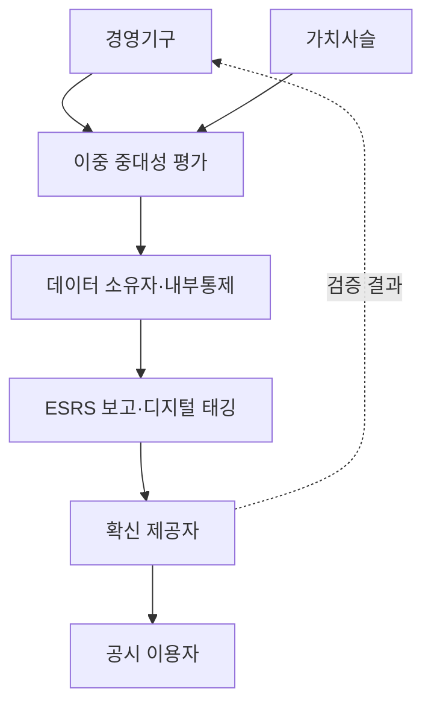
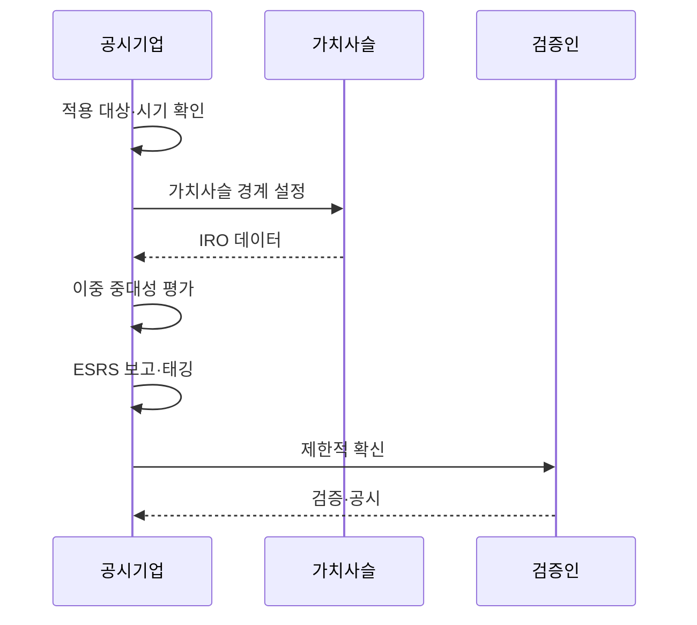

---
sidebar:
  order: 36
  label: "036. EU CSRD 지속가능성 공시"
  badge:
    text: "기출 · 50%"
    variant: note
title: "EU CSRD 지속가능성 공시 (EU CSRD)"
date: "2026-07-27T23:59:59+09:00"
tags:
  - "notes-law-policy"
weight: 36
extra:
  question_no: "036"
  source_status: "기출"
  source_history: "138회"
  priority: 50
  priority_note: "138회 기출, 지속가능성 정보 공시 규제"
---

## 미리 알고가기

- **기업 지속가능성 보고 지침(Corporate Sustainability Reporting Directive, CSRD)**: '시에스알디'로 읽고 EU 지속가능성 공시 지침을 영문 머리글자로 표시
- **유럽연합(European Union, EU)**: '이유'로 읽고 CSRD를 제정한 경제 연합을 표시
- **유럽 지속가능성 보고 표준(European Sustainability Reporting Standards, ESRS)**: '이에스알에스'로 읽고 CSRD 세부 공시 기준을 표시
- **환경·사회·지배구조(Environmental, Social, and Governance, ESG)**: '이에스지'로 읽고 지속가능성 주제의 세 영역을 표시
- **이중 중대성(Double Materiality)**: 기업이 사회에 미치는 영향과 환경이 기업 재무에 미치는 위험을 동시에 평가하는 개념
- **영향·위험·기회(Impacts, Risks and Opportunities, IRO)**: '아이알오'로 읽고 사람·환경 영향과 기업 위험·기회를 표시
- **가치사슬(Value Chain)**: 원재료·공급자부터 판매·사용·폐기까지 기업 활동과 연결된 상·하류 관계
- **제한적 확신(Limited Assurance)**: 중요 왜곡이 발견되지 않았다는 소극적 결론을 제시하는 외부 검증 수준
- **디지털 태깅**: 공시 항목에 기계 판독 표식을 붙여 데이터 검색·비교·자동 처리를 가능하게 하는 방식
- **Stop-the-clock 지침**: 기존 CSRD 2·3차 적용 기업의 보고 시작을 2년 연기한 Directive (EU) 2025/794
- **Omnibus I**: CSRD·지속가능성 실사 의무의 범위와 부담을 줄이기 위한 EU 간소화 입법 묶음
- **가치사슬 상한(Value Chain Cap)**: 공시 대상 기업이 비대상 중소기업에 요구할 수 있는 가치사슬 정보 범위를 제한하는 장치

## Ⅰ. 개요

- 정의/개념: 적용 기업이 ESRS에 따라 **지속가능성 정보를 경영보고서에 공시하도록 한 EU 지침**
- **배경/필요성**: 기존 비재무 보고의 **범위·비교 가능성·가치사슬 정보·검증 한계 해소**

### 쉽게 이해하기 (학습용)
- 기업이 환경·사회에 주는 영향과 환경·사회 변화가 기업 재무에 주는 위험을 같은 보고체계로 공개함

## Ⅱ. 특징

- **이중 중대성**으로 사람·환경 영향과 재무 위험·기회를 함께 판정한다.
- **ESRS·가치사슬·디지털 태깅**으로 정책·행동·목표·지표를 표준화한다.
- **경영보고서 통합·제한적 확신·내부통제**로 공시 증거를 검증한다.

### 쉽게 이해하기 (학습용)
- 돈에 미치는 위험만 고르면 안 되고 기업 활동이 사람·환경에 주는 중요한 영향도 공시 대상이 됨

## Ⅲ. 아키텍처 및 구성요소

| 설계 요소 | 설명 |
|:---|:---|
| 경영기구 | 공시 정책·책임·내부통제 승인 |
| 가치사슬 | 상·하류 IRO와 기초 데이터 |
| 이중 중대성 평가 | 영향·재무 관점의 중요 주제 판정 |
| 데이터 소유자·내부통제 | 출처·산식·승인·변경 증거 |
| ESRS 보고·디지털 태깅 | 표준 공시와 기계 판독 표시 |
| 확신 제공자 | 독립적 제한적 확신 검증 |
| 공시 이용자 | 투자자·시민·고객의 정보 활용 |

### 쉽게 이해하기 (학습용)
- 협력사 원천 데이터가 내부 통제와 경영진 승인을 지나 외부 검증 가능한 보고 항목으로 이어짐

## Ⅳ. 원리 및 절차 흐름도

| 절차 | 설명 |
|:---|:---|
| 적용 대상·시기 확인 | 현행 범위·국내 이행법·연기 판정 |
| 가치사슬 경계 설정 | 연결기업·상하류 활동 범위 확정 |
| IRO 데이터 | 정책·행동·목표·지표 원천 수집 |
| 이중 중대성 평가 | 영향·재무 중요성과 근거 승인 |
| ESRS 보고·태깅 | 중요 주제 공시와 디지털 표시 |
| 제한적 확신 | 통제·산식·표본의 외부 검증 |
| 검증·공시 | 수정 후 경영보고서에 통합 공개 |

### 쉽게 이해하기 (학습용)
- 적용 여부를 먼저 확인하고 가치사슬의 중요한 영향·위험만 증거와 검증을 거쳐 보고함

## Ⅴ. 종류 및 비교

| 기업 보고 체계 | 지속가능성 보고 | 재무보고 |
|:---|:---|:---|
| 적용 기준 | CSRD 대상의 ESRS 공시 | 회계기준상 재무제표 공시 |
| 핵심 특징 | 영향·재무의 이중 중대성 | 재무상태·성과·현금흐름 |
| 한계 | 가치사슬 추정·그린워싱 | 인식·측정·추정 왜곡 |

### 쉽게 이해하기 (학습용)
- 재무보고는 기업의 돈을 중심으로 보고 CSRD는 돈과 사람·환경에 대한 영향을 함께 봄

## Ⅵ. 실무 사례

1. 2·3차 기업은 **Stop-the-clock의 2년 연기 적용**
2. 2026 개정 ESRS는 **EU 관보 발효 여부 확인 후 적용**

### 쉽게 이해하기 (학습용)
- 기존 2025·2026 회계연도 시작 예정 기업은 2년 연기와 회원국 이행법을 확인함
- 2026년 7월 3일 채택된 개정 ESRS는 관보 공표 전이므로 발효 상태를 확인함

## Ⅶ. 결론

- **현행 적용 범위·이중 중대성·원천 증거·발효 상태** 확인

### 쉽게 이해하기 (학습용)
- 적용 범위와 ESRS 개정 상태를 먼저 확인하고 중요한 IRO의 원천부터 검증까지 추적해야 함
