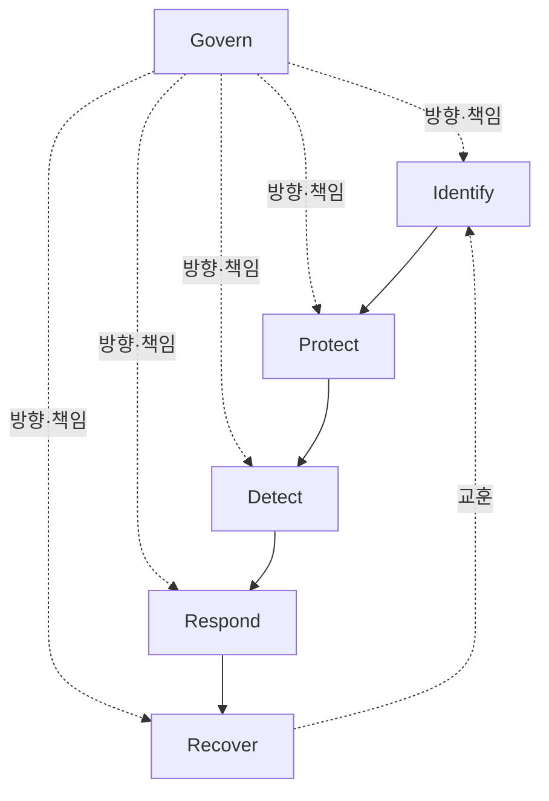
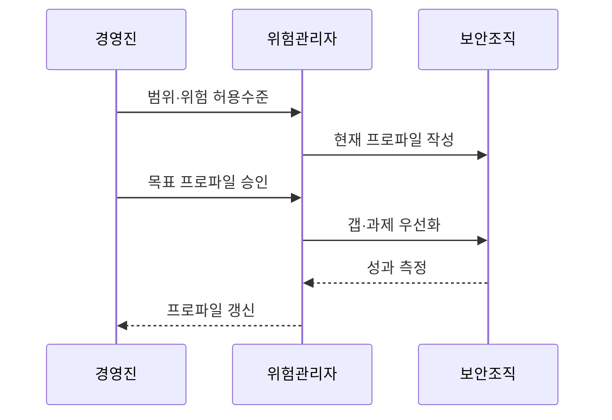

---
sidebar:
  order: 37
  label: "037. NIST Cybersecurity Framework 2.0 (NIST CSF 2.0)"
  badge:
    text: "기출 · 70%"
    variant: note
title: "NIST Cybersecurity Framework 2.0 (NIST CSF 2.0)"
date: "2026-07-27T23:59:59+09:00"
tags:
  - "notes-law-policy"
weight: 37
extra:
  question_no: "037"
  source_status: "기출"
  source_history: "137회"
  priority: 70
  priority_note: "137회 기출, Govern 기능을 더한 보안 프레임"
---

## 미리 알고가기

- **미국 국립표준기술연구소(National Institute of Standards and Technology, NIST)**: '니스트'로 읽고 미국 표준·기술 연구기관을 영문 머리글자로 표시
- **사이버보안 프레임워크(Cybersecurity Framework, CSF)**: '시에스에프'로 읽고 사이버보안 성과 분류체계를 영문 머리글자로 표시
- **거버넌스(Govern)**: 사이버보안 위험관리를 조직의 전략 및 정책과 연결하는 기능
- **조직 프로파일(Organizational Profile)**: 조직의 현재 및 목표 사이버보안 성과를 나타내는 명세서
- **구현 등급(Implementation Tier)**: 조직의 위험관리 성숙도와 엄격성을 나타내는 등급
- **식별(Identify)**: 자산·공급망·위험·개선 필요를 이해하는 기능
- **보호(Protect)**: 신원·데이터·플랫폼·인프라에 예방 통제를 적용하는 기능
- **탐지(Detect)**: 이상과 침해 징후를 찾아 분석하는 기능
- **대응(Respond)**: 사고를 관리·분석·완화하고 관계자와 소통하는 기능
- **복구(Recover)**: 사고로 손상된 자산·서비스를 복원하고 개선하는 기능
- **범주·하위범주**: 기능을 보안 성과 영역과 구체적인 결과 문장으로 세분화한 CSF Core 구조
- **정보 참조(Informative Reference)**: CSF 성과를 표준·규정·통제 문서의 세부 항목과 연결하는 매핑
- **구현 예시(Implementation Example)**: 하위범주의 성과를 달성할 수 있는 대표 행동을 설명한 비규범 예시
- **ISO/IEC 27001**: '아이에스오 아이이씨 이칠공공일'로 읽고 정보보안 경영시스템 요구사항의 표준 번호를 표시

## Ⅰ. 개요

- 정의/개념: 모든 조직이 사이버보안 위험을 관리하도록 **성과 분류체계·프로파일·등급을 제공하는 지침**
- **배경/필요성**: 통제 목록만 적용할 때 생기는 **경영 위험·목표 성과·투자 우선순위 연결 한계 해소**

### 쉽게 이해하기 (학습용)
- 무엇을 설치하라는 목록이 아니라 현재와 목표 보안 성과의 차이를 경영진과 현장이 함께 말하게 함

## Ⅱ. 특징

- **Govern·Identify·Protect·Detect·Respond·Recover**의 6개 기능을 제공한다.
- **기능·범주·하위범주**로 기술·산업 중립적인 보안 성과를 계층화한다.
- **현재·목표 프로파일과 구현 등급**으로 성과 격차와 위험관리 엄격성을 구분한다.

### 쉽게 이해하기 (학습용)
- Govern은 맨 앞에서 끝나는 단계가 아니라 식별부터 복구까지 정책·책임·위험 허용수준을 계속 제공함

## Ⅲ. 아키텍처 및 구성요소

| 설계 요소 | 설명 |
|:---|:---|
| Govern | 맥락·전략·책임·정책·공급망 |
| Identify | 자산·위험·개선 필요 파악 |
| Protect | 신원·데이터·플랫폼·인프라 보호 |
| Detect | 이상·침해 징후 탐지·분석 |
| Respond | 사고관리·분석·완화·소통 |
| Recover | 복구 실행·검증·소통 |

### 쉽게 이해하기 (학습용)
- Govern이 방향을 정하고 다섯 기능이 예방부터 복구까지 움직이며 사고 교훈이 다시 위험 식별로 돌아감

## Ⅳ. 원리 및 절차 흐름도

| 절차 | 설명 |
|:---|:---|
| 범위·위험 허용수준 | 임무·이해관계자·위험 한계 확정 |
| 현재 프로파일 작성 | 하위범주별 현재 성과 기록 |
| 목표 프로파일 승인 | 필요한 보안 성과와 우선순위 결정 |
| 갭·과제 우선화 | 위험·비용·의존성으로 실행 순서 결정 |
| 성과 측정 | 통제 결과와 잔여 위험 확인 |
| 프로파일 갱신 | 변화·사고 교훈을 목표에 반영 |

### 쉽게 이해하기 (학습용)
- 현재와 목표 하위범주의 차이를 위험 순서로 바꿔 예산을 배분하고 결과로 다시 목표를 조정함

## Ⅴ. 종류 및 비교

| NIST CSF 버전 | CSF 1.1 | CSF 2.0 |
|:---|:---|:---|
| 적용 기준 | 기존 1.1 프로파일 유지·참조 | 새 프로파일·전사 거버넌스 정렬 |
| 핵심 특징 | 5개 기능 중심 위험관리 | Govern을 추가한 6개 기능 |
| 한계 | 경영·공급망 연결 약함 | 성과 아닌 통제목록으로 오용 |

### 쉽게 이해하기 (학습용)
- 2.0은 기존 다섯 기능을 없애지 않고 Govern을 독립시켜 경영 책임과 공급망 위험을 더 분명히 함

## Ⅵ. 실무 사례

1. 금융사: 현재·목표 프로파일로 투자 갭 선정
2. 공급망: ISO 27001 통제를 정보 참조로 연결

### 쉽게 이해하기 (학습용)
- 고객 인증과 복구 성과의 현재·목표 차이를 위험으로 정렬해 먼저 투자할 하위범주를 고름
- CSF 성과를 ISO 통제와 연결하되 통제 설치가 실제 목표 성과를 냈는지 별도로 측정함

## Ⅶ. 결론

- CSF 2.0은 **Govern과 현재·목표 프로파일로 투자 우선화**

### 쉽게 이해하기 (학습용)
- 최고 구현 등급보다 조직의 위험 허용수준에 맞는 목표 성과와 실행 갭을 정하는 것이 중요함
