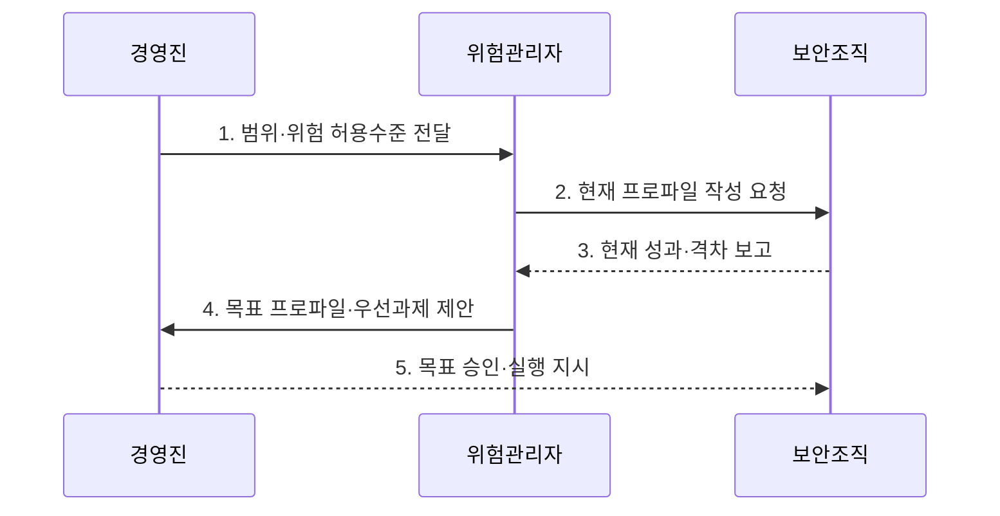

---
sidebar:
  order: 37
  label: "037. NIST Cybersecurity Framework 2.0 (NIST CSF 2.0)"
  badge:
    text: "기출 · 70%"
    variant: note
title: "NIST Cybersecurity Framework 2.0 (NIST CSF 2.0)"
date: "2026-07-31T05:50:56+09:00"
tags:
  - "notes-law-policy"
weight: 37
extra:
  question_no: "037"
  source_status: "기출"
  source_history: "137회"
  priority: 70
  priority_note: "137회 기출, Govern 기능을 더한 보안 프레임"
---

## 미리 알고가기

- **미국 국립표준기술연구소(National Institute of Standards and Technology, NIST)**: 미국의 측정·표준·기술 지침을 연구하고 개발하는 연방기관
- **사이버보안 프레임워크(Cybersecurity Framework, CSF)**: 조직의 사이버보안 위험관리 성과를 기능·범주·하위범주로 구성한 프레임워크
- **거버넌스(Govern)**: 사이버보안 위험관리를 조직의 전략 및 정책과 연결하는 기능
- **조직 프로파일(Organizational Profile)**: 조직의 현재 및 목표 사이버보안 성과를 나타내는 명세서
- **구현 등급(Implementation Tier)**: 조직의 위험관리 성숙도와 엄격성을 나타내는 등급
- **식별(Identify)**: 자산·공급망·위험·개선 필요를 이해하는 기능
- **보호(Protect)**: 신원·데이터·플랫폼·인프라에 예방 통제를 적용하는 기능
- **탐지(Detect)**: 이상과 침해 징후를 찾아 분석하는 기능
- **대응(Respond)**: 사고를 관리·분석·완화하고 관계자와 소통하는 기능
- **복구(Recover)**: 사고로 손상된 자산·서비스를 복원하고 개선하는 기능
- **범주·하위범주**: 기능을 보안 성과 영역과 구체적인 결과 문장으로 세분화한 CSF Core 구조
- **정보 참조(Informative Reference)**: CSF 성과를 표준·규정·통제 문서의 세부 항목과 연결하는 매핑
- **구현 예시(Implementation Example)**: 하위범주의 성과를 달성할 수 있는 대표 행동을 설명한 비규범 예시
- **ISO/IEC 27001**: 정보보호 관리체계의 수립·운영·유지·개선 요구사항을 규정한 국제표준

> **키워드:** NIST Cybersecurity Framework 2.0 (NIST CSF 2.0)

## Ⅰ. 개요

- 정의/개념: 사이버 위험을 경영 목표에 연결하는 **성과 분류체계**와 **구현 등급** 지침
- 배경/필요성: 개별 통제 목록으로는 경영 위험과 **투자 우선순위** 연결 곤란

### 쉽게 이해하기 (학습용)
- 특정 제품 설치 목록이 아니라 현재·목표 보안 성과의 차이를 경영진과 현장이 함께 정의하도록 한다

## Ⅱ. 특징

- 정책·책임·위험 허용수준으로 기능을 조정하는 **거버넌스 중심성**
- 기능·범주·하위범주로 보안 성과를 나누는 **성과 계층성**
- 현재·목표 프로파일의 격차를 찾는 **목표 지향성**

### 쉽게 이해하기 (학습용)
- Govern은 일회성 선행 단계가 아니라 식별부터 복구까지 정책·책임·위험 허용수준을 계속 제공한다

## Ⅲ. 구조 및 구성요소

```mermaid
block-beta
    columns 5
    G["Govern"] I["Identify"] P["Protect"] D["Detect"] R["Respond·Recover"]
    G -- I
    I -- P
    P -- D
    D -- R
```

| 구성요소 | 책임 |
|:---|:---|
| **Govern** | 맥락·전략·책임·정책·공급망 |
| **Identify** | 자산·위험·개선 필요 파악 |
| **Protect** | 신원·데이터·플랫폼·인프라 보호 |
| **Detect** | 이상·침해 징후 탐지·분석 |
| **Respond·Recover** | 사고 완화와 자산·서비스 복구 |

### 쉽게 이해하기 (학습용)
- Govern이 방향을 정하고 다섯 기능이 예방부터 복구까지 움직이며 사고 교훈이 다시 위험 식별로 돌아감

## Ⅳ. 흐름도



1. **범위·위험 허용수준 전달**: 임무·이해관계자·위험 한계 확정
2. **현재 프로파일 작성 요청**: 하위범주별 현재 성과 조사
3. **현재 성과·격차 보고**: 통제 결과와 목표 대비 차이 확인
4. **목표 프로파일·우선과제 제안**: 위험·비용·의존성으로 실행 순서 결정
5. **목표 승인·실행 지시**: 필요한 보안 성과와 투자 우선순위 확정

### 쉽게 이해하기 (학습용)
- 현재·목표 하위범주의 차이를 위험순으로 정렬해 예산을 배분하고 실행 결과로 목표 프로파일을 조정한다

## Ⅴ. 종류 및 비교

| NIST CSF 버전 | CSF 1.1 | CSF 2.0 |
|:---|:---|:---|
| **적용 기준** | 기존 **1.1 프로파일** 유지·참조 | 새 프로파일과 **전사 거버넌스** 정렬 |
| **핵심 특징** | 5개 기능 중심 **위험관리** | Govern을 추가한 **6개 기능** |
| **한계** | 경영·공급망 연결 약화 | 성과가 아닌 **통제 목록**으로 오용 |

### 쉽게 이해하기 (학습용)
- CSF 2.0은 기존 다섯 기능을 유지하면서 Govern을 추가해 경영 책임과 공급망 위험을 명확히 했다

## Ⅵ. 실무 고려사항 및 대책

| 고려사항 | 대책 | 효과 |
|:---|:---|:---|
| 프레임워크를 **통제 목록**으로 오용 | 임무와 위험 허용수준에서 **목표 하위범주** 도출 | 위험 기반 **보안 목표** 정렬 |
| 현재 성과의 **근거 부족** | 항목별 지표·증적·**책임자** 지정 | 성과 격차의 **객관적 측정** |
| 개선과제의 **우선순위 충돌** | 위험 감소·비용·의존성별 **투자 순서** 승인 | 제한된 예산의 **효율적 배분** |

### 쉽게 이해하기 (학습용)
- 고객 인증과 복구 성과의 현재·목표 차이를 위험으로 정렬해 먼저 투자할 하위범주를 고름

## Ⅶ. 결론

- 전사 위험 연계 시 **CSF 2.0**을 채택하고 **목표 프로파일**로 투자 확정

### 쉽게 이해하기 (학습용)
- 최고 구현 등급을 일률적으로 추구하기보다 조직의 위험 허용수준에 맞는 목표 성과와 실행 격차를 정해야 한다
