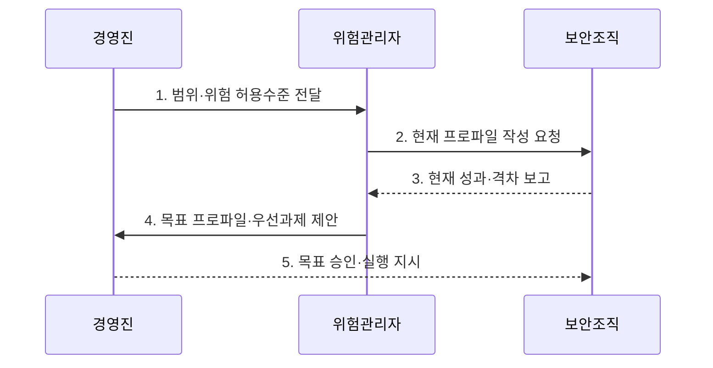

---
sidebar:
  order: 37
  label: "037. NIST Cybersecurity Framework 2.0 (NIST CSF 2.0)"
  badge:
    text: "기출 · 70%"
    variant: note
title: "NIST Cybersecurity Framework 2.0 (NIST CSF 2.0)"
date: "2026-08-02T12:00:00+09:00"
tags:
  - "notes-law-policy"
weight: 37
extra:
  question_no: "037"
  source_status: "기출"
  source_history: "137회"
  priority: 70
  priority_note: "137회 기출, Govern 기능을 더한 보안 프레임"
---

## Ⅰ. 개요

핵심 용어

- **미국 국립표준기술연구소 사이버보안 프레임워크 2.0(National Institute of Standards and Technology Cybersecurity Framework 2.0, NIST CSF 2.0)**: 사이버보안 위험관리 결과를 기능·범주·하위범주로 표현해 경영 목표와 연결하는 성과 분류체계다.
- **구현 등급**: 조직의 사이버보안 위험관리 관행이 임시적·부분적·반복 가능·적응적 수준 가운데 어디에 있는지를 나타내는 기준이다.

- 정의/개념: 사이버 위험을 경영 목표에 연결하는 **성과 분류체계** 와 **구현 등급** 지침
- 배경/필요성: 개별 통제 목록으로는 경영 위험과 **투자 우선순위** 연결 곤란

#### 한줄 요약
- 특정 제품 설치 목록이 아니라 현재·목표 보안 성과의 차이를 경영진과 현장이 함께 정의하도록 한다

## Ⅱ. 특징

핵심 용어

- **거버넌스 중심성**: 조직의 전략·정책·책임·위험 허용수준이 식별부터 복구까지 모든 기능을 조정하게 하는 특성이다.
- **성과 계층성**: 사이버보안 성과를 기능·범주·하위범주로 나누어 경영 목표와 현장 활동을 연결하는 구조적 특성이다.
- **목표 지향성**: 현재 프로파일과 목표 프로파일의 차이를 찾아 위험 감소에 필요한 개선과 투자를 정하는 특성이다.

- 정책·책임·위험 허용수준으로 기능을 조정하는 **거버넌스 중심성**
- 기능·범주·하위범주로 보안 성과를 나누는 **성과 계층성**
- 현재·목표 프로파일의 격차를 찾는 **목표 지향성**

#### 한줄 요약
- Govern은 일회성 선행 단계가 아니라 식별부터 복구까지 정책·책임·위험 허용수준을 계속 제공한다

## Ⅲ. 구조 및 구성요소

핵심 용어

- **거버넌스(Govern)**: 조직 맥락·전략·책임·정책·공급망 위험을 정해 나머지 사이버보안 기능의 방향을 제공한다.
- **식별(Identify)**: 자산·업무 환경·위험과 개선 필요를 파악하여 보호 우선순위의 근거를 만드는 기능이다.
- **보호(Protect)**: 신원·데이터·플랫폼·인프라에 예방 통제를 적용해 사이버 위험의 발생 가능성과 영향을 낮추는 기능이다.
- **탐지(Detect)**: 이상과 침해 징후를 지속 관찰하고 분석해 사고를 조기에 확인하는 기능이다.
- **대응·복구(Respond·Recover)**: 사고를 억제·완화하고 영향을 받은 자산과 서비스를 정상 상태로 복원하는 기능이다.

| 구성요소 | 책임 |
|:---|:---|
| **Govern** | 맥락·전략·책임·정책·공급망 |
| **Identify** | 자산·위험·개선 필요 파악 |
| **Protect** | 신원·데이터·플랫폼·인프라 보호 |
| **Detect** | 이상·침해 징후 탐지·분석 |
| **Respond·Recover** | 사고 완화와 자산·서비스 복구 |

#### 한줄 요약
- Govern이 방향을 정하고 다섯 기능이 예방부터 복구까지 움직이며 사고 교훈이 다시 위험 식별로 돌아감

## Ⅳ. 흐름도

핵심 용어

- **위험 허용수준**: 조직이 임무와 목표를 달성하면서 감수할 수 있다고 정한 사이버보안 위험의 한계이다.
- **현재 프로파일**: 기능·범주·하위범주별로 조직이 현재 달성한 사이버보안 성과를 표현한 상태이다.
- **성과 격차**: 현재 프로파일과 목표 프로파일 사이에서 추가로 달성해야 할 사이버보안 성과의 차이이다.
- **목표 프로파일·우선과제**: 성과 격차를 위험 감소·비용·의존성으로 정렬해 정한 목표 상태와 실행 순서이다.

1. **범위·위험 허용수준 전달**: 임무·이해관계자·위험 한계 확정
2. **현재 프로파일 작성 요청**: 하위범주별 현재 성과 조사
3. **현재 성과·격차 보고**: 통제 결과와 목표 대비 차이 확인
4. **목표 프로파일·우선과제 제안**: 위험·비용·의존성으로 실행 순서 결정
5. **목표 승인·실행 지시**: 필요한 보안 성과와 투자 우선순위 확정

#### 한줄 요약
- 현재·목표 하위범주의 차이를 위험순으로 정렬해 예산을 배분하고 실행 결과로 목표 프로파일을 조정한다

## Ⅴ. 종류 및 비교

핵심 용어

- **미국 국립표준기술연구소 사이버보안 프레임워크(National Institute of Standards and Technology Cybersecurity Framework, NIST CSF) 1.1·2.0**: 2.0은 1.1의 식별·보호·탐지·대응·복구에 거버넌스(Govern)를 추가해 경영 책임과 공급망 위험을 명확히 한 버전이다.

| NIST CSF 버전 | CSF 1.1 | CSF 2.0 |
|:---|:---|:---|
| **적용 기준** | 기존 **1.1 프로파일** 유지·참조 | 새 프로파일과 **전사 거버넌스** 정렬 |
| **핵심 특징** | 5개 기능 중심 **위험관리** | Govern을 추가한 **6개 기능** |
| **한계** | 경영·공급망 연결 약화 | 성과가 아닌 **통제 목록**으로 오용 |

#### 한줄 요약
- CSF 2.0은 기존 다섯 기능을 유지하면서 Govern을 추가해 경영 책임과 공급망 위험을 명확히 했다

## Ⅵ. 실무 고려사항 및 대책

핵심 용어

- **통제 목록 오용**: 조직 임무와 위험 허용수준에 필요한 성과보다 개별 보안 조치의 설치 여부만 확인하는 문제이다.
- **목표 하위범주**: 조직의 임무와 위험 허용수준에 맞춰 추가로 달성해야 한다고 선택한 구체적 사이버보안 성과이다.
- **성과 증적**: 현재 성과를 객관적으로 측정할 수 있도록 항목별 지표·기록·책임자를 연결한 자료이다.
- **투자 우선순위**: 개선과제의 위험 감소 효과·비용·선후 의존성을 비교해 승인한 실행 순서이다.

| 문제 | 대책 | 효과 |
|:---|:---|:---|
| 프레임워크를 **통제 목록**으로 오용 | 임무와 위험 허용수준에서 **목표 하위범주** 도출 | 위험 기반 **보안 목표** 정렬 |
| 현재 성과의 **근거 부족** | 항목별 지표·증적·**책임자** 지정 | 성과 격차의 **객관적 측정** |
| 개선과제의 **우선순위 충돌** | 위험 감소·비용·의존성별 **투자 순서** 승인 | 제한된 예산의 **효율적 배분** |

#### 한줄 요약
- 고객 인증과 복구 성과의 현재·목표 차이를 위험으로 정렬해 먼저 투자할 하위범주를 고름

## Ⅶ. 결론

핵심 용어

- **사이버보안 프레임워크 2.0(Cybersecurity Framework 2.0, CSF 2.0)**: 전사 위험과 여섯 기능의 사이버보안 성과를 연결하는 미국 국립표준기술연구소 프레임워크이다.
- **목표 프로파일**: 조직이 위험 허용수준에 맞춰 달성할 하위범주 성과를 정의하고 투자 우선순위를 확정하는 기준이다.

- 전사 위험 연계 시 **CSF 2.0** 을 채택하고 **목표 프로파일** 로 투자 확정

#### 한줄 요약
- 최고 구현 등급을 일률적으로 추구하기보다 조직의 위험 허용수준에 맞는 목표 성과와 실행 격차를 정해야 한다
