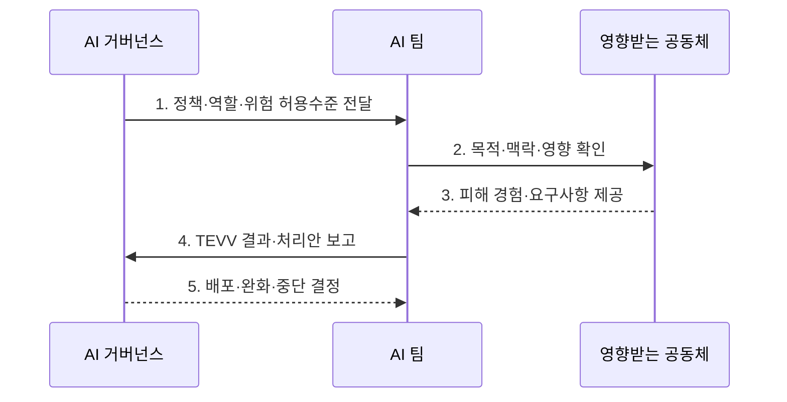

---
sidebar:
  order: 38
  label: "038. NIST AI RMF AI 위험 관리 프레임워크 (NIST AI RMF)"
  badge:
    text: "미출 · 50%"
    variant: note
title: "NIST AI RMF AI 위험 관리 프레임워크 (NIST AI RMF)"
date: "2026-08-02T12:00:00+09:00"
tags:
  - "notes-law-policy"
weight: 38
extra:
  question_no: "038"
  source_status: "미출"
  source_history: ""
  priority: 50
  priority_note: "AI 위험의 Govern·Map·Measure·Manage 핵심"
---

## Ⅰ. 개요

<details>
<summary>핵심 용어</summary>

- **자발적 AI 위험관리 프레임워크**: NIST AI RMF는 AI의 사용 맥락과 영향을 Govern·Map·Measure·Manage로 관리하는 자발적 AI 위험관리 프레임워크다.

</details>

- 정의/개념: **NIST AI RMF**는 AI의 사용 맥락·영향을 파악하고 4대 기능으로 위험을 처리하는 **자발적 AI 위험관리 프레임워크**
- 배경/필요성: 정확도 최적화 과정의 **공정성·설명성 저하** 통제 곤란

### 쉽게 이해하기 (학습용)
- 같은 AI도 사용자와 환경에 따라 영향이 달라지므로 사용 맥락에서 위험을 식별·측정하고 대응하도록 한다

## Ⅱ. 특징

<details>
<summary>핵심 용어</summary>

- **증거 기반 반복성**: 증거 기반 반복성은 TEVV 결과와 불확실성·잔여 위험을 기록하고 운영 변화에 따라 위험 판단을 갱신한다.

</details>

- 산업 중립적 틀을 AI 수명주기에 적용하는 **자발적 범용성**
- 정책·책임·허용수준으로 기능을 조정하는 **거버넌스 중심성**
- TEVV와 불확실성으로 잔여 위험을 기록하는 **증거 기반 반복성**

### 쉽게 이해하기 (학습용)
- 정확도 향상이 설명 가능성이나 공정성을 낮출 수 있으므로 수용한 위험과 판단 근거를 기록한다

## Ⅲ. 구조 및 구성요소

<details>
<summary>핵심 용어</summary>

- **Measure**: Measure는 AI 위험과 신뢰성 특성을 TEVV·지표·불확실성·추적 증거로 측정한다.

</details>

```mermaid
block-beta
    columns 4
    G["Govern"] M["Map"] E["Measure"] A["Manage"]
    G -- M
    M -- E
    E -- A
```

| 구성요소 | 책임 |
|:---|:---|
| **Govern** | 정책·책임·문화·위험 허용수준 |
| **Map** | 맥락·행위자·영향·위험 식별 |
| **Measure** | TEVV·지표·불확실성·추적 |
| **Manage** | 위험 우선순위·처리·감시·소통 |

### 쉽게 이해하기 (학습용)
- Govern은 전체에 규칙을 주고 Map의 맥락이 Measure의 지표를 정하며 Manage 결과가 다시 맥락으로 돌아감

## Ⅳ. 흐름도

<details>
<summary>핵심 용어</summary>

- **4. TEVV 결과·처리안 보고**: AI 팀은 사용 맥락에 맞는 신뢰성 지표와 불확실성을 측정해 위험 처리 대안을 거버넌스에 보고한다.

</details>



1. **정책·역할·위험 허용수준 전달**: 책임과 의사결정 기준 및 문서 체계화
2. **목적·맥락·영향 확인**: 사용 환경과 AI 행위자 및 긍정·부정 영향 파악
3. **피해 경험·요구사항 제공**: 영향받는 공동체의 관점과 수용 조건 반영
4. **TEVV 결과·처리안 보고**: 위험·신뢰성·불확실성을 측정하고 대안 비교
5. **배포·완화·중단 결정**: 잔여 위험을 허용수준과 비교해 조치 선택

### 쉽게 이해하기 (학습용)
- 누구에게 어떤 피해가 생길지 Map에서 놓치면 Measure는 잘못된 지표를 정확히 계산하게 됨

## Ⅴ. 종류 및 비교

<details>
<summary>핵심 용어</summary>

- **NIST AI RMF**: NIST AI RMF는 사용사례별 AI 위험관리 결과와 행동을 설계하는 자발적 프레임워크다.

</details>

| 판단 기준 | NIST AI RMF | ISO/IEC 42001 |
|:---|:---|:---|
| **적용 기준** | 사용사례별 **위험 실무** 설계 | 조직의 **AI 관리체계** 표준화 |
| **핵심 특징** | 위험 결과·행동의 **자발적 프레임** | AIMS 요구사항과 **선택적 인증** |
| **한계** | 법적 준수·인증의 직접 증명 불가 | 인증 범위 밖 **시스템 위험** 누락 |

### 쉽게 이해하기 (학습용)
- AI RMF는 사용사례별 위험관리 지침이고 ISO/IEC 42001은 조직의 AI 경영시스템 요구사항이다

## Ⅵ. 실무 고려사항 및 대책

<details>
<summary>핵심 용어</summary>

- **영향 대상 누락**: 영향 대상 누락은 사용 맥락과 영향받는 공동체를 Map하지 않아 실제 피해 시나리오가 위험 측정에서 빠지는 문제다.

</details>

| 문제 | 대책 | 효과 |
|:---|:---|:---|
| 사용 맥락과 **영향 대상 누락** | 배포 전 공동체 참여로 **Map** 수행 | 실제 **피해 시나리오** 식별 |
| 성능 지표만으로 **위험 판단** | 안전·편향·개인정보를 **TEVV**로 측정 | **신뢰성 지표별 개선·저하 확인** |
| 운영 중 **모델·환경 변화** | 임계치 이탈 시 인간 검토·완화·중단 | 잔여 위험의 **지속적 통제** |
| **AI RMF 1.0** 개정 진행 | 최신 NIST 버전·**프로필** 확인 | 버전 전환의 **누락 방지** |

### 쉽게 이해하기 (학습용)
- 신뢰도가 낮은 진단은 자동 확정하지 않고 의사 검토로 보내며 성능이 변하면 전환 기준을 다시 평가한다.

## Ⅶ. 결론

<details>
<summary>핵심 용어</summary>

- **잔여 위험**: 측정·완화 뒤 남은 잔여 위험을 조직의 허용수준과 비교해 배포·추가 완화·중단 중 하나를 결정해야 한다.

</details>

- 사용사례별 판단은 **AI RMF 1.0**을 적용하고 **잔여 위험**이 허용될 때만 배포

### 쉽게 이해하기 (학습용)
- 위험 목록 작성에 그치지 않고 측정 결과를 배포·완화·중단 결정으로 연결해야 한다
