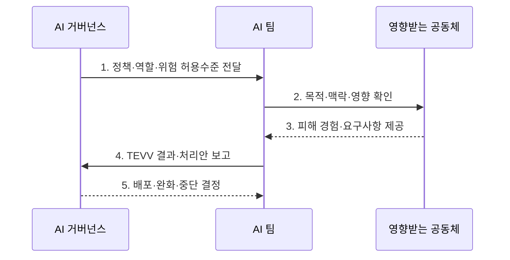

---
sidebar:
  order: 38
  label: "038. NIST AI RMF AI 위험 관리 프레임워크 (NIST AI RMF)"
  badge:
    text: "미출제 · 50%"
    variant: note
title: "NIST AI RMF AI 위험 관리 프레임워크 (NIST AI RMF)"
date: "2026-07-30T14:24:00+09:00"
tags:
  - "notes-law-policy"
weight: 38
extra:
  question_no: "038"
  source_status: "미출제"
  source_history: ""
  priority: 50
  priority_note: "AI 위험의 Govern·Map·Measure·Manage 핵심"
---

## 미리 알고가기

- **인공지능 위험 관리 프레임워크(AI Risk Management Framework, AI RMF)**: AI 시스템의 위험을 관리하고 신뢰성을 높이기 위한 자율 프레임워크
- **미국 국립표준기술연구소(National Institute of Standards and Technology, NIST)**: 측정·표준·기술 지침을 연구·개발하는 미국 정부기관
- **시험·평가·검증·확인(Testing, Evaluation, Verification, and Validation, TEVV)**: AI가 설계 요구와 실제 사용 목적을 충족하는지 여러 증거로 확인하는 활동
- **AI RMF 프로필(AI RMF Profile)**: 특정 사용 용도나 산업 부문에 맞추어 AI RMF의 성과를 구체화한 적용 가이드라인
- **AI RMF 플레이북(AI RMF Playbook)**: AI RMF의 4대 기능을 조직에 실제로 적용할 수 있도록 돕는 구체적인 실행 계획서
- **신뢰성 특성**: 유효·신뢰, 안전, 보안·복원력, 책임·투명성, 설명·해석, 개인정보 보호, 유해 편향 관리 공정성
- **AI 행위자(AI Actor)**: AI의 설계·개발·배포·운영·평가·영향을 맡거나 받는 개인·조직
- **영향받는 공동체**: AI의 결과로 권리·기회·안전·생활에 영향을 받는 개인과 집단
- **위험 허용수준(Risk Tolerance)**: 조직이 목표 달성을 위해 받아들일 수 있다고 승인한 AI 위험의 범위
- **생성형 AI 프로필(Generative AI Profile)**: 생성형 AI 고유 위험에 AI RMF 결과와 권장 행동을 적용한 NIST 프로필
- **ISO/IEC 42001**: 조직의 AI 경영시스템 구축·운영·개선 요구사항을 규정한 국제표준

## Ⅰ. 개요

- 정의/개념: 조직이 AI의 사용 맥락과 영향을 파악하고 위험을 측정·처리하도록 Govern·Map·Measure·Manage 기능을 제공하는 자발적 위험관리 프레임워크
- 배경/필요성: 기술 성능 평가만으로는 AI가 사람·조직·사회에 미치는 위험과 신뢰성 간 상충을 통제하기 곤란

### 쉽게 이해하기 (학습용)
- 같은 AI도 사용자와 환경에 따라 영향이 달라지므로 사용 맥락에서 위험을 식별·측정하고 대응하도록 한다

## Ⅱ. 특징

- 자발적이고 권리를 보존하는 산업 중립적 틀로 다양한 AI 수명주기에 적용
- Govern이 정책과 책임 및 위험 허용수준을 정해 Map·Measure·Manage를 지속적으로 조정
- TEVV 결과와 불확실성을 근거로 신뢰성 특성의 상충과 잔여 위험을 기록
- 네 기능을 고정 순서의 체크리스트가 아닌 반복적 의사결정 체계로 운용

### 쉽게 이해하기 (학습용)
- 정확도 향상이 설명 가능성이나 공정성을 낮출 수 있으므로 수용한 위험과 판단 근거를 기록한다

## Ⅲ. 구조 및 구성요소

| 구성요소 | 책임 |
|:---|:---|
| Govern | 정책·책임·문화·위험 허용수준 |
| Map | 맥락·행위자·영향·위험 식별 |
| Measure | TEVV·지표·불확실성·추적 |
| Manage | 위험 우선순위·처리·감시·소통 |

### 쉽게 이해하기 (학습용)
- Govern은 전체에 규칙을 주고 Map의 맥락이 Measure의 지표를 정하며 Manage 결과가 다시 맥락으로 돌아감

## Ⅳ. 흐름도

### 동작 원리

1. **정책·역할·위험 허용수준 전달**: 책임과 의사결정 기준 및 문서 체계화
2. **목적·맥락·영향 확인**: 사용 환경과 AI 행위자 및 긍정·부정 영향 파악
3. **피해 경험·요구사항 제공**: 영향받는 공동체의 관점과 수용 조건 반영
4. **TEVV 결과·처리안 보고**: 위험·신뢰성·불확실성을 측정하고 대안 비교
5. **배포·완화·중단 결정**: 잔여 위험을 허용수준과 비교해 조치 선택

### 쉽게 이해하기 (학습용)
- 누구에게 어떤 피해가 생길지 Map에서 놓치면 Measure는 잘못된 지표를 정확히 계산하게 됨

## Ⅴ. 종류 및 비교

| 판단 기준 | NIST AI RMF | ISO/IEC 42001 |
|:---|:---|:---|
| 적용 기준 | 사용사례별 위험 실무를 설계할 때 | 조직 AI 관리체계를 표준화할 때 |
| 핵심 특징 | 위험 결과·행동의 자발적 프레임 | AIMS 요구사항과 선택적 인증 |
| 한계 | 법적 준수·인증을 직접 증명하지 못함 | 인증 범위 밖 시스템 위험을 놓칠 수 있음 |

### 쉽게 이해하기 (학습용)
- AI RMF는 사용사례별 위험관리 지침이고 ISO/IEC 42001은 조직의 AI 경영시스템 요구사항이다

## Ⅵ. 실무 고려사항 및 대책

| 고려사항 | 대책 | 효과 |
|:---|:---|:---|
| 사용 맥락과 영향 대상 누락 | 배포 전 AI 행위자와 영향받는 공동체를 참여시켜 Map 수행 | 실제 피해 시나리오 식별 |
| 성능 지표만으로 위험 판단 | 안전·편향·개인정보·설명가능성을 TEVV 지표로 함께 측정 | 신뢰성 특성 간 상충 확인 |
| 운영 중 모델·환경 변화 | 임계치 이탈 시 인간 검토·완화·중단으로 전환하고 재평가 | 잔여 위험의 지속적 통제 |

### 쉽게 이해하기 (학습용)
- 신뢰도가 낮은 진단은 자동 확정하지 않고 의사 검토로 보내며 성능이 변하면 전환 기준을 다시 평가한다.

## Ⅶ. 결론

- 법적 인증보다 사용사례별 위험 의사결정이 필요하면 NIST AI RMF를 선택하고, TEVV로 측정한 잔여 위험이 허용수준 안에 있을 때만 배포·지속 사용을 승인

### 쉽게 이해하기 (학습용)
- 위험 목록 작성에 그치지 않고 측정 결과를 배포·완화·중단 결정으로 연결해야 한다
