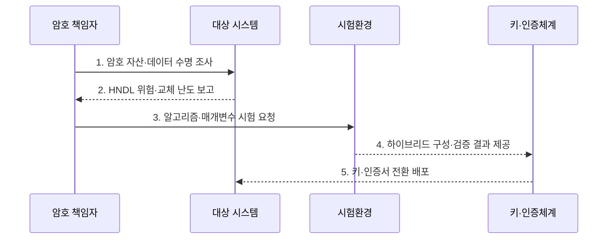

---
sidebar:
  order: 39
  label: "039. NIST PQC 표준화 — FIPS 203/204/205 (NIST PQC FIPS)"
  badge:
    text: "기출 · 70%"
    variant: note
title: "NIST PQC 표준화 — FIPS 203/204/205 (NIST PQC FIPS)"
date: "2026-08-02T12:00:00+09:00"
tags:
  - "notes-law-policy"
weight: 39
extra:
  question_no: "039"
  source_status: "기출"
  source_history: "135회"
  priority: 70
  priority_note: "135회 기출, 양자내성 표준 전환의 핵심축"
---

## Ⅰ. 개요

핵심 용어

- **연방정보처리표준**: FIPS 203·204·205는 양자 공격에 견디는 키 설정과 디지털 서명 알고리즘을 규정한 연방정보처리표준이다.

- 정의/개념: 양자 공격에 견디는 **ML-KEM·ML-DSA·SLH-DSA**의 연방정보처리표준
- 배경/필요성: RSA·ECC만으로는 장기 암호문과 인증 체계의 **양자 공격** 대응 곤란

### 쉽게 이해하기 (학습용)
- 충분한 양자 컴퓨터가 RSA·ECC를 깨기 전에 오래 보호할 데이터와 인증 체계부터 새 공개키 방식으로 옮김

## Ⅱ. 특징

핵심 용어

- **암호 민첩성**: 암호 민첩성은 프로토콜과 데이터 형식을 크게 바꾸지 않고 용도별 알고리즘·매개변수를 교체하는 능력이다.

- ML-KEM과 대칭키의 역할을 나누는 **용도 분리성**
- 격자·해시 기반 서명을 제공하는 **서명 다변성**
- 용도별 알고리즘을 단계적으로 바꾸는 **암호 민첩성**

### 쉽게 이해하기 (학습용)
- PQC 하나를 설치하는 것이 아니라 통신 키 설정과 인증서·코드 서명을 각각 호환 알고리즘으로 바꿈

## Ⅲ. 구조 및 구성요소

핵심 용어

- **ML-KEM·FIPS 203**: ML-KEM·FIPS 203은 모듈 격자 문제를 기반으로 통신 당사자의 공유 비밀을 설정하는 키 캡슐화 표준이다.

| 구성요소 | 책임 |
|:---|:---|
| **ML-KEM·FIPS 203** | 공유 비밀을 설정하는 KEM |
| **대칭 암호** | 공유 비밀로 실제 데이터 보호 |
| **ML-DSA·FIPS 204** | 범용 주력 격자 서명 |
| **SLH-DSA·FIPS 205** | 수학 기반을 분산한 해시 서명 |
| **암호 민첩성·검증** | 알고리즘·매개변수의 선택·교체 |

### 쉽게 이해하기 (학습용)
- ML-KEM은 공유 비밀키를 설정하고 ML-DSA·SLH-DSA는 서명을 수행하며, 암호 민첩성은 용도별 알고리즘 교체를 지원한다

## Ⅳ. 흐름도

핵심 용어

- **4. 하이브리드 구성·검증 결과 제공**: 시험환경은 기존 공개키 암호와 PQC를 병행한 구성의 성능·상호운용성과 롤백 가능성을 검증한다.

1. **암호 자산·데이터 수명 조사**: 알고리즘·키·인증서·장비와 보호기간 목록화
2. **HNDL 위험·교체 난도 보고**: 미래 노출 영향과 시스템 의존성으로 우선순위 산정
3. **알고리즘·매개변수 시험 요청**: 용도별 키·서명 크기와 지연·상호운용 검증
4. **하이브리드 구성·검증 결과 제공**: 기존 암호와 PQC 병행 및 롤백 가능성 확인
5. **키·인증서 전환 배포**: 운영 오류를 감시하며 키와 신뢰체계 교체

### 쉽게 이해하기 (학습용)
- 오래 숨겨야 할 데이터와 교체가 느린 장비부터 찾고 실제 프로토콜 크기·지연을 시험해 단계적으로 바꿈

## Ⅴ. 종류 및 비교

핵심 용어

- **SLH-DSA**: SLH-DSA는 격자와 다른 보안 근거를 제공하는 무상태 해시 기반 양자내성 디지털 서명 알고리즘이다.

| NIST PQC 표준 | ML-KEM | ML-DSA | SLH-DSA |
|:---|:---|:---|:---|
| **적용 기준** | 통신·저장용 **공유 비밀** | 인증서·코드·문서 **서명** | 격자와 다른 **보안 근거** |
| **핵심 특징** | 모듈 격자 기반 **키 설정** | 모듈 격자 기반 **서명** | 무상태 해시 기반 **서명** |
| **한계** | 키·암호문·**구현 부담** | 키·서명·**구현 부담** | 큰 서명·**처리량 부담** |

### 쉽게 이해하기 (학습용)
- 공유 비밀키 설정에는 ML-KEM, 일반 서명에는 ML-DSA, 해시 기반 대안에는 SLH-DSA를 검토한다

## Ⅵ. 실무 고려사항 및 대책

핵심 용어

- **HNDL 노출**: HNDL 노출은 현재 수집된 장기 보호 암호문이 미래의 양자컴퓨터로 해독될 수 있는 위험이다.

| 문제 | 대책 | 효과 |
|:---|:---|:---|
| 장기 데이터의 **HNDL 노출** | 데이터 수명과 위협 시점별 **전환 순위** 지정 | 미래 **복호화 위험** 축소 |
| 키·서명 크기의 **성능 저하** | 패킷 분할·지연·처리량의 **실환경 시험** | 품질과 **상호운용성** 확보 |
| 교체 실패와 **공급자 종속** | 암호 민첩성·하이브리드·**롤백** 설계 | 복구 가능한 **단계적 전환** |

### 쉽게 이해하기 (학습용)
- 기존 키 설정과 ML-KEM을 함께 적용해 패킷 분할·지연·중간장비 오류를 검증한 뒤 전환한다

## Ⅶ. 결론

핵심 용어

- **ML-DSA**: ML-DSA는 인증서·코드·문서의 일반 서명에 사용하는 모듈 격자 기반 FIPS 204 양자내성 알고리즘이다.

- 키 설정은 **ML-KEM**, 일반 서명은 **ML-DSA**를 채택하고 검증된 시스템부터 전환

### 쉽게 이해하기 (학습용)
- FIPS 번호만 선택하지 말고 키 설정·서명 용도와 데이터 수명에 맞춰 시험·교체할 수 있는 구조로 전환해야 한다
