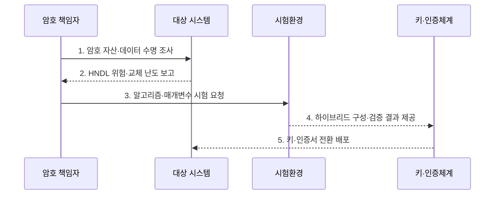

---
sidebar:
  order: 39
  label: "039. NIST PQC 표준화 — FIPS 203/204/205 (NIST PQC FIPS)"
  badge:
    text: "기출 · 70%"
    variant: note
title: "NIST PQC 표준화 — FIPS 203/204/205 (NIST PQC FIPS)"
date: "2026-07-30T14:27:00+09:00"
tags:
  - "notes-law-policy"
weight: 39
extra:
  question_no: "039"
  source_status: "기출"
  source_history: "135회"
  priority: 70
  priority_note: "135회 기출, 양자내성 표준 전환의 핵심축"
---

## 미리 알고가기

- **양자내성암호(Post-Quantum Cryptography, PQC)**: 양자컴퓨터의 공격에도 안전하도록 설계한 공개키 암호기술
- **연방정보처리표준(Federal Information Processing Standards, FIPS)**: 미국 연방기관이 정보시스템에 적용하는 기술 표준
- **지금 수집, 나중 해독(Harvest Now, Decrypt Later, HNDL)**: 현재 암호문을 수집해 두었다가 양자컴퓨터가 실용화된 뒤 해독하는 위협
- **키 캡슐화 메커니즘(Key Encapsulation Mechanism, KEM)**: 공개키를 이용해 공유 비밀키를 안전하게 설정하는 방식
- **디지털 서명 알고리즘(Digital Signature Algorithm, DSA)**: 서명자의 신원과 데이터 무결성을 검증하는 공개키 알고리즘
- **ML-KEM**: 모듈 격자 문제를 기반으로 공유 비밀키를 설정하는 FIPS 203 양자내성 알고리즘
- **ML-DSA**: 모듈 격자 문제를 기반으로 서명과 검증을 수행하는 FIPS 204 양자내성 알고리즘
- **SLH-DSA**: 해시 함수를 기반으로 서명과 검증을 수행하는 FIPS 205 양자내성 알고리즘
- **모듈 격자**: 다차원 격자의 모듈 구조에서 어려운 수학 문제를 보안 근거로 사용하는 방식
- **무상태 해시 서명**: 이전 서명 횟수나 상태를 저장하지 않고 해시 함수로 만드는 디지털 서명
- **암호 민첩성(Crypto Agility)**: 프로토콜·데이터 형식을 크게 바꾸지 않고 알고리즘과 매개변수를 교체하는 능력
- **하이브리드 전환**: 기존 공개키 알고리즘과 PQC를 함께 적용해 한쪽 실패에도 보안을 유지하는 과도기 방식
- **하드웨어 보안 모듈(Hardware Security Module, HSM)**: 암호키를 안전하게 생성·저장하고 암호 연산을 수행하는 전용 장치
- **RSA(Rivest-Shamir-Adleman)**: 큰 정수의 인수분해 난도를 보안 근거로 사용하는 공개키 암호 알고리즘
- **타원곡선암호(Elliptic Curve Cryptography, ECC)**: 타원곡선 이산대수 문제의 난도를 보안 근거로 사용하는 공개키 암호기술

## Ⅰ. 개요

- 정의/개념: NIST가 양자 공격에 견디는 키 설정과 디지털 서명을 위해 ML-KEM·ML-DSA·SLH-DSA를 규정한 연방정보처리표준
- 배경/필요성: RSA·ECC만 유지하면 현재 수집된 장기 보호 암호문과 인증 체계가 미래 양자 공격으로 신뢰성을 잃을 위험 증가

### 쉽게 이해하기 (학습용)
- 충분한 양자 컴퓨터가 RSA·ECC를 깨기 전에 오래 보호할 데이터와 인증 체계부터 새 공개키 방식으로 옮김

## Ⅱ. 특징

- **용도 분리성**: FIPS 203의 ML-KEM으로 공유 비밀을 설정하고 실제 데이터는 대칭키로 보호
- **서명 다변성**: FIPS 204의 ML-DSA와 FIPS 205의 SLH-DSA로 서로 다른 수학 기반의 디지털 서명을 제공
- **암호 민첩성**: 데이터 수명과 용도에 따라 키·서명 크기와 성능 및 구현 지원을 시험해 단계적으로 전환

### 쉽게 이해하기 (학습용)
- PQC 하나를 설치하는 것이 아니라 통신 키 설정과 인증서·코드 서명을 각각 호환 알고리즘으로 바꿈

## Ⅲ. 구조 및 구성요소

```mermaid
block-beta
    columns 3
    K["ML-KEM·FIPS 203"] S["대칭 암호"] D["ML-DSA·FIPS 204"]
    H["SLH-DSA·FIPS 205"] A["암호 민첩성·검증"]:2
    K -- S
    D -- A
    H -- A
    K -- A
    K --- S
    S --- D
    D --- H
    H --- A
```

| 구성요소 | 책임 |
|:---|:---|
| ML-KEM·FIPS 203 | 공유 비밀을 설정하는 KEM |
| 대칭 암호 | 공유 비밀로 실제 데이터 보호 |
| ML-DSA·FIPS 204 | 범용 주력 격자 서명 |
| SLH-DSA·FIPS 205 | 수학 기반을 분산한 해시 서명 |
| 암호 민첩성·검증 | 서명을 검증하고 알고리즘·매개변수를 선택·교체 |

### 쉽게 이해하기 (학습용)
- ML-KEM은 공유 비밀키를 설정하고 ML-DSA·SLH-DSA는 서명을 수행하며, 암호 민첩성은 용도별 알고리즘 교체를 지원한다

## Ⅳ. 흐름도



1. **암호 자산·데이터 수명 조사**: 알고리즘·키·인증서·장비와 보호기간 목록화
2. **HNDL 위험·교체 난도 보고**: 미래 노출 영향과 시스템 의존성으로 우선순위 산정
3. **알고리즘·매개변수 시험 요청**: 용도별 키·서명 크기와 지연·상호운용 검증
4. **하이브리드 구성·검증 결과 제공**: 기존 암호와 PQC 병행 및 롤백 가능성 확인
5. **키·인증서 전환 배포**: 운영 오류를 감시하며 키와 신뢰체계 교체

### 쉽게 이해하기 (학습용)
- 오래 숨겨야 할 데이터와 교체가 느린 장비부터 찾고 실제 프로토콜 크기·지연을 시험해 단계적으로 바꿈

## Ⅴ. 종류 및 비교

| NIST PQC 표준 | ML-KEM | ML-DSA | SLH-DSA |
|:---|:---|:---|:---|
| 적용 기준 | 통신·저장 암호용 공유 비밀 | 일반 인증서·코드·문서 서명 | 격자와 다른 보안 근거가 필요할 때 |
| 핵심 특징 | 모듈 격자 기반 키 설정 | 모듈 격자 기반 서명 | 무상태 해시 기반 서명 |
| 한계 | 키·암호문·구현 부담 | 키·서명·구현 부담 | 큰 서명·처리량 부담 |

### 쉽게 이해하기 (학습용)
- 공유 비밀키 설정에는 ML-KEM, 일반 서명에는 ML-DSA, 해시 기반 대안에는 SLH-DSA를 검토한다

## Ⅵ. 실무 고려사항 및 대책

| 고려사항 | 대책 | 효과 |
|:---|:---|:---|
| 장기 보호 데이터의 HNDL 노출 | 데이터 수명과 양자 위협 도달 시점을 비교해 전환 우선순위 지정 | 미래 복호화 위험 축소 |
| 키·서명 크기에 따른 성능 저하 | 실제 프로토콜에서 패킷 분할·지연·처리량을 시험 | 서비스 품질과 상호운용성 확보 |
| 알고리즘 교체 실패와 공급자 종속 | 암호 민첩성과 하이브리드 운용 및 롤백 절차 설계 | 단계적이고 복구 가능한 전환 |

### 쉽게 이해하기 (학습용)
- 기존 키 설정과 ML-KEM을 함께 적용해 패킷 분할·지연·중간장비 오류를 검증한 뒤 전환한다

## Ⅶ. 결론

- 공유 비밀 설정에는 ML-KEM을, 일반 서명에는 ML-DSA를 우선 검토하고, 데이터 수명과 상호운용 시험 결과가 허용 기준을 충족한 시스템부터 하이브리드 방식으로 전환

### 쉽게 이해하기 (학습용)
- FIPS 번호만 선택하지 말고 키 설정·서명 용도와 데이터 수명에 맞춰 시험·교체할 수 있는 구조로 전환해야 한다
