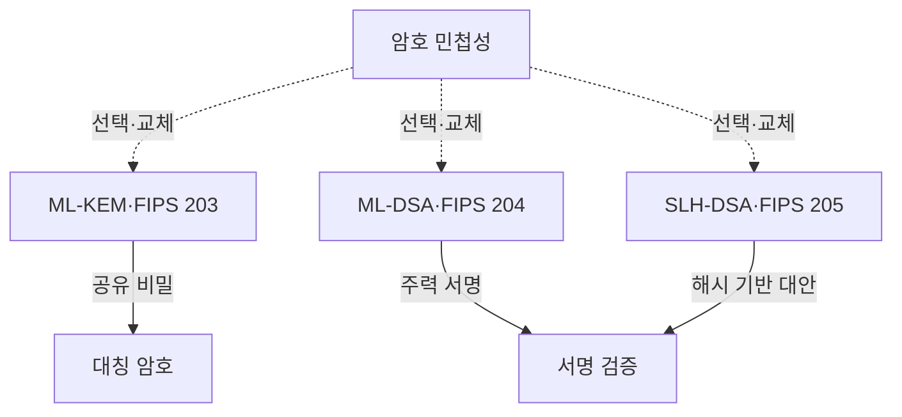
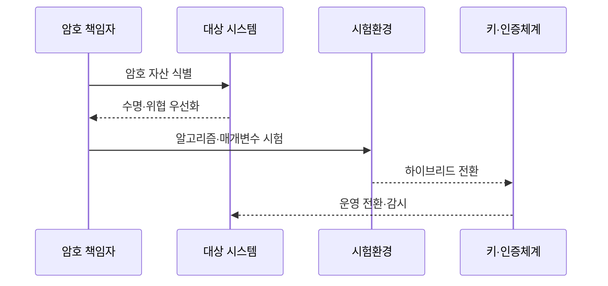

---
sidebar:
  order: 39
  label: "039. NIST PQC 표준화 — FIPS 203/204/205 (NIST PQC FIPS)"
  badge:
    text: "기출 · 70%"
    variant: note
title: "NIST PQC 표준화 — FIPS 203/204/205 (NIST PQC FIPS)"
date: "2026-07-25T01:40:00+09:00"
tags:
  - "notes-law-policy"
weight: 39
extra:
  question_no: "039"
  source_status: "기출"
  source_history: "135회"
  priority: 70
  priority_note: "135회 기출, 양자내성 표준 전환의 핵심축"
---

## 미리 알고가기

- **양자내성암호(Post-Quantum Cryptography, PQC)**: 양자 컴퓨터의 해독 위협에 대응할 수 있는 수학적 복잡도 기반의 공개키 암호
- **연방정보처리표준(Federal Information Processing Standards, FIPS)**: 미국 국립표준기술연구소(NIST)가 제정하는 정보 보안 기술 규격
- **지금 수집, 나중 해독(Harvest Now, Decrypt Later, HNDL)**: 암호화된 데이터를 현재 미리 수집하고 미래에 양자 컴퓨터로 해독하려는 보안 위협
- **키 캡슐화 메커니즘(Key Encapsulation Mechanism, KEM)**: 대칭키를 안전하게 공유하기 위해 공개키로 암호화하고 복원하는 설계 기법
- **디지털 서명 알고리즘(Digital Signature Algorithm, DSA)**: 메시지 송신자의 신원과 데이터 변조 여부를 증명하기 위한 서명 방식
- **ML-KEM**: 모듈 격자 문제의 어려움을 이용해 공유 비밀을 설정하는 FIPS 203 키 캡슐화 알고리즘
- **ML-DSA**: 모듈 격자 문제를 기반으로 서명·검증하는 FIPS 204 디지털 서명 알고리즘
- **SLH-DSA**: 해시 함수 기반으로 상태 저장 없이 서명하는 FIPS 205 디지털 서명 알고리즘
- **모듈 격자**: 다차원 격자의 모듈 구조에서 어려운 수학 문제를 보안 근거로 사용하는 방식
- **무상태 해시 서명**: 이전 서명 횟수나 상태를 저장하지 않고 해시 함수로 만드는 디지털 서명
- **암호 민첩성(Crypto Agility)**: 프로토콜·데이터 형식을 크게 바꾸지 않고 알고리즘과 매개변수를 교체하는 능력
- **하이브리드 전환**: 기존 공개키 알고리즘과 PQC를 함께 적용해 한쪽 실패에도 보안을 유지하는 과도기 방식
- **HSM(Hardware Security Module)**: 암호키를 보호된 하드웨어 안에서 생성·저장·사용하는 장치

## Ⅰ. 개요

- **정의/개념**: 양자내성 키 설정·서명을 규정한 FIPS 표준
- **배경/필요성**: HNDL과 장기 서명 신뢰성에 선제 대응

### 쉽게 이해하기 (학습용)
- 충분한 양자 컴퓨터가 RSA·ECC를 깨기 전에 오래 보호할 데이터와 인증 체계부터 새 공개키 방식으로 옮김

## Ⅱ. 특징

- 키 설정과 디지털 서명을 별도 표준으로 분리한다.
- 격자 기반 알고리즘과 해시 서명을 병행한다.
- 보안강도 매개변수가 크기·성능을 정한다.
- 표준 확정과 제품 지원은 별도 검증한다.

### 쉽게 이해하기 (학습용)
- PQC 하나를 설치하는 것이 아니라 통신 키 설정과 인증서·코드 서명을 각각 호환 알고리즘으로 바꿈

## Ⅲ. 아키텍처 및 구성요소

| 설계 요소 | 설명 |
|:---|:---|
| ML-KEM·FIPS 203 | 공유 비밀을 설정하는 KEM |
| 대칭 암호 | 공유 비밀로 실제 데이터 보호 |
| ML-DSA·FIPS 204 | 범용 주력 격자 서명 |
| SLH-DSA·FIPS 205 | 수학 기반을 분산한 해시 서명 |
| 서명 검증 | 송신자 인증·무결성 확인 |
| 암호 민첩성 | 알고리즘·매개변수 선택·교체 |

### 쉽게 이해하기 (학습용)
- ML-KEM은 통신 비밀을 만들고 두 DSA는 서명하며 민첩성이 용도별 교체를 가능하게 함

## Ⅳ. 원리 및 절차 흐름도

| 절차 | 설명 |
|:---|:---|
| 암호 자산 식별 | 알고리즘·키·인증서·장비·데이터 목록화 |
| 수명·위협 우선화 | HNDL·보호기간·교체 난도 평가 |
| 알고리즘·매개변수 시험 | 용도별 크기·지연·상호운용 검증 |
| 하이브리드 전환 | 기존·PQC 병행과 롤백 준비 |
| 운영 전환·감시 | 키·인증서 교체와 오류정정 추적 |

### 쉽게 이해하기 (학습용)
- 오래 숨겨야 할 데이터와 교체가 느린 장비부터 찾고 실제 프로토콜 크기·지연을 시험해 단계적으로 바꿈

## Ⅴ. 종류 및 비교

| 판단 기준 | ML-KEM | ML-DSA | SLH-DSA |
|:---|:---|:---|:---|
| 핵심 특징 | 모듈 격자 기반 키 설정 | 모듈 격자 기반 주력 서명 | 무상태 해시 기반 대안 서명 |
| 적용 기준 | 통신·저장 암호용 공유 비밀 | 일반 인증서·코드·문서 서명 | 격자와 다른 보안 근거가 필요할 때 |
| 주요 위험 | 큰 키·암호문과 구현 오류 | 큰 키·서명과 구현 오류 | 매우 큰 서명·처리량 부담 |

### 쉽게 이해하기 (학습용)
- 비밀 통신의 키는 ML-KEM, 일반 서명은 ML-DSA, 다른 수학 기반의 대안은 SLH-DSA를 검토함

## Ⅵ. 실무 사례

1. VPN: ML-KEM 하이브리드 연결의 패킷 검증
2. 코드서명: HSM의 ML-DSA 지원·롤백 시험

### 쉽게 이해하기 (학습용)
- 기존 키 설정과 ML-KEM을 함께 써 패킷 분할·지연·중간장비 실패를 확인한 뒤 전환함
- HSM이 ML-DSA 키를 안전하게 다루는지 검증하고 실패 때 기존 서명으로 돌아갈 절차를 시험함

## Ⅶ. 결론

- 데이터 수명·용도·호환성으로 PQC 전환

### 쉽게 이해하기 (학습용)
- FIPS 번호만 고르지 말고 키 설정·서명 용도와 데이터 수명에 맞춰 시험·교체 가능한 구조로 옮겨야 함
